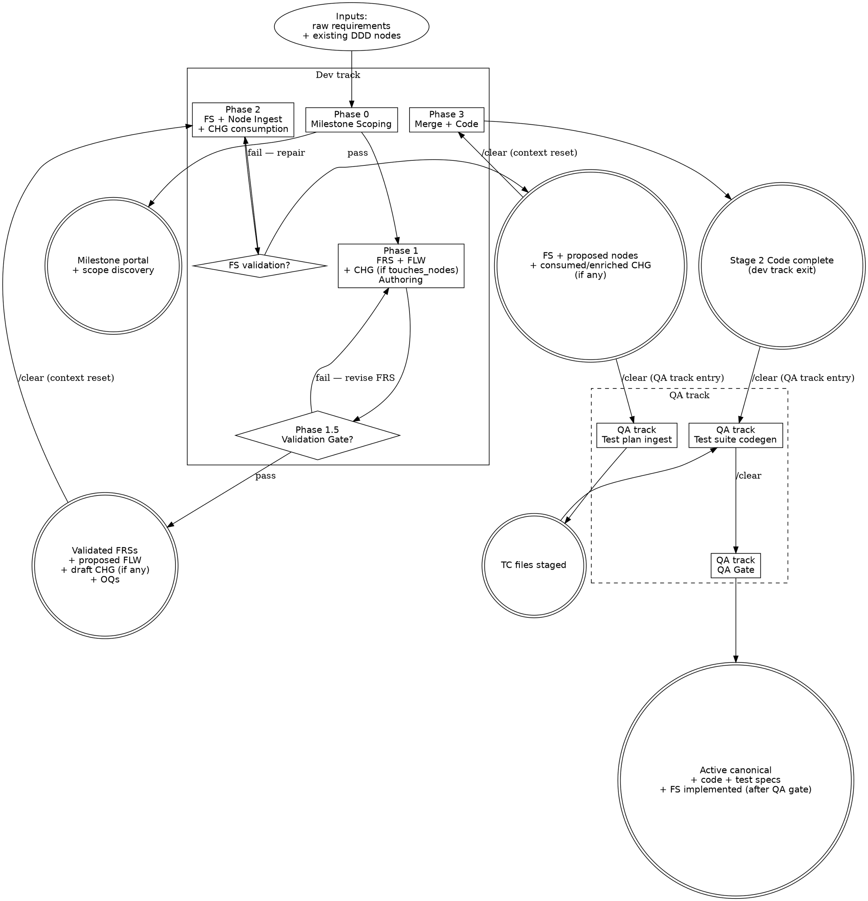

# WORKFLOW-GRAPH.md — Process Flow

Cross-phase dot graph for the dev track and the QA track. Visual orientation
only — the graph names which flow file owns each step; it does not substitute
for opening that file. Per-flow procedure lives in
[`workflow/`](workflow/); always-loaded summary lives in
[`WORKFLOW.md`](WORKFLOW.md).

## Process Flow

Steps `[shape=box]` are phase or flow work; gates `[shape=diamond]` are
non-skippable validation; terminal artifacts `[shape=doublecircle]` are the
durable outputs each phase or flow emits. The `/clear` labels mark canonical
`HARD-GATE` instances (see [`WORKFLOW.md`](WORKFLOW.md) HARD-GATE block);
QA-track flows are independent of the dev track. `/clear` between
`test-plan-ingest` ↔ `test-suite-codegen`; `test-suite-codegen` ↔ `qa-gate`
share a session per CLAUDE.md Rule 5.

The milestone is **the planning container**, top-down or retroactive — it
holds its discoveries, FRSs, and FSs under one path. Multiple FSs can be
generated from one milestone, each aggregating a subset of the milestone's
FRSs.

## Integration

**Parent:** [`WORKFLOW.md`](WORKFLOW.md) — phase-pipeline index.
**Pointed at from:** [`WORKFLOW.md ## Integration`](WORKFLOW.md#integration) and
[`WORKFLOW.md ### Router vs. reader discipline`](WORKFLOW.md#router-vs-reader-discipline) —
on-demand only.
