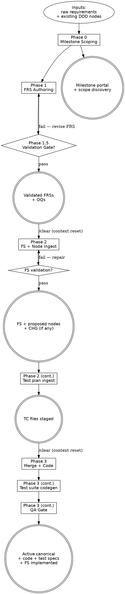

# WORKFLOW.md — Development Workflow

This file is the phase-pipeline index and cross-cutting practices hub for
the engine. It names the five phases, the three flows, the operations they
fire, and the workspace-wide retrieval / context-reset / maintenance
discipline every flow inherits. Per-phase procedure lives in the
per-flow files under [`workflow/`](workflow/); doctrinal *why* lives in
[`PRINCIPLES.md`](PRINCIPLES.md).

<HARD-GATE>
Do NOT begin Phase 2 (Ingest) or Phase 3 (Merge + Code) without a `/clear` and a reload of
the next flow file only. Context that survives a phase boundary is a bug, not a feature.
Detail at [## Anti-Pattern: "The Informed Skip"](#anti-pattern-the-informed-skip).
(Cross-cutting rules: see [CLAUDE.md ## Hard rules](../CLAUDE.md#hard-rules).)
</HARD-GATE>

---

## Overview

Workflow aligns operations to Karpathy's Ingest/Query pattern: the
FRS flow Queries the canonical DDD wiki to validate requirements; the FS flow
Ingests new DDD nodes directly into the canonical wiki at `docs/<component>/nodes/` with
`status: proposed`, and emits a milestone-scoped CHG node when existing canonical
nodes are touched; implementation Applies the CHG deltas to canonical and flips
the new nodes `proposed → active`.

Three principles run through every phase:

1. **The DDD knowledge base in `docs/<component>/nodes/` is the source of truth for behavior.**
   FRSs declare intent; nodes describe behavior; specs reference nodes; code
   implements them. If a node and a spec disagree, the node wins — or both get
   reconciled before code is written. In-flight nodes (created by an unmerged
   FS) carry `status: proposed` in their frontmatter; this is the signal —
   there is no second source-of-truth tree. Component structure:
   `docs/<component>/nodes/` — see `docs/project.md § Components` for
   the component list registered in this workspace.
2. **ADRs are the source of truth for cross-cutting architectural commitments.**
   Component ADRs live at `docs/<component>/adrs/`; cross-component ADRs live
   at `docs/shared/adrs/`. Every Discovery, FRS, and FS declares the ADRs it
   consulted via `adrs:` in frontmatter.
   See [Authoring an ADR](#authoring-an-adr) below.
3. **Reference, never copy.** Specs link to nodes and ADRs by ID. Restating a
   node's behavior or an ADR's decision inline is a lint violation in spirit —
   it lets the source of truth and the spec silently diverge.

Templates for every artifact live in [`_templates/`](_templates/). Node
templates live in [`_templates/nodes/`](_templates/nodes/).

---

## Anti-Pattern: "The Informed Skip"

Convincing yourself the context reset isn't needed because the current
session has "good context" — usually the validated FRS set is still in
view, or the Phase 1.5 findings are fresh, and a `/clear` feels wasteful.
The reset exists precisely because retained context drifts silently
across phases: Phase 2 needs the FRS as input but not the validation
deliberations; Phase 3 needs the FS as input but not the Phase 2
alternatives. The "good context" you preserve becomes Phase 2's silent
broadening of `touches_nodes` or Phase 3's silent canonical edit. **The
rule is non-skippable, every time.** Detail in
[`CLAUDE.md ## Hard rules`](../CLAUDE.md#hard-rules).

---

## When to Use

**Use when:** entering or transitioning between phases, evaluating a
cross-cutting practice that spans flows, deciding which flow file to load
next, or proposing a new rule that may need to live here vs. in a per-op
file.

**Do NOT use when:** drafting a specific phase artifact — load the per-flow
file ([`workflow/design.md`](workflow/design.md),
[`workflow/plan.md`](workflow/plan.md),
[`workflow/implementation.md`](workflow/implementation.md),
[`workflow/test-suite-codegen.md`](workflow/test-suite-codegen.md),
[`workflow/qa-gate.md`](workflow/qa-gate.md)) instead.

**Vs. sibling files:** [`CLAUDE.md`](../CLAUDE.md) carries the always-on
hard rules; [`PRINCIPLES.md`](PRINCIPLES.md) carries the doctrinal *why*;
this file carries the *what* and the *when* of the phase pipeline plus
the cross-cutting practices every flow inherits.

### Router vs. reader discipline

`WORKFLOW.md` is an **index**, not content. When you need to know which
flow file to load next, read only `## Phase flows` (the 7-row table). The
body sections below it (`## The Process`, `## Maintenance discipline`, etc.)
are on-demand reference — load a specific section only when that
cross-cutting practice is the active question, not at phase entry as a
matter of course.

Concretely:
- Phase entry → read `## Phase flows` table only → load the named flow file.
- Cross-cutting question (e.g., "what is the retrieval discipline?") → load
  the specific subsection of `## The Process` that answers it, or load the
  canonical op file it points to.
- Full WORKFLOW.md read: warranted only when proposing a new rule that may
  live here vs. in a per-op file.

---

## Process Flow



Steps `[shape=box]` are phase work; gates `[shape=diamond]` are
non-skippable validation; terminal artifacts `[shape=doublecircle]` are
the durable outputs each phase emits. The `/clear` labels on the
phase-1.5→2 and 2→3 edges are the canonical `HARD-GATE` instances above.

The milestone is **the planning container**, top-down or retroactive — it holds
its discoveries, FRSs, and FSs under one path. Multiple FSs can be generated
from one milestone, each aggregating a subset of the milestone's FRSs.

---

## Phase flows

| Flow                | File                                                                       | Operation             | Mode                  | Phases covered              |
| ------------------- | -------------------------------------------------------------------------- | --------------------- | --------------------- | --------------------------- |
| Design              | [`workflow/design.md`](workflow/design.md)                                 | `generate-frs`        | Validation (Query)    | 0, 1, 1.5                   |
| Pre-plan            | [`workflow/discuss.md`](workflow/discuss.md)                               | `pre-plan-discuss`    | Optional              | Between 1.5 and 2           |
| Plan                | [`workflow/plan.md`](workflow/plan.md)                                     | `generate-feat-spec`  | Ingest                | 2                           |
| Test plan ingest    | [`workflow/test-plan-ingest.md`](workflow/test-plan-ingest.md)             | `generate-test-plan`  | Ingest (test plan)    | 2 (same session, after FS validation) |
| Implementation      | [`workflow/implementation.md`](workflow/implementation.md)                 | `implement-feat`      | Merge + Code          | 3                           |
| Test suite codegen  | [`workflow/test-suite-codegen.md`](workflow/test-suite-codegen.md)         | `generate-test-suite` | Codegen (test suite)  | 3 (same session, after Stage 2 Code) |
| QA Gate             | [`workflow/qa-gate.md`](workflow/qa-gate.md)                               | `qa-gate`             | QA + status flip      | 3 (same session, after test codegen) |

Each flow file owns its phase detail, validation checklists, and exit
criteria. The three Phase 3 files (`implementation.md`, `test-suite-codegen.md`,
`qa-gate.md`) run in sequence in the same Phase 3 session — no `/clear` between
them; the `/clear` boundary sits only at Phase 2→3 entry. Test plan ingest runs
in the same Phase 2 session as Plan — no `/clear` there either.
The sections below this point (The Process, Knowledge base
layout, Migration to VCS platform) apply to all flows.

**Maintenance operations** sit alongside the phase flows but are not
tied to phases: `authoring-adr` (see [Authoring an ADR](#authoring-an-adr)),
`absorb-legacy-doc` (see [Legacy absorption](#legacy-absorption)), and
`absorb-concept` (see [Derived reports](#derived-reports) — promotes
insights surfaced during report synthesis to canonical KB nodes via
RESEARCH staging). All three can fire from inside any phase or stand
alone; all share the tiered touch discipline from
[Maintenance discipline](#maintenance-discipline).

---

## The Process

### Reference, never copy

Specs and node bodies link by ID; they do not paraphrase. Stated under
[The phases → three principles](#the-phases) above; see also
[`PRINCIPLES.md`](PRINCIPLES.md).

### Node content ownership

Every piece of content has exactly one owner node. When two node types
naturally share a surface — most commonly a CON node and an INT node
describing the same integration boundary — the type hierarchy determines
who owns what:

| Layer | Owner | Content owned | References to… |
|-------|-------|---------------|----------------|
| CON (`protocol: events`) | Contract node | Partition key, delivery semantics, retention, DLQ policy, contract-surface fields only (the fields consumers must know to filter or route) | INT node for full schema, DDL, blast radius |
| INT | Integration node | Full field schema, DDL/KSQL stream definitions, SLA targets, failure handling, blast radius | CON node for contract surface |
| FLW (journey-level) | The authoritative end-to-end flow | Shared mechanics: whitelist JOIN pattern, offset recovery, deduplication invariants | — |
| FLW (per-rule / per-command) | The narrower flow | Rule-specific diff only (window, threshold, source filter) | Journey FLW for shared mechanics, INT for whitelist producer |

**Enforcement:** when authoring a node, for each section ask "does this
content originate here, or does it originate on a node already in
`related:`?" If the latter, replace the section body with `see NODE-ID
§Section` and a one-sentence context note. The templates for CON and INT
carry authoring reminders at the relevant sections.

### Frontmatter vs body

YAML frontmatter carries machine-readable fields only — IDs, statuses,
dates, enum values, and lists of cross-reference IDs. The body carries
rationale, behavior, scenarios, and prose explanation. Narrative inside
frontmatter, or a metadata table restating frontmatter values inside the
body, is silent drift waiting to happen. See
[`PRINCIPLES.md`](PRINCIPLES.md).

### Retrieval discipline

At every phase entry: load only nodes declared in the milestone's
`touches_nodes` and `produces_nodes` plus one transitive hop. For ADRs:
wholesale-read `adrs/index.md` only; narrow-load individual pages.
`glossary.md` and `cross-cutting-concerns.md` snapshot-read at Phase 1.5
gate entry. `tech-stack.md` wholesale-read at Phase 3 entry. Test rule books
and maintenance operation references are wholesale-read only when their
matching operation fires.

See [`workflow/retrieval-discipline.md`](workflow/retrieval-discipline.md)
for the full procedure, timing table, and the two canonical exceptions.

### Pre-FRS exploration

> Survey vs. Exploration discriminator, shape detection, and cross-linking discipline.
> Full procedure: [`workflow/design.md → Pre-FRS artifact types`](workflow/design.md#pre-frs-artifact-types).

### Bugs

**Bugs use a lightweight track** — see [`workflow/bug-fix.md`](workflow/bug-fix.md).
Not a phase; a maintenance activity producing a workspace-level Exploration
(with `severity:` and `affects_nodes:` set in frontmatter) plus a direct code
fix, or escalating to a full FRS when the fix requires design work.

### Validation gates

Each phase ends with a checklist before the next begins. These prevent
compounding error. A bad FRS becomes a bad node update becomes a bad spec
becomes bad code.

### Inline dispatch shape for gates

> Gate-specific dispatcher preamble, return contract (3-block format, ≤400 words), mutation
> verification, and orchestrator outcome routing.
> Canonical home: [`workflow/agent-contracts.md → Contract Layer 1`](workflow/agent-contracts.md#contract-layer-1--subagent-dispatch-return-shape).

### Context resets

Start a fresh conversation between Phase 1.5 → 2 (Validation Gate to Ingest)
and Phase 2 → 3 (Ingest to Merge + Code). These are where bad context turns
into wasted nodes or wasted code. Phase 0 → 1 → 1.5 can usually share one
session — the milestone scoping, FRS authoring, and validation gate are
tightly related and short.

See [## Anti-Pattern: "The Informed Skip"](#anti-pattern-the-informed-skip).

### Author self-review (before each phase's exit gate)

> Four-point self-review checklist (placeholder scan, consistency, scope, ambiguity).
> Inlined at Phase 1 exit in [`workflow/design.md`](workflow/design.md#checklist--phase-1-exit-before-phase-15) and Phase 2 exit in [`workflow/plan.md`](workflow/plan.md#6-fs-validation-loop).

### User-review handoff

At the end of Phase 1, Phase 2, and Phase 3, pause and surface the artifact
for review before proceeding:

> "Phase N output at `<path>`. Review before we move on."

The validation loop is the *what to check*; this handoff is the *moment of
checking*. Don't context-reset, don't trigger Phase 1.5, don't mark something
implemented without doing this pass.

### Traceability

- **Filename ID** on every artifact, node, and ADR.
- **Frontmatter links** — `source_ref`, `touches_nodes`, `produces_nodes`,
  `nodes`, `frs`, `milestone`, `related`, `adrs`, `frs_origin`, `fs_origin`.
- **[`docs/home.md`](home.md)** — the cross-type status quick-scan: terse
  tables showing ID, title, status, and source for every artifact type. Used
  when you want "what exists across the whole workspace at a glance."
- **Per-type [`index.md`](adrs/index.md)** — Karpathy-style content catalogs.
  `adrs/index.md` and `nodes/<type>/index.md` carry one row per page with a
  one-line summary, tags, and source — enough for an LLM to route to the
  right page without opening it. These are the files generators wholesale-read.
- **Per-type `log.md`** — append-only chronological event records, one entry
  per lifecycle event. See [Maintenance discipline](#maintenance-discipline)
  for format and update rules.

### Test artifacts traceability

> FLW→TC→spec chain, TC-file discipline, rule-book read timing.
> Full procedure: [`workflow/test-plan-ingest.md → Traceability chain`](workflow/test-plan-ingest.md#traceability-chain).
> Rule books: [`workflow/test-data-generation.md`](workflow/test-data-generation.md) (Phase 2 TC authoring),
> [`workflow/test-runner-cookbook.md`](workflow/test-runner-cookbook.md) (Phase 3 codegen).

### Maintenance discipline

> Every lifecycle event on a canonical node or ADR touches three files (artifact + per-type
> `index.md` + per-type `log.md`). `home.md` is derived from per-type indexes, not hand-maintained.
> Canonical home (vocabulary, tier-touch procedure, log format, lazy-creation rule, fallback):
> [`workflow/maintenance-discipline.md`](workflow/maintenance-discipline.md).

### Maintaining baseline references (glossary, cross-cutting concerns)

> Project-owned NFR baselines (`docs/glossary.md`, `docs/cross-cutting-concerns.md`) that
> every FRS inherits. Lifecycle ops run between Phase 1.5 gates (never during); not part of
> the tiered touch. Full procedures:
> [`workflow/baseline-references.md`](workflow/baseline-references.md).

### In-flight nodes (`status: proposed`)

New nodes drafted at Phase 2 land in canonical with `status: proposed`.
Existing canonical nodes are never modified at Phase 2 — the FS emits a
CHG-NNN node instead, applied at Phase 3. Cross-FS dependencies use
`depends_on_specs:`; Phase 3 enforces merge order. Abandoned FSs flip their
proposed nodes `proposed → deprecated`.

See [`workflow/in-flight-nodes.md`](workflow/in-flight-nodes.md) for the
full CHG mechanics, cross-FS dependency rules, abandonment procedure, and
the workflow self-extension note.

### Derived reports

Curated wiki-derived views live (lazily) under `reports/` (workspace root).
`docs/ROADMAP.md` is **project state** — milestones in-flight, stuck signals —
and stays under `docs/`; it is NOT an audience overview report.
The wiki — nodes, ADRs, FRSs, milestones, discoveries — is the source of truth;
reports are build artifacts. Two report types ship with the scaffolding:
`reports/BUSINESS.md` for product / business stakeholders
and `reports/TECHNICAL.md` for engineering / architecture.
Regenerate on demand; never patch a report directly. No `index.md` /
`log.md` pair under `reports/`.

**KB absorption.** When report synthesis surfaces a concept with no canonical
KB node, trigger `absorb-concept` —
see [`workflow/absorb-concept.md`](workflow/absorb-concept.md). Author a
RESEARCH staging node first; promote to the appropriate canonical type after
review.

See [`workflow/derived-reports.md`](workflow/derived-reports.md) for the
regeneration procedure (`Pulls from:` contract, walk the indexes first,
update `generated_at:` / `source_commit:`) and the discriminator +
procedure for [defining a new report type](workflow/derived-reports.md#defining-a-new-report-type).

### Brownfield muscle

The discipline this workflow asks you to build: when a new requirement appears
to break an existing invariant **or an existing ADR**, surface the conflict in
the FRS (at Phase 1 drafting time as "Brownfield impact", or at Phase 1.5 as a
"Validation finding") — do not absorb it silently in Phase 2 or Phase 3. The
earlier the conflict surfaces, the cheaper it is.

Cross-node and cross-ADR conflicts discovered **outside an active FRS** (e.g.,
two existing nodes that already disagree, or an ADR contradicted by a node,
found during ambient reading) become OQ-NNN files under
[`discovery/open-questions/`](discovery/open-questions/) with
`origin: legacy-absorption` (when found while absorbing legacy text) or
`origin: workflow-evolution` (when found while reading the workflow itself).
Same 3-file lifecycle touch idiom as DEC / ADR. Template:
[`_templates/OPEN-QUESTION.md`](_templates/OPEN-QUESTION.md). The
pre-2026-05-13 legacy file
[`discovery/open-questions.md`](discovery/open-questions.md) is frozen and
no longer receives new entries.

---

## Change-request routing

When a change request arrives, the milestone choice follows this matrix:

| Situation | Milestone choice |
|---|---|
| Existing milestone in flight AND change is within its scope | **Existing** — add FRS under it |
| Existing milestone in flight AND change extends scope materially | **New milestone**, declare `extends: [M-NN]` |
| Existing milestone shipped AND change refines what it built | **New milestone**, declare `extends: [M-NN]` |
| Change is small AND no in-flight milestone fits | **Accumulator milestone** — `kind: accumulator` (see Milestone kinds below) |
| Change is genuinely new large scope | **New milestone** |
| Change is small AND code-level only (parameter tweak, copy edit, UI nudge) | **Bug-fix path** ([`workflow/bug-fix.md`](workflow/bug-fix.md)) — it's a code change, not a requirements change |

### Milestone kinds

Milestones declare `kind:` in frontmatter to drive validation behavior:

- `kind: feature` (default) — a coherent feature delivery. Validation gate
  enforces scope coherence.
- `kind: accumulator` — long-running container for small change requests that
  don't warrant their own milestone. Validation gate **skips** the "milestone
  scope must be coherent" check; accumulator milestones are deliberately
  multi-domain bundles. Close when full (e.g., 8–12 FRSs); successor opens.
  Example slug: `M-NN-refinements-2026-Q2`.
- `kind: refactor` — non-feature work driven by code quality / debt reduction.
- `kind: absorption` — legacy doc absorption milestones.

### Frontmatter additions

For milestones building on previous ones:

```yaml
extends: [M-NN]                  # milestones this one refines / builds on
```

For FRSs born from bug escalation:

```yaml
escalated_from: docs/exploration/EXP-<slug>.md
```

---

## Evolving the workflow

The workflow itself is extensible — new node types, doc templates, and
derived-report types can be coined as the project's needs evolve. The
discipline: extend before invent, refine before coin, and land the
extension in the methodology *before* the artifact that motivates it.
Phase 2 planning sometimes surfaces the need; see
[`workflow/in-flight-nodes.md`](workflow/in-flight-nodes.md)
for the surface-don't-absorb posture this section mirrors.

See [`workflow/evolving-the-workflow.md`](workflow/evolving-the-workflow.md)
for the three extension forms (node type / doc template / derived-report
type), their discriminators, and per-form procedures.

---

## Authoring an ADR

ADRs capture workspace-level architectural commitments — stack choices,
layering rules, framework idioms, cross-cutting policies. Not a phase;
a maintenance activity that fires from inside Phase 0, Phase 1, or
Phase 2 (occasionally standalone). The Phase 3 QA gate consumes them.

**Discriminator (ADR vs DEC):**

> **DEC if the decision shapes one specific node's behavior.**
> **ADR if it constrains how we'd design future nodes we haven't met yet.**

If both seem to apply, file the DEC against the affected node and (if
the underlying rule is genuinely re-applicable) lift the rule into an
ADR that the DEC references.

See [`workflow/authoring-adr.md`](workflow/authoring-adr.md) for the
three triggers (standalone / from an FRS / from an FS), the authoring
steps, and the status lifecycle (`proposed → accepted → deprecated |
superseded`).

---

## Knowledge base layout

DDD content lives in component-qualified canonical wikis at
`docs/<component>/nodes/`. New nodes land there at Phase 2 with
`status: proposed`; Phase 3 flips them to `active`. The only
milestone-scoped DDD artifact is the CHG-NNN change-map (permanent in
the milestone folder — never promoted). When a new component is introduced,
run [`workflow/new-component-bootstrap.md`](workflow/new-component-bootstrap.md)
before Phase 2 ingest.

See [`KB-LAYOUT.md`](KB-LAYOUT.md) for the full type-folder tree,
lazy-creation rules, node-type discriminators, and the external research
tree layout.

---

## Legacy absorption

Operation: `absorb-legacy-doc`. A maintenance activity (peer of
[Authoring an ADR](#authoring-an-adr) — not a phase) that ingests a
legacy document from `docs-backup/` (or any prior-project artifact)
into the canonical wiki. The legacy text is **source material, not
authority**; canonical nodes + ADRs + glossary are the destination.
See [`PRINCIPLES.md`](PRINCIPLES.md) — "The legacy KB is a
quarry, not an authority."

Hard rule: **surface conflicts, never absorb.** When legacy text
contradicts canonical, flag in the absorbing FRS's "Brownfield impact"
or raise an `OQ-NNN` under
[`discovery/open-questions/`](discovery/open-questions/) with
`origin: legacy-absorption` when no FRS is in flight. **ID collisions
resolve upward** — legacy content lands at the next free canonical ID,
never overwrites.

See [`workflow/legacy-absorption.md`](workflow/legacy-absorption.md) for
the signal-to-target map (architecture / API spec / convention /
integration / deployment / feature-tracker), full hard rules, and the
per-pass absorption procedure.

---

## Migration to a VCS / issue-tracking platform

See [`workflow/vcs-migration.md`](workflow/vcs-migration.md) for the
filesystem-to-issue-tracker mapping table, deprecated paths, and platform
adoption guidance.

---

## Common Mistakes

These are file-specific operational misreadings of WORKFLOW.md, distinct
from the doctrinal anti-patterns in [`PRINCIPLES.md`](PRINCIPLES.md). When
a mistake here overlaps a doctrinal anti-pattern, the doctrinal statement
wins — fix the rule, do not rephrase it locally.

**❌ Treat `## The Process` sub-sections as per-flow procedure** — each sub-section is the always-on summary; the per-op procedure lives in the matching `workflow/<op>.md`.
**✅ Load the per-op file when the operation fires** — do not improvise from the summary alone.

**❌ Add a new rule to `## The Process` when it only fires inside one phase** — "cross-cutting" means applies to all three flows; phase-specific rules bloat every reader's load.
**✅ Place phase-specific rules in the matching flow file** — `workflow/design.md`, `workflow/plan.md`, or `workflow/implementation.md`.

**❌ Treat the `## Process Flow` dot graph as the procedure** — it is a shape mnemonic, not a step list.
**✅ Load the correct flow file for the current phase** — the graph tells you which file to open; it does not substitute for opening it.

## Red Flags

File-specific *never*s — distinct from the always-on hard rules in
[`CLAUDE.md ## Hard rules`](../CLAUDE.md#hard-rules) and the doctrinal
refusals in [`PRINCIPLES.md`](PRINCIPLES.md).

**Never:**
- Skip the context reset — reroute to [## Anti-Pattern: "The Informed Skip"](#anti-pattern-the-informed-skip) and reload; the `/clear` rule has no exceptions.
- Defer the Phase 1.5 cross-FRS sweep — it is the only place cross-FRS conflicts are caught cheaply; once Phase 2 begins, conflicts become silent canonical drift.
- Glob the folder because the index summary feels thin — fix the index instead; skipping it defeats retrieval discipline and violates the [`PRINCIPLES.md`](PRINCIPLES.md) anti-pattern on wholesale-reading.
- Inline a rule without checking its scope — re-check: if the rule is doctrinal, route it through [`PRINCIPLES.md`](PRINCIPLES.md); if it's cross-cutting and operational, it belongs here; if it's flow-specific, it belongs in the flow file.

## Integration

**Required before:** [`CLAUDE.md ## Hard rules`](../CLAUDE.md#hard-rules) — every hard rule
binds the actions this file orchestrates. Load hard rules first; this file points at the
per-phase procedure they authorize.

**Required before:** [`PRINCIPLES.md`](PRINCIPLES.md) — the doctrinal *why* behind every
cross-cutting practice cited here.

**Routes to (per phase):**
- Phase 0 / 1 / 1.5 → [`workflow/design.md`](workflow/design.md)
- Phase 2 (FS + node ingest, then test plan ingest) → [`workflow/plan.md`](workflow/plan.md)
- Phase 3 — Merge + Code → [`workflow/implementation.md`](workflow/implementation.md)
- Phase 3 — Test suite codegen → [`workflow/test-suite-codegen.md`](workflow/test-suite-codegen.md) (same session, load after Stage 2 Code)
- Phase 3 — QA Gate → [`workflow/qa-gate.md`](workflow/qa-gate.md) (same session, load after test codegen)
- Bug fix track → [`workflow/bug-fix.md`](workflow/bug-fix.md)

**Maintenance ops fired during phases:** [`workflow/maintenance-discipline.md`](workflow/maintenance-discipline.md),
[`workflow/authoring-adr.md`](workflow/authoring-adr.md),
[`workflow/legacy-absorption.md`](workflow/legacy-absorption.md),
[`workflow/baseline-references.md`](workflow/baseline-references.md),
[`workflow/derived-reports.md`](workflow/derived-reports.md),
[`workflow/evolving-the-workflow.md`](workflow/evolving-the-workflow.md),
[`workflow/new-component-bootstrap.md`](workflow/new-component-bootstrap.md),
[`workflow/phase-state.md`](workflow/phase-state.md),
[`workflow/discuss.md`](workflow/discuss.md) (conditional: between Phase 1.5 and `/clear`
when deferred FRS findings carry high architectural impact),
[`workflow/verify.md`](workflow/verify.md) (optional: at Phase 3 exit / milestone close
when milestone has ≥3 FSs or Phase 3 QA was tightly scoped).

**Rule books wholesale-read at gates and ingests:** [`workflow/frs-validation-rules.md`](workflow/frs-validation-rules.md),
[`workflow/frs-code-extraction-rules.md`](workflow/frs-code-extraction-rules.md),
[`workflow/coverage-matrix.md`](workflow/coverage-matrix.md),
[`workflow/test-data-generation.md`](workflow/test-data-generation.md),
[`workflow/test-runner-cookbook.md`](workflow/test-runner-cookbook.md),
[`workflow/review.md`](workflow/review.md),
[`workflow/lint.md`](workflow/lint.md),
[`workflow/regenerate-roadmap.md`](workflow/regenerate-roadmap.md).

**Sibling reference:** [`BOUNDARY.md`](BOUNDARY.md) — engine-vs-project classification
when proposing a new rule; [`LAYOUT.md`](LAYOUT.md) — folder map.
