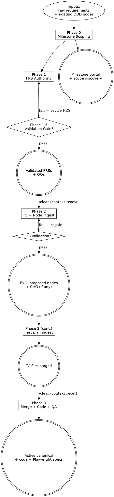

# WORKFLOW.md — Development Workflow

This file is the phase-pipeline index and cross-cutting practices hub for
the engine. It names the five phases, the three flows, the operations they
fire, and the workspace-wide retrieval / context-reset / maintenance
discipline every flow inherits. Per-phase procedure lives in the
per-flow files under [`workflow/`](workflow/); doctrinal *why* lives in
[`PRINCIPLES.md`](PRINCIPLES.md).

> **HARD-GATE:** Do NOT begin Phase 2 (Ingest) or Phase 3 (Merge + Code)
> without a `/clear` and a reload of the next flow file only. Context that
> survives a phase boundary is a bug, not a feature. Detail at
> [`### Context resets`](#context-resets).
> (Cross-cutting rules: see [`CLAUDE.md ## Hard rules`](../CLAUDE.md#hard-rules).)

## When to Use

**Use when:** entering or transitioning between phases, evaluating a
cross-cutting practice that spans flows, deciding which flow file to load
next, or proposing a new rule that may need to live here vs. in a per-op
file.

**Do NOT use when:** drafting a specific phase artifact — load the per-flow
file ([`workflow/design.md`](workflow/design.md),
[`workflow/plan.md`](workflow/plan.md),
[`workflow/implementation.md`](workflow/implementation.md)) instead.

**Vs. sibling files:** [`CLAUDE.md`](../CLAUDE.md) carries the always-on
hard rules; [`PRINCIPLES.md`](PRINCIPLES.md) carries the doctrinal *why*;
this file carries the *what* and the *when* of the phase pipeline plus
the cross-cutting practices every flow inherits.

---

Brownfield project, solo human across BA / BEA / Developer / QA hats, filesystem-based
(no GitLab yet). Workflow aligns operations to Karpathy's Ingest/Query pattern: the
FRS flow Queries the canonical DDD wiki to validate requirements; the FS flow
Ingests new DDD nodes directly into the canonical wiki at `docs/<component>/nodes/` with
`status: proposed`, and emits a milestone-scoped CHG node when existing canonical
nodes are touched; implementation Applies the CHG deltas to canonical and flips
the new nodes `proposed → active`.

## Process Flow



Steps `[shape=box]` are phase work; gates `[shape=diamond]` are
non-skippable validation; terminal artifacts `[shape=doublecircle]` are
the durable outputs each phase emits. The `/clear` labels on the
phase-1.5→2 and 2→3 edges are the canonical `HARD-GATE` instances above.

The milestone is **the planning container**, top-down or retroactive — it holds
its discoveries, FRSs, and FSs under one path. Multiple FSs can be generated
from one milestone, each aggregating a subset of the milestone's FRSs.

Three principles run through every phase:

1. **The DDD knowledge base in `docs/<component>/nodes/` is the source of truth for behavior.**
   FRSs declare intent; nodes describe behavior; specs reference nodes; code
   implements them. If a node and a spec disagree, the node wins — or both get
   reconciled before code is written. In-flight nodes (created by an unmerged
   FS) carry `status: proposed` in their frontmatter; this is the signal —
   there is no second source-of-truth tree. Component structure:
   `docs/<component>/nodes/` — see `docs/project.md § Components` for
   the component list registered in this workspace.
2. **ADRs are the source of truth for cross-cutting architectural commitments.**
   Component ADRs live at `docs/<component>/adrs/`; cross-component ADRs live
   at `docs/shared/adrs/`. Every Discovery, FRS, and FS declares the ADRs it
   consulted via `adrs:` in frontmatter.
   See [Authoring an ADR](#authoring-an-adr) below.
3. **Reference, never copy.** Specs link to nodes and ADRs by ID. Restating a
   node's behavior or an ADR's decision inline is a lint violation in spirit —
   it lets the source of truth and the spec silently diverge.

Templates for every artifact live in [`_templates/`](_templates/). Node
templates live in [`_templates/nodes/`](_templates/nodes/).

---

## The three flows

| Flow            | File                                                         | Operation             | Mode                | Phases covered |
| --------------- | ------------------------------------------------------------ | --------------------- | ------------------- | -------------- |
| Design          | [`workflow/design.md`](workflow/design.md)                   | `generate-frs`        | Validation (Query)  | 0, 1, 1.5      |
| Plan            | [`workflow/plan.md`](workflow/plan.md)                       | `generate-feat-spec`  | Ingest              | 2              |
| Plan            | [`workflow/plan.md → Test plan ingest`](workflow/plan.md#test-plan-ingest-after-fs-validation) | `generate-test-plan` | Ingest (test plan) | 2 (after FS validation) |
| Implementation  | [`workflow/implementation.md`](workflow/implementation.md)   | `implement-feat`      | Merge + Code        | 3              |
| Implementation  | [`workflow/implementation.md → Test suite codegen`](workflow/implementation.md#test-suite-codegen) | `generate-test-suite` | Codegen (test suite) | 3 (Stage 3 QA, before checklist) |

Each flow file owns its phase detail, validation checklists, and exit
criteria. The two test operations (`generate-test-plan`,
`generate-test-suite`) live inside the Plan and Implementation flows
respectively — same session, same context, no separate flow file. The
sections below this point (Cross-cutting practices, Knowledge base
layout, Migration to GitLab) apply to all three flows.

**Maintenance operations** sit alongside the phase flows but are not
tied to phases: `authoring-adr` (see [Authoring an ADR](#authoring-an-adr))
and `absorb-legacy-doc` (see [Legacy absorption](#legacy-absorption)).
Both can fire from inside any phase or stand alone; both share the
tiered touch discipline from
[Maintenance discipline](#maintenance-discipline).

---

## Cross-cutting practices

### Reference, never copy

Specs and node bodies link by ID; they do not paraphrase. Stated under
[The phases → three principles](#the-phases) above; see also
[`PRINCIPLES.md`](PRINCIPLES.md).

### Node content ownership

Every piece of content has exactly one owner node. When two node types
naturally share a surface — most commonly a CON node and an INT node
describing the same integration boundary — the type hierarchy determines
who owns what:

| Layer | Owner | Content owned | References to… |
|-------|-------|---------------|----------------|
| CON (`protocol: events`) | Contract node | Partition key, delivery semantics, retention, DLQ policy, contract-surface fields only (the fields consumers must know to filter or route) | INT node for full schema, DDL, blast radius |
| INT | Integration node | Full field schema, DDL/KSQL stream definitions, SLA targets, failure handling, blast radius | CON node for contract surface |
| FLW (journey-level) | The authoritative end-to-end flow | Shared mechanics: whitelist JOIN pattern, offset recovery, deduplication invariants | — |
| FLW (per-rule / per-command) | The narrower flow | Rule-specific diff only (window, threshold, source filter) | Journey FLW for shared mechanics, INT for whitelist producer |

**Enforcement:** when authoring a node, for each section ask "does this
content originate here, or does it originate on a node already in
`related:`?" If the latter, replace the section body with `see NODE-ID
§Section` and a one-sentence context note. The templates for CON and INT
carry authoring reminders at the relevant sections.

### Frontmatter vs body

YAML frontmatter carries machine-readable fields only — IDs, statuses,
dates, enum values, and lists of cross-reference IDs. The body carries
rationale, behavior, scenarios, and prose explanation. Narrative inside
frontmatter, or a metadata table restating frontmatter values inside the
body, is silent drift waiting to happen. See
[`PRINCIPLES.md`](PRINCIPLES.md).

### Retrieval discipline

The primary token lever. Skill prompts compact at the margin; not re-deriving
the corpus each session is the 10× win.

**Nodes.** When entering Phase 2 (Ingest) or Phase 3 (Merge + Code), read
**only** the nodes the milestone's FRSs declare in `touches_nodes` and
`produces_nodes`, plus one hop of transitive references (nodes those nodes
link in `related`). Do **not** pre-load `docs/<component>/nodes/` wholesale "to be safe."
If a node not on that list turns out to be necessary, stop, update the FRS
to declare it, and surface the omission to the QA hat — silently broadening
the load defeats the whole point.

Phase 2 retrieval reads canonical the same as every other phase — there is
no separate staging tree. The FS's `new_nodes:` frontmatter is the routing
list for nodes the FS introduces (each carries `status: proposed` in
canonical until Phase 3 merge flips it to `active`); the CHG node's
`modifies[]` is the routing list for canonical nodes the FS intends to
modify (Phase 3 applies the deltas).

**ADRs.** A parallel rule. At every generator entry (Phase 0 / 1 / 2 / 3),
the **one file** wholesale-read is [`adrs/index.md`](adrs/index.md) — by
design it carries one line per ADR, bounded size. From the index, pick the
ADR IDs relevant to the scope and narrow-load those pages only. Declare the
consulted IDs in the artifact's `adrs:` frontmatter. **Individual ADR pages
are not wholesale-loaded.** Same rule, second corpus.

**Baselines.** [`glossary.md`](glossary.md) and
[`cross-cutting-concerns.md`](cross-cutting-concerns.md) are
snapshot-read once at every Phase 1.5 gate entry (and at Phase 0 / Phase 1
drafting sessions that consult them for term resolution or
baseline-category citation). The current version of each is captured in
any Phase 1.5 Validation finding that fires (audit reproducibility set —
see [`workflow/frs-validation-rules.md`](workflow/frs-validation-rules.md#audit-reproducibility-set)).
Edits between runs follow [Maintaining baseline references](#maintaining-baseline-references-glossary-cross-cutting-concerns)
below.

**Tech-stack operational baseline.** [`tech-stack.md`](tech-stack.md) is
the project's living operational reference — pinned stack versions,
application layout, operational commands, environments, runtime state,
milestone progress. **Wholesale-read at Phase 3 implementation entry**
alongside the ADR index and the FS; **not snapshot-read at Phase 1.5**
(its mutability is intentional and decoupled from requirements
validation). Updated at Phase 3 merge when its sections change — see
[`workflow/maintenance-discipline.md → Tech-stack touch at merge`](workflow/maintenance-discipline.md).
Stack *decisions* still author ADRs; tech-stack reflects the operational
state those decisions reduce to.

**Test artifact rule books.**
[`workflow/test-data-generation.md`](workflow/test-data-generation.md) is
wholesale-read at Phase 2 Test plan ingest (to populate every TC's
`## Test Data` section) and at Phase 3 Test suite codegen (to interpolate
directive tokens into Playwright code).
[`workflow/action-to-playwright.md`](workflow/action-to-playwright.md) is
wholesale-read at Phase 3 Test suite codegen (action-inference, code
emission, full spec template). Both are bounded-size reference docs —
same retrieval posture as the Phase 1.5 rule books.

**Maintenance operation references.** Six bounded-size reference docs
peer to the rule books above. Each is wholesale-read **only** when the
matching operation fires; otherwise unread.

- [`workflow/maintenance-discipline.md`](workflow/maintenance-discipline.md) —
  Phase 3 merge, ADR lifecycle events, or any canonical node edit (the
  tiered touch).
- [`workflow/baseline-references.md`](workflow/baseline-references.md) —
  add / change / retire / drift-detection ops on
  [`glossary.md`](glossary.md) or
  [`cross-cutting-concerns.md`](cross-cutting-concerns.md). Runs between
  Phase 1.5 gates, never during one.
- [`workflow/authoring-adr.md`](workflow/authoring-adr.md) — authoring an
  ADR (standalone, from an FRS, or from an FS).
- [`workflow/derived-reports.md`](workflow/derived-reports.md) —
  regenerate the BUSINESS / TECHNICAL / `<kind>` overview.
- [`workflow/legacy-absorption.md`](workflow/legacy-absorption.md) —
  `absorb-legacy-doc` pass on `docs-backup/` artifacts.
- [`workflow/evolving-the-workflow.md`](workflow/evolving-the-workflow.md) —
  defining a new node type, refining a template, coining a new
  derived-report type.

**Exceptions.** Two, both at Phase 0 or Phase 1:
- Change-request KB scan — walks `docs/<component>/nodes/**` to find what an FRS
  *should* declare. See [`workflow/design.md`](workflow/design.md).
- ADR-index scan — always-on, every phase. The index file is the
  wholesale-read target; individual ADRs are not.

### Pre-FRS exploration

Two artifact families serve pre-commitment thinking. They live by
different disciplines.

**Survey** — `docs/milestones/M-NN/discovery/`, template
[`_templates/SURVEY.md`](_templates/SURVEY.md). Procedural artifact
consumed by Phase 0 milestone scoping and Phase 1 FRS authoring (and
the absorption workflow). Closed `kind:` enum (`new-feature` |
`change-request` | `absorb-legacy-doc`), mandatory sections per kind,
2-file touch. Use Surveys when the workflow expects them — i.e., as
inputs to Phase 0 / Phase 1 / absorption.

**Exploration** — `docs/exploration/`, template
[`_templates/EXPLORATION.md`](_templates/EXPLORATION.md). Free-form
working knowledge. Minimal mandatory frontmatter (id, title, status,
created), optional everything else, 1-file routine touch, no log.md.
Use Explorations any time you're thinking on paper outside the
milestone path: propositions, spikes, bug investigations, option
weighing, anything.

Related surfaces:

- **OQ-NNN** (`docs/discovery/open-questions/`) — first-class artifacts for
  answerable open questions. Use when the question needs a resolver artifact
  (DEC / ADR / FRS) before work can continue. 3-file lifecycle touch.
  See [`_templates/OPEN-QUESTION.md`](_templates/OPEN-QUESTION.md).
- **ADR / DEC** — commitments. Promote to ADR when cross-cutting; DEC when
  node-local. See [`workflow/authoring-adr.md`](workflow/authoring-adr.md).

#### Shape detection (Exploration only)

Exploration has no `kind:` field. The artifact's shape is detected
from frontmatter presence, not declared:

- `hypothesis:` present → spike-shaped. The workflow gates any related
  ADR's `proposed → accepted` flip on `outcome:` being filled.
- `affects_nodes:` present → bug-shaped. The template offers suggested
  body sections; none are mandatory.
- Neither present → free-form note. No special workflow.

#### Cross-linking

Exploration → commitment:

- The consumer (milestone / FRS / ADR) declares
  `from_exploration: [EXP-<slug>]` in its frontmatter.
- The Exploration declares `adopted_into: [<consumer-id>]`.

Surveys do not need this cross-linking — they're consumed by the
procedure that authored them; the consumption is implicit in the
milestone path.

#### When in doubt

If you're not sure whether a note is a Survey or an Exploration: it's
an Exploration. Surveys exist only when Phase 0 / Phase 1 / absorption
explicitly call for one.

### Bugs

**Bugs use a lightweight track** — see [`workflow/bug-fix.md`](workflow/bug-fix.md).
Not a phase; a maintenance activity producing a workspace-level Exploration
(with `severity:` and `affects_nodes:` set in frontmatter) plus a direct code
fix, or escalating to a full FRS when the fix requires design work.

### Validation gates

Each phase ends with a checklist before the next begins. These prevent
compounding error. A bad FRS becomes a bad node update becomes a bad spec
becomes bad code.

### Inline dispatch shape for gates

Gate checks that fan out to multiple specialist passes — **Phase 1.5
validation** (FRS validation, ADR conformance, baseline snapshot,
standard-conflict check) and the **Phase 3 QA hat ADR-conformance
check** (against the FS's declared `adrs:`) — run as **parallel** inline
`Agent(subagent_type=Explore, ...)` dispatches in a single message,
followed by synthesis in the main session. Subagent rules per
CLAUDE.md → "Inline subagent dispatch has a fixed contract."

Every dispatch must be self-contained: include the goal, the exact
files in scope, the conventions to follow, and the expected return
shape (JSON schema, structured list, file paths only). Free-form prose
returns force the orchestrator to re-read and re-interpret, erasing
the token savings. The contract below is the canonical instance of
this pattern.

**Return contract for every dispatch:**

```
## Findings
- <severity>: <finding> (file:line)

## Risks
- <severity>: <risk>

## Open questions
- <question> (raise as OQ-NNN if blocking)
```

≤ 400 words per dispatch. Cite by file path — do not restate rule
books. The main session merges findings into a single Validation
findings document (Phase 1.5) or a single QA-gate result (Phase 3) —
never concatenates raw subagent reports.

**Mutation verification (write-capable dispatches only):**

After any write-capable subagent returns:

1. The orchestrator confirms the change — a diff, a grep, or a re-read
   of one canary file. Do not trust the return message alone; subagents
   reliably report success on edits they partially or incorrectly applied.
2. On wrong or empty result: do not retry the same dispatch blindly.
   Either re-dispatch to a stronger model or split the task into smaller,
   more mechanical units. A failed weak-model call followed by a
   successful strong-model call is signal about task shape, not a defeat.

### Context resets

Start a fresh conversation between Phase 1.5 → 2 (Validation Gate to Ingest)
and Phase 2 → 3 (Ingest to Merge + Code). These are where bad context turns
into wasted nodes or wasted code. Phase 0 → 1 → 1.5 can usually share one
session — the milestone scoping, FRS authoring, and validation gate are
tightly related and short.

#### Anti-Pattern: "The Informed Skip"

Convincing yourself the context reset isn't needed because the current
session has "good context" — usually the validated FRS set is still in
view, or the Phase 1.5 findings are fresh, and a `/clear` feels wasteful.
The reset exists precisely because retained context drifts silently
across phases: Phase 2 needs the FRS as input but not the validation
deliberations; Phase 3 needs the FS as input but not the Phase 2
alternatives. The "good context" you preserve becomes Phase 2's silent
broadening of `touches_nodes` or Phase 3's silent canonical edit. **The
rule is non-skippable, every time.** Detail in
[`CLAUDE.md ## Hard rules`](../CLAUDE.md#hard-rules).

### Author self-review (before each phase's exit gate)

After writing an FRS set or an FS, look at the output with fresh eyes:

1. Placeholder scan — any "TBD", incomplete sections, or vague requirements?
2. Internal consistency — does the artifact contradict itself or upstream
   inputs (discovery, FRSs, nodes)?
3. Scope — for FRSs: each one atomic? for FS: single coherent slice?
4. Ambiguity — could any criterion or task be interpreted to build the wrong
   thing? If so, pick one interpretation and make it explicit.

Fix inline. No separate review file, no dispatched reviewer — just the same
hat you wore writing it, looking again.

### User-review handoff

At the end of Phase 1, Phase 2, and Phase 3, pause and surface the artifact
for review before proceeding:

> "Phase N output at `<path>`. Review before we move on."

The validation loop is the *what to check*; this handoff is the *moment of
checking*. Don't context-reset, don't trigger Phase 1.5, don't mark something
implemented without doing this pass.

### Traceability

- **Filename ID** on every artifact, node, and ADR.
- **Frontmatter links** — `source_ref`, `touches_nodes`, `produces_nodes`,
  `nodes`, `frs`, `milestone`, `related`, `adrs`, `frs_origin`, `fs_origin`.
- **[`docs/home.md`](home.md)** — the cross-type status quick-scan: terse
  tables showing ID, title, status, and source for every artifact type. Used
  when you want "what exists across the whole workspace at a glance."
- **Per-type [`index.md`](adrs/index.md)** — Karpathy-style content catalogs.
  `adrs/index.md` and `nodes/<type>/index.md` carry one row per page with a
  one-line summary, tags, and source — enough for an LLM to route to the
  right page without opening it. These are the files generators wholesale-read.
- **Per-type `log.md`** — append-only chronological event records, one entry
  per lifecycle event. See [Maintenance discipline](#maintenance-discipline)
  for format and update rules.

### Test artifacts traceability

The test artifacts form a three-link chain from behavioral spec to
executable code:

```
FLW-NNN#happy / #edge / #fault   (behavioral spec, canonical wiki)
        ↓ Traces to:
TC-NNN-<slug>.md                 (test case, FS-staged at Phase 2)
        ↓ generate-test-suite
<use-case>.spec.ts               (Playwright code, tests/ folder at Phase 3)
```

- **FLW nodes are the behavioral source of truth.** Scenarios live as
  named anchors (`#happy`, `#edge-N`, `#fault-N`) inside the canonical
  FLW node body and are referenced — never restated — by both TCs and
  the FRS's `## Test plan view` table.
- **TC files are the executable interpretation.** Drafted at Phase 2
  under each FS's `test-plans/<use-case>/` folder. Each TC's
  `**Traces to:**` line carries both FRS-side IDs (`AC-NN`, `Matrix:
  <row>`) AND FLW-side scenario anchors (`FLW-NNN#happy`,
  `FLW-NNN#edge-N`, `FLW-NNN#fault-N`). The dual trace makes coverage
  auditable from both directions.
- **Playwright specs are disposable artifacts.** Generated from TC
  files at Phase 3 (Stage 3 QA) and landed at
  `tests/{test_dir}/<feature>/<use-case>.spec.ts` on the FS's
  implementation branch. Hand edits to spec files are lost on
  regeneration — fix the TC, regenerate.

**TC files do not participate in the tiered touch.** They stay
milestone-scoped (no canonical promotion at Phase 3 merge); no
`docs/test-plans/index.md` or `log.md` exists. The FS's `## Test plan`
section IS the TC index for that FS.

**Two workflow references support this chain:**

- [`workflow/test-data-generation.md`](workflow/test-data-generation.md) —
  recipe for the `## Test Data` section in every TC; directive
  vocabulary that crosses the Phase 2 → Phase 3 boundary
  (`violatesMaxLength(N)`, `duplicate(value)`, `{timestamp}`, `{uuid}`).
- [`workflow/action-to-playwright.md`](workflow/action-to-playwright.md) —
  recipe for Phase 3 codegen; action-inference table, selector
  resolution, value substitution, full spec file template, mandatory
  `createdRecords + afterEach` cleanup pattern.

These two refs are wholesale-read during their respective operations
(Phase 2 Test plan ingest reads `test-data-generation.md`; Phase 3
Test suite codegen reads both). They are peers of
[`workflow/frs-validation-rules.md`](workflow/frs-validation-rules.md)
and
[`workflow/frs-code-extraction-rules.md`](workflow/frs-code-extraction-rules.md).

### Maintenance discipline

Every lifecycle event on a **canonical** node or ADR touches **three** files
— the artifact, the per-type `index.md`, the per-type `log.md`. No
exceptions. The touch fires at the lifecycle event itself, event-driven:
at Phase 2 ingest for a new node's `created` event; at Phase 3 merge for
the new node's `proposed → active` `status-change` event and for the CHG's
applied `modifies` / `removes` / `supersedes` (which fire `updated` /
`superseded` / `status-change` against the canonical target). The master
catalog [`home.md`](home.md) is derived from the per-type indexes —
not hand-maintained per event.

> **Canonical home.**
> [`workflow/maintenance-discipline.md`](workflow/maintenance-discipline.md)
> is the canonical home for the **closed operation vocabulary**
> (`created`, `status-change`, `superseded`, `deprecated`, `linked`,
> `updated`), the 3-file / (3+N) tier-touch procedure, the log entry
> format, the lazy-creation rule, and the light-touch fallback. This
> section is the always-loaded summary, not the procedure — when an
> operation fires, load that file.

### Maintaining baseline references (glossary, cross-cutting concerns)

[`docs/glossary.md`](glossary.md) and
[`docs/cross-cutting-concerns.md`](cross-cutting-concerns.md) are
**project-owned baselines** — domain vocabulary and NFR defaults that
every FRS inherits. They sit outside the canonical DDD wiki and outside
the ADR commitment store. An FRS deviation from a baseline category
becomes an ADR; the baseline file does not absorb the deviation.

Lifecycle ops (add / change / retire / drift detection) run **between**
Phase 1.5 gates, never during one — the gate snapshots both files at
entry. Cross-cutting numbering is permanent (never renumber). These
baselines do **not** participate in the tiered touch.

See [`workflow/baseline-references.md`](workflow/baseline-references.md)
for full procedures, version-bump classification (breaking / non-breaking),
drift-report taxonomy, and the hard rules across all ops.

### In-flight nodes (`status: proposed`)

New DDD nodes drafted during Phase 2 land directly in canonical
`docs/<component>/nodes/<type>/<ID>-<slug>.md` with `status: proposed` in
frontmatter. The 3-file lifecycle touch fires at that ingest — `created` log
entry, `proposed` row in the per-type index. Phase 3 merge flips
`proposed → active` and fires a `status-change` log entry. DDD node
lifecycle: `proposed → active → superseded | deprecated`.

**Existing canonical nodes are not modified at Phase 2.** When an FS's
FRS declares `touches_nodes`, the FS emits a CHG-NNN node (milestone-
scoped, permanent at
`milestones/M-NN-<slug>/specs/FS-NNN-<slug>/nodes/changes/CHG-NNN-<slug>.md`)
that documents the intended delta in its `modifies[]` / `removes[]` /
`supersedes[]` fields. The delta is *applied* at Phase 3 — never at
Phase 2 — so canonical nodes never carry partially-applied changes
while an FS is in flight. Phase 3 fires `updated` / `superseded` /
`status-change` log entries on the canonical targets at apply time and
flips the CHG's status `approved → merged` in place.

**Cross-FS dependencies.** An FS may read a `proposed` sibling-FS node
via `depends_on_specs:`. An FS may **not** include a `proposed`
sibling-FS node in its `touches_nodes` / CHG `modifies[]` — proposed
nodes are provisional, not modify targets. Phase 3 enforces merge
order: every spec in `depends_on_specs:` must have `merged: true`
before this FS's Phase 3 begins.

**FS abandonment.** If an FS is abandoned before reaching Phase 3, each
of its new canonical nodes flips `proposed → deprecated` (never
deleted; the append-only log keeps the history); the index row moves
to the Superseded/deprecated section. IDs are not reused.
Bidirectional `related:` back-links to a deprecated proposed node
remain (existing deprecated-node pattern).

**Workflow self-extension during Phase 2.** Planning sometimes surfaces
the need to extend the workflow itself — a new node type the current
13 don't model, a new derived-report type the existing BUSINESS /
TECHNICAL templates don't carry, or a doc template that needs
refinement before the in-flight FS can use it. When it does, the
extension lands in the methodology **before** the new artifact, not
after — same discipline as [Brownfield muscle](#brownfield-muscle)
surfacing-not-absorbing. See [Evolving the workflow](#evolving-the-workflow).

### Derived reports

Curated wiki-derived views live (lazily) under `docs/overview/`. The wiki
— nodes, ADRs, FRSs, milestones, discoveries — is the source of truth;
reports are build artifacts. Two report types ship with the scaffolding:
[`BUSINESS.md`](overview/BUSINESS.md) for product / business stakeholders
and [`TECHNICAL.md`](overview/TECHNICAL.md) for engineering / architecture.
Regenerate on demand; never patch a report directly. No `index.md` /
`log.md` pair under `docs/overview/`.

See [`workflow/derived-reports.md`](workflow/derived-reports.md) for the
regeneration procedure (`Pulls from:` contract, walk the indexes first,
update `generated_at:` / `source_commit:`) and the discriminator +
procedure for [defining a new report type](workflow/derived-reports.md#defining-a-new-report-type).

### Brownfield muscle

The discipline this workflow asks you to build: when a new requirement appears
to break an existing invariant **or an existing ADR**, surface the conflict in
the FRS (at Phase 1 drafting time as "Brownfield impact", or at Phase 1.5 as a
"Validation finding") — do not absorb it silently in Phase 2 or Phase 3. The
earlier the conflict surfaces, the cheaper it is.

Cross-node and cross-ADR conflicts discovered **outside an active FRS** (e.g.,
two existing nodes that already disagree, or an ADR contradicted by a node,
found during ambient reading) become OQ-NNN files under
[`discovery/open-questions/`](discovery/open-questions/) with
`origin: legacy-absorption` (when found while absorbing legacy text) or
`origin: workflow-evolution` (when found while reading the workflow itself).
Same 3-file lifecycle touch idiom as DEC / ADR. Template:
[`_templates/OPEN-QUESTION.md`](_templates/OPEN-QUESTION.md). The
pre-2026-05-13 legacy file
[`discovery/open-questions.md`](discovery/open-questions.md) is frozen and
no longer receives new entries.

---

## Change-request routing

When a change request arrives, the milestone choice follows this matrix:

| Situation | Milestone choice |
|---|---|
| Existing milestone in flight AND change is within its scope | **Existing** — add FRS under it |
| Existing milestone in flight AND change extends scope materially | **New milestone**, declare `extends: [M-NN]` |
| Existing milestone shipped AND change refines what it built | **New milestone**, declare `extends: [M-NN]` |
| Change is small AND no in-flight milestone fits | **Accumulator milestone** — `kind: accumulator` (see Milestone kinds below) |
| Change is genuinely new large scope | **New milestone** |
| Change is small AND code-level only (parameter tweak, copy edit, UI nudge) | **Bug-fix path** ([`workflow/bug-fix.md`](workflow/bug-fix.md)) — it's a code change, not a requirements change |

### Milestone kinds

Milestones declare `kind:` in frontmatter to drive validation behavior:

- `kind: feature` (default) — a coherent feature delivery. Validation gate
  enforces scope coherence.
- `kind: accumulator` — long-running container for small change requests that
  don't warrant their own milestone. Validation gate **skips** the "milestone
  scope must be coherent" check; accumulator milestones are deliberately
  multi-domain bundles. Close when full (e.g., 8–12 FRSs); successor opens.
  Example slug: `M-NN-refinements-2026-Q2`.
- `kind: refactor` — non-feature work driven by code quality / debt reduction.
- `kind: absorption` — legacy doc absorption milestones.

### Frontmatter additions

For milestones building on previous ones:

```yaml
extends: [M-NN]                  # milestones this one refines / builds on
```

For FRSs born from bug escalation:

```yaml
escalated_from: docs/exploration/EXP-<slug>.md
```

---

## Evolving the workflow

The workflow itself is extensible — new node types, doc templates, and
derived-report types can be coined as the project's needs evolve. The
discipline: extend before invent, refine before coin, and land the
extension in the methodology *before* the artifact that motivates it.
Phase 2 planning sometimes surfaces the need; see
[In-flight nodes (`status: proposed`)](#in-flight-nodes-status-proposed)
for the surface-don't-absorb posture this section mirrors.

See [`workflow/evolving-the-workflow.md`](workflow/evolving-the-workflow.md)
for the three extension forms (node type / doc template / derived-report
type), their discriminators, and per-form procedures.

---

## Authoring an ADR

ADRs capture workspace-level architectural commitments — stack choices,
layering rules, framework idioms, cross-cutting policies. Not a phase;
a maintenance activity that fires from inside Phase 0, Phase 1, or
Phase 2 (occasionally standalone). The Phase 3 QA gate consumes them.

**Discriminator (ADR vs DEC):**

> **DEC if the decision shapes one specific node's behavior.**
> **ADR if it constrains how we'd design future nodes we haven't met yet.**

If both seem to apply, file the DEC against the affected node and (if
the underlying rule is genuinely re-applicable) lift the rule into an
ADR that the DEC references.

See [`workflow/authoring-adr.md`](workflow/authoring-adr.md) for the
three triggers (standalone / from an FRS / from an FS), the authoring
steps, and the status lifecycle (`proposed → accepted → deprecated |
superseded`).

---

## Knowledge base layout

DDD content lives in **component-qualified canonical wikis** at
`docs/<component>/nodes/`. New nodes land there at Phase 2 with
`status: proposed`; Phase 3 flips them to `active`. The only
milestone-scoped DDD artifact is the CHG-NNN change-map at
`milestones/M-NN-<slug>/specs/FS-NNN-<slug>/nodes/changes/CHG-NNN-<slug>.md`,
which documents modify-intent against existing canonical nodes and
stays permanently in the milestone folder (never promoted).

When a new component is introduced, run
[`workflow/new-component-bootstrap.md`](workflow/new-component-bootstrap.md)
**before** Phase 2 ingest to declare the component and create its type folders.

```
docs/<component>/nodes/             # canonical wiki (one per component)
  actors/             ACT-NNN-*.md  (or {PREFIX}-ACT-NNN-*.md for prefixed components)
  entities/           ENT-NNN-*.md
  commands/           CMD-NNN-*.md  # write operations (state changes)
  queries/            QRY-NNN-*.md  # read operations (lazy)
  flows/              FLW-NNN-*.md
  states/             STA-NNN-*.md
  decisions/          DEC-NNN-*.md
  integrations/       INT-NNN-*.md
  modules/            MOD-NNN-*.md  # bounded context (engineering-facing)
  screens/            SCR-NNN-*.md  # conceptual UI surface
  contracts/          CON-NNN-*.md  # inter-component surface — HTTP / events / queue / gRPC
                                    # (discriminated by frontmatter protocol:)
  permissions/        PERM-NNN-*.md # first-class authorization rules
  services/           SVC-NNN-*.md  # deployable unit (lazy; multi-service projects only)
  functional-areas/   FA-NNN-*.md   # cross-MOD product slice (lazy)
  events/             EVT-NNN-*.md  # async/distributed events — Kafka + RabbitMQ (lazy)
```

The lazy folders (`queries/`, `modules/`, `screens/`, `contracts/`,
`permissions/`, `services/`, `functional-areas/`, `events/`) are created **lazily
on first Phase 2 ingest of that type.** **MOD** is the bounded-context
node (engineering-facing); cross-MOD product slices are **FA** nodes;
deployable units realizing a MOD are **SVC** nodes. **CMD vs QRY**: a
command changes state and has postconditions / domain events; a query
reads state and produces a projection with no side effects. Read
operations belong in QRY — never shoehorn them into CMD. **CON** is
the unified contract surface — HTTP routes, event topics, queues, gRPC
methods — discriminated by `protocol:` frontmatter; superseded the
prior EP (endpoint) prefix on 2026-05-14. **EVT** is the async-event
catalog — distributed events published to Kafka topics or RabbitMQ
exchanges; in-process ABP local events are NOT EVT nodes (they stay in
CMD's "Domain events raised" subsection). Every EVT node requires a
`linked_contract: CON-NNN` pointing at its transport surface.

ID prefixes are intentionally short — they appear in every cross-reference.

There is no canonical `docs/<component>/nodes/changes/` folder — CHG-NNN nodes live
permanently under the milestone's FS folder. See
[In-flight nodes (`status: proposed`)](#in-flight-nodes-status-proposed)
for how new nodes and CHGs interact across Phase 2 and Phase 3.

If your existing nodes use different filenames, prefixes, or folder structure,
**keep your existing convention.** The templates are scaffolding for new nodes;
they should not retrofit existing ones.

### External research (parallel to nodes)

`docs/research/` is a parallel canonical tree for **external / competitive
research** — vendor docs, industry papers, competitor wikis, domain
whitepapers — that inform future ADRs and FRSs. It is not DDD content
and does not live under `docs/<component>/nodes/`.

```
docs/research/                    # canonical research tree (lazy)
  index.md                        # Karpathy-style content catalog
  log.md                          # append-only chronological record
  RESEARCH-NNN-<slug>.md          # individual pages, narrow-loaded
```

Lazy-create the folder + `index.md` + `log.md` pair on first
`RESEARCH-NNN` instance, per
[`workflow/maintenance-discipline.md → Lazy creation`](workflow/maintenance-discipline.md).
RESEARCH entries are *cited references*: ADRs and FRSs link by ID
rather than restating content. Lifecycle: `raw` → `synthesized` →
`superseded`. Template:
[`_templates/RESEARCH.md`](_templates/RESEARCH.md).

---

## Legacy absorption

Operation: `absorb-legacy-doc`. A maintenance activity (peer of
[Authoring an ADR](#authoring-an-adr) — not a phase) that ingests a
legacy document from `docs-backup/` (or any prior-project artifact)
into the canonical wiki. The legacy text is **source material, not
authority**; canonical nodes + ADRs + glossary are the destination.
See [`PRINCIPLES.md`](PRINCIPLES.md) — "The legacy KB is a
quarry, not an authority."

Hard rule: **surface conflicts, never absorb.** When legacy text
contradicts canonical, flag in the absorbing FRS's "Brownfield impact"
or raise an `OQ-NNN` under
[`discovery/open-questions/`](discovery/open-questions/) with
`origin: legacy-absorption` when no FRS is in flight. **ID collisions
resolve upward** — legacy content lands at the next free canonical ID,
never overwrites.

See [`workflow/legacy-absorption.md`](workflow/legacy-absorption.md) for
the signal-to-target map (architecture / API spec / convention /
integration / deployment / feature-tracker), full hard rules, and the
per-pass absorption procedure.

---

## Migration to GitLab later

| Filesystem                                                          | GitLab                                       |
| ------------------------------------------------------------------- | -------------------------------------------- |
| `docs/milestones/M-NN-<slug>/M-NN-<slug>.md`                        | GitLab Milestone                             |
| `docs/milestones/M-NN-<slug>/frs/FRS-NNN-*.md`                      | Issue labeled `FRS`, linked to the milestone |
| `docs/milestones/M-NN-<slug>/specs/FS-NNN-<slug>/FS-NNN.md`         | Issue labeled `Feature Spec`, linked to the milestone |
| `docs/milestones/M-NN-<slug>/specs/FS-NNN-<slug>/nodes/changes/**`  | Stays in repo — CHG permanent home           |
| `docs/milestones/M-NN-<slug>/discovery/**`                          | Stays in repo — working notes                |
| `docs/milestones/M-NN-<slug>/id-claims.md`                          | Stays in repo — claim ledger                 |
| `docs/<component>/nodes/**`                                                     | Stays in repo — wiki is the right home       |
| `docs/<component>/adrs/**`                                                      | Stays in repo — wiki is the right home       |
| `docs/research/**`                                                  | Stays in repo — wiki is the right home       |
| `docs/discovery/open-questions/**`                                  | Stays in repo — per-OQ files + index + log   |
| `docs/discovery/open-questions.md`                                  | Stays in repo — frozen legacy log (pre-cut-over OQs) |

Nodes, ADRs, discoveries, and per-FS CHG nodes remain filesystem-based
even after GitLab adoption. Issues are for trackable work; everything under
`nodes/`, `adrs/`, and the per-milestone `discovery/`,
`specs/<FS>/nodes/changes/`, `id-claims.md` is durable knowledge that stays
in the repo.

**Deprecated paths.** The previous top-level `docs/frs/`, `docs/specs/`, and
`docs/discovery/<scope>.md` (per-feature) trees no longer exist — everything
moves under `docs/milestones/M-NN-<slug>/`. At the original discovery root,
two artifacts remain: the per-OQ folder `docs/discovery/open-questions/`
(authoritative for new OQs) and the frozen legacy file
`docs/discovery/open-questions.md` (pre-2026-05-13 entries; migrates
opportunistically when touched).

---

## Common Mistakes

These are file-specific operational misreadings of WORKFLOW.md, distinct
from the doctrinal anti-patterns in [`PRINCIPLES.md`](PRINCIPLES.md). When
a mistake here overlaps a doctrinal anti-pattern, the doctrinal statement
wins — fix the rule, do not rephrase it locally.

- **Treating `## Cross-cutting practices` as a per-flow rule book.** Each
  sub-section there is the always-on summary; the per-op procedure lives
  in the matching `workflow/<op>.md`. When the operation fires, load the
  per-op file — do not improvise from the summary alone.
- **Adding a new rule to `## Cross-cutting practices` when it actually
  belongs to one flow.** "Cross-cutting" means *applies to all three
  flows*. If a proposed rule only fires inside Phase 2 (or Phase 3, or
  bug-fix), it belongs in the per-flow file. Mis-homing the rule makes
  every phase reader pay the cost.
- **Treating the `## Process Flow` dot graph as the procedure.** It is a
  shape mnemonic; the procedural detail per phase lives in
  [`workflow/design.md`](workflow/design.md),
  [`workflow/plan.md`](workflow/plan.md), and
  [`workflow/implementation.md`](workflow/implementation.md). The graph
  helps recognize which file to load next; it does not substitute for
  loading it.

## Red Flags

File-specific *never*s — distinct from the always-on hard rules in
[`CLAUDE.md ## Hard rules`](../CLAUDE.md#hard-rules) and the doctrinal
refusals in [`PRINCIPLES.md`](PRINCIPLES.md).

- **"I'll skip the context reset just this once."** Reroute to
  [`### Anti-Pattern: "The Informed Skip"`](#anti-pattern-the-informed-skip)
  and reload — the `/clear` rule has no exceptions.
- **"I'll defer the cross-FRS sweep to Phase 2."** Phase 1.5's Pass-2
  sweep is the only place cross-FRS conflicts are caught cheaply; once
  Phase 2 begins, conflicts become silent canonical drift. The sweep
  runs at the gate, not at convenience.
- **"The index summary isn't detailed enough — let me glob the folder."**
  If the index is genuinely insufficient, fix the index. Skipping it to
  glob defeats the retrieval discipline and the
  [`PRINCIPLES.md`](PRINCIPLES.md) anti-pattern on wholesale-reading.
- **"This rule applies to my current flow only — I'll inline it
  there."** Re-check: if the rule is doctrinal, route it through
  [`PRINCIPLES.md`](PRINCIPLES.md); if it's cross-cutting and
  operational, it belongs here; if it's flow-specific, it belongs in
  the flow file. Inline-everywhere is silent drift.

## Integration

- **Required before:** [`CLAUDE.md ## Hard rules`](../CLAUDE.md#hard-rules)
  — every hard rule binds the actions this file orchestrates. Load
  hard rules first; this file points at the per-phase procedure they
  authorize.
- **Required before:** [`PRINCIPLES.md`](PRINCIPLES.md) — the
  doctrinal *why* behind every cross-cutting practice cited here.
- **Routes to (per phase):**
  - Phase 0 / 1 / 1.5 → [`workflow/design.md`](workflow/design.md)
  - Phase 2 (FS + node ingest, then test plan ingest) →
    [`workflow/plan.md`](workflow/plan.md)
  - Phase 3 (merge + code + QA + test suite codegen) →
    [`workflow/implementation.md`](workflow/implementation.md)
  - Bug fix track → [`workflow/bug-fix.md`](workflow/bug-fix.md)
- **Maintenance ops fired during phases:**
  [`workflow/maintenance-discipline.md`](workflow/maintenance-discipline.md),
  [`workflow/authoring-adr.md`](workflow/authoring-adr.md),
  [`workflow/legacy-absorption.md`](workflow/legacy-absorption.md),
  [`workflow/baseline-references.md`](workflow/baseline-references.md),
  [`workflow/derived-reports.md`](workflow/derived-reports.md),
  [`workflow/evolving-the-workflow.md`](workflow/evolving-the-workflow.md),
  [`workflow/new-component-bootstrap.md`](workflow/new-component-bootstrap.md).
- **Rule books wholesale-read at gates and ingests:**
  [`workflow/frs-validation-rules.md`](workflow/frs-validation-rules.md),
  [`workflow/frs-code-extraction-rules.md`](workflow/frs-code-extraction-rules.md),
  [`workflow/coverage-matrix.md`](workflow/coverage-matrix.md),
  [`workflow/test-data-generation.md`](workflow/test-data-generation.md),
  [`workflow/action-to-playwright.md`](workflow/action-to-playwright.md),
  [`workflow/review.md`](workflow/review.md),
  [`workflow/lint.md`](workflow/lint.md),
  [`workflow/regenerate-roadmap.md`](workflow/regenerate-roadmap.md).
- **Sibling reference:** [`BOUNDARY.md`](BOUNDARY.md) — engine-vs-project
  classification when proposing a new rule;
  [`LAYOUT.md`](LAYOUT.md) — folder map.
