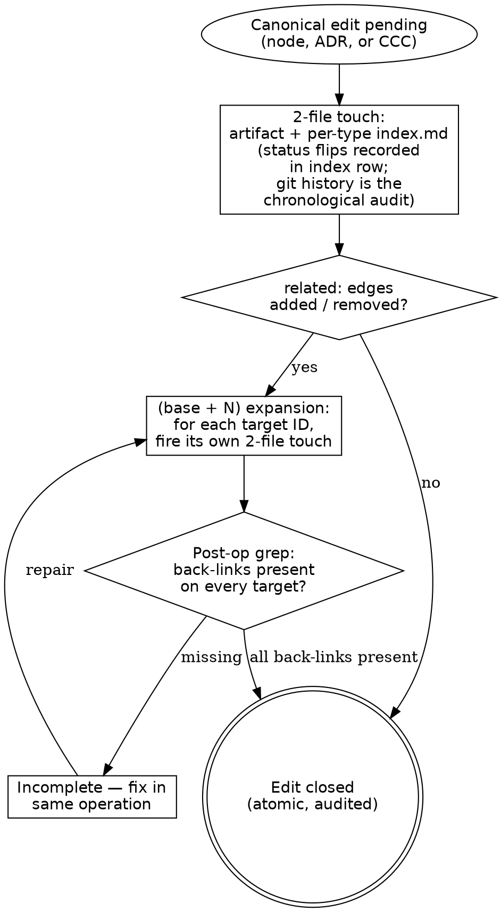

# Anti-Pattern: "The Lightweight Shortcut"

Firing the artifact edit but skipping the `index.md` re-sync, or the
reciprocal `related:` back-link on a target — because the edit is small, the
operation already feels long, or "the next session will catch it".
The cost: the index goes stale; cross-type retrieval (`Read the per-type
index.md before globbing`, from
[`../../CLAUDE.md ## Hard rules`](../../CLAUDE.md#hard-rules)) returns
the wrong view of canonical; future readers consume the index summary
and write derivative artifacts against the wrong shape. **Half-fired
events are how the corpus drifts silently.** Doctrinal anchor:
[`../PRINCIPLES.md`](../PRINCIPLES.md) — *Silent node or ADR edits* and
*If it can drift, the operation isn't atomic enough.*

## Process Flow

All canonical artifacts fire the same **2-file touch** (artifact + per-type
`index.md`). The single remaining diamond — the **related-edge diamond** —
classifies the cross-reference delta and decides whether N reciprocal touches
are owed via the `(base + N)` expansion.

## Integration

**Parent:** [`maintenance-discipline.md`](maintenance-discipline.md) — routing gate.
**Doctrinal anchor:** [`../PRINCIPLES.md`](../PRINCIPLES.md) — *Silent node
or ADR edits* and *If it can drift, the operation isn't atomic enough*.
**Related:** [`node-edit.md`](node-edit.md), [`bidirectional-link.md`](bidirectional-link.md).
