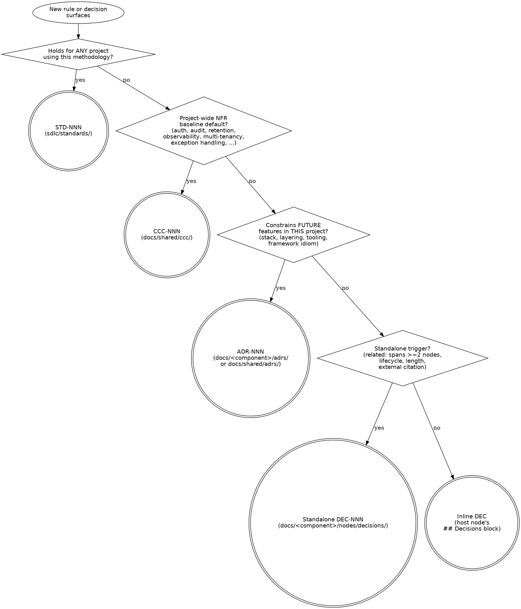

# Authoring an ADR

> Procedure for landing an Architecture Decision Record — picking the
> right artifact type (STD vs ADR vs DEC vs inline DEC), filing it,
> wiring the cross-references, and running the supersession path. Fires
> as a maintenance activity inside Phase 0 / 1 / 2 (occasionally
> standalone); the Phase 3 QA gate consumes the result.

> **HARD-GATE:** Do NOT author an ADR until the **4-way discriminator**
> below has been run — STD vs ADR vs CCC vs DEC. The discriminator is not
> a one-time gate; re-apply it whenever a DEC's `related:` set or scope
> expands, or when an inline CCC commitment broadens into a project-wide
> NFR default (see *Scope-creep re-application*). Authoring an ADR for a
> rule that should be a Standard pollutes the project-specific
> commitment store; authoring for a rule that should be a DEC over-weights
> a node-local decision; authoring for a rule that should be a CCC strands
> it outside the NFR-baseline retrieval path. (Cross-cutting rule:
> [`../../CLAUDE.md ## Hard rules`](../../CLAUDE.md#hard-rules) —
> "Four sources of truth for governance: STD / ADR / CCC / DEC".)

## When to Use

**Use when:** an architectural commitment needs to land — drawn from a
Phase 1 FRS clarification, a Phase 2 FS architecture decision, a
standalone realization, or the cross-type supersession of a DEC. Also
load when an `OQ-NNN` is resolved by a new or revised ADR (the
`resolves:` mechanic at *Steps* §8 applies).

**Do NOT use when:** the commitment is project-agnostic (load
[`../standards/`](../standards/index.md) — it's a Standard); when it
states a project-wide NFR baseline default such as auth, audit,
retention, observability, exception handling, validation, localization,
caching, background jobs, distributed events, multi-tenancy, soft-delete,
or session policy (load [`../../docs/shared/ccc/`](../../docs/shared/ccc/index.md)
— it's a CCC; ADRs capture *deviations* from a CCC, not the baseline
itself); or when it shapes one specific node's behavior with no
cross-cutting reach (file a DEC inline under that node's `## Decisions`
heading; promote to standalone only on a trigger from *Inline vs
standalone DEC*).

**Vs. sibling files:** [`maintenance-discipline.md`](maintenance-discipline.md)
is the rule book for the 3-file lifecycle touch this procedure fires
on every ADR `created` / `linked` / `status-change` / `superseded`
event. [`legacy-absorption.md`](legacy-absorption.md) routes legacy
convention/architecture docs into the ADR procedure here.
[`evolving-the-workflow.md`](evolving-the-workflow.md) governs the
case where the *type system itself* is being extended (rare, distinct
from authoring an ADR).

## Process Flow

Order the questions as drawn — STD first, CCC second, ADR third, DEC last.
Prefer the narrowest classification when multiple seem to apply, then
lift upward (DEC → ADR → CCC → STD) only when the underlying rule is
genuinely re-applicable. CCC and ADR are not competitors: a CCC is the
*baseline default* (what happens absent a deviation); an ADR captures the
*deviation* that overrides the CCC for a specific operation or scope.
Tired-solo-dev-at-midnight test: every diamond has a yes/no answer with
no third option.

## Anti-Pattern: "The Premature ADR"

Filing an ADR because the decision *feels* architectural, without
running the discriminator — most commonly when the rule is genuinely
single-node-scoped (should be a DEC), methodology-level (should be a
Standard), or a project-wide NFR default (should be a CCC). The cost:
ADRs accumulate as a junk drawer of "things we chose"; the Phase 3 QA
gate has to enforce every one of them; the canonical Standards and CCC
stores lose content that should live there. **Cheaper than filing wrong
is asking the four questions.** If the answer to "would this hold on a
different project?" is yes, it's a Standard — file under
[`../standards/`](../standards/index.md), not here. If the rule is a
project-wide NFR default (auth, audit, retention, observability,
multi-tenancy, exception handling, ...), it's a CCC — file under
[`../../docs/shared/ccc/`](../../docs/shared/ccc/index.md); ADRs only
land when this operation *deviates* from that baseline. If the answer
to "does it constrain future features?" is no, it's a DEC — inline
under the owning node unless a trigger in *Inline vs standalone DEC*
fires. Doctrinal anchor:
[`../PRINCIPLES.md`](../PRINCIPLES.md) — *Adding rules without
removing the old ones.*

ADRs capture workspace-level architectural commitments — stack choices,
layering rules, framework idioms, cross-cutting policies, and documented
deviations from CCC baselines. They are not a phase; they're a maintenance
activity that fires from inside Phase 0, Phase 1, or Phase 2 (and
occasionally standalone). The Phase 3 QA gate consumes them.

## When to file a STD, CCC, ADR, or DEC (the 4-way discriminator)

> **Standard (STD)** if the rule applies to **any project** using this
> methodology (DDD constraints, framework idioms, node-contract rules,
> API-shape rules). Lives in [`../standards/`](../standards/index.md).
> Stack-conditional applicability is declared via `applies_when:` frontmatter
> rather than by repository location. ID prefix `STD-NNN`.
>
> **Cross-cutting concern (CCC)** if the rule is a **project-wide NFR
> baseline default** — authentication & identity, authorization,
> multi-tenancy, auditing, validation, exception handling, localization,
> caching, background jobs, distributed events, session management,
> soft-delete & retention, observability, performance, availability,
> security, data retention. Lives in
> [`../../docs/shared/ccc/`](../../docs/shared/ccc/index.md). ID prefix
> `CCC-NNN`. CCC is the *default*; an operation that needs to deviate
> from a CCC files the deviation as an ADR back-linked to the CCC.
>
> **ADR** if it's a **project-specific cross-cutting commitment** that
> constrains how we'd design future features in *this* project (stack
> choice, integration topology, tooling, framework idiom) — or the
> **deviation** from a CCC baseline for one operation. Lives in
> `docs/<component>/adrs/` (when it constrains a single component) or
> `docs/shared/adrs/` (when it spans ≥2 components — use the component
> discriminator in [`BOUNDARY.md`](../BOUNDARY.md#component-structure-docs)).
> ID prefix `ADR-NNN`.
>
> **DEC** if it's a **node-local atomic decision** that shapes one node's
> behavior. Lives inline under the node's `## Decisions` heading, or
> standalone under `docs/<component>/nodes/decisions/`. ID prefix `DEC-NNN`
> (standalone) or `DEC-inline-N` (inline).

A tired solo dev at midnight should be able to apply this. Order the questions:

1. **Would this rule still hold if a different team adopted the methodology
   for an unrelated project?** Yes → STD. No → continue.
2. **Is this a project-wide NFR baseline default that every operation will
   absorb unless it explicitly deviates?** Yes → CCC. No → continue.
3. **Does it constrain how we'd design future features we haven't met yet in
   this project, or capture a one-time deviation from a CCC?** Yes → ADR.
   No → DEC.
4. **For a DEC**: would inline placement in the owning node serve discovery
   better than a standalone file? See *Inline vs standalone DEC* below.

If multiple seem to apply, prefer the narrowest. Then if the underlying rule
is genuinely re-applicable, lift it upward (DEC → ADR → CCC → STD) and have
the narrower artifact reference the broader one.

### Worked examples

| Candidate rule | Routes to | Why |
|----|----|----|
| "Every new entity declares its base class and rationale" | **STD-005** with `applies_when: { stack: [api], framework: [abp-net] }` | Engine-level — would hold for any project on the ABP stack. Conditional applicability is split across `stack:` (functional role) and `framework:` (framework binding), not encoded as a single token. |
| "Audit-log retention is 7 years by default; operations may extend it via ADR" | **CCC-NNN** (Auditing / Retention category) | Project-wide NFR default. Operation-specific extensions are ADRs back-linked to the CCC. |
| "REST endpoints in the customer-facing API use `/v1/...` versioning and return RFC-7807 problem details on error" | **ADR** with `stack: [api]` | Project-specific API convention; constrains how every future API feature is designed. Not engine-universal (other projects may use gRPC, GraphQL, or unversioned routes). |
| "The customer-portal UI uses TanStack Router with file-based routes" | **ADR** with `stack: [ui]` | Project-specific UI commitment; stack scope narrows to UI alone. |
| "For this single workflow, the BG-number generator skips numbers ending in `13`" | **DEC** (inline under the owning command node) | Node-local quirk; no future feature consumes it. |
| "Audit retention for legal-hold flags is 25 years instead of the baseline 7" | **ADR** back-linked to the Auditing CCC | A documented deviation from the CCC default for one operation. Baseline stays in CCC; deviation captured in ADR. |

## Inline vs standalone DEC (sub-discriminator)

A DEC starts **inline** by default — a `## Decisions` block inside the owning
node's file. Promote to **standalone** (a file under
`docs/<component>/nodes/decisions/DEC-NNN-<slug>.md`) when **any** of these trigger:

| Trigger | Standalone required because |
|---------|-----------------------------|
| `related:` would span ≥2 nodes | No single owner; inline forces duplication |
| Carries lifecycle (`status`, `superseded_by`) or is a promotion candidate to ADR/Standard | File identity is required for supersession path (cf. DEC-009 → ADR-029) |
| Rationale exceeds ~5 sentences or carries explicit Alternatives / Revisit-if sections | Length crowds the host node; standalone gives it room |
| External nodes need to cite the DEC by ID | External citation needs a stable canonical path |

**Promotion paths:**
- **Inline → standalone**: cut from host node's `## Decisions` block; create
  `docs/<component>/nodes/decisions/DEC-NNN-<slug>.md`; fire the 2-file node touch
  (file + decisions/index.md — DEC is a canonical node; no log.md fires); replace
  the inline content with a one-line link: `See [DEC-NNN](../decisions/DEC-NNN-<slug>.md)`.
- **Standalone → ADR**: see *Cross-type supersession* below. Worked example:
  DEC-009 → ADR-029 (2026-05-13).
- **DEC → Standard**: rare — usually means the rule was misclassified as
  project-specific from the start. Standalone DEC first, then standalone DEC →
  Standard via the same cross-type supersession mechanics.
- **Inline → ADR or Standard direct**: not permitted. Do standalone first.

## Scope-creep re-application

The discriminator is **not a one-time gate**. Re-apply it whenever a DEC's
`related:` set expands (standalone DEC scope-creep) or an inline DEC's host
node grows its effective reach (inline DEC scope-creep). Concrete cases:

- A standalone DEC's `related:` grows from one node to three → re-run the
  ADR-vs-DEC question. If it now constrains future nodes, promote.
- An inline DEC under `CMD-042` starts being cited from `FLW-018` by ID →
  promote inline → standalone (the citation-by-ID trigger fires).
- A standalone DEC gains a forward-compatibility clause ("Revisit if Phase 2
  begins") → re-run the ADR-vs-DEC question; the clause constrains future
  nodes by definition.

Apply at the moment of edit, not at next session boundary. The atomicity
principle (`sdlc/PRINCIPLES.md`) requires the re-classification fire in the
same operation as the scope-expansion edit.

## Three triggers

1. **Standalone.** A new architectural commitment with no FRS context —
   e.g., "Use Playwright for E2E tests with the page-object pattern." No
   in-flight feature. Pick the next `ADR-NNN`, copy
   [`_templates/ADR.md`](../_templates/ADR.md), fill, update
   `docs/<component>/adrs/index.md`, and append a `created` entry to
   `docs/<component>/adrs/log.md`. (`docs/home.md`'s ADR table is derived
   from the per-component indexes — regenerated on demand, not hand-edited.)
   Standalone ADRs have no Phase 1 / Phase 2 handoff to ride on, so author
   them directly as `accepted` once you're committed; use `proposed` only if
   you want a deliberate "sit with this for a week" gap before accepting.

2. **From an FRS** (Phase 1). The clarifying dialog surfaces a previously
   implicit architectural choice. Record as an ADR alongside the FRS draft.
   Set the ADR's `frs_origin: FRS-NNN`; add the ID to the FRS's `adrs:`
   frontmatter. The FRS's "Brownfield impact" section is the right place to
   note "this FRS produces ADR-NNN."

3. **From an FS** (Phase 2). The "Architecture decisions" section turns out
   to hold something cross-cutting enough to constrain future specs. Apply
   the discriminator. If it's an ADR: create the page, set `fs_origin: FS-NNN`,
   add the ID to the FS's `adrs:` frontmatter, and **collapse the FS prose to
   a reference** — full rationale lives in the ADR.

## Steps (all triggers)

1. Determine the component: is this ADR component-specific (one component) or cross-component
   (≥2 components)? Component-specific → `docs/<component>/adrs/`. Cross-component → `docs/shared/adrs/`.
   Pick the next ID from the target component's `index.md` — increment from the highest
   globally existing `ADR-NNN` across all component ADR indexes.
2. Copy [`_templates/ADR.md`](../_templates/ADR.md) to
   `docs/<component>/adrs/ADR-NNN-<slug>.md` and fill it. One-sentence imperative title.
   **Body ≤80 lines** (see [`retrieval-discipline.md § ADRs`](retrieval-discipline.md#adrs)).
   If the draft overflows, the rationale belongs in a deeper artifact
   (research doc, FS) rather than the ADR itself.
3. Update `docs/<component>/adrs/index.md` — add one row to the Active ADRs
   table per the schema in [`retrieval-discipline.md § Index row schemas`](retrieval-discipline.md#index-row-schemas)
   (title ≤120 chars; Source cell mapping per the schema).
4. Append a `created` entry to `docs/<component>/adrs/log.md` — see
   [`maintenance-discipline.md`](maintenance-discipline.md) for format.
   (`docs/home.md` is derived from the per-component ADR indexes — it
   regenerates on demand, not per event. Do not hand-edit its ADR table.)
5. Link from origin if applicable: set `frs_origin` / `fs_origin` on the ADR,
   and add the ADR ID to the origin artifact's `adrs:` frontmatter. When the
   back-link lands, append a `linked` entry to `docs/<component>/adrs/log.md`.
6. If superseding: set `supersedes:` on the new ADR, set `superseded_by:` on
   the old one, move the old one's index row from Active to
   Superseded/deprecated, and append `superseded` entries to `docs/<component>/adrs/log.md`
   for both ADRs.
7. If the ADR resolves one or more `OQ-NNN`: add the OQ ID(s) to the ADR's
   `resolves:` frontmatter (add the field if absent — it accepts a list
   of OQ-NNN, DEC-NNN, or FRS-NNN IDs the ADR closes). For each resolved
   OQ, flip its `status` to `resolved`, set `resolved_by: ADR-NNN`, and
   fire the discovery-surface touch on `docs/discovery/open-questions/` —
   2-file (OQ file + `open-questions/index.md` if one exists; index row
   moves to Resolved section). No `log.md` — discovery surface; see
   [`maintenance-discipline.md → Discovery surface discipline`](maintenance-discipline.md#discovery-surface-discipline).
   Back-links are reciprocal; an OQ closed without the resolver citing it
   via `resolves:` is half-closed.

The same `resolves:` mechanic applies when a DEC, STD, or FRS revision
closes an OQ: the resolver carries `resolves: [OQ-NNN]`; the OQ's
`resolved_by:` names the resolver. CHG nodes and RESEARCH-NNN docs use
the same field when they close an OQ. Workflow-evolution OQs close when the methodology change lands; the OQ's
`resolved_by:` names the updated workflow file.

## Cross-type supersession (ADR supersedes DEC, or vice versa)

When a node's classification turns out to be wrong from the start — most
commonly a DEC whose `related:` is empty and whose rule constrains future
nodes we haven't met — the corrective move is an ADR that **supersedes
the DEC** rather than editing the DEC in place. The mechanics:

- The new ADR's `supersedes:` field carries the DEC ID
  (e.g., `supersedes: DEC-009`). Same field, no new syntax.
- The DEC's `superseded_by:` field carries the ADR ID.
- The DEC's status flips `active → superseded`.
- The DEC's index row moves from Active to Superseded/deprecated in
  `docs/<component>/nodes/decisions/index.md` (the Status column re-sync
  captures the status-change — no separate DEC log entry). The ADR's
  `log.md` gets a `created` entry that names the supersession.
- The DEC body is retained for audit — add a banner at the top pointing
  at the superseding ADR. The canonical rationale, alternatives, and
  consequences live in the ADR going forward; the DEC page is read-only.
- Outbound references to the superseded DEC (in legacy
  `open-questions.md`, in OQ-NNN files' `resolved_by:`, in other nodes'
  `related:`, etc.) are repointed at the ADR in the same pass.

The opposite direction (a DEC superseding an ADR) is permitted but
should be rare — usually means an ADR was authored at the wrong scope.
Same mechanics, fields swapped. Precedent: ADR-029 superseding DEC-009
(2026-05-13).

## Status lifecycle

> **Canonical home:** [`../BOUNDARY.md ## Engine-vs-project axis`](../BOUNDARY.md#engine-vs-project-axis)
> carries the authoritative status-vocabulary table for all four
> artifact families (node / ADR / FRS / OQ). The summary below is a
> reading aid for the ADR family; on any discrepancy, the BOUNDARY.md
> table wins.

`proposed → accepted → (optionally) deprecated | superseded`

- **proposed** — drafted but not committed-to. Generators **may** consult
  but do not enforce.
- **accepted** — committed. Generators consult; the Phase 3 QA gate enforces.
- **deprecated** — no longer applies, no successor. Kept for audit.
- **superseded** — successor ADR exists; both ends linked.

Status moves are explicit edits, not implicit. The user-review handoff at
Phase 1 or Phase 2 exit is the moment to flip a `proposed` ADR to `accepted`
if it was authored during that phase. Every status move appends a
`status-change` entry to `docs/<component>/adrs/log.md` and re-syncs the row
in `docs/<component>/adrs/index.md`. (`docs/home.md` is derived from the
per-component ADR indexes — regenerated on demand, not hand-edited per
event.) See [`maintenance-discipline.md`](maintenance-discipline.md).

---

## Integration

- **Required before:** [`../../CLAUDE.md ## Hard rules`](../../CLAUDE.md#hard-rules)
  — "Four sources of truth for governance: STD / ADR / CCC / DEC" is the
  doctrinal anchor of this flow's HARD-GATE; "Canonical edits use
  tiered touch" governs every ADR `created` / `linked` /
  `status-change` / `superseded` event.
- **Required before:** [`../PRINCIPLES.md`](../PRINCIPLES.md) —
  "Adding rules without removing the old ones" is the named
  anti-pattern the discriminator prevents.
- **Required before:** [`../BOUNDARY.md`](../BOUNDARY.md) —
  engine-vs-project axis (a Standard is engine-level; an ADR is
  project-level) and the canonical status-vocabulary table.
- **Rule books wholesale-read during this op:**
  [`maintenance-discipline.md`](maintenance-discipline.md) — file-set
  and log-entry format for every ADR lifecycle event;
  [`../standards/index.md`](../standards/index.md) — when the
  discriminator routes upward to a Standard rather than an ADR.
- **Callers (this file is wholesale-read by):**
  [`design.md`](design.md) (Phase 1 FRS surfaces an implicit ADR;
  `frs_origin:` wiring),
  [`plan.md`](plan.md) (Phase 2 FS architecture decision routed to ADR
  vs DEC vs inline),
  [`legacy-absorption.md`](legacy-absorption.md) (convention /
  architecture / integration docs classified into ADRs).
- **Sibling rule books:**
  [`maintenance-discipline.md`](maintenance-discipline.md),
  [`legacy-absorption.md`](legacy-absorption.md),
  [`evolving-the-workflow.md`](evolving-the-workflow.md),
  [`new-component-bootstrap.md`](new-component-bootstrap.md),
  [`baseline-references.md`](baseline-references.md).
