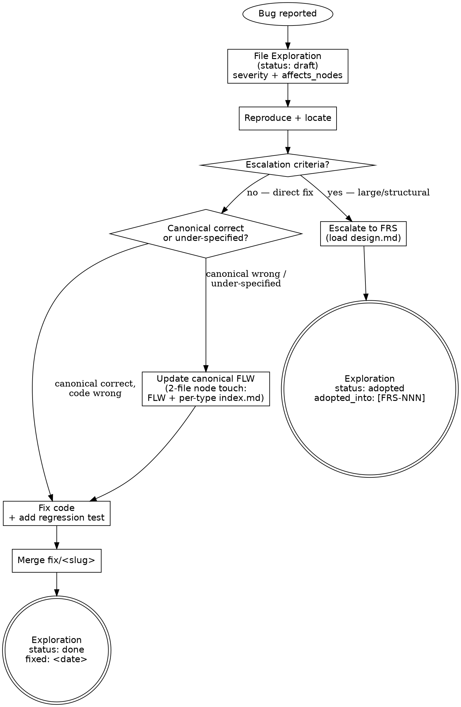

---
applies_when:
  stack: [agnostic]
---

# Bug-fix workflow

Bugs use a lightweight track distinct from milestones / FRSs / FSs.
A bug fix is "the code drifted from canonical" or "canonical was
under-specified" — not a milestone-scoping problem.

> **HARD-GATE:** Do NOT edit a canonical node (FLW or otherwise) as
> part of a bug fix without firing the 2-file node touch
> (node + per-type `index.md` re-sync). The bug-fix track exists as a
> lightweight option *because* it still honors the maintenance
> discipline — silent canonical edits are not the discount; they are a
> different (broken) path. (Cross-cutting rules: see
> [`../../CLAUDE.md ## Hard rules`](../../CLAUDE.md#hard-rules) — "Tiered
> touch for canonical edits".)

## When to Use

**Use when:** a defect has surfaced (production, staging, dev) and the
fix is "code drifted from canonical" or "canonical was under-specified
in a small, addressable way". The Exploration file at workspace level
is the audit trail; the fix lands on a `fix/<slug>` branch.

**Do NOT use when:** the fix requires multi-day design work, new
behavior beyond restoring intended behavior, multiple bugs cluster
around the same canonical area, or a structural gap surfaces. Those
cases **escalate to an FRS** (see [Escalation criteria](#escalation-criteria)
below) and load [`design.md`](design.md) under a new or existing
milestone.

**Vs. sibling files:** [`design.md`](design.md) / [`plan.md`](plan.md) /
[`implementation.md`](implementation.md) are the full milestone-driven
track for *intended* behavior; this file is the lightweight track for
*broken* behavior. The two tracks share the maintenance discipline (the
HARD-GATE above) — they differ only in scoping ceremony.

## Process Flow



The triage diamond names the two direct-fix shapes — `canonical_changed:
false` (code-only) and `canonical_changed: true` (canonical + code).
The escalation diamond guards the lightweight track from absorbing
work it shouldn't.

## Anti-Pattern: "The Obvious Tweak"

A one-line fix to a canonical node body during bug investigation
because the wording is "clearly" wrong — without re-syncing the
per-type `index.md` row. The temptation: the edit is small, the bug
fix is small, and the canonical node is right there. The cost: a
future reader sees the index summary unchanged, assumes the node is
what they think it is, and writes code against the wrong shape.
**Every canonical edit fires the 2-file node touch — bug fix track
included.** If the index row's summary/tags/source-ref need updating
because of the bug fix and you can't write a commit message naming
what changed and why, the edit isn't ready; either delay it or
escalate the bug to an FRS. Doctrinal anchor:
[`../PRINCIPLES.md`](../PRINCIPLES.md) — "Silent node or ADR edits".

## File location

`docs/exploration/EXP-<slug>.md` — workspace-level Exploration with
`severity:` and `affects_nodes:` set in frontmatter (no `kind:` field;
shape is detected from the `affects_nodes:` presence). See
[`../_templates/EXPLORATION.md`](../_templates/EXPLORATION.md).

## Lifecycle

```
Bug reported
    ↓
File the Exploration (status: draft)
    ↓
Reproduce + locate (body sections fill in)
    ↓
    ├── Small (canonical correct, code wrong) ── Direct fix path
    │
    └── Large (canonical wrong / under-specified) ── Escalate to FRS
```

Bug-specific triage stages (Expected behavior / Actual behavior / Root
cause / Fix / Test added) live in body sections, not in `status:`. The
Exploration status enum is the framework standard
(`draft | done | stale | adopted | rejected | dormant`); on terminal
resolution the bug Exploration flips to `done` (when fixed in code) or
`adopted` (when escalated to FRS, with `adopted_into:` citing the FRS ID).

## Direct fix path

1. Branch `fix/<slug>` in the affected service repo.
2. **If canonical FLW was correct:** add the missing test that locks
   in the fix; fix the code; verify. `canonical_changed: false`.
3. **If canonical FLW was wrong or under-specified:** update the
   canonical FLW node (add the fault scenario or correct the existing
   one). Fire the 2-file node touch per maintenance discipline
   (FLW + per-type `index.md` re-sync as needed). Then fix code; add
   test; verify. `canonical_changed: true`.
4. Bug Exploration `status: done`; populate `fixed:` date.
5. Merge.

## What bug-fix path skips

- No milestone scoping (Phase 0)
- No FRS authoring (Phase 1)
- No validation gate (Phase 1.5)
- No FS authoring (Phase 2)
- No CHG node (canonical updates land via `updated` event in place,
  not via CHG)
- No Coverage Matrix walk

## What bug-fix path requires

- Reproduction step recorded (the falsifiable claim, in `reproduction:`
  frontmatter or the body)
- Test added (regression prevention)
- Canonical update only if canonical was actually wrong, never silent
- Bug Exploration file as audit trail

## Escalation criteria

A bug escalates to an FRS when:

- Fix requires multi-day design work
- Bug reveals a structural gap warranting full FRS → FS chain
- Multiple bugs cluster around the same canonical area
- Fix introduces new behavior beyond restoring intended behavior
  (at that point it's a change request, not a bug)

Escalated: bug Exploration `status: adopted` with `adopted_into:
[FRS-NNN]`. The FRS is authored under an existing or new milestone
per the change-request routing rules in
[`../WORKFLOW.md → Change-request routing`](../WORKFLOW.md). The FRS
frontmatter declares `from_exploration: [EXP-<slug>]` (or, for the
escalation-specific case, `escalated_from: docs/exploration/EXP-<slug>.md`).

---

## Integration

- **Required before:** [`../../CLAUDE.md ## Hard rules`](../../CLAUDE.md#hard-rules)
  — "Tiered touch for canonical edits" is the doctrinal anchor of this
  flow's HARD-GATE.
- **Required before:** [`../WORKFLOW.md`](../WORKFLOW.md) — phase
  pipeline (`### Bugs` cross-cutting practice), retrieval discipline,
  `### Maintenance discipline` summary.
- **Required before:** [`../PRINCIPLES.md`](../PRINCIPLES.md) —
  "Silent node or ADR edits" and "Drive-by refactors" are the named
  anti-patterns this track exists to navigate around.
- **Rule books wholesale-read when a canonical edit fires:**
  [`maintenance-discipline.md`](maintenance-discipline.md) — for the
  2-file node touch when canonical FLW changes.
- **Routes to (on escalation):** [`design.md`](design.md) — the FRS
  authored under a new or existing milestone per the change-request
  routing matrix in
  [`../WORKFLOW.md → Change-request routing`](../WORKFLOW.md).
- **Sibling flow files:** [`design.md`](design.md),
  [`plan.md`](plan.md), [`implementation.md`](implementation.md).
