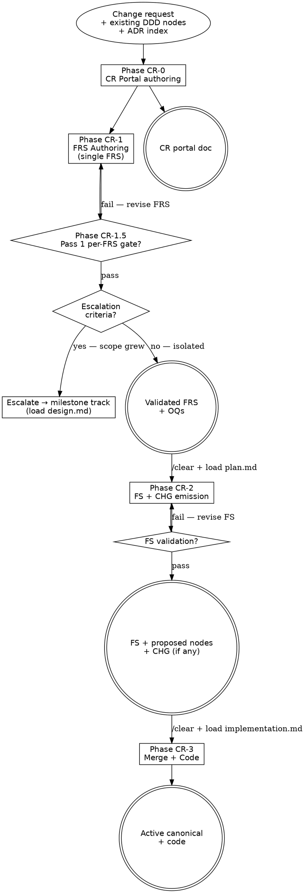

# Change-Request Flow

Lightweight track for isolated, standalone change requests that don't belong
in a milestone group. Produces a CR-scoped container
(`docs/change-requests/CR-NNN-<slug>/`) instead of a milestone folder. FRS,
FS, and CHG artifacts are CR-scoped. Phase 0 (milestone scoping) and Phase
1.5 Pass 2 (cross-FRS sweep) are omitted — one FRS per CR is the ceiling.

<HARD-GATE>
Do NOT begin Phase CR-2 (FS authoring) until the single FRS has cleared
Phase CR-1.5 (Pass 1 per-FRS gate, zero unresolved-without-OQ findings)
AND a `/clear` + reload of [`plan.md`](plan.md) has happened.
Do NOT write method bodies, brace-delimited blocks, SQL bodies, YAML
payloads, implementation file paths, or line-level code in the FS or any
CHG node. Phase CR-2 names structures; Phase CR-3 writes them.
(Cross-cutting rules: [`../../CLAUDE.md ## Hard rules`](../../CLAUDE.md#hard-rules).)
</HARD-GATE>

---

## When to Use

**Use when:** a change request is:
- Self-contained — single user journey, single FRS
- Scope is known at start (no discovery needed)
- Not related to other in-flight or planned work that should group together

**Do NOT use when:**
- Multiple related user journeys surface → escalate to milestone track
- Cross-FRS conflicts surface at Phase CR-1.5 → escalate to milestone track
- The change restores broken behavior (not changing intent) → load [`bug-fix.md`](bug-fix.md)
- Several unrelated small CRs accumulate and grouping adds value → use a
  `kind: accumulator` milestone (`MILESTONE.md` template) instead; accumulator
  milestones skip the scope-coherence check and close at 8–12 FRSs

**Vs. sibling files:** [`design.md`](design.md) / [`plan.md`](plan.md) /
[`implementation.md`](implementation.md) are the milestone-grouped track for
multi-FRS deliveries; this file is the CR-scoped track for single-FRS
isolated changes. Both tracks share the same canonical-edit discipline and
phase structure — they differ only in the container (CR folder vs. milestone
folder) and the omission of Phase 0 and Pass 2.

**Extend-before-invent record** (`evolving-the-workflow.md` discriminator):
Bug-fix shape-coverage <60% (no FRS, no CHG, no Pass 1 gate). Milestone
track shape-coverage ~80% but the container is the explicit gap; the user
requirement is CR-scoped CHG nodes, not milestone-scoped. ≥3 CR instances
expected per project. Distinct container lifecycle (`open → in-progress →
done | escalated`) and path structure — criterion met for a new flow file.

---

## CR Container Structure

```
docs/change-requests/
  CR-NNN-<slug>/
    CR-NNN-<slug>.md           # Portal doc (template: sdlc/_templates/CR-PORTAL.md)
    id-claims.md               # ID reservation ledger (lazy — same discipline as milestones)
    frs/
      FRS-NNN-<slug>.md        # Single FRS per CR
    specs/
      FS-NNN-<slug>/
        FS-NNN.md
        nodes/
          changes/
            CHG-NNN-<slug>.md  # CR-scoped CHG nodes (permanent home, never promoted to canonical)
        test-plans/            # TC files (lazy; created at QA-track flow entry)
          <use-case>/
            TC-NNN-<slug>.md
```

New DDD nodes the FS introduces land in `docs/<component>/nodes/<type>/`
directly (same as milestone track) with `status: proposed`.

---

## Process Flow



---

## Phase CR-0 — CR Portal

Author the portal doc at
`docs/change-requests/CR-NNN-<slug>/CR-NNN-<slug>.md`.
Template: [`../../_templates/CR-PORTAL.md`](../../_templates/CR-PORTAL.md).

- Assign `CR-NNN` ID: check `docs/change-requests/` for the highest-numbered
  existing CR, then increment.
- Write 1–2 sentence scope (what behavior changes and why).
- Leave `frs:` and `specs:` frontmatter empty — filled iteratively.
- No milestone-scope discovery. If scope is genuinely unclear, file an
  Exploration (`docs/exploration/`) first and return when scope is clear.

---

## Phase CR-1 — FRS Authoring

One FRS per CR — the ceiling, not a target. Load
`design.md § Phase 1 — FRS Authoring` only (not the full file). Use the same
`sdlc/_templates/FRS.md` template; leave `milestone:` blank and set
`cr: CR-NNN` in frontmatter (`cr:` and `milestone:` are mutually exclusive).

File at: `docs/change-requests/CR-NNN-<slug>/frs/FRS-NNN-<slug>.md`

Add the FRS ID to the portal doc `frs:` frontmatter and body list.

---

## Phase CR-1.5 — Per-FRS Gate (Pass 1 only)

Run the per-FRS gate per [`design.md § Pass 1 — Per-FRS gate`](design.md#pass-1--per-frs-gate-runs-after-each-frs-is-authored),
which dispatches to [`frs-validation-rules.md`](frs-validation-rules.md)
for the rule definitions. Pass 2 (cross-FRS sweep) is not applicable —
one FRS per CR.

**Escalation check** (run after Pass 1 passes):

| Signal | Action |
|---|---|
| Pass 1 surfaces a second user journey in scope | Escalate to milestone track |
| Pass 1 flags a cross-cutting architectural decision spanning components | Escalate to milestone track |
| CR is related to other planned work that shares a domain | Escalate or group under an existing milestone |
| All signals absent | Proceed to Phase CR-2 after `/clear` + `plan.md` reload |

---

## Phase CR-2 — FS Authoring + CHG Emission

Load [`plan.md`](plan.md) after `/clear`. Follow `plan.md` exactly. The only
differences from the milestone track are path substitutions:

| Milestone path | CR path |
|---|---|
| `milestones/M-NN-<slug>/specs/FS-NNN-<slug>/FS-NNN.md` | `docs/change-requests/CR-NNN-<slug>/specs/FS-NNN-<slug>/FS-NNN.md` |
| `milestones/M-NN-<slug>/specs/FS-NNN-<slug>/nodes/changes/CHG-NNN.md` | `docs/change-requests/CR-NNN-<slug>/specs/FS-NNN-<slug>/nodes/changes/CHG-NNN.md` |
| `milestone: M-NN` in FS frontmatter | `cr: CR-NNN` in FS frontmatter; leave `milestone:` blank |

Add the FS ID to the portal doc `specs:` frontmatter and body list.

---

## Phase CR-3 — Implementation

Load [`implementation.md`](implementation.md) after `/clear`. No differences
from the milestone track — CHG deltas are applied to canonical, proposed nodes
flip `proposed → active`, code is written.

---

## Escalation procedure (→ milestone track)

When escalation criteria fire at Phase CR-1.5 or during Phase CR-2:

1. Stop — do not continue the CR track.
2. Load [`design.md`](design.md) under a new or existing milestone.
3. Adopt the CR FRS into the milestone: add `from_cr: [CR-NNN]` to
   the milestone FRS frontmatter; update the CR portal doc to
   `status: escalated` and `escalated_to: [M-NNN]`.
4. CR portal doc is the audit trail — do not delete it.

---

## QA track (unchanged)

The QA track applies after Phase CR-3 without modification. Load
[`test-plan-ingest.md`](test-plan-ingest.md),
[`test-suite-codegen.md`](test-suite-codegen.md), and
[`qa-gate.md`](qa-gate.md) on their own cadence with `/clear` between each.
TC files live under
`docs/change-requests/CR-NNN-<slug>/specs/FS-NNN-<slug>/test-plans/`.

---

## Integration

- **Routing:** [`index.md`](index.md) (routing table)
- **Delegates Phase CR-1 to:** `design.md § Phase 1 — FRS Authoring`
- **Delegates Phase CR-1.5 to:** `design.md § Pass 1 — Per-FRS gate` (Pass 1 only; Pass 2 cross-FRS sweep is N/A for single-FRS CRs). Rule definitions live in `frs-validation-rules.md`.
- **Delegates Phase CR-2 to:** `plan.md` (full)
- **Delegates Phase CR-3 to:** `implementation.md` (full)
- **Escalation target:** `design.md` (full, under new or existing milestone)
- **Canonical-edit discipline:** [`maintenance-discipline.md`](maintenance-discipline.md) — fires at every 2-file node touch
- **ID discipline:** [`maintenance-discipline.md`](maintenance-discipline.md) — check `id-claims.md` + per-type index before assigning FRS / FS / CHG IDs
