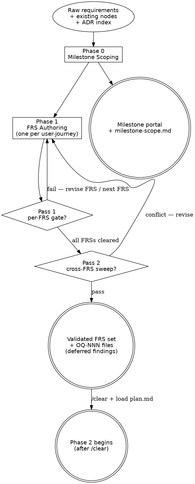

# Design Flow

> Design flow — generates the milestone container, its discoveries, its FRSs,
> and runs the validation gate that hardens those FRSs before the Ingest flow
> drafts nodes. Part of the workflow defined in [`../WORKFLOW.md`](../WORKFLOW.md).
>
> **Mode: Validation (Query).** This flow does not write DDD nodes. It Queries
> the canonical wiki (which includes `status: proposed` in-flight nodes from
> any FS not yet at Phase 3) and the ADR index to validate that requirements
> are well-formed, non-duplicate, and conflict-free before Phase 2 Ingest
> writes the new canonical nodes.

> **HARD-GATE:** Do NOT begin Phase 2 (Ingest) until **every** FRS in this
> milestone has cleared Phase 1.5 (zero unresolved-without-OQ findings,
> cross-FRS sweep clean) AND a `/clear` + reload of
> [`plan.md`](plan.md) has happened. The validation gate is non-skippable
> and runs even when "the FRS looks obviously fine."
> (Cross-cutting rules: see [`CLAUDE.md ## Hard rules`](../../CLAUDE.md#hard-rules).)

## When to Use

**Use when:** entering Phase 0 (milestone scoping), Phase 1 (FRS
authoring), or Phase 1.5 (validation gate). Sessions 0 / 1 / 1.5 typically
share one conversation; entering Phase 2 requires `/clear` + reload of
[`plan.md`](plan.md).

**Do NOT use when:** drafting an FS or new DDD nodes (load
[`plan.md`](plan.md)), or applying CHG deltas (load
[`implementation.md`](implementation.md)). This flow Queries the canonical
wiki — it does not Ingest into it.

**Vs. sibling files:** [`plan.md`](plan.md) is the Ingest flow that writes
nodes; [`implementation.md`](implementation.md) is the Merge + Code flow
that applies CHGs; this file is the Query / Validation flow that hardens
FRSs **before** any node lands in canonical.

This flow covers Phases 0, 1, and 1.5. They typically share one session because
the work is tightly related and short.

### Minimal read set per task type

Load only what the task type requires. Do not pre-load speculatively.

| Task type | Load in full | Load by section only | Skip entirely |
|---|---|---|---|
| **Meta question** ("what is the process", "document phase X") | `design.md` | `frs-validation-rules.md` §Severity + §Bundling detection (lines 1–140) | `KB-LAYOUT.md`, `retrieval-discipline.md`, `FRS.md` template, `WORKFLOW.md` body |
| **Actual Phase 0 execution** | `design.md` | `WORKFLOW.md` §Phase flows (router only) | `KB-LAYOUT.md`, `retrieval-discipline.md`, `FRS.md` template |
| **Actual Phase 1 execution** | `design.md` | ADR index (one-line scan) | `KB-LAYOUT.md`, `retrieval-discipline.md` |
| **Actual Phase 1.5 execution** | `design.md`, `frs-validation-rules.md` | `glossary.md`, `docs/shared/ccc/index.md` (snapshot at gate entry), `sdlc/standards/index.md` (scan for FRS-relevant STDs) | `KB-LAYOUT.md`, `WORKFLOW.md` body |

For `frs-validation-rules.md` partial reads: §Severity classification ends at the gate-verdict block (~line 110 of the file). §Bundling detection follows immediately. Read offset 0, limit 140 for meta questions; read the full file only at an actual Phase 1.5 gate.

## Section routing

If you've loaded this file for a specific phase (rather than starting
Phase 0 fresh and running through to 1.5), read the linked section only.
The HARD-GATE callout at the top and [Process Flow](#process-flow)
carry the doctrinal frame the per-phase sections assume — first-time
readers should skim those regardless.

| Operation | Sections to read |
|---|---|
| Phase 0 entry (milestone scoping) | [Phase 0 — Milestone Scoping](#phase-0--milestone-scoping) |
| Phase 1 entry (FRS authoring) | [Phase 1 — FRS Authoring](#phase-1--frs-authoring) |
| Phase 1.5 entry (Validation gate) | [Phase 1.5 — Validation Gate](#phase-15--validation-gate) + [`frs-validation-rules.md`](frs-validation-rules.md) |
| Phase 1.5 Pass 1 only (per-FRS) | [Pass 1 — Per-FRS gate](#pass-1--per-frs-gate-runs-after-each-frs-is-authored) |
| Phase 1.5 Pass 2 only (cross-FRS sweep) | [Pass 2 — Milestone cross-FRS sweep](#pass-2--milestone-cross-frs-sweep-runs-once-after-all-frss-in-the-milestone-are-per-frs-gated) |
| Survey / Exploration / OQ artifact question | [Pre-FRS artifact types](#pre-frs-artifact-types) |
| What sibling files to load per task type | [When to Use → Minimal read set per task type](#minimal-read-set-per-task-type) |
| Cross-file dependencies / handoff question | [Integration](#integration) |

If your operation is not in the table, or you are entering Phase 0/1
end-to-end for the first time, read the full file. The minimal-read-set
table above the routing table tells you which sibling files to pair with
this one for the task at hand — the two tables are complementary
(routing = intra-file; minimal read set = cross-file).

## Process Flow

The two diamonds are the Phase 1.5 sub-gates — Pass 1 (per-FRS) runs
after each FRS is authored; Pass 2 (cross-FRS sweep) runs once after
every FRS has cleared Pass 1. Both must pass before the `/clear` →
Phase 2 transition fires.

---

## The Process

The three phases below run in order; sessions 0 / 1 / 1.5 typically share
one conversation. Phase 1.5 is the gate — its exit criteria are
non-skippable.

1. [`## Phase 0 — Milestone Scoping`](#phase-0--milestone-scoping) —
   milestone portal + milestone-scope discovery.
2. [`## Phase 1 — FRS Authoring`](#phase-1--frs-authoring) — one FRS per
   user-journey + per-FRS discovery.
3. [`## Phase 1.5 — Validation Gate`](#phase-15--validation-gate) — Pass 1
   per-FRS gate + Pass 2 cross-FRS sweep; exits this flow.

## Pre-FRS artifact types

Two artifact families serve pre-commitment thinking. They live by
different disciplines.

**Survey** — `docs/milestones/M-NN/discovery/`, template
[`../_templates/SURVEY.md`](../_templates/SURVEY.md). Procedural artifact
consumed by Phase 0 milestone scoping and Phase 1 FRS authoring (and
the absorption workflow). Closed `kind:` enum (`new-feature` |
`change-request` | `absorb-legacy-doc`), mandatory sections per kind,
2-file touch. Use Surveys when the workflow expects them — i.e., as
inputs to Phase 0 / Phase 1 / absorption.

**Exploration** — `docs/exploration/`, template
[`../_templates/EXPLORATION.md`](../_templates/EXPLORATION.md). Free-form
working knowledge. Minimal mandatory frontmatter (id, title, status,
created), optional everything else, 1-file routine touch, no log.md.
Use Explorations any time you're thinking on paper outside the
milestone path: propositions, spikes, bug investigations, option
weighing, anything.

Related surfaces:

- **OQ-NNN** (`docs/discovery/open-questions/`) — first-class artifacts for
  answerable open questions. Use when the question needs a resolver artifact
  (DEC / ADR / FRS) before work can continue. Discovery-surface touch: 1-file
  for routine edits, 2-file (artifact + `open-questions/index.md` if one
  exists) for terminal lifecycle events (`resolved`, `rejected`, `escalated`).
  No `log.md` — see
  [`maintenance-discipline.md → Discovery surface discipline`](maintenance-discipline.md#discovery-surface-discipline).
  See [`../_templates/OPEN-QUESTION.md`](../_templates/OPEN-QUESTION.md).
- **ADR / DEC** — commitments. Promote to ADR when cross-cutting; DEC when
  node-local. See [`authoring-adr.md`](authoring-adr.md).

### Shape detection (Exploration only)

Exploration has no `kind:` field. The artifact's shape is detected
from frontmatter presence, not declared:

- `hypothesis:` present → spike-shaped. The workflow gates any related
  ADR's `proposed → accepted` flip on `outcome:` being filled.
- `affects_nodes:` present → bug-shaped. The template offers suggested
  body sections; none are mandatory.
- Neither present → free-form note. No special workflow.

### Cross-linking

Exploration → commitment:

- The consumer (milestone / FRS / ADR) declares
  `from_exploration: [EXP-<slug>]` in its frontmatter.
- The Exploration declares `adopted_into: [<consumer-id>]`.

Surveys do not need this cross-linking — they're consumed by the
procedure that authored them; the consumption is implicit in the
milestone path.

### When in doubt

If you're not sure whether a note is a Survey or an Exploration: it's
an Exploration. Surveys exist only when Phase 0 / Phase 1 / absorption
explicitly call for one.

---

## Phase 0 — Milestone Scoping

**Prerequisite:** The milestone folder must be pre-created by running
[`open-milestone.md`](open-milestone.md) before this phase begins.
`open-milestone.md` allocates the M-NN ID, creates the folder structure,
and lazy-creates `MILESTONE-STATE.md`. If the folder already exists (reopened
from a prior session), skip `open-milestone.md` and proceed directly.

**Operation:** `generate-frs` (Milestone framing)
**Inputs:** raw scope description, ADR index, canonical wiki summaries
**Outputs:**
- `docs/milestones/M-NN-<slug>/M-NN-<slug>.md` (the milestone portal)
- `docs/milestones/M-NN-<slug>/discovery/milestone-scope.md` (milestone-level discovery)

The milestone is **the planning container**. Authored first, top-down, before
the FRSs that live under it — or authored retroactively to group FRSs that have
already been drafted. Both paths are valid; the directory layout is the same.

### Before any questions

- Read recent commits, key files, and the canonical DDD nodes the milestone
  scope plausibly touches. Understand the project state before proposing
  changes or asking clarifying questions — a grep often answers what a
  question would.
- **Scope check first.** If the raw scope spans multiple unrelated concerns
  (e.g., "auth + billing + reporting"), split into separate milestones —
  one milestone per scope — *before* drafting any discovery. Decomposition
  is cheaper at this gate than at any later phase.

  **If a split need surfaces partway through Phase 0** (after some discovery
  is drafted): narrow the current milestone's scope statement in
  `milestone-scope.md` to the retained concern, then either (a) open a new
  milestone via [`open-milestone.md`](open-milestone.md) for the
  out-of-scope concern and migrate any already-drafted discovery content
  into its discovery folder, or (b) raise an `OQ-NNN` under
  `docs/discovery/open-questions/` with
  `origin: milestone-scoping, needed_by: roadmap` if the out-of-scope
  concern is genuinely deferrable. Do not delete already-drafted
  discovery — preserve it through migration or OQ attachment.
- **Scan the ADR index.** Read `docs/<component>/adrs/index.md` —
  one-line summaries only, the file is bounded by design. Identify ADRs
  whose tags or components intersect the milestone scope. This is
  **always-on**; the index is the only ADR file that gets wholesale-read.
  Drill into individual ADR pages **only** if the index summary suggests
  direct relevance.
- **Brownfield code-mining (optional).** When the milestone scope starts
  from the existing application's source code (a change request adding
  to or reshaping an existing implementation), consult
  [`frs-code-extraction-rules.md`](frs-code-extraction-rules.md) for the
  signal-to-FRS mapping, `[inferred from code]` tagging discipline, and
  the `Module.Area.Name` logical source-name convention that lands in
  canonical node `source_ref` frontmatter. The rule book is optional
  for new-feature milestones with no existing code.

Then find the canonical DDD nodes the milestone touches.

This is cheaper than free-form code archaeology because the knowledge base
already exists. Read `docs/<component>/nodes/<type>/index.md` for each node
type plausibly in scope — it carries one line per node (same bounded-file
posture as the ADR index); glob only when no `index.md` exists for that type
yet (expected on a green KB or a type with no nodes ingested yet). Read the
relevant Actors, Entities, Flows, and Decisions for the affected area. Note
where the milestone would extend or break existing invariants or ADRs.

### Milestone-scope Discovery

Author `docs/milestones/M-NN-<slug>/discovery/milestone-scope.md` using
[`../_templates/SURVEY.md`](../_templates/SURVEY.md) with
`level: milestone` in the frontmatter. Keep it short — one page. It anchors
the FRSs that follow.

For change requests: set `kind: change-request`, run the KB scan using
per-type indexes — read `docs/<component>/nodes/<type>/index.md` for each
node type plausibly in scope; glob `docs/<component>/nodes/<type>/*.md` only
when no `index.md` exists for that type yet. Match on `source_ref`, `related`,
or title. Pre-fill the "Existing nodes scanned" section with matched IDs. For
new features: set `kind: new-feature`; the "Existing nodes scanned" section
may be left empty.

The KB scan and ADR-index scan are the only places in the workflow where
wholesale reading is allowed — see
[`retrieval-discipline.md`](retrieval-discipline.md).

### Milestone doc

Author `docs/milestones/M-NN-<slug>/M-NN-<slug>.md` using
[`../_templates/MILESTONE.md`](../_templates/MILESTONE.md). The milestone doc
is a **portal** for the folder: it names the scope in 2–4 sentences, lists
the FRSs that will be drafted under it (filled iteratively as Phase 1
progresses), lists the specs (filled at Phase 2), and notes sequencing
constraints. Out-of-scope items go in the discovery doc, not the portal.

### Checklist — Phase 0 exit

- [ ] Milestone scope is coherent — no multi-domain bundling.
      **Skip this check when `kind: accumulator`** — accumulator milestones are
      deliberately multi-domain by design (per
      [`../WORKFLOW.md → Change-request routing`](../WORKFLOW.md#change-request-routing)).
- [ ] Affected canonical nodes are identified by ID in the milestone-scope
      discovery.
- [ ] Relevant ADRs identified (from the index scan) and listed in the
      discovery's "Relevant ADRs scanned" section. Empty is acceptable only
      when the ADR index is genuinely empty or no entry intersects the scope
      — "did not check" is not.
- [ ] Conflicts with existing invariants, decisions, **or ADRs** are listed
      in the discovery.
- [ ] Open questions raised during discovery are answered, explicitly
      deferred, or carried as `OQ-NNN` files under
      `docs/discovery/open-questions/` (check
      `docs/discovery/open-questions/index.md` and `id-claims.md` before
      allocating the next `OQ-NNN`) with
      `origin: discovery, origin_ref: DISCOVERY-NNN, needed_by: phase-1`.
      The discovery's "Open questions" section cites the OQ IDs; the
      question text is not duplicated.
- [ ] Milestone portal frontmatter set: `id`, `title`, `status: planning`,
      `discovery: discovery/milestone-scope.md`. `frs: []` and `specs: []`
      start empty.
- [ ] Run [`regenerate-roadmap.md`](regenerate-roadmap.md) to surface this
      milestone in `docs/ROADMAP.md`. No-op if the milestone is already
      listed; the operation is idempotent.

---

## Phase 1 — FRS Authoring

**Operation:** `generate-frs` (per-user-journey)
**Inputs:** milestone-scope discovery, raw requirement
**Outputs:**
- `docs/milestones/M-NN-<slug>/frs/FRS-NNN-<slug>.md` (one per user-journey)
- `docs/milestones/M-NN-<slug>/discovery/FRS-NNN-<slug>.md` (per-FRS discovery)

**One FRS per user-journey / flow.** A FRS is atomic at the user-journey
granularity: one externally-observable behavior the actor can complete
end-to-end. CRUD-level decomposition is too fine; "the whole onboarding
experience" is too coarse.

For each user-journey in the milestone:

1. Choose entry path:
   - **Path A (default):** Author the per-FRS discovery at
     `docs/milestones/M-NN-<slug>/discovery/FRS-NNN-<slug>.md` using
     [`../_templates/SURVEY.md`](../_templates/SURVEY.md) with
     `level: frs`. Survey scopes discovery; OQs surface during this step.
   - **Path B (scope known):** Create an FRS skeleton at
     `docs/milestones/M-NN-<slug>/frs/FRS-NNN-<slug>.md` (frontmatter +
     scope paragraph + `produces_nodes` + `touches_nodes` only), then
     author the per-FRS Survey bounded by the skeleton's declared nodes.
     Use Path B only when `touches_nodes` and `produces_nodes` can be
     filled completely from the canonical node indexes
     (`docs/<component>/nodes/<type>/index.md`) **before** any discovery
     dialog — i.e., every node ID is already known and confirmed against
     the index. If any node scope is still being negotiated with the
     user, use Path A.
2. Classify OQs from the Survey using the 4-tier table in
   [`research.md`](research.md) (load when ≥1 OQ requires tier-classification;
   skip entirely when no Survey OQs exist). If any OQ is `blocking-frs`, invoke
   the `research-gate` operation in [`research.md`](research.md) before
   authoring the FRS body. If no OQ is `blocking-frs`, proceed directly
   to step 3.
3. Author the complete FRS at
   `docs/milestones/M-NN-<slug>/frs/FRS-NNN-<slug>.md` using
   [`../_templates/FRS.md`](../_templates/FRS.md) (Path A), or complete
   the FRS body sections on the existing skeleton (Path B). If the
   user-journey directly answers a pre-existing `OQ-NNN`, populate the
   `resolves:` frontmatter at draft time — don't defer it to the exit
   checklist.
4. Append the FRS ID to the milestone portal's `frs:` frontmatter and to its
   "FRSs in this milestone" section.

Each FRS must:

- Cover one user-journey, independently testable.
- Reference its per-FRS discovery note.
- Declare `touches_nodes` (existing canonical nodes it will modify) and
  `produces_nodes` (new node IDs it intends to introduce at Phase 2 Ingest).
- Declare `adrs:` — the ADR IDs consulted while drafting. Carries forward
  from the discovery's "Relevant ADRs scanned" plus any ADR that surfaces
  during the dialog.
- Declare `standards:` — the STD IDs whose rules the FRS consumes. Scan
  [`../standards/index.md`](../standards/index.md) at draft time;
  narrow-load each STD whose `applies_when.stack:` intersects this FRS's
  declared `stack:`. Engine-universal rules (those tagged `agnostic`) apply
  by default — list them when the FRS's behavior depends on a specific
  rule.
- Declare `ccc:` — the CCC-NNN IDs from
  [`../../docs/shared/ccc/index.md`](../../docs/shared/ccc/index.md) whose
  baselines this FRS cites or relies on. Each CCC is cited by category
  reference; do not restate the baseline in the FRS body. Operation-specific
  deviations from a CCC are filed as ADRs (which carry
  `related: [CCC-NNN]`) and listed in the FRS's "Brownfield impact" section.

The FRS describes the use case behaviorally but does **not** duplicate node
or ADR content. If existing canonical nodes already define an Actor or
Command involved, link the ID and move on. Same rule for ADRs — reference,
never restate.

If the Phase 1 dialog surfaces a previously implicit architectural choice
(stack, layering, tooling, cross-cutting policy), promote it to an ADR rather
than absorbing it inline. See
[`authoring-adr.md → From an FRS`](authoring-adr.md#three-triggers).

### Dialog discipline (while drafting)

When clarifying requirements or drafting the FRS, treat the conversation as
load-bearing — the assumptions that surface here don't have to be unwound
later.

- **One question per message.** Multiple questions per turn produce shallow
  answers and lose threads. Hold the next question until the current one is
  resolved.
- **Prefer multiple-choice when the option space is bounded.** Open-ended
  questions are for genuinely open spaces, not for "did you mean A or B".
- **Focus on purpose, constraints, success criteria.** Skip implementation
  detail — that belongs in Phase 2.
- **Draft section by section.** Walk the FRS template in order — Use case →
  Behavior → Acceptance criteria → Brownfield impact — and pause for
  confirmation between sections. If something stops making sense, go back;
  don't paper over.

### Checklist — Phase 1 exit (before Phase 1.5)

- [ ] Author self-review pass — look at each FRS with fresh eyes:
  1. Placeholder scan — any "TBD", incomplete sections, or vague requirements?
  2. Internal consistency — does the FRS contradict itself or upstream inputs (discovery, nodes)?
  3. Scope — each FRS covers exactly one user-journey, independently testable?
  4. Ambiguity — any criterion interpretable to build the wrong thing? Pick one interpretation and make it explicit.
  Fix inline. No separate review file, no dispatched reviewer.
- [ ] Each FRS covers exactly one user-journey, independently testable.
- [ ] No duplicate FRSs within the milestone.
- [ ] No silent gaps.
- [ ] `touches_nodes`, `produces_nodes`, `adrs:`, and `milestone:` frontmatter
      fields are filled (empty list allowed only when genuinely nothing applies —
      and that's noted, not assumed).
- [ ] `resolves:` frontmatter lists any pre-existing `OQ-NNN` this FRS closes
      (most commonly OQs raised at Phase 0 discovery or by an earlier FRS in
      this milestone). For each cited OQ, set its `resolved_by:` field to this
      FRS ID — reciprocal 2-file touch. Empty list is allowed when this FRS
      opens questions but closes none.
- [ ] Conflicts noticed at drafting time are recorded in "Brownfield impact" —
      not silently absorbed. (Validation findings from the gate land in a
      separate section at Phase 1.5; do not pre-empt.)
- [ ] Any ADR authored during Phase 1 dialog is filed under
      `docs/<component>/adrs/ADR-NNN-<slug>.md`, indexed in `adrs/index.md`
      (2-file touch — no `adrs/log.md`), and back-linked from the FRS via `adrs:`.
      (`docs/home.md` is derived from the per-component ADR indexes — regenerated on
      demand, not hand-edited per ADR event.) See
      [`maintenance-discipline.md`](maintenance-discipline.md).
- [ ] **QA-hat review.** For referenced FLWs (`touches_nodes`), walk
      existing scenarios; for produced FLWs (`produces_nodes`), walk the
      scenarios you intend to write at Phase 2. Each scenario (happy /
      edge / fault) is independently testable. Any scenario that cannot
      be expressed as a test runner assertion (see the testing-convention
      ADR for the chosen runner) is flagged in "Brownfield impact" or
      sent back for clarification. The Flow scenarios *are* the test plan
      — do not draft a parallel test-plan artifact.

Then run the user-review handoff before moving to Phase 1.5.

---

## Phase 1.5 — Validation Gate

**Operation:** `generate-frs` (Query mode)
**Inputs:** each FRS drafted in Phase 1, plus the milestone-scope discovery
**Outputs:**
- Validation findings table appended to each FRS's "Validation findings"
  section
- "Cross-FRS conflicts" section appended to `discovery/milestone-scope.md`
- Unresolved-after-author-review entries raised as `OQ-NNN` files under
  `docs/discovery/open-questions/` with `origin: validation-gate`

This phase **replaces** the previous "Node Compilation" step. Nodes are no
longer created here — they're written directly to canonical at Phase 2
with `status: proposed`. What lands here are the validation findings that
prove each FRS is implementable before any node is drafted.

The gate runs in two passes.

See [`frs-validation-rules.md`](frs-validation-rules.md) for the expanded
rule book — severity classification (Blocker / Major / Minor), bundling
detection signals, NFR rubric, `[inferred from code]` propagation, OQ tag
taxonomy, and the audit reproducibility set captured per finding — that
this gate applies on top of the three per-FRS checks below.

#### Anti-Pattern: "The Pre-resolved Gate"

Writing `resolution: resolved` (or "addressed in Phase 2") in a finding
row before the resolution has actually landed — because the path forward
looks obvious. Once the row says resolved, the finding falls off the
attention surface, and the obvious-looking fix turns into Phase 2 silent
drift. Findings are resolved when the *artifact* is fixed (FRS revised,
ADR updated, scope retracted) or deferred with an `OQ-NNN` filed — not
when a sentence committing to the fix has been written. If you can't
point at the artifact change that resolved it, the finding is still
open. (Doctrinal anchor: see
[`PRINCIPLES.md` → "Anti-Pattern: Doctrinal Override by Convenience"](../PRINCIPLES.md#anti-pattern-doctrinal-override-by-convenience).)

#### Subagent dispatch shape + outcome routing

The Phase 1.5 specialist passes run in **two ordered stages** — the
parallel dispatch shape applies *inside* each stage, not across them:

**Stage A (per-FRS, parallel within one FRS):** Pass 1's five checks
(existence + sanity + adr-conflict + standard-conflict + ccc-deviation)
and the baseline-snapshot capture per
[`frs-validation-rules.md`](frs-validation-rules.md) fire as parallel
inline `Agent(subagent_type=Explore, ...)` dispatches in a single message —
they are file-disjoint over one FRS. Run Stage A after each FRS is
authored.

**Stage B (milestone cross-FRS, after all FRSs cleared Stage A):**
Pass 2's cross-FRS sweep dispatches once, after every FRS in the
milestone has cleared Stage A. Running Pass 2 against an unvalidated
FRS produces findings against a moving target. Skip Stage B when the
milestone has < 2 FRSs (see Pass 2 below).

Each dispatch returns the 3-block contract
(`## Findings / ## Risks / ## Open questions`). Contract canonical home:
[`agent-contracts.md → Contract Layer 1`](agent-contracts.md#contract-layer-1--subagent-dispatch-return-shape)
— do not restate the contract here.

**Parent-side routing on dispatch return** (orchestrator decides next
step based on the 3-block return, using these outcome handles):

- **DONE** → 0 Findings, or only Minor — proceed to the cross-FRS sweep
  / exit checklist.
- **DONE_WITH_CONCERNS** → ≥ 1 Major Finding — resolve **before**
  proceeding to the next pass. Revise the FRS, then re-dispatch the
  affected pass only.
- **NEEDS_CONTEXT** → empty return or self-reported "could not
  determine" — re-dispatch with explicit added context (named files,
  named ADR IDs, narrower scope). Do NOT retry blindly.
- **BLOCKED** → ≥ 1 Blocker Finding, or task-shape mismatch (a judgment
  call disguised as a mechanical check) — escalate: either split the
  task into smaller mechanical units, re-dispatch to a stronger model,
  or raise an `OQ-NNN` under `docs/discovery/open-questions/` with
  `origin: validation-gate, gate_effect: blocking` and resolve before
  the milestone moves.

### Pass 1 — Per-FRS gate (runs after each FRS is authored)

For each FRS, run these five checks and write findings to the FRS's
"Validation findings" section.

1. **Existence scan.** Search the canonical wiki (including `status:
   proposed` in-flight nodes from any FS not yet at Phase 3) for nodes
   that match the FRS's user-journey signature — title, actor ID, command
   domain. If a near-duplicate exists, record a finding with
   `type: existence` and a non-blank `rationale:` for the resolution. When
   the match is a `proposed` sibling-FS node, the `rationale:` notes the
   in-flight flavor ("matches proposed ENT-005 introduced by FS-A — confirm
   distinctness or coordinate"). Possible resolutions:
   - the FRS is genuinely a change request → flip to `kind: change-request`
     in the per-FRS discovery, declare the conflicting canonical IDs in
     `touches_nodes`, and the FS at Phase 2 will emit a CHG node;
   - the FRS is duplicative → drop it;
   - the FRS is adjacent-but-distinct → narrow the title and the use case to
     remove the ambiguity.
2. **Business-logic sanity.** Walk the FRS's preconditions and
   postconditions. Do they form a coherent state transition? Any
   impossible precondition, unreachable postcondition, or contradiction
   between acceptance criteria is a finding with `type: sanity`.
3. **ADR conflict scan.** Re-read each ADR in the FRS's `adrs:`
   frontmatter. Does any `accepted` ADR constrain something the FRS
   proposes? Each conflict is a finding with `type: adr-conflict`. The
   resolution either updates the ADR (via the supersession procedure) or
   reshapes the FRS to honor the ADR.
4. **STD conformance scan.** Scan [`../standards/index.md`](../standards/index.md);
   narrow-load each STD whose `applies_when.stack:` intersects this FRS's
   declared `stack:` plus every STD already in the FRS's `standards:`. Does
   any `accepted` STD rule constrain something the FRS proposes? Each
   conflict is a finding with `type: standard-conflict`. The resolution is
   to either reshape the FRS to honor the STD or file a project-scoped ADR
   that codifies the deviation (which back-links to the STD via
   `related_adrs:`).
5. **CCC deviation scan.** Re-read each CCC in the FRS's `ccc:` frontmatter
   plus any CCC whose category the FRS implicitly touches (auth, audit,
   retention, ...). For each CCC the FRS reads, walk the Baseline section
   and verify the FRS does not override the default in body prose. A silent
   override is a finding with `type: ccc-deviation`. The resolution is to
   either remove the override from the FRS body, or file an ADR (carrying
   `related: [CCC-NNN]`) that captures the operation-specific deviation —
   and add the ADR ID to the FRS's `adrs:` and the "Brownfield impact" list.

Findings format in the FRS's "Validation findings" table:

| Finding | Type | Resolution | Rationale |
| ------- | ---- | ---------- | --------- |
| <one line> | existence \| sanity \| adr-conflict \| standard-conflict \| ccc-deviation \| cross-frs | resolved \| deferred | <one line> |

Unresolved findings after the author-review pass become `OQ-NNN` files
under `docs/discovery/open-questions/` (allocate the next `OQ-NNN` from
`id-claims.md`; verify against the OQ index) with
`origin: validation-gate, origin_ref: FRS-NNN` and a back-link to the
FRS in `nodes:` / body. The FRS's `Validation findings` row cites the
`OQ-NNN`; the question text is not duplicated.

### Pass 2 — Milestone cross-FRS sweep (runs once after all FRSs in the milestone are per-FRS gated)

**Skip Pass 2 when the milestone has fewer than 2 FRSs.** A single-FRS
milestone has no cross-FRS conflicts to detect; the sweep is a no-op. Still
append an empty "Cross-FRS conflicts" section to `discovery/milestone-scope.md`
noting "N/A — single FRS milestone" for audit trail.

With every FRS in the milestone validated individually, scan for cross-FRS
conflicts that any single-FRS gate cannot catch.

1. **Duplicate-CMD detection.** Are two FRSs' `produces_nodes` claiming the
   same command name or behavioral signature? Either the intent is shared
   (merge the FRSs' command production into one) or the allocation is wrong
   (rename / split).
2. **Overlapping ENT definitions.** Two FRSs each introducing an entity that
   represents the same domain concept → merge or differentiate before
   Phase 2 writes them to canonical.
3. **Contradictory invariants.** FRS-A states an invariant that FRS-B's
   acceptance criteria implicitly violate → explicit resolution required.

Output: append to `discovery/milestone-scope.md` under a new
"Cross-FRS conflicts" section, with cross-FRS finding rows. Each row also
appends a corresponding `cross-frs` finding to the FRSs involved.

### Checklist — Phase 1.5 exit (gate closure)

- [ ] Every FRS has a "Validation findings" section. (Empty table is allowed
      when no finding fired across all three checks plus the cross-FRS
      sweep.)
- [ ] Every finding has `resolution: resolved` or `resolution: deferred`
      with a non-blank `rationale:`.
- [ ] Unresolved findings each have a corresponding `OQ-NNN` under
      `docs/discovery/open-questions/` (next ID drawn from `id-claims.md`
      and verified against the OQ index) with `origin: validation-gate`
      and a back-link to the FRS.
- [ ] The milestone portal's `frs:` list matches the actual set of FRS files
      in `frs/`.

The gate cannot be bypassed. Deferred findings are explicitly deferred —
"will address in Phase 2" or "needs business clarification, blocked on
<owner>" — never silently dropped.

**Then context-reset before Phase 2.** A fresh session enters the Ingest
flow with only the milestone path and the validated FRS set in scope.

---

Next: [`plan.md`](plan.md) (Phase 2, Ingest) after context reset.

---

## Integration

- **Required before:** [`../../CLAUDE.md ## Hard rules`](../../CLAUDE.md#hard-rules)
  — hard rules bind every Phase 0 / 1 / 1.5 action this flow describes.
- **Required before:** [`../WORKFLOW.md`](../WORKFLOW.md) — phase
  pipeline and cross-cutting practices this flow inherits.
- **Required before:** [`../PRINCIPLES.md`](../PRINCIPLES.md) — doctrinal
  anti-patterns this flow's gate enforces (esp. "Bypass the CHG gate",
  "Pre-loading the whole KB", "Silent edits").
- **Rule books wholesale-read during this flow:**
  [`frs-validation-rules.md`](frs-validation-rules.md) (Phase 1.5
  per-FRS gate + cross-FRS sweep),
  [`frs-code-extraction-rules.md`](frs-code-extraction-rules.md)
  (brownfield code-mining at Phase 0).
- **Maintenance ops that may fire during this flow:**
  [`research.md`](research.md) (conditional: load when Survey OQs exist;
  invoke research-gate only on `blocking-frs` classification),
  [`authoring-adr.md`](authoring-adr.md) (a Phase 1 dialog can surface
  a new ADR),
  [`new-component-bootstrap.md`](new-component-bootstrap.md) (Phase 0
  may need to scaffold a new component before any FRS lands),
  [`discuss.md`](discuss.md) (optional post-Phase-1.5 gate — invoke when
  **any** of the following holds, otherwise skip:
  (a) ≥1 deferred FRS finding has `gate_effect: blocking`;
  (b) ≥2 FRSs in the milestone touch the same canonical node and the
      coordinate-or-conflict resolution direction is not yet locked;
  (c) a new ADR was authored during Phase 1 dialog but has not yet flipped
      to `accepted`; or
  (d) a milestone-scope discovery's "Cross-FRS conflicts" section contains
      an unresolved row.
  Produces DISCUSSION-LOG.md and per-FS CONTEXT.md before `/clear`).
- **Routes to (after `/clear`):**
  [`plan.md`](plan.md) — Phase 2 Ingest, with the validated FRS set as
  input.
- **Sibling flow files:** [`plan.md`](plan.md),
  [`implementation.md`](implementation.md), [`bug-fix.md`](bug-fix.md).
