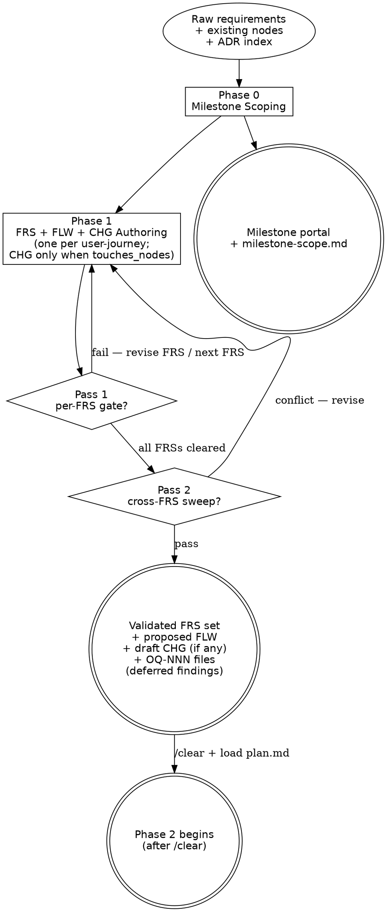

---
applies_when:
  stack: [agnostic]
---

# Design Flow

> Design flow — generates the milestone container, its discoveries, its FRSs,
> and runs the validation gate that hardens those FRSs before the Ingest flow
> drafts nodes. Part of the workflow defined in [`../WORKFLOW.md`](../WORKFLOW.md).
>
> **Mode: mixed — Query (FRS validates against canonical) + Ingest (FLW
> born to canonical with `status: proposed`; CHG born to milestone with
> `status: draft` when `touches_nodes:` is non-empty).** Phase 1 Queries
> the canonical wiki (which includes `status: proposed` in-flight nodes
> from any FS not yet at Phase 3) and the ADR index to validate that
> requirements are well-formed, non-duplicate, and conflict-free, **and**
> Ingests the journey + modify-intent containers — the new FLW
> (Trigger + Scenarios, business language) born to canonical with
> `status: proposed`; plus a per-FRS CHG (behavior-language `modifies[]`
> only) born to the milestone-scoped `chg/` home with `status: draft`
> when the FRS declares non-empty `touches_nodes:` (R-CHG-1..4). Phase 2
> (plan.md) Ingests ACT (when the FRS declares `produced_actor:`) + ENT /
> CMD / STA / CON / INT / DEC / PERM / QRY structures, enriches the
> Phase-1-born FLW with wiring, and consumes the per-FRS CHGs (via FS
> `consumes_chgs:`) for structural enrichment. Per R-NEW-1, R-NEW-2,
> R-CHG-1..7. (R-NEW-2a retired 2026-05-17 — see
> [`maintenance-discipline.md → Rule history`](maintenance-discipline.md#rule-history--canonical-logmd-retired-2026-05-16).)

> **HARD-GATE:** Do NOT begin Phase 2 (Ingest) until **every** FRS in this
> milestone has cleared Phase 1.5 (zero unresolved-without-OQ findings,
> cross-FRS sweep clean) AND a `/clear` + reload of
> [`plan.md`](plan.md) has happened. The validation gate is non-skippable
> and runs even when "the FRS looks obviously fine."
> (Cross-cutting rules: see [`CLAUDE.md ## Hard rules`](../../CLAUDE.md#hard-rules).)

> **Core/detail layout.** This is the core file — wholesale-read at flow
> entry. Step-level procedure detail lives in [`design/`](design/) detail
> files, loaded on demand per the
> [Detail files](#detail-files-load-on-demand--not-at-phase-entry) table.
> Every binding gate (HARD-GATE, exit checklists) is in this file.

## When to Use

**Use when:** entering Phase 0 (milestone scoping), Phase 1 (FRS
authoring), or Phase 1.5 (validation gate). Sessions 0 / 1 / 1.5 typically
share one conversation; entering Phase 2 requires `/clear` + reload of
[`plan.md`](plan.md).

**Do NOT use when:** drafting an FS or new DDD nodes (load
[`plan.md`](plan.md)), or applying CHG deltas (load
[`implementation.md`](implementation.md)). This flow Queries the canonical
wiki — it does not Ingest into it.

**Vs. sibling files:** [`plan.md`](plan.md) is the Ingest flow that writes
nodes; [`implementation.md`](implementation.md) is the Merge + Code flow
that applies CHGs; this file is the Query / Validation flow that hardens
FRSs **before** any node lands in canonical.

This flow covers Phases 0, 1, and 1.5. They typically share one session because
the work is tightly related and short.

### Minimal read set per task type

Load only what the task type requires. Do not pre-load speculatively.

| Task type | Load in full | Load by section only | Skip entirely |
|---|---|---|---|
| **Meta question** ("what is the process", "document phase X") | `design.md` | `frs-validation-rules.md` §Severity + §Bundling detection (lines 1–140) | `KB-LAYOUT.md`, `retrieval-discipline.md`, `FRS.md` template, `WORKFLOW.md` body |
| **Actual Phase 0 execution** | `design.md` | `WORKFLOW.md` §Phase flows (router only) | `KB-LAYOUT.md`, `retrieval-discipline.md`, `FRS.md` template |
| **Actual Phase 1 execution** | `design.md`, `design/phase1-authoring.md`, `_templates/FRS.md`, `_templates/nodes/FLOW.md`, `_templates/nodes/CHANGE.md` (when any FRS in this session declares non-empty `touches_nodes:`) | ADR index (one-line scan) | `KB-LAYOUT.md`, `retrieval-discipline.md`, STDs, CCC index, `_templates/nodes/ACTOR.md` (loaded at Phase 2 — Phase 1 uses business language; STD/CCC narrow-load fires at Phase 1.5) |
| **Actual Phase 1.5 execution** | `design.md`, `design/validation-gate-detail.md`, `frs-validation-rules.md` | `glossary.md`, `docs/shared/ccc/index.md` (snapshot at gate entry), `sdlc/standards/index.md` (scan for FRS-relevant STDs) | `KB-LAYOUT.md`, `WORKFLOW.md` body |

For `frs-validation-rules.md` partial reads: §Severity classification ends at the gate-verdict block (~line 110 of the file). §Bundling detection follows immediately. Read offset 0, limit 140 for meta questions; read the full file only at an actual Phase 1.5 gate.

## Section routing

If you've loaded this file for a specific phase (rather than starting
Phase 0 fresh and running through to 1.5), read the linked section only.
The HARD-GATE callout at the top and [Process Flow](#process-flow)
carry the doctrinal frame the per-phase sections assume — first-time
readers should skim those regardless.

| Operation | Sections to read |
|---|---|
| Phase 0 entry (milestone scoping) | [Phase 0 — Milestone Scoping](#phase-0--milestone-scoping) |
| Phase 1 entry (FRS authoring) | [Phase 1 — FRS Authoring](#phase-1--frs-authoring) + [`design/phase1-authoring.md`](design/phase1-authoring.md) |
| Phase 1.5 entry (Validation gate) | [Phase 1.5 — Validation Gate](#phase-15--validation-gate) + [`design/validation-gate-detail.md`](design/validation-gate-detail.md) + [`frs-validation-rules.md`](frs-validation-rules.md) |
| Phase 1.5 Pass 1 only (per-FRS) | [Pass 1 — Per-FRS gate](#pass-1--per-frs-gate-runs-after-each-frs-is-authored) + the detail file's Pass 1 text |
| Phase 1.5 Pass 2 only (cross-FRS sweep) | [Pass 2 — Milestone cross-FRS sweep](#pass-2--milestone-cross-frs-sweep-runs-once-after-all-frss-in-the-milestone-are-per-frs-gated) + the detail file's Pass 2 text |
| Survey / Exploration / OQ artifact question | [`design/pre-frs-artifacts.md`](design/pre-frs-artifacts.md) |
| What sibling files to load per task type | [When to Use → Minimal read set per task type](#minimal-read-set-per-task-type) |
| Cross-file dependencies / handoff question | [Integration](#integration) |

If your operation is not in the table, or you are entering Phase 0/1
end-to-end for the first time, read the full file. The minimal-read-set
table above the routing table tells you which sibling files to pair with
this one for the task at hand — the two tables are complementary
(routing = intra-file; minimal read set = cross-file).

## Detail files (load on demand — not at phase entry)

| When | Load |
|---|---|
| Choosing Survey vs Exploration vs OQ artifact type | [`design/pre-frs-artifacts.md`](design/pre-frs-artifacts.md) |
| Milestone is brownfield / prototype-sourced, or a mid-Phase-0 split surfaces | [`design/phase0-detail.md`](design/phase0-detail.md) |
| Authoring FRSs (first time in a session) | [`design/phase1-authoring.md`](design/phase1-authoring.md) |
| First-time Phase 1.5 entry (doctrinal frame) | [`design/anti-patterns.md`](design/anti-patterns.md) |
| Executing the Phase 1.5 gate (Pass 1 / Pass 2 / round-trip) | [`design/validation-gate-detail.md`](design/validation-gate-detail.md) |

## Process Flow

The two diamonds are the Phase 1.5 sub-gates — Pass 1 (per-FRS) runs
after each FRS is authored; Pass 2 (cross-FRS sweep) runs once after
every FRS has cleared Pass 1. Both must pass before the `/clear` →
Phase 2 transition fires.

---

## The Process

The three phases below run in order; sessions 0 / 1 / 1.5 typically share
one conversation. Phase 1.5 is the gate — its exit criteria are
non-skippable.

1. [`## Phase 0 — Milestone Scoping`](#phase-0--milestone-scoping) —
   milestone portal + milestone-scope discovery.
2. [`## Phase 1 — FRS Authoring`](#phase-1--frs-authoring) — one FRS per
   user-journey + per-FRS discovery.
3. [`## Phase 1.5 — Validation Gate`](#phase-15--validation-gate) — Pass 1
   per-FRS gate + Pass 2 cross-FRS sweep; exits this flow.

## Pre-FRS artifact types

→ Load [`design/pre-frs-artifacts.md`](design/pre-frs-artifacts.md) when choosing.

**Summary:** **Survey** (milestone path, closed `kind:` enum, 2-file touch) only
when Phase 0 / Phase 1 / absorption call for one; **Exploration** (free-form,
1-file touch) for everything else — when in doubt, it's an Exploration.
**OQ-NNN** for answerable questions needing a resolver artifact; **ADR / DEC**
for commitments ([`authoring-adr.md`](authoring-adr.md)).

---

## Phase 0 — Milestone Scoping

**Prerequisite:** The milestone folder must be pre-created by running
[`open-milestone.md`](open-milestone.md) before this phase begins.
`open-milestone.md` allocates the M-NN ID, creates the folder structure,
and lazy-creates `MILESTONE-STATE.md`. If the folder already exists (reopened
from a prior session), skip `open-milestone.md` and proceed directly.

**Operation:** `generate-frs` (Milestone framing)
**Inputs:** raw scope description, ADR index, canonical wiki summaries
**Outputs:**
- `docs/milestones/M-NN-<slug>/M-NN-<slug>.md` (the milestone portal)
- `docs/milestones/M-NN-<slug>/discovery/milestone-scope.md` (milestone-level discovery)

The milestone is **the planning container**. Authored first, top-down, before
the FRSs that live under it — or authored retroactively to group FRSs that have
already been drafted. Both paths are valid; the directory layout is the same.

### Before any questions

- Read recent commits, key files, and the canonical DDD nodes the milestone
  scope plausibly touches. Understand the project state before proposing
  changes or asking clarifying questions — a grep often answers what a
  question would.
- **Scope check first.** If the raw scope spans multiple unrelated concerns
  (e.g., "auth + billing + reporting"), split into separate milestones —
  one milestone per scope — *before* drafting any discovery. Decomposition
  is cheaper at this gate than at any later phase. Mid-Phase-0 split
  procedure: [`design/phase0-detail.md`](design/phase0-detail.md).
- **Scan the ADR index.** Read `docs/<component>/adrs/index.md` —
  one-line summaries only, the file is bounded by design. Identify ADRs
  whose tags or components intersect the milestone scope. This is
  **always-on**; the index is the only ADR file that gets wholesale-read.
  Drill into individual ADR pages **only** if the index summary suggests
  direct relevance.
- **Brownfield code-mining / prototype-seeding (optional entry routes).**
  When the milestone seed is existing source code or a UI prototype, load
  [`design/phase0-detail.md`](design/phase0-detail.md) for the routing to
  [`frs-code-extraction-rules.md`](frs-code-extraction-rules.md) /
  [`frs-prototype-extraction-rules.md`](frs-prototype-extraction-rules.md)
  and the `PROTO-<slug>` disposition mechanics.

Then find the canonical DDD nodes the milestone touches.

This is cheaper than free-form code archaeology because the knowledge base
already exists. Read `docs/<component>/nodes/<type>/index.md` for each node
type plausibly in scope — it carries one line per node (same bounded-file
posture as the ADR index); glob only when no `index.md` exists for that type
yet (expected on a green KB or a type with no nodes ingested yet). Read the
relevant Actors, Entities, Flows, and Decisions for the affected area. Note
where the milestone would extend or break existing invariants or ADRs.

### Milestone-scope Discovery

Author `docs/milestones/M-NN-<slug>/discovery/milestone-scope.md` using
[`../_templates/SURVEY.md`](../_templates/SURVEY.md) with
`level: milestone` in the frontmatter. Keep it short — one page. It anchors
the FRSs that follow.

For change requests: set `kind: change-request`, run the KB scan using
per-type indexes — read `docs/<component>/nodes/<type>/index.md` for each
node type plausibly in scope; glob `docs/<component>/nodes/<type>/*.md` only
when no `index.md` exists for that type yet. Match on `source_ref`, `related`,
or title. Pre-fill the "Existing nodes scanned" section with matched IDs. For
new features: set `kind: new-feature`; the "Existing nodes scanned" section
may be left empty.

The KB scan and ADR-index scan are the only places in the workflow where
wholesale reading is allowed — see
[`retrieval-discipline.md`](retrieval-discipline.md).

### Milestone doc

Author `docs/milestones/M-NN-<slug>/M-NN-<slug>.md` using
[`../_templates/MILESTONE.md`](../_templates/MILESTONE.md). The milestone doc
is a **portal** for the folder: it names the scope in 2–4 sentences, lists
the FRSs that will be drafted under it (filled iteratively as Phase 1
progresses), lists the specs (filled at Phase 2), and notes sequencing
constraints. Out-of-scope items go in the discovery doc, not the portal.

### Checklist — Phase 0 exit

- [ ] Milestone scope is coherent — no multi-domain bundling.
      **Skip this check when `kind: accumulator`** — accumulator milestones are
      deliberately multi-domain by design (per
      [`../WORKFLOW.md → Change-request routing`](../WORKFLOW.md#change-request-routing)).
- [ ] Affected canonical nodes are identified by ID in the milestone-scope
      discovery.
- [ ] Relevant ADRs identified (from the index scan) and listed in the
      discovery's "Relevant ADRs scanned" section. Empty is acceptable only
      when the ADR index is genuinely empty or no entry intersects the scope
      — "did not check" is not.
- [ ] Conflicts with existing invariants, decisions, **or ADRs** are listed
      in the discovery.
- [ ] Open questions raised during discovery are answered, explicitly
      deferred, or carried as `OQ-NNN` files under
      `docs/discovery/open-questions/` (check
      `docs/discovery/open-questions/index.md` for the next OQ-NNN —
      R-NEW-9 amended 2026-05-17, the OQ index is the authoritative
      ceiling) with
      `origin: discovery, origin_ref: DISCOVERY-NNN, needed_by: phase-1`.
      The discovery's "Open questions" section cites the OQ IDs; the
      question text is not duplicated.
- [ ] Milestone portal frontmatter set: `id`, `title`, `status: planning`,
      `discovery: discovery/milestone-scope.md`. `frs: []` and `specs: []`
      start empty.
- [ ] Run [`regenerate-roadmap.md`](regenerate-roadmap.md) to surface this
      milestone in `docs/ROADMAP.md`. No-op if the milestone is already
      listed; the operation is idempotent.

---

## Phase 1 — FRS Authoring

→ Load [`design/phase1-authoring.md`](design/phase1-authoring.md) for the full
procedure (entry paths A/B/C, the six steps, the FRS declaration contract,
ACT claim mechanics, dialog discipline).

**Operation:** `generate-frs` (per-user-journey)
**Inputs:** milestone-scope discovery, raw requirement
**Outputs:**
- `docs/milestones/M-NN-<slug>/frs/FRS-NNN-<slug>.md` (one per user-journey)
- `docs/milestones/M-NN-<slug>/discovery/FRS-NNN-<slug>.md` (per-FRS discovery) — **omitted when the FRS sets `discovery: inline`** (Path C, simple FRSs); the survey content is absorbed into the FRS's Brownfield impact section.
- `docs/<component>/nodes/flows/FLW-NNN-<slug>.md` — the FLW this FRS introduces, born to canonical with `status: proposed`, Phase-1-bare body (Trigger + Scenarios + Brownfield notes only; `related: []`). Required when `produced_flw:` is set. Per R-NEW-1, R-NEW-2.
- `docs/milestones/M-NN-<slug>/chg/CHG-NNN-<slug>.md` — the per-FRS CHG this FRS introduces when `touches_nodes:` is non-empty, born to its milestone-scoped permanent home with `status: draft`, Phase-1-bare body (behavior-language `modifies[]` + optional milestone-level `invariants_before/after` + optional `removes[]` / `supersedes[]`; no `adds[]`, no `migration_steps[]`, no structural before/after). One CHG per FRS. Per R-CHG-1..4. (CR track: `docs/change-requests/CR-NNN-<slug>/chg/CHG-NNN-<slug>.md`.)

**ACT-NNN is NOT born at Phase 1** — when `produced_actor:` is set, the ID
is claimed in the FRS frontmatter itself (R-NEW-9 amended 2026-05-17); the
ACT file is authored at Phase 2. Claim + collision mechanics:
[`design/phase1-authoring.md`](design/phase1-authoring.md).

**One FRS per user-journey / flow.** A FRS is atomic at the user-journey
granularity: one externally-observable behavior the actor can complete
end-to-end. CRUD-level decomposition is too fine; "the whole onboarding
experience" is too coarse.

**Phase 1 uses business language only** — STDs and CCCs are not narrow-loaded
here (that fires at Phase 1.5); templates loaded at entry are FRS.md,
nodes/FLOW.md, and nodes/CHANGE.md (when any FRS declares `touches_nodes:`).

### Checklist — Phase 1 exit (before Phase 1.5)

- [ ] Author self-review pass — look at each FRS with fresh eyes:
  1. Placeholder scan — any "TBD", incomplete sections, or vague requirements?
  2. Internal consistency — does the FRS contradict itself or upstream inputs (discovery, nodes)?
  3. Scope — each FRS covers exactly one user-journey, independently testable?
  4. Ambiguity — any criterion interpretable to build the wrong thing? Pick one interpretation and make it explicit.
  Fix inline. No separate review file, no dispatched reviewer.
- [ ] Each FRS covers exactly one user-journey, independently testable.
- [ ] No duplicate FRSs within the milestone.
- [ ] No silent gaps.
- [ ] `discovery:` resolves correctly: when `discovery: <path>`, the
      external survey file exists at the cited path; when `discovery:
      inline`, the FRS's "Brownfield impact → Surveyed surface" sub-bullet
      is populated (carries the survey's Existing-nodes-scanned +
      Relevant-existing-modules content).
- [ ] `produced_flw:`, `produced_actor:` (blank when reusing), `produces_nodes:`,
      `touches_nodes:`, `adrs:`, and `milestone:` frontmatter fields are filled
      (empty list / blank scalar allowed only when genuinely nothing applies —
      and that's noted, not assumed). `produced_flw:` resolves to a real
      Phase-1-born node file in canonical; `produced_actor:` resolves to a
      claimed ID in the FRS frontmatter itself (forward reference; the ACT
      file is authored at Phase 2 — R-NEW-9 amended 2026-05-17).
- [ ] The Phase-1-born FLW file exists at `docs/<component>/nodes/flows/FLW-NNN-<slug>.md`
      with body shape per R-NEW-2 (Trigger + Scenarios + optional Brownfield;
      `related: []`); the FLW is appended to `nodes/flows/index.md` (2-file
      touch).
- [ ] When `produced_actor:` is set, the ACT-NNN ID is recorded in the
      FRS frontmatter `produced_actor:` field (R-NEW-9 amended 2026-05-17
      — the FRS frontmatter is the claim; no `id-claims.md` introduce
      row). **No Phase-1 ACT file is authored** — that fires at Phase 2
      (plan.md § 3).
- [ ] When `touches_nodes:` is non-empty, the Phase-1-born CHG file exists
      at `milestones/M-NN-<slug>/chg/CHG-NNN-<slug>.md` (CR track:
      `docs/change-requests/CR-NNN-<slug>/chg/CHG-NNN-<slug>.md`) with body
      shape per R-CHG-4 (behavior-language `modifies[]` + optional
      milestone-level `invariants_before/after` + optional `removes[]` /
      `supersedes[]`; no `adds[]`, no `migration_steps[]`, no structural
      before/after); `status: draft`; `source_ref: [{frs: FRS-NNN, op:
      modify}]`. The CHG-NNN ID is the filename itself at the milestone
      `chg/` path (R-NEW-9 amended 2026-05-17 — the CHG file is the
      claim; no `id-claims.md` introduce row).
- [ ] `resolves:` frontmatter lists any pre-existing `OQ-NNN` this FRS closes
      (most commonly OQs raised at Phase 0 discovery or by an earlier FRS in
      this milestone). For each cited OQ, set its `resolved_by:` field to this
      FRS ID — reciprocal 2-file touch. Empty list is allowed when this FRS
      opens questions but closes none.
- [ ] Conflicts noticed at drafting time are recorded in "Brownfield impact" —
      not silently absorbed. (Validation findings from the gate land in a
      separate section at Phase 1.5; do not pre-empt.)
- [ ] Any ADR authored during Phase 1 dialog is filed under
      `docs/<component>/adrs/ADR-NNN-<slug>.md`, indexed in `adrs/index.md`
      (2-file touch — no `adrs/log.md`), and back-linked from the FRS via `adrs:`.
      (`docs/home.md` is derived from the per-component ADR indexes — regenerated on
      demand, not hand-edited per ADR event.) See
      [`maintenance-discipline.md`](maintenance-discipline.md).
- [ ] **QA-hat review — AC→scenario coverage on the just-authored FLW.**
      Walk each acceptance criterion in the FRS and verify it maps to a
      scenario anchor (`FLW-NNN#happy`, `FLW-NNN#edge`, or `FLW-NNN#fault`)
      on the Phase-1-born FLW (or on an existing canonical FLW listed in
      `touches_nodes:`). Each scenario is independently expressible as a
      test runner assertion (see the testing-convention ADR for the chosen
      runner). Any AC that cannot be mapped, or any scenario that cannot be
      expressed as an assertion, is flagged in "Brownfield impact" or sent
      back for clarification. **Intentional redundancy:** Phase 1.5 Pass 1
      re-runs the same AC→scenario coverage check as a gate-level
      validation (R-NEW-3); the Phase 1 exit pass is author self-review
      and the Phase 1.5 pass is the gate (defense-in-depth per
      [`../../CLAUDE.md` hard rule #13 framework exception](../../CLAUDE.md#hard-rules)).
      The Flow scenarios *are* the test plan — do not draft a parallel
      test-plan artifact.

Then run the user-review handoff before moving to Phase 1.5 — surface the
authored paths: the FRS, the Phase-1-born FLW, and the Phase-1-born CHG
(when `touches_nodes:` is non-empty). The ACT (when `produced_actor:` is
set) is a forward-reference ID claim only at this stage; the file lands
at Phase 2.

---

## Phase 1.5 — Validation Gate

→ Load [`design/validation-gate-detail.md`](design/validation-gate-detail.md)
(dispatch shape, the eight Pass 1 checks in full, round-trip rules, Pass 2 full
text) + [`frs-validation-rules.md`](frs-validation-rules.md) (severity, bundling,
NFR rubric, inferred-tag propagation, OQ taxonomy) when executing this gate.

**Operation:** `generate-frs` (Query mode)
**Inputs:** each FRS drafted in Phase 1, plus the milestone-scope discovery
**Outputs:**
- Validation findings table appended to each FRS's "Validation findings"
  section
- "Cross-FRS conflicts" section appended to `discovery/milestone-scope.md`
- Unresolved-after-author-review entries raised as `OQ-NNN` files under
  `docs/discovery/open-questions/` with `origin: validation-gate`

This phase **replaces** the previous "Node Compilation" step. Nodes are no
longer created here — they're written directly to canonical at Phase 2
with `status: proposed`. What lands here are the validation findings that
prove each FRS is implementable before any node is drafted.

The gate runs in two passes — Stage A (Pass 1, per-FRS, parallel dispatches
within one FRS) then Stage B (Pass 2, cross-FRS, once after all FRSs clear
Stage A).

#### Anti-Pattern: "The Pre-resolved Gate"

A finding row marked `resolved` before the artifact change has landed.
Findings are resolved when the *artifact* is fixed or deferred with an
`OQ-NNN` filed — never by a sentence committing to the fix.
→ Full narrative: [`design/anti-patterns.md`](design/anti-patterns.md).

### Pass 1 — Per-FRS gate (runs after each FRS is authored)

→ Full check text: [`design/validation-gate-detail.md`](design/validation-gate-detail.md).

The eight checks, one line each (findings land in the FRS's "Validation
findings" table):

1. **Existence scan** — near-duplicate detection against canonical (incl.
   `proposed` in-flight nodes), widened to FLW Scenario signatures (R-NEW-6).
2. **Business-logic sanity** — coherent state transition across
   pre/postconditions, ACs, and FLW Scenarios; business-language discipline.
3. **ADR conflict scan** — every `accepted` ADR in `adrs:` vs the FRS's claims.
4. **STD conformance scan** — stack-intersecting STDs vs the FRS's claims.
5. **CCC deviation scan** — no silent baseline overrides in FRS prose.
6. **FLW coverage check** (R-NEW-3) — every AC maps to a scenario anchor on
   a real FLW; every scenario expressible as a test assertion.
7. **Phase-1-bare body-shape sanity** (R-NEW-2/R-NEW-8) — no Phase-2-wired
   content (forward-claim leak) on the Phase-1-born FLW or CHG.
8. **chg-sanity** (R-CHG-5; only when `touches_nodes:` non-empty) — the CHG's
   behavior delta coherently follows from the FRS and the target's state.

Findings format in the FRS's "Validation findings" table:

| Finding | Type | Resolution | Rationale |
| ------- | ---- | ---------- | --------- |
| <one line> | existence \| sanity \| adr-conflict \| standard-conflict \| ccc-deviation \| chg-sanity \| cross-frs | resolved \| deferred | <one line> |

Unresolved findings after the author-review pass become `OQ-NNN` files
under `docs/discovery/open-questions/` (allocate the next `OQ-NNN` from
the OQ index `docs/discovery/open-questions/index.md` — R-NEW-9 amended
2026-05-17) with
`origin: validation-gate, origin_ref: FRS-NNN` and a back-link to the
FRS in `nodes:` / body. The FRS's `Validation findings` row cites the
`OQ-NNN`; the question text is not duplicated.

**Phase 1.5 round-trip (FAIL / PASS_WITH_MAJORS):** revisions ripple to the
FLW / CHG as in-place body edits (1-file touch per R-NEW-7 and the CHG
carve-out); full FRS abandonment routes to
[`in-flight-nodes.md → Abandonment`](in-flight-nodes.md). Full rules:
[`design/validation-gate-detail.md`](design/validation-gate-detail.md).

### Pass 2 — Milestone cross-FRS sweep (runs once after all FRSs in the milestone are per-FRS gated)

→ Full check text: [`design/validation-gate-detail.md`](design/validation-gate-detail.md).

**Skip Pass 2 when the milestone has fewer than 2 FRSs** (still append an
"N/A — single FRS milestone" Cross-FRS conflicts section for audit). The four
sweep checks: **duplicate-CMD detection**, **overlapping ENT definitions**,
**contradictory invariants**, **CHG-conflict** (R-CHG-6 — same-target Major;
contradictory `modifies[]` / `invariants_after[]` Blocker). Output: a
"Cross-FRS conflicts" section on `discovery/milestone-scope.md` + a
`cross-frs` finding row on each FRS involved.

### Checklist — Phase 1.5 exit (gate closure)

- [ ] Every FRS has a "Validation findings" section. (Empty table is allowed
      when no finding fired across all three checks plus the cross-FRS
      sweep.)
- [ ] Every finding has `resolution: resolved` or `resolution: deferred`
      with a non-blank `rationale:`.
- [ ] Unresolved findings each have a corresponding `OQ-NNN` under
      `docs/discovery/open-questions/` (next ID drawn from the OQ index
      `docs/discovery/open-questions/index.md` per R-NEW-9 amended
      2026-05-17) with `origin: validation-gate`
      and a back-link to the FRS.
- [ ] The milestone portal's `frs:` list matches the actual set of FRS files
      in `frs/`.
- [ ] For each FRS that reaches `status: approved` at this gate **AND**
      whose `discovery:` is a path (Path A / Path B), flip its per-FRS
      discovery file's frontmatter `status:` from `draft` (or `done`) to
      `adopted`. 1-file touch — discovery surface; no `log.md`, no
      `index.md` re-sync. Background:
      [`../_templates/SURVEY.md → Status lifecycle`](../_templates/SURVEY.md).
      **Skip this check when `discovery: inline`** (Path C) — there is no
      separate survey file to flip; the survey content lives inside the
      FRS's Brownfield impact section and tracks the FRS's own `status:`.
      Milestone-level discovery (`milestone-scope.md`) flips to `adopted`
      at milestone close, not here — see
      [`close-milestone.md`](close-milestone.md).

The gate cannot be bypassed. Deferred findings are explicitly deferred —
"will address in Phase 2" or "needs business clarification, blocked on
<owner>" — never silently dropped.

**Then context-reset before Phase 2.** A fresh session enters the Ingest
flow with only the milestone path and the validated FRS set in scope.

---

Next: [`plan.md`](plan.md) (Phase 2, Ingest) after context reset.

---

## Integration

- **Required before:** same as all dev-track flows —
  [`../../CLAUDE.md ## Hard rules`](../../CLAUDE.md#hard-rules),
  [`../WORKFLOW.md`](../WORKFLOW.md), [`../PRINCIPLES.md`](../PRINCIPLES.md)
  (esp. "Bypass the CHG gate", "Pre-loading the whole KB", "Silent edits").
- **Rule books wholesale-read during this flow:**
  [`frs-validation-rules.md`](frs-validation-rules.md) (Phase 1.5
  per-FRS gate + cross-FRS sweep),
  [`frs-code-extraction-rules.md`](frs-code-extraction-rules.md)
  (brownfield code-mining at Phase 0),
  [`frs-prototype-extraction-rules.md`](frs-prototype-extraction-rules.md)
  (prototype-sourced prototype-seeding at Phase 0 — posture-independent
  peer to code-mining).
- **Maintenance ops that may fire during this flow:**
  [`research.md`](research.md) (conditional: load when Survey OQs exist;
  invoke research-gate only on `blocking-frs` classification),
  [`authoring-adr.md`](authoring-adr.md) (a Phase 1 dialog can surface
  a new ADR),
  [`new-component-bootstrap.md`](new-component-bootstrap.md) (Phase 0
  may need to scaffold a new component before any FRS lands),
  [`discuss.md`](discuss.md) (optional post-Phase-1.5 gate — invoke when
  **any** of the following holds, otherwise skip:
  (a) ≥1 deferred FRS finding has `gate_effect: blocking`;
  (b) ≥2 FRSs in the milestone touch the same canonical node and the
      coordinate-or-conflict resolution direction is not yet locked;
  (c) a new ADR was authored during Phase 1 dialog but has not yet flipped
      to `accepted`; or
  (d) a milestone-scope discovery's "Cross-FRS conflicts" section contains
      an unresolved row.
  Produces DISCUSSION-LOG.md and per-FS CONTEXT.md before `/clear`).
- **Routes to (after `/clear`):**
  [`plan.md`](plan.md) — Phase 2 Ingest, with the validated FRS set as
  input.
- **Sibling flow files:** [`plan.md`](plan.md),
  [`implementation.md`](implementation.md), [`bug-fix.md`](bug-fix.md).
