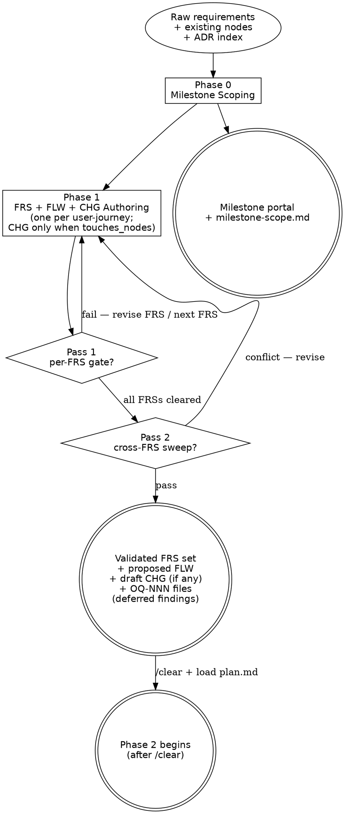

---
applies_when:
  stack: [agnostic]
---

# Design Flow

> Design flow — generates the milestone container, its discoveries, its FRSs,
> and runs the validation gate that hardens those FRSs before the Ingest flow
> drafts nodes. Part of the workflow defined in [`../WORKFLOW.md`](../WORKFLOW.md).
>
> **Mode: mixed — Query (FRS validates against canonical) + Ingest (FLW
> born to canonical with `status: proposed`; CHG born to milestone with
> `status: draft` when `touches_nodes:` is non-empty).** Phase 1 Queries
> the canonical wiki (which includes `status: proposed` in-flight nodes
> from any FS not yet at Phase 3) and the ADR index to validate that
> requirements are well-formed, non-duplicate, and conflict-free, **and**
> Ingests the journey + modify-intent containers — the new FLW
> (Trigger + Scenarios, business language) born to canonical with
> `status: proposed`; plus a per-FRS CHG (behavior-language `modifies[]`
> only) born to the milestone-scoped `chg/` home with `status: draft`
> when the FRS declares non-empty `touches_nodes:` (R-CHG-1..4). Phase 2
> (plan.md) Ingests ACT (when the FRS declares `produced_actor:`) + ENT /
> CMD / STA / CON / INT / DEC / PERM / QRY structures, enriches the
> Phase-1-born FLW with wiring (`related:` populated, Sequence, Branches,
> Compensating actions, structural Postconditions), and consumes the
> per-FRS CHGs (via FS `consumes_chgs:`) for structural enrichment
> (`modifies[]` before/after, `adds[]`, `migration_steps[]`). Per R-NEW-1,
> R-NEW-2, R-CHG-1..7. (R-NEW-2a retired 2026-05-17 — see
> [`maintenance-discipline.md → Rule history`](maintenance-discipline.md#rule-history--canonical-logmd-retired-2026-05-16).)

> **HARD-GATE:** Do NOT begin Phase 2 (Ingest) until **every** FRS in this
> milestone has cleared Phase 1.5 (zero unresolved-without-OQ findings,
> cross-FRS sweep clean) AND a `/clear` + reload of
> [`plan.md`](plan.md) has happened. The validation gate is non-skippable
> and runs even when "the FRS looks obviously fine."
> (Cross-cutting rules: see [`CLAUDE.md ## Hard rules`](../../CLAUDE.md#hard-rules).)

## When to Use

**Use when:** entering Phase 0 (milestone scoping), Phase 1 (FRS
authoring), or Phase 1.5 (validation gate). Sessions 0 / 1 / 1.5 typically
share one conversation; entering Phase 2 requires `/clear` + reload of
[`plan.md`](plan.md).

**Do NOT use when:** drafting an FS or new DDD nodes (load
[`plan.md`](plan.md)), or applying CHG deltas (load
[`implementation.md`](implementation.md)). This flow Queries the canonical
wiki — it does not Ingest into it.

**Vs. sibling files:** [`plan.md`](plan.md) is the Ingest flow that writes
nodes; [`implementation.md`](implementation.md) is the Merge + Code flow
that applies CHGs; this file is the Query / Validation flow that hardens
FRSs **before** any node lands in canonical.

This flow covers Phases 0, 1, and 1.5. They typically share one session because
the work is tightly related and short.

### Minimal read set per task type

Load only what the task type requires. Do not pre-load speculatively.

| Task type | Load in full | Load by section only | Skip entirely |
|---|---|---|---|
| **Meta question** ("what is the process", "document phase X") | `design.md` | `frs-validation-rules.md` §Severity + §Bundling detection (lines 1–140) | `KB-LAYOUT.md`, `retrieval-discipline.md`, `FRS.md` template, `WORKFLOW.md` body |
| **Actual Phase 0 execution** | `design.md` | `WORKFLOW.md` §Phase flows (router only) | `KB-LAYOUT.md`, `retrieval-discipline.md`, `FRS.md` template |
| **Actual Phase 1 execution** | `design.md`, `_templates/FRS.md`, `_templates/nodes/FLOW.md`, `_templates/nodes/CHANGE.md` (when any FRS in this session declares non-empty `touches_nodes:`) | ADR index (one-line scan) | `KB-LAYOUT.md`, `retrieval-discipline.md`, STDs, CCC index, `_templates/nodes/ACTOR.md` (loaded at Phase 2 — Phase 1 uses business language; STD/CCC narrow-load fires at Phase 1.5) |
| **Actual Phase 1.5 execution** | `design.md`, `frs-validation-rules.md` | `glossary.md`, `docs/shared/ccc/index.md` (snapshot at gate entry), `sdlc/standards/index.md` (scan for FRS-relevant STDs) | `KB-LAYOUT.md`, `WORKFLOW.md` body |

For `frs-validation-rules.md` partial reads: §Severity classification ends at the gate-verdict block (~line 110 of the file). §Bundling detection follows immediately. Read offset 0, limit 140 for meta questions; read the full file only at an actual Phase 1.5 gate.

## Section routing

If you've loaded this file for a specific phase (rather than starting
Phase 0 fresh and running through to 1.5), read the linked section only.
The HARD-GATE callout at the top and [Process Flow](#process-flow)
carry the doctrinal frame the per-phase sections assume — first-time
readers should skim those regardless.

| Operation | Sections to read |
|---|---|
| Phase 0 entry (milestone scoping) | [Phase 0 — Milestone Scoping](#phase-0--milestone-scoping) |
| Phase 1 entry (FRS authoring) | [Phase 1 — FRS Authoring](#phase-1--frs-authoring) |
| Phase 1.5 entry (Validation gate) | [Phase 1.5 — Validation Gate](#phase-15--validation-gate) + [`frs-validation-rules.md`](frs-validation-rules.md) |
| Phase 1.5 Pass 1 only (per-FRS) | [Pass 1 — Per-FRS gate](#pass-1--per-frs-gate-runs-after-each-frs-is-authored) |
| Phase 1.5 Pass 2 only (cross-FRS sweep) | [Pass 2 — Milestone cross-FRS sweep](#pass-2--milestone-cross-frs-sweep-runs-once-after-all-frss-in-the-milestone-are-per-frs-gated) |
| Survey / Exploration / OQ artifact question | [Pre-FRS artifact types](#pre-frs-artifact-types) |
| What sibling files to load per task type | [When to Use → Minimal read set per task type](#minimal-read-set-per-task-type) |
| Cross-file dependencies / handoff question | [Integration](#integration) |

If your operation is not in the table, or you are entering Phase 0/1
end-to-end for the first time, read the full file. The minimal-read-set
table above the routing table tells you which sibling files to pair with
this one for the task at hand — the two tables are complementary
(routing = intra-file; minimal read set = cross-file).

## Process Flow

The two diamonds are the Phase 1.5 sub-gates — Pass 1 (per-FRS) runs
after each FRS is authored; Pass 2 (cross-FRS sweep) runs once after
every FRS has cleared Pass 1. Both must pass before the `/clear` →
Phase 2 transition fires.

---

## The Process

The three phases below run in order; sessions 0 / 1 / 1.5 typically share
one conversation. Phase 1.5 is the gate — its exit criteria are
non-skippable.

1. [`## Phase 0 — Milestone Scoping`](#phase-0--milestone-scoping) —
   milestone portal + milestone-scope discovery.
2. [`## Phase 1 — FRS Authoring`](#phase-1--frs-authoring) — one FRS per
   user-journey + per-FRS discovery.
3. [`## Phase 1.5 — Validation Gate`](#phase-15--validation-gate) — Pass 1
   per-FRS gate + Pass 2 cross-FRS sweep; exits this flow.

## Pre-FRS artifact types

Two artifact families serve pre-commitment thinking. They live by
different disciplines.

**Survey** — `docs/milestones/M-NN/discovery/`, template
[`../_templates/SURVEY.md`](../_templates/SURVEY.md). Procedural artifact
consumed by Phase 0 milestone scoping and Phase 1 FRS authoring (and
the absorption workflow). Closed `kind:` enum (`new-feature` |
`change-request` | `absorb-legacy-doc`), mandatory sections per kind,
2-file touch. Use Surveys when the workflow expects them — i.e., as
inputs to Phase 0 / Phase 1 / absorption.

**Exploration** — `docs/exploration/`, template
[`../_templates/EXPLORATION.md`](../_templates/EXPLORATION.md). Free-form
working knowledge. Minimal mandatory frontmatter (id, title, status,
created), optional everything else, 1-file routine touch, no log.md.
Use Explorations any time you're thinking on paper outside the
milestone path: propositions, spikes, bug investigations, option
weighing, anything.

Related surfaces:

- **OQ-NNN** (`docs/discovery/open-questions/`) — first-class artifacts for
  answerable open questions. Use when the question needs a resolver artifact
  (DEC / ADR / FRS) before work can continue. Discovery-surface touch: 1-file
  for routine edits, 2-file (artifact + `open-questions/index.md` if one
  exists) for terminal lifecycle events (`resolved`, `rejected`, `escalated`).
  No `log.md` — see
  [`maintenance-discipline.md → Discovery surface discipline`](maintenance-discipline.md#discovery-surface-discipline).
  See [`../_templates/OPEN-QUESTION.md`](../_templates/OPEN-QUESTION.md).
- **ADR / DEC** — commitments. Promote to ADR when cross-cutting; DEC when
  node-local. See [`authoring-adr.md`](authoring-adr.md).

### Shape detection (Exploration only)

Exploration has no `kind:` field. The artifact's shape is detected
from frontmatter presence, not declared:

- `hypothesis:` present → spike-shaped. The workflow gates any related
  ADR's `proposed → accepted` flip on `outcome:` being filled.
- `affects_nodes:` present → bug-shaped. The template offers suggested
  body sections; none are mandatory.
- Neither present → free-form note. No special workflow.

### Cross-linking

Exploration → commitment:

- The consumer (milestone / FRS / ADR) declares
  `from_exploration: [EXP-<slug>]` in its frontmatter.
- The Exploration declares `adopted_into: [<consumer-id>]`.

Surveys do not need this cross-linking — they're consumed by the
procedure that authored them; the consumption is implicit in the
milestone path.

### When in doubt

If you're not sure whether a note is a Survey or an Exploration: it's
an Exploration. Surveys exist only when Phase 0 / Phase 1 / absorption
explicitly call for one.

---

## Phase 0 — Milestone Scoping

**Prerequisite:** The milestone folder must be pre-created by running
[`open-milestone.md`](open-milestone.md) before this phase begins.
`open-milestone.md` allocates the M-NN ID, creates the folder structure,
and lazy-creates `MILESTONE-STATE.md`. If the folder already exists (reopened
from a prior session), skip `open-milestone.md` and proceed directly.

**Operation:** `generate-frs` (Milestone framing)
**Inputs:** raw scope description, ADR index, canonical wiki summaries
**Outputs:**
- `docs/milestones/M-NN-<slug>/M-NN-<slug>.md` (the milestone portal)
- `docs/milestones/M-NN-<slug>/discovery/milestone-scope.md` (milestone-level discovery)

The milestone is **the planning container**. Authored first, top-down, before
the FRSs that live under it — or authored retroactively to group FRSs that have
already been drafted. Both paths are valid; the directory layout is the same.

### Before any questions

- Read recent commits, key files, and the canonical DDD nodes the milestone
  scope plausibly touches. Understand the project state before proposing
  changes or asking clarifying questions — a grep often answers what a
  question would.
- **Scope check first.** If the raw scope spans multiple unrelated concerns
  (e.g., "auth + billing + reporting"), split into separate milestones —
  one milestone per scope — *before* drafting any discovery. Decomposition
  is cheaper at this gate than at any later phase.

  **If a split need surfaces partway through Phase 0** (after some discovery
  is drafted): narrow the current milestone's scope statement in
  `milestone-scope.md` to the retained concern, then either (a) open a new
  milestone via [`open-milestone.md`](open-milestone.md) for the
  out-of-scope concern and migrate any already-drafted discovery content
  into its discovery folder, or (b) raise an `OQ-NNN` under
  `docs/discovery/open-questions/` with
  `origin: milestone-scoping, needed_by: roadmap` if the out-of-scope
  concern is genuinely deferrable. Do not delete already-drafted
  discovery — preserve it through migration or OQ attachment.
- **Scan the ADR index.** Read `docs/<component>/adrs/index.md` —
  one-line summaries only, the file is bounded by design. Identify ADRs
  whose tags or components intersect the milestone scope. This is
  **always-on**; the index is the only ADR file that gets wholesale-read.
  Drill into individual ADR pages **only** if the index summary suggests
  direct relevance.
- **Brownfield code-mining (optional).** When the milestone scope starts
  from the existing application's source code (a change request adding
  to or reshaping an existing implementation), consult
  [`frs-code-extraction-rules.md`](frs-code-extraction-rules.md) for the
  signal-to-FRS mapping, `[inferred from code]` tagging discipline, and
  the `Module.Area.Name` logical source-name convention that lands in
  canonical node `source_ref` frontmatter. The rule book is optional
  for new-feature milestones with no existing code.
- **Prototype-seeding (optional).** When the milestone scope starts
  from a UI prototype rather than source code or written brief
  (stakeholders react to clickable screens before written specs
  exist) — or when a brief already exists and a prototype is built to
  validate it — consult
  [`frs-prototype-extraction-rules.md`](frs-prototype-extraction-rules.md)
  for the screen-to-FRS signal mapping, `[inferred from prototype]`
  tagging discipline, and the `Module.Area.Screen` stable identifier
  convention that lands in canonical node `source_ref` frontmatter.
  The prototype artifact itself lives at
  `docs/prototypes/<slug>/PROTO-<slug>.md` as a dedicated **Prototype
  disposition** (`PROTO-<slug>`) and is cited from the milestone SURVEY
  via `prototype_ref:` — see
  [`../_templates/SURVEY.md`](../_templates/SURVEY.md). The bidirectional
  operation doctrine (both directions — prototype→milestone seeding and
  milestone/CR→prototype validation) is
  [`prototype-first.md`](prototype-first.md). The **prototype-sourced**
  peer rule book to brownfield code-mining above; route on input medium
  (code-sourced is inherently brownfield; prototype-sourced is
  posture-independent).

Then find the canonical DDD nodes the milestone touches.

This is cheaper than free-form code archaeology because the knowledge base
already exists. Read `docs/<component>/nodes/<type>/index.md` for each node
type plausibly in scope — it carries one line per node (same bounded-file
posture as the ADR index); glob only when no `index.md` exists for that type
yet (expected on a green KB or a type with no nodes ingested yet). Read the
relevant Actors, Entities, Flows, and Decisions for the affected area. Note
where the milestone would extend or break existing invariants or ADRs.

### Milestone-scope Discovery

Author `docs/milestones/M-NN-<slug>/discovery/milestone-scope.md` using
[`../_templates/SURVEY.md`](../_templates/SURVEY.md) with
`level: milestone` in the frontmatter. Keep it short — one page. It anchors
the FRSs that follow.

For change requests: set `kind: change-request`, run the KB scan using
per-type indexes — read `docs/<component>/nodes/<type>/index.md` for each
node type plausibly in scope; glob `docs/<component>/nodes/<type>/*.md` only
when no `index.md` exists for that type yet. Match on `source_ref`, `related`,
or title. Pre-fill the "Existing nodes scanned" section with matched IDs. For
new features: set `kind: new-feature`; the "Existing nodes scanned" section
may be left empty.

The KB scan and ADR-index scan are the only places in the workflow where
wholesale reading is allowed — see
[`retrieval-discipline.md`](retrieval-discipline.md).

### Milestone doc

Author `docs/milestones/M-NN-<slug>/M-NN-<slug>.md` using
[`../_templates/MILESTONE.md`](../_templates/MILESTONE.md). The milestone doc
is a **portal** for the folder: it names the scope in 2–4 sentences, lists
the FRSs that will be drafted under it (filled iteratively as Phase 1
progresses), lists the specs (filled at Phase 2), and notes sequencing
constraints. Out-of-scope items go in the discovery doc, not the portal.

### Checklist — Phase 0 exit

- [ ] Milestone scope is coherent — no multi-domain bundling.
      **Skip this check when `kind: accumulator`** — accumulator milestones are
      deliberately multi-domain by design (per
      [`../WORKFLOW.md → Change-request routing`](../WORKFLOW.md#change-request-routing)).
- [ ] Affected canonical nodes are identified by ID in the milestone-scope
      discovery.
- [ ] Relevant ADRs identified (from the index scan) and listed in the
      discovery's "Relevant ADRs scanned" section. Empty is acceptable only
      when the ADR index is genuinely empty or no entry intersects the scope
      — "did not check" is not.
- [ ] Conflicts with existing invariants, decisions, **or ADRs** are listed
      in the discovery.
- [ ] Open questions raised during discovery are answered, explicitly
      deferred, or carried as `OQ-NNN` files under
      `docs/discovery/open-questions/` (check
      `docs/discovery/open-questions/index.md` for the next OQ-NNN —
      R-NEW-9 amended 2026-05-17, the OQ index is the authoritative
      ceiling) with
      `origin: discovery, origin_ref: DISCOVERY-NNN, needed_by: phase-1`.
      The discovery's "Open questions" section cites the OQ IDs; the
      question text is not duplicated.
- [ ] Milestone portal frontmatter set: `id`, `title`, `status: planning`,
      `discovery: discovery/milestone-scope.md`. `frs: []` and `specs: []`
      start empty.
- [ ] Run [`regenerate-roadmap.md`](regenerate-roadmap.md) to surface this
      milestone in `docs/ROADMAP.md`. No-op if the milestone is already
      listed; the operation is idempotent.

---

## Phase 1 — FRS Authoring

**Operation:** `generate-frs` (per-user-journey)
**Inputs:** milestone-scope discovery, raw requirement
**Outputs:**
- `docs/milestones/M-NN-<slug>/frs/FRS-NNN-<slug>.md` (one per user-journey)
- `docs/milestones/M-NN-<slug>/discovery/FRS-NNN-<slug>.md` (per-FRS discovery) — **omitted when the FRS sets `discovery: inline`** (Path C, simple FRSs); the survey content is absorbed into the FRS's Brownfield impact section.
- `docs/<component>/nodes/flows/FLW-NNN-<slug>.md` — the FLW this FRS introduces, born to canonical with `status: proposed`, Phase-1-bare body (Trigger + Scenarios + Brownfield notes only; `related: []`). Required when `produced_flw:` is set. Per R-NEW-1, R-NEW-2.
- `docs/milestones/M-NN-<slug>/chg/CHG-NNN-<slug>.md` — the per-FRS CHG this FRS introduces when `touches_nodes:` is non-empty, born to its milestone-scoped permanent home with `status: draft`, Phase-1-bare body (behavior-language `modifies[]` + optional milestone-level `invariants_before/after` + optional `removes[]` / `supersedes[]`; no `adds[]`, no `migration_steps[]`, no structural before/after). One CHG per FRS. Per R-CHG-1..4. (CR track: `docs/change-requests/CR-NNN-<slug>/chg/CHG-NNN-<slug>.md`.)

**ACT-NNN is NOT born at Phase 1.** When the FRS introduces a new actor role
(`produced_actor:` is set), the ACT-NNN ID is **claimed** via the FRS
frontmatter `produced_actor: ACT-NNN` field (R-NEW-9 amended 2026-05-17 —
the FRS frontmatter IS the authoritative claim; no `id-claims.md` introduce
row is written). The canonical ACT file is authored at Phase 2 alongside
ENT / CMD / STA / etc. — see [`plan.md § 3`](plan.md#3-new-node-canonical-ingest--phase-1-born-flw-enrichment).
The FRS body cites `produced_actor: ACT-NNN` as a forward reference (real ID,
no file yet) — parallel to the way `produces_nodes:` entries are claimed.
**Cross-FRS ACT-NNN collision detection at allocation:** glob every FRS in
the milestone's `frs/` folder for `produced_actor:` and pick the next free
ID above both that ceiling and the canonical `nodes/actors/index.md` ceiling.
R-NEW-2a retired 2026-05-17 — Phase-1-bare ACT body shape no longer applies
because there is no Phase-1 ACT body. Cross-FRS duplicate-actor detection at
Phase 1.5 is explicitly dropped (accepted trade-off — surfaces at Phase 2 FS
authoring when both FSs claim the same actor name in `produces_nodes:` /
`produced_actor:`).

**Templates loaded at Phase 1 entry:** [`../_templates/FRS.md`](../_templates/FRS.md),
[`../_templates/nodes/FLOW.md`](../_templates/nodes/FLOW.md), and
[`../_templates/nodes/CHANGE.md`](../_templates/nodes/CHANGE.md) (the last
when any FRS in this session declares non-empty `touches_nodes:` — pure-
addition FRSs do not load CHANGE.md). The FLOW and CHANGE templates carry
phase-keyed authoring notes — Phase 1 authors only the Phase-1 sections; the
Phase-2 sections (Sequence, Branches, Compensating actions, structural
Postconditions, Decisions on FLW; structural before/after on `modifies[]`,
`adds[]`, `migration_steps[]` on CHG) are gated by inline notes and stay
unauthored at Phase 1. ACTOR.md is loaded at Phase 2 (plan.md), not here.

**STD / CCC narrow-load posture stays Phase 1.5+.** Phase 1 FRS + FLW
authoring uses business language only; STDs and CCCs are not narrow-loaded
here. The Phase 1.5 Pass 1 STD-conformance and CCC-deviation scans are where
the index narrow-loads fire — see [Phase 1.5 — Validation Gate](#phase-15--validation-gate).

**One FRS per user-journey / flow.** A FRS is atomic at the user-journey
granularity: one externally-observable behavior the actor can complete
end-to-end. CRUD-level decomposition is too fine; "the whole onboarding
experience" is too coarse.

For each user-journey in the milestone:

1. Choose entry path:
   - **Path A (default, external survey):** Author the per-FRS discovery at
     `docs/milestones/M-NN-<slug>/discovery/FRS-NNN-<slug>.md` using
     [`../_templates/SURVEY.md`](../_templates/SURVEY.md) with
     `level: frs`. Survey scopes discovery; OQs surface during this step.
     Set `discovery: ../discovery/FRS-NNN-<slug>.md` on the FRS frontmatter.
   - **Path B (scope known, external survey):** Create an FRS skeleton at
     `docs/milestones/M-NN-<slug>/frs/FRS-NNN-<slug>.md` (frontmatter +
     scope paragraph + `produces_nodes` + `touches_nodes` only), then
     author the per-FRS Survey bounded by the skeleton's declared nodes.
     Use Path B only when `touches_nodes` and `produces_nodes` can be
     filled completely from the canonical node indexes
     (`docs/<component>/nodes/<type>/index.md`) **before** any discovery
     dialog — i.e., every node ID is already known and confirmed against
     the index. If any node scope is still being negotiated with the
     user, use Path A.
   - **Path C (inline survey for simple FRSs):** Set `discovery: inline`
     in the FRS frontmatter. No separate file at `discovery/FRS-NNN-<slug>.md`
     is created. The survey's node-scan content (Existing-nodes-scanned +
     Relevant-existing-modules) is absorbed into the FRS's "Brownfield
     impact → Surveyed surface" sub-bullet; ADRs flow into `adrs:`
     frontmatter as usual; OQs still surface to
     `docs/discovery/open-questions/` (the OQ files are workflow-level,
     not survey-level). **Use Path C when** the FRS is narrow — typically
     pure-addition new-feature, or single-node change-request — and a
     separate survey file would be less than one screen of content. **Do
     NOT use Path C when** `kind: absorb-legacy-doc` applies (absorption
     surveys are workspace-level and always external) or when the survey
     would carry ≥ 1 OQ with `gate_effect: blocking` (the OQ file flow
     handles those independently, but the survey's narrative scope is
     needed for resolution).
2. Classify OQs from the Survey using the 4-tier table in
   [`research.md`](research.md) (load when ≥1 OQ requires tier-classification;
   skip entirely when no Survey OQs exist). If any OQ is `blocking-frs`, invoke
   the `research-gate` operation in [`research.md`](research.md) before
   authoring the FRS body. If no OQ is `blocking-frs`, proceed directly
   to step 3.
3. Author the complete FRS at
   `docs/milestones/M-NN-<slug>/frs/FRS-NNN-<slug>.md` using
   [`../_templates/FRS.md`](../_templates/FRS.md) (Path A), or complete
   the FRS body sections on the existing skeleton (Path B). If the
   user-journey directly answers a pre-existing `OQ-NNN`, populate the
   `resolves:` frontmatter at draft time — don't defer it to the exit
   checklist.
4. **Author the Phase-1-born FLW** at `docs/<component>/nodes/flows/FLW-NNN-<slug>.md`
   using [`../_templates/nodes/FLOW.md`](../_templates/nodes/FLOW.md). Phase-1
   body shape: Trigger (Actor: ACT-NNN — no `Initiating command:` line) +
   Scenarios (happy / edge / fault, Given/When/Then, business language only —
   no ENT/CMD/STA IDs) + Brownfield notes (optional). `related: []`. Status
   `proposed`. Per R-NEW-2. 2-file touch: FLW file + `nodes/flows/index.md`.
   Allocate the FLW-NNN ID from `docs/<component>/nodes/flows/index.md` —
   the per-type canonical index is the FLW ID ceiling (R-NEW-9 amended
   2026-05-17 — no `id-claims.md` introduce row written; the index row
   created by the 2-file touch IS the claim).
5. **Author the Phase-1-born CHG** at `milestones/M-NN-<slug>/chg/CHG-NNN-<slug>.md`
   (CR track: `docs/change-requests/CR-NNN-<slug>/chg/CHG-NNN-<slug>.md`)
   using [`../_templates/nodes/CHANGE.md`](../_templates/nodes/CHANGE.md) —
   **only when the FRS declares non-empty `touches_nodes:`** (R-CHG-1). One
   CHG per FRS (parallel to `produced_flw:` / `produced_actor:` scalar
   shape). Phase-1 body shape: behavior-language `modifies[]` entries
   (business language only — no ENT/CMD/STA/PERM-NNN IDs in before/after,
   no Sequence step numbers, no structural detail; same discipline as
   FLW Scenarios and ACT Preconditions); optional milestone-level
   `invariants_before` / `invariants_after`; optional `removes[]` /
   `supersedes[]` when the FRS explicitly retires. `adds[]`,
   `migration_steps[]`, and structural before/after on `modifies[]` stay
   empty at Phase 1 — they fire at Phase 2 FS enrichment. Status `draft`.
   `source_ref: [{frs: FRS-NNN, op: modify}]`. Per R-CHG-1..4. Allocate
   the CHG-NNN ID by globbing the milestone's `chg/` folder for the next
   free `CHG-NNN-<slug>.md` filename (R-NEW-9 amended 2026-05-17 — the
   CHG file itself is the claim; no `id-claims.md` introduce row is
   written). 1-file touch on the CHG file (CHG has no per-type
   `index.md` today per row-12 gap note). When the FRS's
   `touches_nodes:` is empty (pure-addition FRS), skip this step.

   **ACT-NNN ID claim (when `produced_actor:` is set).** Even though the
   ACT file is authored at Phase 2, the ACT-NNN ID is claimed at Phase 1
   via the FRS frontmatter `produced_actor: ACT-NNN` field — R-NEW-9
   amended 2026-05-17, the FRS frontmatter IS the authoritative claim;
   no `id-claims.md` introduce row is written. This reserves the ID
   against sibling FRSs: cross-FRS collision detection globs every FRS
   in the milestone's `frs/` for `produced_actor:` plus the canonical
   `nodes/actors/index.md` ceiling. When `produced_actor:` is blank
   (FRS reuses an existing ACT), no claim is made; cite the existing
   ACT-NNN in the FRS Actors section by ID.
6. Append the FRS ID to the milestone portal's `frs:` frontmatter and to its
   "FRSs in this milestone" section.

Each FRS must:

- Cover one user-journey, independently testable.
- Reference its per-FRS discovery note.
- Declare `produced_flw:` — the FLW-NNN this FRS introduces (scalar; real
  because the FLW is authored alongside the FRS at Phase 1). Blank only when
  no new FLW is introduced (rare; usually a `touches_nodes:`-only FRS).
- Declare `produced_actor:` — the ACT-NNN this FRS introduces when it
  introduces a new actor role (scalar; forward reference because the ACT
  file is authored at Phase 2, but the ID is claimed at Phase 1 in the
  FRS frontmatter itself — R-NEW-9 amended 2026-05-17). Blank when
  reusing an existing actor.
- Declare `produces_nodes:` — new node IDs this FRS intends to introduce
  at Phase 2 Ingest (ENT / CMD / STA / CON / INT / DEC / PERM / QRY only;
  FLW and ACT are covered by `produced_flw:` / `produced_actor:`).
- Declare `touches_nodes:` — existing canonical nodes this FRS modifies
  (modify-intent only; read-only references to existing FLW / ACT go in
  the FRS body prose, not here).
- Declare `adrs:` — the ADR IDs consulted while drafting. Carries forward
  from the discovery's "Relevant ADRs scanned" plus any ADR that surfaces
  during the dialog.
- Declare `standards:` — the STD IDs whose rules the FRS consumes. Scan
  [`../standards/index.md`](../standards/index.md) at draft time;
  narrow-load each STD whose `applies_when.stack:` intersects this FRS's
  declared `stack:`. Engine-universal rules (those tagged `agnostic`) apply
  by default — list them when the FRS's behavior depends on a specific
  rule.
- Declare `ccc:` — the CCC-NNN IDs from
  [`../../docs/shared/ccc/index.md`](../../docs/shared/ccc/index.md) whose
  baselines this FRS cites or relies on. Each CCC is cited by category
  reference; do not restate the baseline in the FRS body. Operation-specific
  deviations from a CCC are filed as ADRs (which carry
  `related: [CCC-NNN]`) and listed in the FRS's "Brownfield impact" section.

The FRS describes the use case behaviorally but does **not** duplicate node
or ADR content. If existing canonical nodes already define an Actor or
Command involved, link the ID and move on. Same rule for ADRs — reference,
never restate.

If the Phase 1 dialog surfaces a previously implicit architectural choice
(stack, layering, tooling, cross-cutting policy), promote it to an ADR rather
than absorbing it inline. See
[`authoring-adr.md → From an FRS`](authoring-adr.md#three-triggers).

### Dialog discipline (while drafting)

When clarifying requirements or drafting the FRS, treat the conversation as
load-bearing — the assumptions that surface here don't have to be unwound
later.

- **One question per message.** Multiple questions per turn produce shallow
  answers and lose threads. Hold the next question until the current one is
  resolved.
- **Prefer multiple-choice when the option space is bounded.** Open-ended
  questions are for genuinely open spaces, not for "did you mean A or B".
- **Focus on purpose, constraints, success criteria.** Skip implementation
  detail — that belongs in Phase 2.
- **Draft section by section.** Walk the FRS template in order — Use case →
  Actors → Preconditions → Postconditions → Business rules → Edge cases →
  Acceptance criteria → Brownfield impact — and pause for confirmation
  between sections. If something stops making sense, go back; don't paper
  over. The Behavior section is retired (R-NEW-1): journey behavior lives
  on the Phase-1-born FLW (Trigger + Scenarios), not in the FRS body.
- **Author FLW and CHG after the FRS body, before exit.** Once the FRS
  is drafted, walk the FLW template (Trigger + 3 Scenarios in business
  language), then — when `touches_nodes:` is non-empty — the CHANGE
  template (behavior-language `modifies[]` + optional milestone-level
  invariant deltas + optional `removes[]` / `supersedes[]`). Each Scenario
  must map back to at least one Acceptance criterion. Each CHG's
  `modifies[]` delta must coherently follow from the FRS's ACs / BRs /
  Postconditions and the target canonical node's state. Phase 1.5 Pass 1
  verifies AC→scenario coverage (R-NEW-3) and chg-sanity (R-CHG-5). (The
  ACT is authored at Phase 2, not here — see [`plan.md § 3`](plan.md#3-new-node-canonical-ingest--phase-1-born-flw-enrichment).)

### Checklist — Phase 1 exit (before Phase 1.5)

- [ ] Author self-review pass — look at each FRS with fresh eyes:
  1. Placeholder scan — any "TBD", incomplete sections, or vague requirements?
  2. Internal consistency — does the FRS contradict itself or upstream inputs (discovery, nodes)?
  3. Scope — each FRS covers exactly one user-journey, independently testable?
  4. Ambiguity — any criterion interpretable to build the wrong thing? Pick one interpretation and make it explicit.
  Fix inline. No separate review file, no dispatched reviewer.
- [ ] Each FRS covers exactly one user-journey, independently testable.
- [ ] No duplicate FRSs within the milestone.
- [ ] No silent gaps.
- [ ] `discovery:` resolves correctly: when `discovery: <path>`, the
      external survey file exists at the cited path; when `discovery:
      inline`, the FRS's "Brownfield impact → Surveyed surface" sub-bullet
      is populated (carries the survey's Existing-nodes-scanned +
      Relevant-existing-modules content).
- [ ] `produced_flw:`, `produced_actor:` (blank when reusing), `produces_nodes:`,
      `touches_nodes:`, `adrs:`, and `milestone:` frontmatter fields are filled
      (empty list / blank scalar allowed only when genuinely nothing applies —
      and that's noted, not assumed). `produced_flw:` resolves to a real
      Phase-1-born node file in canonical; `produced_actor:` resolves to a
      claimed ID in the FRS frontmatter itself (forward reference; the ACT
      file is authored at Phase 2 — R-NEW-9 amended 2026-05-17).
- [ ] The Phase-1-born FLW file exists at `docs/<component>/nodes/flows/FLW-NNN-<slug>.md`
      with body shape per R-NEW-2 (Trigger + Scenarios + optional Brownfield;
      `related: []`); the FLW is appended to `nodes/flows/index.md` (2-file
      touch).
- [ ] When `produced_actor:` is set, the ACT-NNN ID is recorded in the
      FRS frontmatter `produced_actor:` field (R-NEW-9 amended 2026-05-17
      — the FRS frontmatter is the claim; no `id-claims.md` introduce
      row). **No Phase-1 ACT file is authored** — that fires at Phase 2
      (plan.md § 3).
- [ ] When `touches_nodes:` is non-empty, the Phase-1-born CHG file exists
      at `milestones/M-NN-<slug>/chg/CHG-NNN-<slug>.md` (CR track:
      `docs/change-requests/CR-NNN-<slug>/chg/CHG-NNN-<slug>.md`) with body
      shape per R-CHG-4 (behavior-language `modifies[]` + optional
      milestone-level `invariants_before/after` + optional `removes[]` /
      `supersedes[]`; no `adds[]`, no `migration_steps[]`, no structural
      before/after); `status: draft`; `source_ref: [{frs: FRS-NNN, op:
      modify}]`. The CHG-NNN ID is the filename itself at the milestone
      `chg/` path (R-NEW-9 amended 2026-05-17 — the CHG file is the
      claim; no `id-claims.md` introduce row).
- [ ] `resolves:` frontmatter lists any pre-existing `OQ-NNN` this FRS closes
      (most commonly OQs raised at Phase 0 discovery or by an earlier FRS in
      this milestone). For each cited OQ, set its `resolved_by:` field to this
      FRS ID — reciprocal 2-file touch. Empty list is allowed when this FRS
      opens questions but closes none.
- [ ] Conflicts noticed at drafting time are recorded in "Brownfield impact" —
      not silently absorbed. (Validation findings from the gate land in a
      separate section at Phase 1.5; do not pre-empt.)
- [ ] Any ADR authored during Phase 1 dialog is filed under
      `docs/<component>/adrs/ADR-NNN-<slug>.md`, indexed in `adrs/index.md`
      (2-file touch — no `adrs/log.md`), and back-linked from the FRS via `adrs:`.
      (`docs/home.md` is derived from the per-component ADR indexes — regenerated on
      demand, not hand-edited per ADR event.) See
      [`maintenance-discipline.md`](maintenance-discipline.md).
- [ ] **QA-hat review — AC→scenario coverage on the just-authored FLW.**
      Walk each acceptance criterion in the FRS and verify it maps to a
      scenario anchor (`FLW-NNN#happy`, `FLW-NNN#edge`, or `FLW-NNN#fault`)
      on the Phase-1-born FLW (or on an existing canonical FLW listed in
      `touches_nodes:`). Each scenario is independently expressible as a
      test runner assertion (see the testing-convention ADR for the chosen
      runner). Any AC that cannot be mapped, or any scenario that cannot be
      expressed as an assertion, is flagged in "Brownfield impact" or sent
      back for clarification. **Intentional redundancy:** Phase 1.5 Pass 1
      re-runs the same AC→scenario coverage check as a gate-level
      validation (R-NEW-3); the Phase 1 exit pass is author self-review
      and the Phase 1.5 pass is the gate (defense-in-depth per
      [`../../CLAUDE.md` hard rule #13 framework exception](../../CLAUDE.md#hard-rules)).
      The Flow scenarios *are* the test plan — do not draft a parallel
      test-plan artifact.

Then run the user-review handoff before moving to Phase 1.5 — surface the
authored paths: the FRS, the Phase-1-born FLW, and the Phase-1-born CHG
(when `touches_nodes:` is non-empty). The ACT (when `produced_actor:` is
set) is a forward-reference ID claim only at this stage; the file lands
at Phase 2.

---

## Phase 1.5 — Validation Gate

**Operation:** `generate-frs` (Query mode)
**Inputs:** each FRS drafted in Phase 1, plus the milestone-scope discovery
**Outputs:**
- Validation findings table appended to each FRS's "Validation findings"
  section
- "Cross-FRS conflicts" section appended to `discovery/milestone-scope.md`
- Unresolved-after-author-review entries raised as `OQ-NNN` files under
  `docs/discovery/open-questions/` with `origin: validation-gate`

This phase **replaces** the previous "Node Compilation" step. Nodes are no
longer created here — they're written directly to canonical at Phase 2
with `status: proposed`. What lands here are the validation findings that
prove each FRS is implementable before any node is drafted.

The gate runs in two passes.

See [`frs-validation-rules.md`](frs-validation-rules.md) for the expanded
rule book — severity classification (Blocker / Major / Minor), bundling
detection signals, NFR rubric, `[inferred from code]` propagation, OQ tag
taxonomy, and the audit reproducibility set captured per finding — that
this gate applies on top of the three per-FRS checks below.

#### Anti-Pattern: "The Pre-resolved Gate"

Writing `resolution: resolved` (or "addressed in Phase 2") in a finding
row before the resolution has actually landed — because the path forward
looks obvious. Once the row says resolved, the finding falls off the
attention surface, and the obvious-looking fix turns into Phase 2 silent
drift. Findings are resolved when the *artifact* is fixed (FRS revised,
ADR updated, scope retracted) or deferred with an `OQ-NNN` filed — not
when a sentence committing to the fix has been written. If you can't
point at the artifact change that resolved it, the finding is still
open. (Doctrinal anchor: see
[`PRINCIPLES.md` → "Anti-Pattern: Doctrinal Override by Convenience"](../PRINCIPLES.md#anti-pattern-doctrinal-override-by-convenience).)

#### Subagent dispatch shape + outcome routing

The Phase 1.5 specialist passes run in **two ordered stages** — the
parallel dispatch shape applies *inside* each stage, not across them:

**Stage A (per-FRS, parallel within one FRS):** Pass 1's eight checks
(existence + sanity + adr-conflict + standard-conflict + ccc-deviation +
flw-coverage + phase-1-bare-body-shape + chg-sanity) and the
baseline-snapshot capture per
[`frs-validation-rules.md`](frs-validation-rules.md) fire as parallel
inline `Agent(subagent_type=Explore, ...)` dispatches in a single message —
they are file-disjoint over one FRS (each check reads the FRS plus the
Phase-1-born FLW / CHG, but each writes to a disjoint finding row).
Run Stage A after each FRS is authored. **`chg-sanity` (check #8) fires
only when the FRS declares non-empty `touches_nodes:` — pure-addition
FRSs skip the chg-sanity dispatch.** **Sibling-FRS ordering for
chg-sanity:** Pass 1 processes sibling FRSs in birth order (per the
FRS frontmatter `created:` timestamp; tie-break by FRS-NNN ascending);
chg-sanity re-runs only on the affected CHG when any cited sibling FLW
body changes during the round-trip (per υ / M1).

**Stage B (milestone cross-FRS, after all FRSs cleared Stage A):**
Pass 2's cross-FRS sweep dispatches once, after every FRS in the
milestone has cleared Stage A. Running Pass 2 against an unvalidated
FRS produces findings against a moving target. Skip Stage B when the
milestone has < 2 FRSs (see Pass 2 below).

Each dispatch returns the 3-block contract
(`## Findings / ## Risks / ## Open questions`). Contract canonical home:
[`agent-contracts.md → Contract Layer 1`](agent-contracts.md#contract-layer-1--subagent-dispatch-return-shape)
— do not restate the contract here.

**Parent-side routing on dispatch return** (orchestrator decides next
step based on the 3-block return, using these outcome handles):

- **DONE** → 0 Findings, or only Minor — proceed to the cross-FRS sweep
  / exit checklist.
- **DONE_WITH_CONCERNS** → ≥ 1 Major Finding — resolve **before**
  proceeding to the next pass. Revise the FRS, then re-dispatch the
  affected pass only.
- **NEEDS_CONTEXT** → empty return or self-reported "could not
  determine" — re-dispatch with explicit added context (named files,
  named ADR IDs, narrower scope). Do NOT retry blindly.
- **BLOCKED** → ≥ 1 Blocker Finding, or task-shape mismatch (a judgment
  call disguised as a mechanical check) — escalate: either split the
  task into smaller mechanical units, re-dispatch to a stronger model,
  or raise an `OQ-NNN` under `docs/discovery/open-questions/` with
  `origin: validation-gate, gate_effect: blocking` and resolve before
  the milestone moves.

### Pass 1 — Per-FRS gate (runs after each FRS is authored)

For each FRS, run these eight checks and write findings to the FRS's
"Validation findings" section. Checks 1, 2, 6, 7 also read the Phase-1-born
FLW — the FLW file exists at this gate per R-NEW-1. Check 8 reads the
Phase-1-born CHG when `touches_nodes:` is non-empty (the CHG file exists
at this gate per R-CHG-1); pure-addition FRSs skip check 8. **ACT-NNN is
not Phase-1-born** (R-NEW-2a retired 2026-05-17 — see HARD-GATE callout
at top of file). When `produced_actor:` is set, Pass 1 checks the ID is
claimed in the FRS frontmatter `produced_actor:` field (R-NEW-9 amended
2026-05-17) but does NOT read an ACT body — there is none at this stage.

1. **Existence scan** (widened per R-NEW-6 to match FLW scenario signatures).
   Search the canonical wiki (including `status: proposed` in-flight nodes
   from any FS not yet at Phase 3) for nodes that match (a) the FRS's
   user-journey signature — title, actor ID, command domain — and (b) the
   Phase-1-born FLW's Scenario signatures (happy-path Given/When/Then
   phrasing — duplicate-flow detection at this gate, not Phase 2). If a
   near-duplicate exists, record a finding with `type: existence` and a
   non-blank `rationale:` for the resolution. When the match is a
   `proposed` sibling-FS node, the `rationale:` notes the in-flight flavor
   ("matches proposed ENT-005 introduced by FS-A — confirm distinctness or
   coordinate"). Read-only references to canonical FLW / ACT in FRS prose
   are NOT existence-checked here (text grep is the audit hook; author is
   responsible for citation accuracy — per M2). **Cross-FRS duplicate-actor
   detection at this gate is explicitly dropped (R-NEW-2a retired
   2026-05-17)** — when two sibling FRSs independently introduce the same
   actor role, the conflict surfaces at Phase 2 FS authoring when both FSs
   claim the same actor name. Possible resolutions:
   - the FRS is genuinely a change request → flip to `kind: change-request`
     in the per-FRS discovery, declare the conflicting canonical IDs in
     `touches_nodes`, and the FRS births a Phase-1 CHG node (per R-CHG-1)
     that the consuming FS will list in `consumes_chgs:` at Phase 2;
   - the FRS is duplicative → drop it (and retire the Phase-1-born FLW
     via `proposed → deprecated` per
     [`in-flight-nodes.md → Abandonment`](in-flight-nodes.md); the
     claimed ACT-NNN ID is released — append an `op: released` row to
     the milestone's `id-claims.md` with Source = this FRS, since the
     FRS itself is being retired and the frontmatter no longer carries
     the claim);
   - the FRS is adjacent-but-distinct → narrow the title and the use case to
     remove the ambiguity (and revise the FLW Scenarios in place — 1-file
     body-edit per R-NEW-7).
2. **Business-logic sanity** (FRS + Phase-1-born FLW).
   Walk the FRS's preconditions and postconditions and the FLW Scenarios.
   Do they form a coherent state transition? Any impossible precondition,
   unreachable postcondition, contradiction between acceptance criteria, or
   FLW Scenario that violates the Phase-1 business-language discipline
   (uses ENT/CMD/STA/PERM-NNN IDs in scenario bodies — the IDs don't exist
   yet, this is a forward-claim leak) is a finding with `type: sanity`.
   Also catches: a `created_under:` marker on a FLW with `created:` after
   the cutover date (illegitimate marker use per B5 risk — Major finding).
3. **ADR conflict scan.** Re-read each ADR in the FRS's `adrs:`
   frontmatter. Does any `accepted` ADR constrain something the FRS
   proposes? Each conflict is a finding with `type: adr-conflict`. The
   resolution either updates the ADR (via the supersession procedure) or
   reshapes the FRS to honor the ADR.
4. **STD conformance scan.** Scan [`../standards/index.md`](../standards/index.md);
   narrow-load each STD whose `applies_when.stack:` intersects this FRS's
   declared `stack:` plus every STD already in the FRS's `standards:`. Does
   any `accepted` STD rule constrain something the FRS proposes? Each
   conflict is a finding with `type: standard-conflict`. The resolution is
   to either reshape the FRS to honor the STD or file a project-scoped ADR
   that codifies the deviation (which back-links to the STD via
   `related_adrs:`).
5. **CCC deviation scan.** Re-read each CCC in the FRS's `ccc:` frontmatter
   plus any CCC whose category the FRS implicitly touches (auth, audit,
   retention, ...). For each CCC the FRS reads, walk the Baseline section
   and verify the FRS does not override the default in body prose. A silent
   override is a finding with `type: ccc-deviation`. The resolution is to
   either remove the override from the FRS body, or file an ADR (carrying
   `related: [CCC-NNN]`) that captures the operation-specific deviation —
   and add the ADR ID to the FRS's `adrs:` and the "Brownfield impact" list.
6. **FLW coverage check** (per R-NEW-3). Walk each acceptance criterion in
   the FRS and verify it maps to a scenario anchor on a real FLW — either
   the Phase-1-born FLW declared in `produced_flw:` or an existing
   canonical FLW listed in `touches_nodes:`. Each scenario (happy / edge /
   fault) is independently expressible as a test-runner assertion. Any
   unmapped AC or unrealizable scenario is a finding with `type: sanity`
   (`coverage` flavor in the Rationale). This was the previous Phase 2
   exit check, moved earlier — FLWs now exist at Phase 1 per R-NEW-2.
7. **Phase-1-bare body-shape sanity** (per R-NEW-2 / R-NEW-8 — narrowed
   to FLW + CHG only; R-NEW-2a retired 2026-05-17). Verify the Phase-1-born
   FLW carries `related: []` (empty) and contains only Trigger + Scenarios
   + optional Brownfield notes — no Sequence, Branches, Compensating
   actions, structural Postconditions, or Decisions. **Verify the
   Phase-1-born CHG (when `touches_nodes:` is non-empty) carries empty
   `adds[]` and `migration_steps[]` and that `modifies[]` entries carry no
   structural before/after** — Phase-2-wired content in a Phase-1-bare CHG
   is a forward-claim leak. Any forward-claim leak (Phase-2 content under
   a Phase-1-bare body) is a `type: sanity` finding. The
   `created_under: pre-2026-05-17` audit marker exempts a FLW from this
   check (grandfather only — FLW-003). ACT body-shape is no longer checked
   at this gate — there is no Phase-1 ACT body.
8. **chg-sanity** (per R-CHG-5). For each CHG born by this FRS (one per
   FRS when `touches_nodes:` is non-empty), verify the `modifies[]`
   behavior delta coherently follows from (a) the FRS's ACs / BRs /
   Postconditions and (b) the target FLW / ACT / etc.'s current canonical
   state. Findings:

   | Severity | Trigger |
   |---|---|
   | **Major** | FRS-CHG mismatch (FRS implies behavior change X but CHG doesn't describe X; or CHG describes a modification the FRS doesn't justify). |
   | **Minor** | Behavior delta is vague / under-specified but the Phase 2 enrichment path is clear. |
   | **Blocker** | (rare) CHG `modifies[]` references a canonical node ID that doesn't exist — subsumed by check 1 (existence). |

   Severity prefix in Rationale: `"Major: chg-sanity — …"`.

   **Sibling-FRS ordering (per υ / M1):** Pass 1 processes sibling FRSs
   in birth order (per FRS frontmatter `created:` timestamp; tie-break
   by FRS-NNN ascending). If a CHG's target FLW /
   ACT is Phase-1-bare and born by a sibling FRS, the check validates
   against the current Phase-1-bare body. If that sibling's body changes
   mid-round-trip, chg-sanity re-runs on the affected CHG only (not full
   Pass 1).

   **Target node may itself be Phase-1-bare.** Structural-language
   validations (does the CHG correctly reference the target's Sequence
   step number? does it touch the right CMD-NNN?) are not in scope here
   — they land at Phase 2 FS-validation. Pass 1 authors must NOT reach
   for Phase-2-wired structural detail when the target node is
   Phase-1-bare.

   Resolution paths parallel `sanity`: resolve inline (revise FRS or
   CHG) or raise an OQ with `gate_effect: blocking | post-approval`.
   The 1-file body-edit carve-out (R-NEW-7) extends to CHG body edits
   during Phase 1.5 round-trip when `status:` stays `draft` — see
   [`maintenance-discipline.md`](maintenance-discipline.md).

Findings format in the FRS's "Validation findings" table:

| Finding | Type | Resolution | Rationale |
| ------- | ---- | ---------- | --------- |
| <one line> | existence \| sanity \| adr-conflict \| standard-conflict \| ccc-deviation \| chg-sanity \| cross-frs | resolved \| deferred | <one line> |

Unresolved findings after the author-review pass become `OQ-NNN` files
under `docs/discovery/open-questions/` (allocate the next `OQ-NNN` from
the OQ index `docs/discovery/open-questions/index.md` — R-NEW-9 amended
2026-05-17) with
`origin: validation-gate, origin_ref: FRS-NNN` and a back-link to the
FRS in `nodes:` / body. The FRS's `Validation findings` row cites the
`OQ-NNN`; the question text is not duplicated.

**Phase 1.5 round-trip (FAIL / PASS_WITH_MAJORS).** When the gate sends the
FRS back to revise (Blocker or unresolved Major), the revision often
ripples to the canonical FLW (Scenarios revised per AC change) and/or the
milestone-scoped CHG (`modifies[]` delta revised to follow the updated
FRS). Both are **in-place body edits** with `status:` unchanged — 1-file
touch per R-NEW-7 (narrowed to FLW only; canonical node body + `updated:`
timestamp; `nodes/<type>/index.md` Status column unchanged, no index
re-sync) and the parallel carve-out for CHG body edits during Phase 1.5
round-trip when `status:` stays `draft` (see
[`maintenance-discipline.md`](maintenance-discipline.md)). Any
status-change event (Phase 3 activation `proposed → active`, full FRS
abandonment `proposed → deprecated`, CHG `draft → approved`) keeps the
standard 2-file touch. Full FRS abandonment during Phase 1 / 1.5 routes to
[`in-flight-nodes.md → Abandonment`](in-flight-nodes.md) and deprecates
the Phase-1-born FLW and CHG (if any) together; any `produced_actor:`
ID claim is released — append an `op: released` row to the milestone's
`id-claims.md` since the FRS itself is being retired (no ACT file
exists yet to deprecate). FRS split-and-replace retires the originals
as `deprecated`
and allocates fresh IDs for the splits (IDs are never reused).

### Pass 2 — Milestone cross-FRS sweep (runs once after all FRSs in the milestone are per-FRS gated)

**Skip Pass 2 when the milestone has fewer than 2 FRSs.** A single-FRS
milestone has no cross-FRS conflicts to detect; the sweep is a no-op. Still
append an empty "Cross-FRS conflicts" section to `discovery/milestone-scope.md`
noting "N/A — single FRS milestone" for audit trail.

With every FRS in the milestone validated individually, scan for cross-FRS
conflicts that any single-FRS gate cannot catch.

1. **Duplicate-CMD detection.** Are two FRSs' `produces_nodes` claiming the
   same command name or behavioral signature? Either the intent is shared
   (merge the FRSs' command production into one) or the allocation is wrong
   (rename / split).
2. **Overlapping ENT definitions.** Two FRSs each introducing an entity that
   represents the same domain concept → merge or differentiate before
   Phase 2 writes them to canonical.
3. **Contradictory invariants.** FRS-A states an invariant that FRS-B's
   acceptance criteria implicitly violate → explicit resolution required.
4. **CHG-conflict** (per R-CHG-6). When two sibling FRSs in the same
   milestone both birth CHGs at Phase 1, sweep for:

   | Conflict | Severity | Resolution |
   |---|---|---|
   | Two sibling CHGs target the same canonical FLW / ACT node | **Major** | Surface for FS-time merge decision (per R-CHG-3's CHG-merging procedure) or for explicit split-into-different-FSs routing. Both are valid; the sweep refuses silent absorption. |
   | Two sibling CHGs' `modifies[]` deltas contradict each other | **Blocker** | Resolve via FRS-level re-scoping; the milestone cannot move with two contradictory modify-intents on the same canonical node. |
   | Two sibling CHGs' `invariants_after[]` contradict each other | **Blocker** | Same as above — invariant contradictions are uniformly Blocker (echoes Pass 2's existing Contradictory-invariants check). |

   Severity prefix in Rationale: `"Major: chg-conflict — …"` or
   `"Blocker: chg-conflict — …"`. CR track is single-FRS only — Pass 2
   doesn't run, so this check doesn't apply on CR track.

Output: append to `discovery/milestone-scope.md` under a new
"Cross-FRS conflicts" section, with cross-FRS finding rows. Each row also
appends a corresponding `cross-frs` finding to the FRSs involved.

### Checklist — Phase 1.5 exit (gate closure)

- [ ] Every FRS has a "Validation findings" section. (Empty table is allowed
      when no finding fired across all three checks plus the cross-FRS
      sweep.)
- [ ] Every finding has `resolution: resolved` or `resolution: deferred`
      with a non-blank `rationale:`.
- [ ] Unresolved findings each have a corresponding `OQ-NNN` under
      `docs/discovery/open-questions/` (next ID drawn from the OQ index
      `docs/discovery/open-questions/index.md` per R-NEW-9 amended
      2026-05-17) with `origin: validation-gate`
      and a back-link to the FRS.
- [ ] The milestone portal's `frs:` list matches the actual set of FRS files
      in `frs/`.
- [ ] For each FRS that reaches `status: approved` at this gate **AND**
      whose `discovery:` is a path (Path A / Path B), flip its per-FRS
      discovery file's frontmatter `status:` from `draft` (or `done`) to
      `adopted`. 1-file touch — discovery surface; no `log.md`, no
      `index.md` re-sync. Background:
      [`../_templates/SURVEY.md → Status lifecycle`](../_templates/SURVEY.md).
      **Skip this check when `discovery: inline`** (Path C) — there is no
      separate survey file to flip; the survey content lives inside the
      FRS's Brownfield impact section and tracks the FRS's own `status:`.
      Milestone-level discovery (`milestone-scope.md`) flips to `adopted`
      at milestone close, not here — see
      [`close-milestone.md`](close-milestone.md).

The gate cannot be bypassed. Deferred findings are explicitly deferred —
"will address in Phase 2" or "needs business clarification, blocked on
<owner>" — never silently dropped.

**Then context-reset before Phase 2.** A fresh session enters the Ingest
flow with only the milestone path and the validated FRS set in scope.

---

Next: [`plan.md`](plan.md) (Phase 2, Ingest) after context reset.

---

## Integration

- **Required before:** [`../../CLAUDE.md ## Hard rules`](../../CLAUDE.md#hard-rules)
  — hard rules bind every Phase 0 / 1 / 1.5 action this flow describes.
- **Required before:** [`../WORKFLOW.md`](../WORKFLOW.md) — phase
  pipeline and cross-cutting practices this flow inherits.
- **Required before:** [`../PRINCIPLES.md`](../PRINCIPLES.md) — doctrinal
  anti-patterns this flow's gate enforces (esp. "Bypass the CHG gate",
  "Pre-loading the whole KB", "Silent edits").
- **Rule books wholesale-read during this flow:**
  [`frs-validation-rules.md`](frs-validation-rules.md) (Phase 1.5
  per-FRS gate + cross-FRS sweep),
  [`frs-code-extraction-rules.md`](frs-code-extraction-rules.md)
  (brownfield code-mining at Phase 0),
  [`frs-prototype-extraction-rules.md`](frs-prototype-extraction-rules.md)
  (prototype-sourced prototype-seeding at Phase 0 — posture-independent
  peer to code-mining).
- **Maintenance ops that may fire during this flow:**
  [`research.md`](research.md) (conditional: load when Survey OQs exist;
  invoke research-gate only on `blocking-frs` classification),
  [`authoring-adr.md`](authoring-adr.md) (a Phase 1 dialog can surface
  a new ADR),
  [`new-component-bootstrap.md`](new-component-bootstrap.md) (Phase 0
  may need to scaffold a new component before any FRS lands),
  [`discuss.md`](discuss.md) (optional post-Phase-1.5 gate — invoke when
  **any** of the following holds, otherwise skip:
  (a) ≥1 deferred FRS finding has `gate_effect: blocking`;
  (b) ≥2 FRSs in the milestone touch the same canonical node and the
      coordinate-or-conflict resolution direction is not yet locked;
  (c) a new ADR was authored during Phase 1 dialog but has not yet flipped
      to `accepted`; or
  (d) a milestone-scope discovery's "Cross-FRS conflicts" section contains
      an unresolved row.
  Produces DISCUSSION-LOG.md and per-FS CONTEXT.md before `/clear`).
- **Routes to (after `/clear`):**
  [`plan.md`](plan.md) — Phase 2 Ingest, with the validated FRS set as
  input.
- **Sibling flow files:** [`plan.md`](plan.md),
  [`implementation.md`](implementation.md), [`bug-fix.md`](bug-fix.md).
