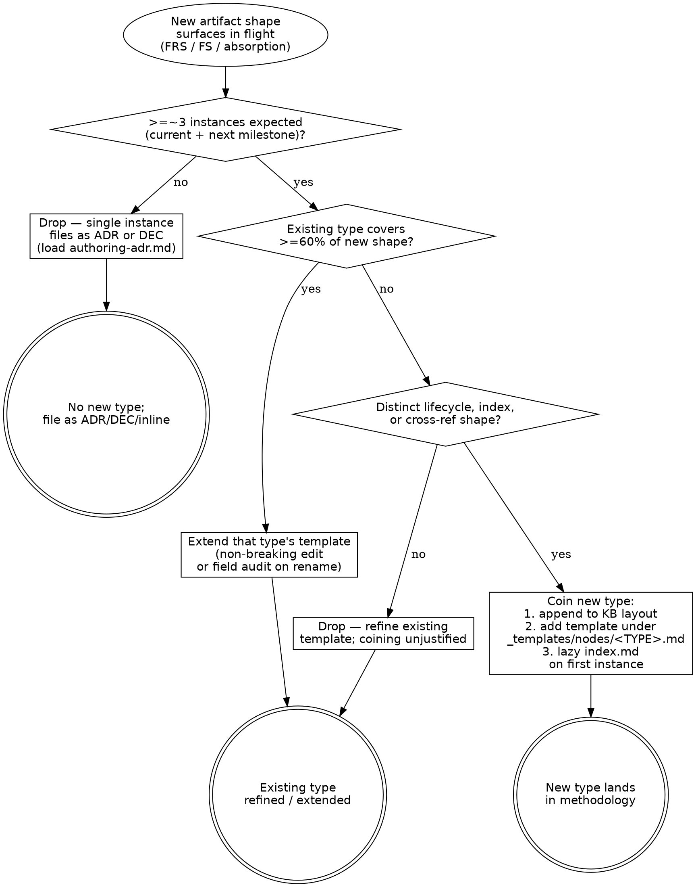

# Evolving the workflow

> Procedure for extending the workflow itself — adding a new node
> type, refining or coining a doc template, or defining a new derived
> report type. The discipline: extend before invent, and land the
> extension in the methodology *before* the artifact that motivates
> it.

> **HARD-GATE:** Do NOT coin a new node type, template, or report
> type until the relevant discriminator below has been run AND the
> 60% shape-coverage check has been answered against existing types.
> If an existing type covers ≥60% of the new shape, **extend that
> type** — do not coin. Coining without the discriminator pollutes
> the workflow with parallel types that only differ in name.
> (Cross-cutting rule:
> [`../../CLAUDE.md ## Hard rules`](../../CLAUDE.md#hard-rules) —
> "Existing nodes are authoritative — adapt the template, don't
> retrofit.")

## When to Use

**Use when:** an in-flight FRS / FS / absorption surfaces an artifact
shape that no existing type covers — a new behavioral aggregate
(node type), a recurring artifact shape (template), or a recurring
roll-up view (derived report). Also load when a `RESEARCH-NNN` or
`OQ-NNN` proposes coining a new type.

**Do NOT use when:** the gap can be closed by adding a field to an
existing template (that's a refinement — Op below covers it without
coining), or when the rule being captured is project-specific
architectural commitment (load [`authoring-adr.md`](authoring-adr.md)
— it's an ADR, not a new type).

**Vs. sibling files:** [`authoring-adr.md`](authoring-adr.md) coins
new *commitments* within an existing artifact type (ADR);
[`maintenance-discipline.md`](maintenance-discipline.md) maintains
artifacts of established types; this file coins the *types
themselves*. The three are nested: type coining (rarest) →
commitment coining (occasional) → artifact maintenance (every
session).

## Process Flow

The shape-coverage diamond (`>=60%`) is the **extend-before-invent
gate**; the lifecycle diamond catches the case where an existing
type *almost* fits but carries a different status vocabulary or
index/log shape. Three diamonds, each with a yes/no answer — no
escape hatch.

## Anti-Pattern: "The Motivated Invention"

Coining a new node type because the in-flight FS "needs" one — without
walking the 13 existing types and answering whether one covers ≥60%
of the new shape. The cost: the methodology grows parallel types that
only differ in naming convention (e.g., a "ProcessFlow" node coined
alongside the existing FLW because "flows" felt too generic for the
current FS); generators have to consult both; the discriminator in
[`authoring-adr.md`](authoring-adr.md) blurs because the new type's
boundary with existing types isn't sharp. **The right move when an
existing type covers ≥60% is to extend that type's template** — add
the missing field or sub-shape, run the audit-pass against existing
artifacts, and keep the type set sharp. Doctrinal anchor:
[`../PRINCIPLES.md`](../PRINCIPLES.md) — *Coining a new artifact type
when an existing one would carry the data.*

Three forms of extension, each with its own discriminator. Apply
sequentially — refine first, invent last.

## Defining a new node type

**Discriminator** (all four required):

1. **At least ~3 instances expected** within the foreseeable horizon
   (current milestone plus the next). Single-instance concerns
   collapse into an ADR (cross-cutting) or DEC (node-scoped) — see
   [`authoring-adr.md → When to file a Standard, ADR, or DEC`](authoring-adr.md#when-to-file-a-standard-adr-or-dec-the-3-way-discriminator).
2. **No existing type carries the semantics naturally.** Walk the 13
   types in [`../KB-LAYOUT.md`](../KB-LAYOUT.md).
   If one covers ≥60% of the new type's shape, extend that type's
   template rather than coining a new one.
3. **The new type has its own lifecycle or index behavior** that the
   closest existing type doesn't model (e.g., a distinct frontmatter
   field set, a distinct status vocabulary, a distinct cross-reference
   shape).

**Procedure:**

1. Append the new type to
   [`../KB-LAYOUT.md`](../KB-LAYOUT.md) —
   directory, ID prefix, lazy-creation note if applicable.
2. Add a node template at `_templates/nodes/<TYPE>.md`.
3. Lazy-create `docs/<component>/nodes/<type>/index.md` on first
   instance, per the existing rule in
   [`maintenance-discipline.md → Lazy creation`](maintenance-discipline.md#lazy-creation).

## Defining or refining a doc template

**Discriminator:**

- **Refine** an existing template when ≥60% of the new artifact's
  structure carries over. Refinement is a non-breaking edit unless
  required frontmatter fields are added or renamed — that triggers an
  audit pass against existing artifacts of the same kind.
- **Coin a new template** when the artifact kind recurs with a
  distinct shape that no existing template covers without major
  surgery.

**Procedure (refine):** edit the template in place; if any required
frontmatter field changes, run a grep audit (`adrs:`, `touches_nodes:`,
etc.) against existing artifacts and patch the divergences.

**Procedure (coin):** drop the new template under `_templates/`, name
it after the artifact kind.

## Defining a new derived-report type

Forward-reference to
[`derived-reports.md → Defining a new report type`](derived-reports.md#defining-a-new-report-type).
Same discriminator, same procedure, same log entry. The distinction
from node types and templates: reports are build artifacts under
`reports/`, never carry an `index.md`/`log.md` pair, and are
always regenerable from the wiki.

## Landing extensions

Workflow extensions (new node types, template refinements, report types)
are evaluated against the discriminators in this file; once approved they
land directly in the appropriate file. No separate change-log artifact is
maintained.

---

## Integration

- **Required before:** [`../../CLAUDE.md ## Hard rules`](../../CLAUDE.md#hard-rules)
  — "Existing nodes are authoritative — adapt the template, don't
  retrofit." is the doctrinal anchor of this flow's HARD-GATE.
- **Required before:** [`../PRINCIPLES.md`](../PRINCIPLES.md) —
  "Coining a new artifact type when an existing one would carry the
  data" is the named anti-pattern.
- **Required before:** [`../KB-LAYOUT.md`](../KB-LAYOUT.md)
  — the existing node types this file extends.
- **Callers (this file is wholesale-read by):**
  [`plan.md`](plan.md) (Phase 2 surfaces a missing node type or
  template gap),
  [`legacy-absorption.md`](legacy-absorption.md) (first instance of a
  new node type — e.g., the planned MOD type for `architecture.md`
  absorption — or a new derived report type — e.g., the planned
  `overview/ARCHITECTURE.md`).
- **Maintenance ops that may fire after a coin:**
  [`maintenance-discipline.md`](maintenance-discipline.md) — lazy
  `index.md` creation on the first instance of the new type.
- **Sibling rule books:**
  [`authoring-adr.md`](authoring-adr.md),
  [`maintenance-discipline.md`](maintenance-discipline.md),
  [`legacy-absorption.md`](legacy-absorption.md),
  [`new-component-bootstrap.md`](new-component-bootstrap.md),
  [`derived-reports.md`](derived-reports.md).
