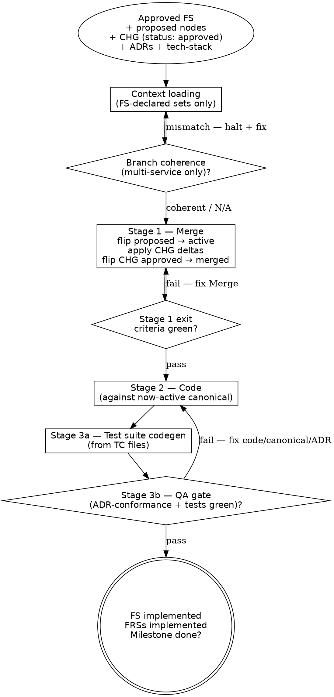

# Implementation Flow

> Implementation flow — **applies** the FS's CHG deltas to the canonical
> wiki, **flips** the FS's new nodes `proposed → active`, then writes
> production code, then runs the QA gate. Part of the workflow defined in
> [`../WORKFLOW.md`](../WORKFLOW.md).
>
> **Mode: Merge + Code.** "Merge" here is the apply-deltas-and-flip-statuses
> operation, not a file copy. The new nodes the FS introduced are already
> canonical (written at Phase 2 with `status: proposed`); this flow flips
> them to `active` and fires a `status-change` log entry per node. For
> each CHG node listed in the FS's `changes:`, this flow applies the
> CHG's `modifies[]` / `removes[]` / `supersedes[]` deltas to the canonical
> targets (firing `updated` / `superseded` / `status-change` log entries
> there), then flips the CHG's status `approved → merged` in place. The
> CHG file itself stays at its milestone path — never promoted. Then
> implements the code that the now-active canonical nodes describe.

> **HARD-GATE:** Do NOT begin Stage 2 (Code) until **every** Stage 1 (Merge)
> exit criterion is green — every new node flipped `proposed → active`,
> every CHG delta applied to canonical with the matching log entries
> fired, every CHG flipped `approved → merged`. Coding against a
> still-`proposed` node, or against a CHG-targeted canonical node that
> hasn't yet received its delta, breaks the source-of-truth invariant
> the Merge stage exists to maintain.
> (Cross-cutting rules: see
> [`../../CLAUDE.md ## Hard rules`](../../CLAUDE.md#hard-rules) — "Canonical
> edits use tiered touch".)

## When to Use

**Use when:** the Plan flow has produced an approved FS with
`merged: false`, every new node it introduced sits in canonical with
`status: proposed`, every CHG sits at `status: approved`, every
`depends_on_specs:` dependency has `merged: true`, and a `/clear` has
happened.

**Do NOT use when:** the FS or any of its dependencies is still in flight
(load [`plan.md`](plan.md)), or the work is a bug fix rather than an
FS-driven slice (load [`bug-fix.md`](bug-fix.md)).

**Vs. sibling files:** [`design.md`](design.md) Queries canonical;
[`plan.md`](plan.md) Ingests new nodes (`status: proposed`); this file
Applies CHG deltas + Flips statuses + Writes code + runs QA.

**Prerequisites:**

- An approved Feature Spec at
  `docs/milestones/M-NN-<slug>/specs/FS-NNN-<slug>/FS-NNN.md` with
  `merged: false` in frontmatter. Every new node in the FS's `new_nodes:`
  is already present in canonical `docs/<component>/nodes/<type>/` with
  `status: proposed`. If the FS has CHGs, each lives at its milestone
  path: `nodes/changes/CHG-NNN-<slug>.md` with `status: approved`.
- The FS's `depends_on_specs:` list (if any) — every spec in that list must
  already have `merged: true`. If a dependency is unmerged, this FS's Phase 3
  is **blocked** until the dependency merges.
- A context reset has happened between Phase 2 and this flow.
- **(Multi-service only.)** If the FS's `service_repos:` is non-empty,
  every listed repo exists as a clone at its workspace-relative path
  and is on the FS's feature branch (`feat/FS-NNN-<slug>`). Verify with
  `sdlc/scripts/check-branch-coherence.sh path/to/FS-NNN.md` — if any
  repo mismatches, halt Phase 3 until coherent. See
  [Multi-repo Phase 3 model](#multi-repo-phase-3-model) below.

---

## Process Flow



The Stage-1-exit diamond is the canonical instance of this file's
HARD-GATE — Stage 2 does not begin until every Merge entry has fired
correctly. The Stage 3 QA diamond is the ADR-conformance + tests-green
gate; the FS does not flip to `implemented` until it passes.

---

## The Process

## Phase 3 — Implementation: Merge + Code + QA

**Operation:** `implement-feat`
**Inputs:** approved FS, new canonical nodes (status: proposed) listed in
  the FS's `new_nodes:`, CHG nodes (if any) at the milestone path, canonical
  nodes the CHGs target, all ADRs declared in the FS's `adrs:`
**Output:** canonical wiki updated (statuses flipped, CHG deltas applied);
  production code; FS marked `implemented` after QA gate

This flow runs in three stages, in order:

1. **Merge** — flip new nodes `proposed → active`, apply CHG `modifies[]` /
   `removes[]` / `supersedes[]` to canonical targets, fire the matching log
   entries per event. ("Merge" is the apply-deltas-and-flip-statuses
   operation, not a file copy.)
2. **Code** — implement against the now-active canonical nodes.
3. **QA** — verify code matches the Flow scenarios and ADRs, then flip
   status fields.

Each stage has its own discipline. Do not skip ahead — coding before
the Merge stage applies the CHG deltas defeats the source-of-truth
invariant.

### Context loading (before merging or coding)

Read **only** what the FS declares:

1. Open the FS at
   `docs/milestones/M-NN-<slug>/specs/FS-NNN-<slug>/FS-NNN.md`. Collect:
   `new_nodes:`, `changes:`, `adrs:`, `depends_on_specs:`.
2. Read every new canonical node under `docs/<component>/nodes/<type>/` whose ID
   appears in the FS's `new_nodes:` (all carry `status: proposed`). These
   are the definitions the FS introduces; Phase 3 flips them to `active`.
3. For every CHG-NNN in `changes:`, read the CHG file at
   `milestones/M-NN-<slug>/specs/FS-NNN-<slug>/nodes/changes/`. Each
   `modifies[]` entry names a canonical target — read those canonical
   files too. Each `adds[]` entry references a node already in
   `new_nodes:` (already in canonical, status: proposed); no separate
   read needed.
4. Read `docs/<component>/adrs/index.md` — one-line summaries only.
   Narrow-load every ADR declared in the FS's `adrs:` plus any
   convention-tagged ADR the FS missed (surface the gap if you find one,
   update the FS, do not silently load).
5. Read [`../../docs/tech-stack.md`](../../docs/tech-stack.md) wholesale —
   it is the operational baseline that carries pinned stack versions,
   application layout, operational commands (build / run / test /
   migrate), environments, runtime state, and milestone progress. Cited
   ADRs inside each section are routing hints, not a re-load instruction:
   only the ADRs already declared in the FS's `adrs:` get narrow-loaded.
6. Do **not** glob `docs/<component>/nodes/**` or `docs/<component>/adrs/**` wholesale. The FS's
   declared sets are the load.

See "Retrieval discipline" in
[`../WORKFLOW.md`](../WORKFLOW.md#retrieval-discipline) for the underlying
rule.

---

### Stage 1 — Merge

For **every new node** in the FS's `new_nodes:` (already at
`docs/<component>/nodes/<type>/<ID>-<slug>.md` with `status: proposed` from Phase 2):

1. **Flip status.** Edit the canonical node's frontmatter:
   `status: proposed → status: active`.
2. **Append `status-change` log entry** to `docs/<component>/nodes/<type>/log.md`. Body
   notes `proposed → active via FS-NNN Phase 3 merge`.
3. **Re-sync the per-type index row** at `docs/<component>/nodes/<type>/index.md`:
   Status column flips from `proposed` to `active`. If the one-line
   summary, tags, or source also changed, sync those too.

   `docs/home.md` is derived from the per-type indexes — it regenerates
   on demand, not per merge.

For **every CHG-NNN** in the FS's `changes:`:

1. For each entry in the CHG's `adds[]`: the new node is already canonical
   (status flipped to `active` in the loop above) — mark satisfied. The
   `adds[]` field is the audit trail and the source for the
   `supersedes[]` → `adds[]` enforcement below.
2. For each entry in the CHG's `modifies[]`:
   - [ ] Open the canonical target file at `docs/<component>/nodes/<type>/<ID>-<slug>.md`.
   - [ ] Apply the delta described in the CHG's `before → after` summary.
   - [ ] Append a `source_ref` entry `{frs, fs, op: modify}` to the
         canonical node.
   - [ ] Append an `updated` entry to `docs/<component>/nodes/<type>/log.md` with a
         one-line note referencing CHG-NNN.
   - [ ] Re-sync the canonical node's row in `docs/<component>/nodes/<type>/index.md` if
         the summary, tags, status, or source changed.
3. For each entry in the CHG's `removes[]` or `supersedes[]`: apply the
   status transition (`status-change` or `superseded` log entry per the
   [Operation vocabulary](maintenance-discipline.md#operation-vocabulary-closed-set))
   and re-sync the per-type index. Any successor IDs must already be in
   the CHG's `adds[]`.

Finally, flip the CHG node itself:

- [ ] In the CHG file at
      `milestones/M-NN-<slug>/specs/FS-NNN-<slug>/nodes/changes/CHG-NNN-<slug>.md`,
      flip frontmatter `status: approved → status: merged`.
- [ ] CHG files stay at the milestone path permanently — they are NOT
      promoted to canonical. No `docs/<component>/nodes/changes/` subtree exists; no
      3-file lifecycle touch fires against canonical for the CHG.

The CHG file under the milestone folder is **kept as permanent history.**
Do not delete `milestones/M-NN-<slug>/specs/FS-NNN-<slug>/nodes/changes/CHG-NNN-<slug>.md`
after applying its deltas. The `status: merged` marker is the signal that
the deltas have already been applied; future readers consult the file as the
durable audit trail of this FS's modifications to canonical.

### Checklist — Stage 1 Merge exit (before Stage 2)

#### Anti-Pattern: "The Shortcut Merge"

Starting Stage 2 code work while one of the Merge bookkeeping touches
is still pending — the canonical node body is correct but the
`status-change` log entry hasn't been appended, or the per-type
`index.md` Status column hasn't been re-synced, or the CHG file's
frontmatter still reads `approved`. The temptation: the *behavior* is
right; the log/index sync feels like ceremony. The cost: the next
person (often future-you) reads the index, sees `proposed`, decides
the node isn't ready, and builds against the wrong assumption. The
3-file touch is one operation, not a checklist of optional steps.
Doctrinal anchor:
[`../PRINCIPLES.md`](../PRINCIPLES.md) — "Silent node or ADR edits"
and "If it can drift, the operation isn't atomic enough."

- [ ] Every entry in the FS's `new_nodes:` has had its canonical
      `status` flipped `proposed → active`, with a `status-change` log
      entry fired and the per-type index row re-synced.
- [ ] Every CHG `modifies[]` entry has been applied to its canonical target
      (delta applied, `source_ref` appended, `updated` log entry fired,
      index row re-synced as needed).
- [ ] Every CHG `removes[]` / `supersedes[]` entry has fired its status
      transition on the canonical target.
- [ ] Every CHG node's frontmatter has been flipped `approved → merged` in
      place at its milestone path.
- [ ] No canonical edits exist outside what the FS's `new_nodes:` or its
      CHGs declared, irrespective of phase.

---

### Stage 2 — Code

Implement against the now-active canonical nodes at `docs/<component>/nodes/<type>/`.
Every node referenced in this Stage carries `status: active` after Stage 1
(or `status: proposed` for a node that hasn't been flipped yet — that is a
Stage 1 bug, not a Stage 2 working state).

**Convention ADRs to consult during coding.** Stage 2 honors every ADR
in `docs/<component>/adrs/index.md` tagged `convention` (or
labelled as a project-wide commitment) in addition to the FS's declared
ADR set. Read the index first; narrow-load each page when authoring code
that touches its area. The FS's `adrs:` list plus the convention-tagged
ADRs from the index together form the conformance set Stage 3 QA
verifies.

Cohort ordering inside the FS's Implementation tasks maps to these ADRs —
see
[`plan.md → Implementation-task cohort ordering`](plan.md#implementation-task-cohort-ordering)
and the cohort-ordering ADR for this project.

**Build validation between cohorts.** After each cohort's code lands,
run your project's build command (declared in
[`../../docs/tech-stack.md § Operational commands`](../../docs/tech-stack.md#3-operational-commands))
for the affected projects (and the host) before moving on. Compilation
failures inside the just-touched cohort are local and fixed in place;
failures in unrelated projects, missing-type errors across cohort
boundaries, or DI-resolution errors at startup indicate the cohort
ordering or dependency declaration is wrong — halt and revisit the FS
task ordering rather than papering over.

Four disciplines distinguish this from "just write the code":

**Keep canonical nodes in sync.** If implementation reveals that a node was
wrong — missing an invariant, wrong transition, wrong contract — update the
canonical node, not just the code. The knowledge base is only useful if it
stays current with what the code actually does. Each such edit fires an
`updated` entry per the [Node content updates](#node-content-updates-during-implementation)
section below.

**Honor the ADRs.** Decisions captured in the FS's declared ADRs (and the
convention-tagged ADRs from the index) are not optional. If an FRS or node
forces a deviation, surface it in the FS's "Architecture decisions" section
first, then **update or supersede the ADR** — do not silently break it. A
deviation that warrants superseding an ADR is itself the moment to author
the successor.

**No silent canonical edits.** Edits to canonical nodes outside the FS's
declared `new_nodes:` or CHG `modifies[]` lists are silent drift,
irrespective of phase — see the
[In-flight nodes (`status: proposed`)](../WORKFLOW.md#in-flight-nodes-status-proposed)
clause. If implementation reveals the FS missed a node, update the FS first
(or raise an `OQ-NNN` under `docs/discovery/open-questions/` with
`origin: implementation, origin_ref: FS-NNN, needed_by: <next-FRS>` if
the change is large enough to be a separate FS), then make the canonical
edit.

**Drive each task from a failing check.** Before implementing an FRS
acceptance criterion or Flow scenario, write the test that fails for the
right reason, then make it pass. For non-test-shaped work (e.g., a refactor
governed by an ADR), name the equivalent pre/post check (type-checker green,
lint clean, scenario still passes) before touching code. Solo means there
is no second pair of eyes to tell you when you're done — the failing check
is the signal, and Stage 3's verification checklist is just the aggregate of
those per-task checks.

### Node content updates (during implementation)

The "Keep canonical nodes in sync" discipline above produces `updated`
lifecycle events on canonical nodes — implementation reveals a node was
missing an invariant, had a wrong transition, or stated a wrong contract,
and the canonical node gets edited to match reality. These are not status
changes, but they **are** lifecycle events under
[`maintenance-discipline.md`](maintenance-discipline.md)
and follow the full 3-file lifecycle touch.

- [ ] For every canonical node whose content is edited during
      implementation:
      - [ ] `updated` entry appended to `docs/<component>/nodes/<type>/log.md` with a
            one-line note on what changed (the why; the diff is in git).
      - [ ] Per-type `index.md` row re-synced if the one-line summary,
            tags, or source changed. (No re-sync needed for purely internal
            edits that don't change those fields.)
- [ ] Conversely: no silent canonical edits. If you can't write an
      `updated` log entry that names the reason, the edit isn't ready —
      either the FS should have declared it, or you're drifting outside the
      slice.

### Status transitions (during implementation)

Implementation routinely flips canonical node and ADR lifecycle states — a
node moves `active → superseded` when its replacement lands; an ADR moves
`accepted → deprecated` (or `superseded`) when an implementation deviation
forces it. **Every status move re-syncs the four files** named in
[`maintenance-discipline.md`](maintenance-discipline.md).
No silent flips.

- [ ] For every canonical node whose status changes during implementation:
      - [ ] `status-change` (or `superseded` / `deprecated`) entry appended
            to `docs/<component>/nodes/<type>/log.md` with old and new status in the
            body.
      - [ ] Per-type `index.md` row updated (moved to the
            Superseded/deprecated section if applicable).
- [ ] For every ADR whose status changes during implementation:
      - [ ] `status-change` (or `superseded` / `deprecated`) entry appended
            to `adrs/log.md`.
      - [ ] `adrs/index.md` row updated (moved to the Superseded/deprecated
            section if applicable).
      - [ ] If superseding: successor ADR authored via the full procedure
            in [`authoring-adr.md → Steps`](authoring-adr.md#steps-all-triggers).

---

### Task-level patterns

Tasks are first-class within an FS (the Implementation tasks section with
cohort ordering). They do **not** have their own node type. Task-level issues
are handled by existing facilities — Exploration for research, bug-fix for
adjacent bugs, FRS escalation for new scope. Four patterns cover the common
cases.

#### Pattern 1 — Task needs research

A task requires exploration or option evaluation before it can be executed.

1. Pause the task.
2. Author an Exploration at workspace level (see
   [`../_templates/EXPLORATION.md`](../_templates/EXPLORATION.md)).
   If falsifiable, fill `hypothesis:` / `harness:` / `success_criteria:`
   (the shape is detected from `hypothesis:` presence); if
   alternative-evaluation, the body lays out options. Set `tag:` if it
   helps the index — `tag:` is free-form on Exploration.
3. Annotate the FS task: `Blocked on: docs/exploration/EXP-<slug>.md`.
4. Continue non-critical-path tasks, or pause the FS.
5. When the Exploration reaches `status: done`, update the task with
   the chosen direction and resume.

#### Pattern 2 — Task encounters a bug

- **Bug in scope** (the task IS fixing this exact thing, or the bug
  blocks intended behavior): fix as part of the task. No separate artifact.
- **Bug adjacent to scope** (encountered while working on something
  else): raise a bug-fix Exploration per [`bug-fix.md`](bug-fix.md); fix on
  a separate `fix/<slug>` branch; do not drive-by-fix inside the FS branch.

Drive-by refactors of code the FS doesn't require is already an anti-pattern
in [`../PRINCIPLES.md`](../PRINCIPLES.md). The same discipline applies to bugs.

#### Pattern 3 — Task is too big

- **Same user-journey, deeper than expected:** split into T<N>a /
  T<N>b / T<N>c within the FS. The user-journey decomposition was
  right; task decomposition needs refinement.
- **Genuinely new scope discovered:** pause; raise an OQ; either
  expand the FS (if still one user-journey) or add a new FRS to the
  milestone covering the new scope; revalidate; continue.
- **New internal service / component surfaces:** see Pattern 4.

#### Pattern 4 — Task reveals an internal service needing its own design

Discriminator: *would another FS later want to consume this service
directly?*

- **No** — it's an internal implementation detail of this feature.
  Tasks within the current FS. Any research is an Exploration; result
  feeds back to the tasks.
- **Yes** — it's a real deliverable. Pause; raise an OQ; author a new
  FRS (and likely FS) for the service under the same milestone (or a
  new milestone if scope is broader). The original FS declares
  `depends_on_specs: [FS-NNN-new-service]`. Phase 3 enforces merge
  order — the new service merges first.

---

### Stage 3 — QA

Solo doesn't mean QA is skipped — it means the QA hat is the same human at
a deliberate moment. Before flipping the FS to `implemented`, complete the
QA verification checklist in the spec.

QA runs in two parts: first **Test suite codegen** (generate test specs
from the Phase 2 TC files per the test-runner cookbook), then the **QA
verification checklist** (the spec runs green plus every other criterion).

#### Test suite codegen

**Operation:** `generate-test-suite`
**Mode:** Codegen — runs in the same Phase 3 session, on the FS's
implementation branch.

**Prerequisites:**

- TC files exist under
  `docs/milestones/M-NN-<slug>/specs/FS-NNN-<slug>/test-plans/<use-case>/`
  from Phase 2's Test plan ingest. The FS's `test_plan_path:`
  frontmatter is set.
- The UI for this FS exists and is running locally (Stage 2 Code is
  complete or substantially complete for the FS's Implementation tasks).
- The developer has run an explorer pass (runner explorer tooling,
  `data-testid` audit, or manual inspection) and replaced the
  `(discovered by explorer)` selectors in each TC's Steps table with
  concrete CSS or role-based selectors.

  TCs where every interaction step is still `(discovered by explorer)`
  are flagged and skipped. The fix is to resolve the selectors against
  the real DOM, update the TC, and rerun codegen — not to invent a
  selector that looks plausible.

**Inputs:**

- TC files under the FS's `test-plans/` folder.
- The runner config file (e.g., `playwright.config.ts`) — the `testDir`
  setting resolves to `{test_dir}`. If the config does not exist, this is
  the **one-time test runner bootstrap** moment: the first FS to reach
  Phase 3 scaffolds the `tests/` directory with the runner's config,
  package descriptor, `.gitignore`, and (optionally) a `tests/.env.example`
  for credential env vars. See the test-runner cookbook for the exact
  files. Add the bootstrap as an Implementation task in the FS rather than
  treating it as ambient work.
- Environment variables: `TEST_EMAIL`, `TEST_PASSWORD`, plus any
  feature-specific secrets the TC's Test Data declares. Sourced from
  `tests/.env` (gitignored) or the developer's shell — never hardcoded.

**Codegen rules:**

See
[`test-runner-cookbook.md`](test-runner-cookbook.md) for the
action-inference table, code emission table, selector resolution,
value substitution, auth/SSO patterns, and the full spec file template
including the mandatory `createdRecords + afterEach` cleanup pattern.
The discipline:

- One test spec per use-case sub-folder (file name and extension per the
  cookbook).
- One test case per TC, in TC number order.
- Raw runner calls only — per the cookbook's code emission table. No page
  objects. No helper wrappers. No polling waits. No retry logic.
- Every step produces a code line or a `// TODO` — no silent drops.
- Every test has at least one `expect()`; if a TC has zero assertions
  emit `// TODO: no assertions found — add expected result to TC`.
- `createdRecords` array + `afterEach` block always present (even on
  read-only use cases — uniformity beats per-spec divergence).
- Spec files are **disposable** — regenerated end-to-end each run. Hand
  edits are lost.

**Output target:**

```
tests/{test_dir}/<feature>/<use-case>.<ext>
```

where `<feature>` matches the FS folder slug, `<use-case>` matches the
kebab-case verb of the TC sub-folder, and `.<ext>` is the file extension
defined by the test-runner cookbook (e.g. `.spec.ts` for Playwright).

**Branch strategy.** Phase 3 already runs on the FS's implementation
branch. Spec files land on the same branch alongside production code —
no `test/<feature-name>` sub-branching. No auto-commit, no auto-push.
The developer reviews the generated specs, fills the `afterEach` TODO
bodies, and commits alongside the cohort's code.

**Resolution Summary before any side effect.** Before the first file
is written, print a resolution summary so a wrong write target can be
caught:

```
─────────────────────────────────────────────────────────────
Test suite codegen — resolution summary
─────────────────────────────────────────────────────────────
test_plan_path:    {docs}/milestones/.../specs/FS-NNN/test-plans/
tests_dir:         tests/{test_dir}
feature_slug:      <feature>
target branch:     <current FS implementation branch>
spec files to emit: <N>
TCs skipped:       <M> (all-`(discovered by explorer)`)
─────────────────────────────────────────────────────────────
```

Wait for explicit "proceed" or a corrected value before writing any
file. Silence, "looks good", or unrelated messages do not count as
acknowledgment.

**Generation report.** After writing, emit a summary table grouped by
use-case sub-folder, listing each TC's title, step count, TODO count,
and result (✅ generated / ⚠ skipped). Surface any remaining TODOs
(unresolved selectors, ambiguous step text) explicitly.

#### QA verification — subagent dispatch + outcome routing

The Phase 3 QA gate's **ADR-conformance check** runs as a parallel
inline `Agent(subagent_type=Explore, ...)` dispatch (one per ADR area,
or one for the FS-declared ADR set + one for the convention-tagged
ADR set from the index), each returning the 3-block contract
(`## Findings / ## Risks / ## Open questions`). Contract canonical
home:
[`../WORKFLOW.md → Inline dispatch shape for gates`](../WORKFLOW.md#inline-dispatch-shape-for-gates)
— do not restate the contract here.

**Parent-side routing on dispatch return** (orchestrator decides next
step based on the 3-block return, using these outcome handles):

- **DONE** → 0 Findings or only Minor — proceed to the QA verification
  checklist below.
- **DONE_WITH_CONCERNS** → ≥ 1 Major Finding — resolve before flipping
  FS → `implemented`. Either fix the code, update the canonical node
  to match reality (firing the `updated` lifecycle touch), or — if the
  deviation is correct and the ADR is wrong — supersede the ADR via
  [`authoring-adr.md`](authoring-adr.md) before the flip.
- **NEEDS_CONTEXT** → empty return or self-reported "could not
  determine" — re-dispatch with explicit added context (named code
  paths, narrower ADR scope, the specific tagged convention to check).
  Do NOT retry blindly.
- **BLOCKED** → ≥ 1 Blocker Finding, or task-shape mismatch (the ADR
  check requires judgment a subagent cannot deliver reliably) —
  escalate: split into smaller mechanical checks, route to a stronger
  model, or hand back to the main session. The FS does not flip to
  `implemented` while a Blocker is open.

#### QA verification checklist

After Test suite codegen produces the specs:

- Every linked Flow scenario mapped to a passing test (runner conventions
  live in the testing-convention ADR once authored; consult the
  project-owned test-runner cookbook for file-path and invocation
  conventions). An executed scenario without a corresponding test does not
  count. "Mapped to a passing test" means: a test file exists at the path
  the cookbook specifies, its corresponding TC's `Traces to:` line includes
  the scenario anchor, and the test runs green.
- Every FRS acceptance criterion verified.
- **ADR-conformance check** — code conforms to every `accepted` ADR
  declared in the FS's `adrs:` plus convention-tagged ADRs from the index.
  Lint, formatter, type-checker, and project-specific gates (themselves
  originating from convention ADRs) green. Deviations either documented in
  the FS's "Architecture decisions" with a follow-up ADR update or
  superseding ADR, or fixed before the flip.
- Affected canonical nodes updated to reflect actual implementation.
- No silent canonical edits outside what the FS declared.
- No silent ADR edits — any ADR change goes through the proper authoring /
  supersession procedure in [`authoring-adr.md`](authoring-adr.md).

#### Code-quality gates

The ADR-conformance check above runs the gate checklist declared in your
project's code-quality ADR. Each gate is a yes / no check; any "no"
blocks the flip to `implemented` until resolved or covered by a
superseding ADR. The gates live in the ADR rather than this flow file so
the workflow stays project-agnostic and the gate list evolves where it
belongs.

> **Your project:** Look up the ADR tagged `code-quality` in
> `docs/<component>/adrs/index.md` and note its ID here as a session
> reference. The gate list lives only in that ADR.

Any relaxation of a gate requires authoring an ADR that supersedes the
code-quality ADR — not a quiet exception. See
[`authoring-adr.md`](authoring-adr.md).

### Status updates on completion

- FS → `merged: true`, `merge_sha: <HEAD sha>`, `status: implemented`.
- Each FRS in the FS's `frs:` → `implemented`.
- Every CHG node in the FS's `changes:` → `status: merged`.
- Milestone → `done` when all its specs are `merged: true` and
  `status: implemented`.

Run the user-review handoff before flipping these statuses.

---

## Multi-repo Phase 3 model

> Applies only when the project is multi-service. Single-service /
> monolith projects skip this section; the FS's `service_repos:` is
> empty.

Service repos are clones **inside** the workspace repo. The workspace
`.gitignore` excludes every `*-repo/` path; each service repo keeps its
own git history and tracks code commits independently of the planning
workspace.

```
workspace/                          # this repo
  .gitignore                        # ignores *-repo/
  CLAUDE.md
  sdlc/
  docs/
  ui-repo/                          # clone of the UI service repo
  api-repo/                         # clone of the API service repo
  fraud-detection-repo/             # clone of the stream-processor repo
  ...
```

Workspace root is the agent's CWD; service-relative paths look like
`./api-repo/src/controllers/...`. No worktrees, no submodules.

### Pre-merge branch-coherence check

Before Stage 1 Merge begins, run:

```
sdlc/scripts/check-branch-coherence.sh docs/milestones/M-NN-<slug>/specs/FS-NNN-<slug>/FS-NNN.md
```

The script reads `service_repos:` from the FS frontmatter and verifies
every listed repo is on `feat/FS-NNN-<slug>`. Any mismatch halts Phase
3 — the merge does not begin until every service repo is on the
expected branch. The script also flags missing clones (paths declared
in `service_repos:` but absent from disk).

A monolith FS — `service_repos:` empty — skips the check trivially
(the script exits 0 with "no service_repos declared").

### Stage 2 Code across repos

Code edits in Stage 2 land in the appropriate service repo's working
tree. Each service repo's commit history is independent; the workspace
does not track those commits. The FS's `merge_sha:` records the **workspace**
HEAD at merge time — service-repo SHAs live in each service repo's own
log.

### Reading tech stack across repos

[`Context loading`](#context-loading-before-merging-or-coding) reads
`docs/tech-stack.md` wholesale for cross-cutting infrastructure. In
multi-service projects, **also** read the `## Stack` section of every
SVC node listed in (or implied by) the FS's `service_repos:` — that is
where per-service runtime, build, test, and deploy commands live. See
[Per-SVC stack discipline](#per-svc-stack-discipline) below.

### Per-SVC stack discipline

`docs/tech-stack.md` carries **cross-cutting** shared infrastructure
only — Kafka cluster, databases, observability stack, CI/CD platform,
language / ecosystem standards, project-wide runtime state. **Per-service**
runtime, repo URL, branch convention, directory layout, build / test /
run / deploy commands, environment variables, and deploy target live
in each SVC node's `## Stack` section. Linking nodes to the stack they
use is **implicit by containment**: an ENT in MOD-NNN realized by
SVC-NNN uses SVC-NNN's stack; no per-node tech link.

Source: `sdlc-framework-refinement-v3.md` Δ5 + Δ8.

---

## Integration

- **Required before:** [`../../CLAUDE.md ## Hard rules`](../../CLAUDE.md#hard-rules)
  — "Canonical edits use tiered touch" anchors every Stage 1 Merge
  touch; "Existing nodes are authoritative" governs Stage 2 Code; "Read
  the per-type index.md before globbing" governs context loading.
- **Required before:** [`../WORKFLOW.md`](../WORKFLOW.md) — phase
  pipeline, retrieval discipline, the `### Inline dispatch shape for
  gates` contract the Stage 3 QA dispatch consumes,
  [`../WORKFLOW.md → Maintenance discipline`](../WORKFLOW.md#maintenance-discipline)
  for the 3-file lifecycle touch fired here.
- **Required before:** [`../PRINCIPLES.md`](../PRINCIPLES.md) —
  doctrinal anti-patterns this stage enforces ("Silent node or ADR
  edits"; "Editing a canonical node outside an active Phase 3 merge";
  "If it can drift, the operation isn't atomic enough").
- **Required before (entry):** [`plan.md`](plan.md) — produces the
  approved FS + proposed nodes + approved CHG this flow consumes.
- **Rule books wholesale-read during this flow:**
  [`test-runner-cookbook.md`](test-runner-cookbook.md) (Stage 3a Test
  suite codegen),
  [`test-data-generation.md`](test-data-generation.md) (Stage 3a
  directive interpolation),
  [`maintenance-discipline.md`](maintenance-discipline.md) (every
  lifecycle event fired during Stage 1 Merge and the Stage 2 "Keep
  canonical nodes in sync" discipline).
- **Maintenance ops that may fire:**
  [`authoring-adr.md`](authoring-adr.md) (Stage 2 implementation
  forces an ADR supersession, or the QA gate's ADR-conformance check
  surfaces a needed update),
  [`derived-reports.md`](derived-reports.md) (regenerate after the
  FS flips to `implemented`).
- **Routes to (after FS flips to `implemented`):**
  user-review handoff; milestone close if every spec is merged.
- **Sibling flow files:** [`design.md`](design.md),
  [`plan.md`](plan.md), [`bug-fix.md`](bug-fix.md).
