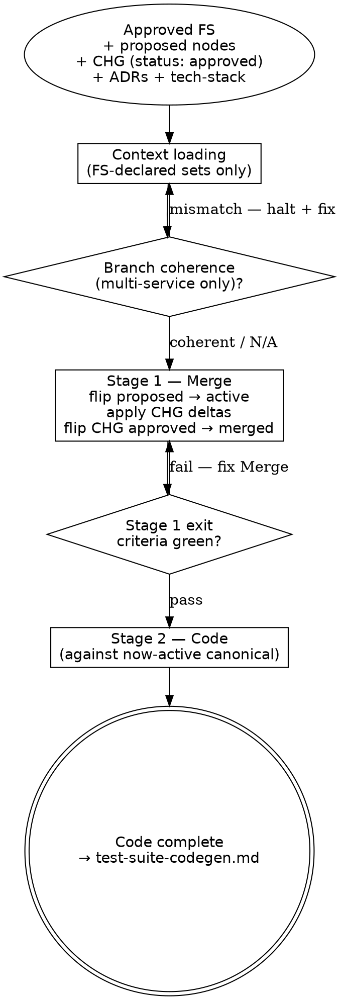

# Implementation Flow

Implementation flow — **applies** the FS's CHG deltas to the canonical
wiki, **flips** the FS's new nodes `proposed → active`, then writes
production code, then runs the QA gate. Part of the workflow defined in
[`../WORKFLOW.md`](../WORKFLOW.md).

**Mode: Merge + Code.** Covers Stage 1 (Merge) and Stage 2 (Code) only. After Stage 2 Code is
complete, **hand off to the QA track** — the QA track is independent of this session. Its second
flow ([`test-suite-codegen.md`](test-suite-codegen.md)) runs in a fresh session after the developer
has resolved selectors against the real DOM; its third flow ([`qa-gate.md`](qa-gate.md)) runs the
QA gate and flips the FS to `implemented`. No shared session, no `/clear` exception — `/clear`
separates this file from each QA-track flow.

"Merge" here is the apply-deltas-and-flip-statuses operation, not a file copy. The new nodes the FS introduced are already
canonical (written at Phase 2 with `status: proposed`); this flow flips
them to `active` and re-syncs each node's per-type `index.md` row Status
column. For each CHG node listed in the FS's `consumes_chgs:` (or
`changes:` for pre-cutover FSs — grandfathered), this flow
applies the CHG's `modifies[]` / `removes[]` / `supersedes[]` deltas to
the canonical targets (re-syncing the affected index rows), then flips
the CHG's status `approved → merged` in place. The CHG file itself stays
at its milestone path — never promoted. Then implements the code that
the now-active canonical nodes describe.

All canonical lifecycle events during implementation (node status flips,
supersession, content updates; ADR status changes) fire the 2-file touch.
The audit trail is the index row's Status column + git history; no
canonical `log.md` (retired 2026-05-16). See
[`maintenance-discipline.md`](maintenance-discipline.md).

> **Core/detail layout.** This is the core file — wholesale-read at Phase 3
> entry. Situational detail lives in [`implementation/`](implementation/)
> detail files, loaded on demand per the
> [Detail files](#detail-files-load-on-demand--not-at-phase-entry) table.
> Every binding gate (HARD-GATE, checklists) is in this file.

<HARD-GATE>
Do NOT begin Stage 2 (Code) until every Stage 1 (Merge) exit criterion is green — every new node flipped `proposed → active`, every CHG delta applied to canonical with the matching per-type `index.md` rows re-synced (including any ADR status changes), every CHG flipped `approved → merged`. Coding against a still-`proposed` node, or against a CHG-targeted canonical node that hasn't yet received its delta, breaks the source-of-truth invariant the Merge stage exists to maintain.
(Cross-cutting rules: see [`../../CLAUDE.md ## Hard rules`](../../CLAUDE.md#hard-rules) — "Tiered touch for canonical edits".)
</HARD-GATE>

---

## Anti-Pattern: "The Shortcut Merge"

Starting Stage 2 code work while one of the Merge bookkeeping touches
is still pending — the canonical node body is correct but the per-type
`index.md` Status column hasn't been re-synced, or the CHG file's
frontmatter still reads `approved`. The temptation: the *behavior* is
right; the index sync feels like ceremony. The cost: the next person
(often future-you) reads the index, sees `proposed`, decides the node
isn't ready, and builds against the wrong assumption. The node touch
is one operation, not a checklist of optional steps. Do not advance to
Stage 2 until every item in the Stage 1 Merge exit checklist is checked. Doctrinal anchor:
[`../PRINCIPLES.md`](../PRINCIPLES.md) — "Silent node or ADR edits"
and "If it can drift, the operation isn't atomic enough."

---

## When to Use

**Use when:** the Plan flow has produced an approved FS with
`merged: false`, every new node it introduced sits in canonical with
`status: proposed`, every CHG sits at `status: approved`, every
`depends_on_specs:` dependency has `merged: true`, and a `/clear` has
happened.

**Do NOT use when:** the FS or any of its dependencies is still in flight
(load [`plan.md`](plan.md)), or the work is a bug fix rather than an
FS-driven slice (load [`bug-fix.md`](bug-fix.md)).

**Vs. sibling files:** [`design.md`](design.md) Queries canonical;
[`plan.md`](plan.md) Ingests new nodes (`status: proposed`); this file
Applies CHG deltas + Flips statuses + Writes code; (QA track flows, independent of this session):
[`test-plan-ingest.md`](test-plan-ingest.md), [`test-suite-codegen.md`](test-suite-codegen.md),
[`qa-gate.md`](qa-gate.md) — Generates test specs from TC files and runs QA gate to flip statuses.

**Prerequisites:**

- An approved Feature Spec at
  `docs/milestones/M-NN-<slug>/specs/FS-NNN-<slug>/FS-NNN.md` with
  `merged: false` in frontmatter. Every new node in the FS's `new_nodes:`
  is already present in canonical `docs/<component>/nodes/<type>/` with
  `status: proposed`. If the FS lists CHGs in `consumes_chgs:`, each
  lives at the milestone-scoped path
  `milestones/M-NN-<slug>/chg/CHG-NNN-<slug>.md` (CR track:
  `docs/change-requests/CR-NNN-<slug>/chg/CHG-NNN-<slug>.md`; pre-cutover
  at `specs/FS-NNN-<slug>/nodes/changes/` is grandfathered) with
  `status: approved`.
- The FS's `depends_on_specs:` list (if any) — every spec in that list must
  already have `merged: true`. If a dependency is unmerged, this FS's Phase 3
  is **blocked** until the dependency merges.
- A context reset has happened between Phase 2 and this flow.
- **(Multi-service only.)** If the FS's `service_repos:` is non-empty,
  every listed repo exists as a clone at its workspace-relative path
  and is on the FS's feature branch (`feat/FS-NNN-<slug>`). Verify with
  `sdlc/scripts/check-branch-coherence.sh path/to/FS-NNN.md` — if any
  repo mismatches, halt Phase 3 until coherent. See
  [Multi-repo Phase 3 model](#multi-repo-phase-3-model) below.

---

## Section routing

Single-service / monolith projects never load
[`implementation/multi-repo.md`](implementation/multi-repo.md) — it covers
branch-coherence and per-SVC stack discipline that only apply when an FS
declares `service_repos:`.

If you've loaded this file for a specific issue mid-flow (rather than
at Phase 3 entry), route by operation:

| Operation | Sections to read |
|---|---|
| Phase 3 entry (first time, monolith) | [Checklist](#checklist) → [Process Flow](#process-flow) → [The Process](#the-process) |
| Phase 3 entry (first time, multi-service) | Same as above + [`implementation/multi-repo.md`](implementation/multi-repo.md) |
| Resume after dependency unblocked | [Stage 1 — Merge](#stage-1--merge) (Step 0 only) |
| Stage 1 merge of new nodes / CHGs | [Stage 1 — Merge](#stage-1--merge) + [Checklist — Stage 1 Merge exit](#checklist--stage-1-merge-exit-before-stage-2) |
| Stage 2 code generation | [Stage 2 — Code](#stage-2--code) (conventions: ADRs / STDs / CCCs) |
| Dispatching per-layer coding sub-agents | [`implementation/stage2-dispatch.md`](implementation/stage2-dispatch.md) |
| Canonical node edit / status flip during Stage 2 | [`implementation/node-sync.md`](implementation/node-sync.md) |
| Task needs research / hits a bug / too big / internal service surfaces | [`implementation/task-patterns.md`](implementation/task-patterns.md) |
| Pre-merge branch check (multi-repo) | [`implementation/multi-repo.md`](implementation/multi-repo.md) |

The **HARD-GATE** callout near the top and
[Anti-Pattern: "The Shortcut Merge"](#anti-pattern-the-shortcut-merge) are
doctrinal — re-read on each new Phase 3 even when routing.

## Detail files (load on demand — not at phase entry)

| When | Load |
|---|---|
| FS's `service_repos:` is non-empty (multi-service) | [`implementation/multi-repo.md`](implementation/multi-repo.md) |
| Dispatching per-layer coding sub-agents | [`implementation/stage2-dispatch.md`](implementation/stage2-dispatch.md) |
| A canonical node / ADR needs an edit or status flip during Stage 2 | [`implementation/node-sync.md`](implementation/node-sync.md) |
| A task hits a non-standard situation (research / bug / too big / new service) | [`implementation/task-patterns.md`](implementation/task-patterns.md) |

---

## Checklist

You MUST complete these in order:

1. Load context (FS-declared sets only — FS, new canonical nodes, CHG files, ADRs, tech-stack)
2. Stage 1 — Merge (flip every new node `proposed → active`, apply CHG deltas to canonical targets, flip every CHG `approved → merged`)
3. Stage 2 — Code (implement against now-active canonical nodes, one cohort at a time, build-validate between cohorts)
4. Hand off to the **QA track** — `test-suite-codegen.md` (fresh session after `/clear`) then `qa-gate.md` (session-shared with codegen per CLAUDE.md HR-CLEAR). Do not load them in this session.

---

## Process Flow



The Stage-1-exit diamond is the canonical instance of this file's
HARD-GATE — Stage 2 does not begin until every Merge entry has fired
correctly. The QA gate (ADR-conformance + tests-green) runs in [`qa-gate.md`](qa-gate.md) as the third
QA-track flow — in its own session, not this one. The FS does not flip to `implemented` until
it passes; milestone close blocks until that flip occurs.

---

## The Process

**Operation:** `implement-feat`
**Inputs:** approved FS, new canonical nodes (status: proposed) listed in
  the FS's `new_nodes:`, CHG nodes (if any) at the milestone path, canonical
  nodes the CHGs target, all ADRs declared in the FS's `adrs:`
**Output:** canonical wiki updated (statuses flipped, CHG deltas applied);
  production code; FS marked `implemented` after QA gate

This flow runs in two stages, in order:

1. **Merge** — flip new nodes `proposed → active`, apply CHG `modifies[]` /
   `removes[]` / `supersedes[]` to canonical targets, re-sync the affected
   per-type `index.md` rows. ("Merge" is the apply-deltas-and-flip-statuses
   operation, not a file copy.)
2. **Code** — implement against the now-active canonical nodes.

After Stage 2 Code is complete, this flow exits. The **QA track** then runs:
`test-suite-codegen.md` (fresh session after `/clear` from this file) followed
by `qa-gate.md` (session-shared with codegen per CLAUDE.md HR-CLEAR). The
FS-to-`implemented` flip happens in `qa-gate.md` once its checks pass —
milestone close depends on that flip, but cadence is up to the QA-track
operator.

Do not skip ahead — coding before the Merge stage applies the CHG deltas defeats the
source-of-truth invariant.

### Context loading (before merging or coding)

Read **only** what the FS declares:

1. Open the FS at
   `docs/milestones/M-NN-<slug>/specs/FS-NNN-<slug>/FS-NNN.md`. Collect:
   `new_nodes:`, `consumes_chgs:` (`changes:` for pre-cutover FSs —
   grandfathered), `adrs:`, `standards:`, `ccc:`, `depends_on_specs:`.
2. Read every new canonical node under `docs/<component>/nodes/<type>/` whose ID
   appears in the FS's `new_nodes:` (all carry `status: proposed`). These
   are the definitions the FS introduces; Phase 3 flips them to `active`.
3. For every CHG-NNN in `consumes_chgs:`, read the CHG file at
   `milestones/M-NN-<slug>/chg/CHG-NNN-<slug>.md` (CR track:
   `docs/change-requests/CR-NNN-<slug>/chg/CHG-NNN-<slug>.md`;
   pre-cutover at `specs/FS-NNN-<slug>/nodes/changes/` is grandfathered).
   Each `modifies[]` entry names a canonical target — read those
   canonical files too. Each `adds[]` entry references a node already in
   `new_nodes:` (already in canonical, status: proposed); no separate
   read needed.
4. Read `docs/<component>/adrs/index.md` — one-line summaries only.
   Narrow-load every ADR declared in the FS's `adrs:` plus any
   convention-tagged ADR the FS missed (surface the gap if you find one,
   update the FS, do not silently load).
4a. Read [`../standards/index.md`](../standards/index.md) and
    [`../../docs/shared/ccc/index.md`](../../docs/shared/ccc/index.md) — one-line
    summaries only, both indexes bounded. Narrow-load every STD declared in the
    FS's `standards:` whose `applies_when.stack:` intersects the FS's `stack:`,
    plus every STD tagged `convention` / `task-ordering` / `code-quality` that
    the FS missed. Narrow-load every CCC declared in `ccc:`; for each CCC, walk
    its Baseline section so Stage 2 Code honors the default unless an ADR
    declares the operation-specific deviation.
5. Read [`../../docs/shared/tech-stack.md`](../../docs/shared/tech-stack.md) wholesale —
   it is the operational baseline that carries pinned stack versions,
   application layout, operational commands (build / run / test /
   migrate), environments, runtime state, and milestone progress. Cited
   ADRs inside each section are routing hints, not a re-load instruction:
   only the ADRs already declared in the FS's `adrs:` get narrow-loaded.
6. Do **not** glob `docs/<component>/nodes/**` or `docs/<component>/adrs/**` wholesale. The FS's
   declared sets are the load.

See [`retrieval-discipline.md`](retrieval-discipline.md) for the underlying
rule.

#### Load-completeness checkpoint (before Stage 1)

Before entering Stage 1 Merge, emit the **Conformance set in scope** to
the session as a named-slot list. Each slot is empty-by-default; an
empty slot is visibly missing in the transcript and forces a re-load
rather than silently passing. Use this exact shape:

```
Conformance set in scope (FS-NNN):
  FS-declared STDs:           [STD-…, STD-…]
  Convention-tagged STDs:     [STD-… (convention), STD-… (task-ordering), STD-… (code-quality)]
  FS-declared ADRs:           [ADR-…, ADR-…]
  Convention-tagged ADRs:     [ADR-… (convention), ADR-… (task-ordering)]
  FS-declared CCCs:           [CCC-…, CCC-…]
```

The convention / task-ordering / code-quality slots are populated by
scanning `sdlc/standards/index.md` and `docs/<component>/adrs/index.md`
for those tag values — they are not optional and not derivable from
the FS's frontmatter alone. A slot left as `[]` is a load gap: either
the index truly has zero tagged artifacts for that slot (rare; record
as `[]` explicitly), or the scan was skipped. The latter is the
failure mode this checkpoint exists to prevent.

The emitted list is the session's evidence of retrieval. The QA gate's
STD-conformance and ADR-conformance dispatches
([`qa-gate.md`](qa-gate.md)) verify the SAME set; a slot that was empty
at Stage 1 and non-empty at QA-gate time is a retrieval-discipline
finding, not a code finding.

---

### Stage 1 — Merge

**Step 0 — Verify dependency ordering** (before any flip or delta application):

1. Read this FS's `depends_on_specs:` frontmatter.
2. For each spec ID in that list, open the spec file and verify its
   frontmatter shows `merged: true`.
3. Halt if any shows `merged: false` — this FS's Phase 3 is blocked until
   those dependencies merge. Do not partial-merge; surface the blocker and
   wait. Resuming in the same session after the dependency merges does
   **not** require a fresh `/clear` if Step 0 was the only step executed.
4. **Reverse-dependent check** (only when retiring or reordering THIS FS):
   glob `depends_on_specs:` across every other FS in the milestone; each
   match identifies a downstream dependent that must be coordinated with
   before this FS's merge state changes. Surface the dependent list — do
   not silently re-order.

For **every new node** in the FS's `new_nodes:` (already at
`docs/<component>/nodes/<type>/<ID>-<slug>.md` with `status: proposed` from Phase 2):

1. **Flip status.** Edit the canonical node's frontmatter:
   `status: proposed → status: active`.
2. **Re-sync the per-type index row** at `docs/<component>/nodes/<type>/index.md`:
   Status column flips from `proposed` to `active`. If the one-line
   summary, tags, or source also changed, sync those too.

   `docs/home.md` is derived from the per-type indexes — it regenerates
   on demand, not per merge.

   No canonical `log.md` entry fires; the index row's Status column
   plus git history are the audit trail. See
   [`maintenance-discipline.md → Rule history`](maintenance-discipline.md#rule-history--canonical-logmd-retired-2026-05-16).

**Cardinality preflight** (per R-CHG-3). Before applying any CHG delta,
glob `consumes_chgs:` across every FS in this milestone — verify each
milestone-scoped CHG appears in exactly one FS's `consumes_chgs:`
(unless flipped to `deprecated` by sibling-CHG fold). Double-consumption
aborts merge.

For **every CHG-NNN** in the FS's `consumes_chgs:` (`changes:` for
pre-cutover FSs):

1. For each entry in the CHG's `adds[]`: the new node is already canonical
   (status flipped to `active` in the loop above) — mark satisfied. The
   `adds[]` field is the audit trail and the source for the
   `supersedes[]` → `adds[]` enforcement below.
2. For each entry in the CHG's `modifies[]`:
   - [ ] Open the canonical target file at `docs/<component>/nodes/<type>/<ID>-<slug>.md`.
   - [ ] Apply the delta described in the CHG's `before → after` summary.
   - [ ] Append a `source_ref` entry `{frs, fs, op: modify}` to the
         canonical node.
   - [ ] Re-sync the canonical node's row in `docs/<component>/nodes/<type>/index.md` if
         the summary, tags, status, or source changed.
3. For each entry in the CHG's `removes[]` or `supersedes[]`: flip the
   canonical node's Status (`active → superseded` or `active → deprecated`)
   and re-sync the per-type index row (move it to the
   Superseded/deprecated section). The CHG file's `before → after`
   summary plus git history are the per-event audit. Any successor IDs
   must already be in the CHG's `adds[]`.

Finally, flip the CHG node itself:

- [ ] In the CHG file at
      `milestones/M-NN-<slug>/chg/CHG-NNN-<slug>.md` (CR track:
      `docs/change-requests/CR-NNN-<slug>/chg/CHG-NNN-<slug>.md`;
      pre-cutover at `specs/FS-NNN-<slug>/nodes/changes/` is
      grandfathered), flip frontmatter `status: approved → status:
      merged`.
- [ ] CHG files stay at the milestone path permanently — they are NOT
      promoted to canonical. No `docs/<component>/nodes/changes/`
      subtree exists; no canonical touch fires against the CHG itself.

The CHG file under the milestone folder is **kept as permanent history.**
Do not delete the CHG file after applying its deltas. The
`status: merged` marker is the signal that the deltas have already been
applied; future readers consult the file as the durable audit trail of
this FS's modifications to canonical.

### Checklist — Stage 1 Merge exit (before Stage 2)

See [Anti-Pattern: "The Shortcut Merge"](#anti-pattern-the-shortcut-merge) above for why every item below is non-optional.

- [ ] Every entry in the FS's `new_nodes:` has had its canonical
      `status` flipped `proposed → active`, and the per-type index row
      Status column re-synced.
- [ ] Every CHG `modifies[]` entry has been applied to its canonical target
      (delta applied, `source_ref` appended, index row re-synced as needed).
- [ ] Every CHG `removes[]` / `supersedes[]` entry has flipped the
      canonical target's Status and moved the index row to the
      Superseded/deprecated section.
- [ ] Every CHG node's frontmatter has been flipped `approved → merged` in
      place at its milestone path.
- [ ] No canonical edits exist outside what the FS's `new_nodes:` or its
      CHGs declared, irrespective of phase.

---

### Stage 2 — Code

Implement against the now-active canonical nodes at `docs/<component>/nodes/<type>/`.
Every node referenced in this Stage carries `status: active` after Stage 1
(or `status: proposed` for a node that hasn't been flipped yet — that is a
Stage 1 bug, not a Stage 2 working state).

**Convention ADRs, STDs, and CCCs to consult during coding.** Stage 2 honors:
- Every ADR in `docs/<component>/adrs/index.md` tagged `convention` (or labelled
  as a project-wide commitment) in addition to the FS's declared `adrs:` set.
- **All `convention` / `task-ordering` / `code-quality` STDs from
  `sdlc/standards/index.md` (currently: STD-002, STD-005, STD-006)** — load
  wholesale at Stage 2 entry via the indexes, in addition to any STDs explicitly
  declared in the FS's `standards:`.
- **Per-layer narrow-load:** when dispatching a coding sub-agent for a layer,
  the sub-agent loads `sdlc/standards/by-layer/<layer>.md` +
  `sdlc/standards/by-layer/cross-cutting.md` — and *only* the STD rules those
  pointer files cite. Routing table:
  [`sdlc/standards/by-layer/index.md`](../standards/by-layer/index.md).
- Every CCC in the FS's `ccc:` set — the Baseline section names the default
  behavior; an operation-specific deviation requires a back-linked ADR (with
  `related: [CCC-NNN]`) already declared in `adrs:`.

Read `sdlc/standards/index.md` and `sdlc/standards/by-layer/index.md` first;
narrow-load individual STD pages and the relevant layer pointer file when
authoring or dispatching code for a layer. The FS's `adrs:` + `standards:`
+ `ccc:` lists together with the convention-tagged ADRs and STDs from the
indexes form the conformance set [`qa-gate.md`](qa-gate.md) verifies.

Cohort ordering inside the FS's Implementation tasks maps to these ADRs —
see
[`plan/fs-authoring.md → Implementation-task cohort ordering`](plan/fs-authoring.md#implementation-task-cohort-ordering)
and the project's `task-ordering`-tagged ADR (look up
`docs/<component>/adrs/index.md`; in the originating project this is APP
`ADR-009-implementation-task-cohort-ordering.md`). When such an ADR
exists, its cohort table is the source of truth for layer order,
per-cohort STD/CCC anchors, and per-cohort parallel-dispatch
eligibility (file-disjoint subagents within a cohort per
[`agent-contracts.md § Dispatch shapes`](agent-contracts.md#dispatch-shapes)).
When the project has not yet authored one, the engine-default Round
structure in
[`implementation/stage2-dispatch.md`](implementation/stage2-dispatch.md)
applies as-is.

**Build validation between cohorts.** After each cohort's code lands,
run your project's build command (declared in
[`../../docs/shared/tech-stack.md § Operational commands`](../../docs/shared/tech-stack.md#3-operational-commands))
for the affected projects (and the host) before moving on. Compilation
failures inside the just-touched cohort are local and fixed in place;
failures in unrelated projects, missing-type errors across cohort
boundaries, or DI-resolution errors at startup indicate the cohort
ordering or dependency declaration is wrong — halt and revisit the FS
task ordering rather than papering over. Cohort C is the canonical
surface for STD-005 R12 violations — rationale in the project's
`task-ordering`-tagged ADR where one exists (originating project: APP
ADR-009 § Rationale).

### Stage 2 Code — per-layer dispatch

→ Load [`implementation/stage2-dispatch.md`](implementation/stage2-dispatch.md)
when dispatching per-layer sub-agents.

**Summary:** dispatch only when the cohort's task rows are mechanically
specified (file path, type name, signatures, CHG refs) — vague rows stay in
the main session. Engine default: Round 1 = Cohort A (shared ∥ domain),
Round 2 = Cohort B (contracts ∥ application), Round 3 = Cohort C
(infrastructure), Cohort D in main session; build-gate after each round;
per-agent writes confined to its ABP project root.

Four disciplines distinguish this from "just write the code":

**Keep canonical nodes in sync.** If implementation reveals that a node was
wrong — missing an invariant, wrong transition, wrong contract — update the
canonical node, not just the code. The knowledge base is only useful if it
stays current with what the code actually does. Each such edit fires an
`updated` entry per [`implementation/node-sync.md`](implementation/node-sync.md).

**Honor the ADRs.** Decisions captured in the FS's declared ADRs (and the
convention-tagged ADRs from the index) are not optional. If an FRS or node
forces a deviation, surface it in the FS's "Architecture decisions" section
first, then **update or supersede the ADR** — do not silently break it. A
deviation that warrants superseding an ADR is itself the moment to author
the successor.

**No silent canonical edits.** Edits to canonical nodes outside the FS's
declared `new_nodes:` or CHG `modifies[]` lists are silent drift,
irrespective of phase — see the
[`in-flight-nodes.md`](in-flight-nodes.md)
clause. If implementation reveals the FS missed a node, update the FS first
(or raise an `OQ-NNN` under `docs/discovery/open-questions/` with
`origin: implementation, origin_ref: FS-NNN, needed_by: <next-FRS>` if
the change is large enough to be a separate FS), then make the canonical
edit.

**Drive each task from a failing check.** Before implementing an FRS
acceptance criterion or Flow scenario, write the test that fails for the
right reason, then make it pass. For non-test-shaped work (e.g., a refactor
governed by an ADR), name the equivalent pre/post check (type-checker green,
lint clean, scenario still passes) before touching code. Solo means there
is no second pair of eyes to tell you when you're done — the failing check
is the signal, and the QA gate's verification checklist in [`qa-gate.md`](qa-gate.md)
is just the aggregate of those per-task checks.

### Exit handoff

Stage 2 Code complete; this flow exits. The **QA track** may now run
[`test-suite-codegen.md`](test-suite-codegen.md) in a fresh session (after `/clear`). The
QA-track operator owns the cadence — informational handoff, not a directive — but milestone
close depends on the QA track's final flow ([`qa-gate.md`](qa-gate.md)) flipping the FS to
`implemented`.

### Node content updates / status transitions (during implementation)

→ Load [`implementation/node-sync.md`](implementation/node-sync.md) when a
canonical node or ADR needs an edit or lifecycle flip during Stage 2.

**Summary:** content edits fire the 2-file node touch (index re-sync only
when summary/tags/source changed); status flips (node or ADR) always fire
the 2-file touch, with terminal statuses moving the index row to the
Superseded/deprecated section; ADR supersession routes to
[`authoring-adr.md`](authoring-adr.md). No silent edits, no silent flips.

### Task-level patterns

→ Load [`implementation/task-patterns.md`](implementation/task-patterns.md)
when a task hits a non-standard situation.

**Summary:** tasks have no node type; the four patterns route to existing
facilities — needs-research → Exploration; adjacent bug → `fix/<slug>`
branch per [`bug-fix.md`](bug-fix.md); too-big → split tasks or raise an
OQ/new FRS; internal-service-surfaces → discriminate on "would another FS
consume it?" (no → internal tasks; yes → new FRS + `depends_on_specs:`).

---

## Common Mistakes

**❌ Starting Stage 2 before all Stage 1 exit checklist items are checked** — the canonical node body may be correct but the per-type `index.md` re-sync is missing; the next reader sees `proposed` and treats the node as unready.
**✅ Complete every item in the Stage 1 Merge exit checklist before writing a single line of production code.**

**❌ Editing a canonical node during Stage 2 without updating the FS's declared sets** — silent drift; index goes stale; the edit has no FS-declared reason.
**✅ If implementation reveals a missed node, update the FS first (or raise an OQ), then make the canonical edit with the 2-file node touch (node + per-type index.md).**

**❌ Drive-by-fixing or refactoring adjacent code discovered while working on an FS task** — scope creep inside the feature branch; untested changes.
**✅ File a separate bug-fix branch per [`bug-fix.md`](bug-fix.md); the FS branch touches only what the FS declares.**

---

## Multi-repo Phase 3 model

→ Load [`implementation/multi-repo.md`](implementation/multi-repo.md) — applies
only when the FS declares non-empty `service_repos:`; monolith projects skip.

**Summary:** service repos are git-ignored clones inside the workspace;
`check-branch-coherence.sh` gates Stage 1 (every repo on `feat/FS-NNN-<slug>`);
Stage 2 code lands in service-repo working trees (workspace `merge_sha:` only);
cross-cutting stack lives in `docs/shared/tech-stack.md`, per-service stack in
each SVC node's `## Stack` section (implicit-by-containment linking).

---

## Integration

- **Required before:** same as all dev-track flows —
  [`../../CLAUDE.md ## Hard rules`](../../CLAUDE.md#hard-rules) (here
  especially: tiered touch, "Existing nodes are authoritative", per-type
  index before globbing), [`../WORKFLOW.md`](../WORKFLOW.md),
  [`../PRINCIPLES.md`](../PRINCIPLES.md) ("Silent node or ADR edits";
  "Editing a canonical node outside an active Phase 3 merge"; "If it can
  drift, the operation isn't atomic enough").
- **Required before (entry):** [`plan.md`](plan.md) — produces the
  approved FS + proposed nodes + approved CHG this flow consumes.
- **Rule books wholesale-read during this flow:**
  [`maintenance-discipline.md`](maintenance-discipline.md) (every
  lifecycle event fired during Stage 1 Merge and the Stage 2 "Keep
  canonical nodes in sync" discipline).
- **Maintenance ops that may fire:**
  [`authoring-adr.md`](authoring-adr.md) (Stage 2 implementation
  forces an ADR supersession).
- **Hands off to (after Stage 2 Code is complete):** the **QA track**, starting at
  [`test-suite-codegen.md`](test-suite-codegen.md) (the QA-track's first applicable flow at this
  point; [`test-plan-ingest.md`](test-plan-ingest.md) may already have run after `plan.md` exit).
  Each QA-track flow runs in its own session — `/clear` between this file and `test-suite-codegen.md`.
- **Sibling flow files (dev track):** [`design.md`](design.md), [`plan.md`](plan.md);
  (bugs) [`bug-fix.md`](bug-fix.md); (QA track) [`test-plan-ingest.md`](test-plan-ingest.md),
  [`test-suite-codegen.md`](test-suite-codegen.md), [`qa-gate.md`](qa-gate.md).
