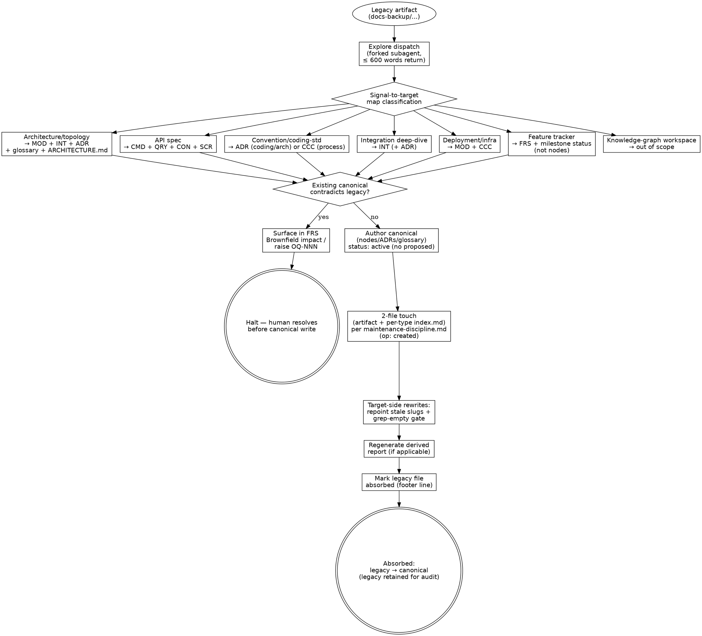

---
applies_when:
  stack: [agnostic]
---

# Legacy absorption

> Operation: `absorb-legacy-doc`. A maintenance activity that ingests
> a legacy document from `docs-backup/` (or any prior-project artifact)
> into the canonical wiki by **classifying** it against a signal-to-target
> map and **routing** its content to canonical nodes, ADRs, and glossary
> terms — never copying the legacy text verbatim. The legacy text is
> source material; canonical is the authority.

> **HARD-GATE:** Do NOT write canonical content from a legacy document
> until the legacy artifact has been classified against the *Signal-to-target
> map* below and the absorbing FRS / OQ has surfaced every conflict
> with an existing canonical node or ADR. Absorbing legacy text into
> canonical without that routing pass produces silent overrides of the
> authoritative source. (Cross-cutting rules:
> [`../../CLAUDE.md ## Hard rules`](../../CLAUDE.md#hard-rules) —
> "Reference, never copy" + "Existing nodes are authoritative";
> [`../PRINCIPLES.md`](../PRINCIPLES.md) — "The legacy KB is a quarry,
> not an authority.")

## When to Use

**Use when:** a legacy artifact in `docs-backup/` (or any prior-project
artifact) needs to be promoted into canonical — an architecture doc,
an API spec, an integration deep-dive, a convention doc, a deployment
doc, a feature tracker. The operation runs as a forked Explore
dispatch (see *Dispatch posture* below); the main session writes
canonical artifacts and fires the 2-file touch (artifact + per-type
`index.md`) on every promoted node, ADR, or CCC.

**Do NOT use when:** the source is a node or ADR already in canonical
(use the standard edit path with [`maintenance-discipline.md`](maintenance-discipline.md)),
or the source is workspace-root user-owned snapshots that your project
has flagged out of scope (see the inventory appendix below).

**Vs. sibling files:** [`authoring-adr.md`](authoring-adr.md) is the
ADR side of the same routing — when the classified target is an ADR,
this file routes the discriminator call into that one.
[`maintenance-discipline.md`](maintenance-discipline.md) governs the
2-file touch that fires on every promoted artifact (node, ADR, or CCC
uniformly).
[`evolving-the-workflow.md`](evolving-the-workflow.md) governs the
extension procedure when absorption exercises a new node type or
report type for the first time.

## Process Flow



The conflict diamond is the **brownfield gate**: every classified
piece of content runs through it before canonical authoring. Surfacing
is the doctrine; silent override is the failure mode this gate exists
to prevent.

## Anti-Pattern: "The Verbatim Import"

Copying a paragraph (or, worse, a whole section) of legacy prose into
a canonical node body or ADR rationale because the legacy text is
"already well-written" or "the words are exactly right." The cost: the
canonical node now restates legacy material verbatim — the two will
drift the moment either side is edited, and the legacy file is no
longer just a quarry but a parallel source of truth that has to be
kept in sync forever. **Legacy is source material, not authority.**
The absorb pass extracts the *structure and behavior* the legacy
document captures and re-authors it against the canonical template;
direct copy-paste from `docs-backup/` into a canonical artifact body
is the smell. If the legacy phrasing is genuinely worth preserving,
quote it in a `> source: docs-backup/<file>.md` callout in the node's
`source_ref` provenance — never in the body proper. Doctrinal anchor:
[`../../CLAUDE.md ## Hard rules`](../../CLAUDE.md#hard-rules) —
"Reference, never copy" + "The legacy KB is a quarry, not an
authority."

## Dispatch posture

This operation is read-heavy and exploratory — textbook forked shape.
Run as `Agent(subagent_type=Explore, prompt=...)` from the main
session rather than executing in main context. Subagent rules per
CLAUDE.md → "Inline subagent dispatch has a fixed contract."

**Return contract:**

```
## Classified artifacts
- <legacy file>: <kind from signal-to-target map>

## Canonical targets to author
- <node IDs / ADR IDs / glossary terms> + rationale

## Conflicts surfaced
- <conflict>: existing <canonical> vs legacy <text> (raise as OQ-NNN)

## ID remaps
- legacy <ID> → canonical <ID>
```

≤ 600 words. Cite by file path; do not restate legacy content. The
subagent surfaces the routing; the main session writes the canonical
artifacts and fires the 2-file touch (artifact + per-type `index.md`)
on each promoted node, ADR, or CCC — those mutations stay in main
context for visibility.

## Signal-to-target map

Classify the legacy artifact, then route its content to the
corresponding canonical targets.

| Legacy artifact kind          | Maps to canonical targets                                                                  |
| ----------------------------- | ------------------------------------------------------------------------------------------ |
| Architecture / topology doc   | MOD nodes + INT nodes + ADRs + glossary terms + a derived `docs/reports/ARCHITECTURE.md` |
| API spec                      | CMD nodes (writes) + QRY nodes (reads) + CON nodes (`protocol: http` routes / event topics / queues) + SCR nodes (UI surfaces)  |
| Convention / coding-standard  | Three-rule routing: architecture/coding-conv → ADR (component-scoped under `docs/<component>/adrs/`, or cross-component under `docs/shared/adrs/`); process-conv → `docs/shared/ccc/` (relevant CCC page); overlap with existing ADRs → footer-link only |
| Integration deep-dive         | INT nodes (one per external system) + ADRs if integration patterns are reusable           |
| Deployment / infra doc        | MOD nodes + `docs/shared/ccc/` updates (see `docs/shared/ccc/index.md` for matching CCC page)                                            |
| Feature tracker / status      | FRS + milestone status updates, not nodes                                                  |
| Knowledge-graph workspace     | Out of scope — separate ontology, do not absorb                                            |

## Per-op invariants

These rules apply to every absorption pass, regardless of which row of
the *Signal-to-target map* the legacy artifact classifies into. The
file-level `> **HARD-GATE:**` at the top of this file is the
non-skippable doctrine; the rules below are the operational invariants
that make the gate enforceable.

- **Surface conflicts, never absorb.** When legacy text contradicts an
  existing canonical node or ADR, flag the conflict in the absorbing
  FRS's "Brownfield impact" section, or raise an `OQ-NNN` under
  [`discovery/open-questions/`](../../docs/discovery/open-questions/)
  with `origin: legacy-absorption, origin_ref: legacy` when no FRS is
  in flight. Canonical wiki + ADRs win; the absorption stops at the
  conflict until the human resolves it.
- **ID collisions resolve upward.** When legacy IDs collide with
  canonical IDs (e.g., legacy `ADR-001-cqrs-without-mediator` vs
  canonical `ADR-001-unified-list-management`), the legacy content
  lands at the next free canonical ID — never overwrite. Record the
  legacy-to-canonical ID remap in the absorbing FRS or in the
  ADR's Revision History.
- **Tiered touch fires at the absorption merge.** Each promoted
  artifact triggers the 2-file touch — artifact file + per-type
  `index.md` — per [`maintenance-discipline.md`](maintenance-discipline.md).
  ADRs use `adrs/index.md`; CCCs use `ccc/index.md`. Absorption is
  Phase-3-equivalent in discipline, not in phase ordering.
- **Absorbed nodes go straight to `status: active`.** The `proposed`
  stage applies only to FS-generated nodes (Phase 2 ingest by an
  unmerged FS); absorption writes canonical with `status: active`
  directly. The legacy content is an existing system's reality being
  made canonical, not design intent awaiting implementation — there is
  no design-to-implementation gap to gate. The operation is described
  as `created` in commit messages (the content is new in canonical
  terms); only the status value differs from the FS-generated path.
- **Derived reports come last.** Absorb to nodes + ADRs + glossary
  first; regenerate the derived report (if any) only after canonical
  coverage is dense enough to support it. A sparse derived report
  signals a wiki gap — fill the wiki, then regenerate.
- **Legacy original stays in `docs-backup/`.** The legacy file is
  the audit trail. Mark it absorbed by adding a footer line:
  `> Absorbed YYYY-MM-DD into: <comma-separated canonical IDs>`.
  Never delete; never overwrite with canonical content.
- **Target-side rewrites are part of the operation.** When an absorption
  renames or renormalizes an artifact (e.g., legacy slug `DEC-RuleActiveOnCreate`
  → canonical `DEC-003`; legacy field schema → canonical frontmatter), every
  node that references the renamed artifact must be rewritten in the same
  operation. Stale slugs surviving in `related:` targets or body prose is
  how brownfield migrations leave enforcement scars. **Gate condition:**
  post-migration `grep -r <legacy-slug> docs/<component>/nodes/` returns empty before
  the absorption commit lands. If the grep is non-empty, the operation is
  incomplete — see `sdlc/PRINCIPLES.md` — *If it can drift, the operation
  isn't atomic enough.*
  
  Worked example of what NOT to do: the 2026-05-13 DEC-001..004 frontmatter
  normalization renamed the legacy slugs to numeric IDs but did not rewrite
  the pointed-at ENT-016 / ENT-017 / STA-006 / STA-007 bodies. Result: legacy
  slugs survive in entity body prose with no hyperlink, and discoverability
  from the entity side collapses. The DEC-009 audit (2026-05-13) surfaced this
  drift as a separate item; the fix is now an explicit gate on every future
  schema renormalization.

## Procedure

1. **Classify** the legacy artifact against the signal-to-target map.
   If it spans multiple kinds (common for big root files like a 227K
   `technical-solution.md`), split the absorption into per-kind
   passes — one pass per target set.
2. **Reserve IDs** by reading each authoritative home — per-type
   `index.md` for nodes; `adrs/index.md` for ADRs (R-NEW-9 amended
   2026-05-17 — `id-claims.md` no longer carries introduce rows; the
   index row created on artifact birth IS the claim). For ADRs the
   collisions rule applies; pick the next free ID from
   `docs/<component>/adrs/index.md`.
3. **Author the canonical artifacts** — nodes via their templates,
   ADRs via [`authoring-adr.md`](authoring-adr.md), glossary terms via
   [`baseline-references.md → Op 1 (Add)`](baseline-references.md#op-1-add).
4. **Fire the 2-file touch** for each canonical artifact landing —
   artifact + per-type `index.md` (nodes use their type folder; ADRs
   use `adrs/index.md`; CCCs use `ccc/index.md`). Commit-message
   operation is `created` (not `updated`) since the absorbed content
   is new in canonical terms.
5. **Generate the derived report** (if applicable) per
   [`derived-reports.md → Procedure on regenerate`](derived-reports.md#procedure-on-regenerate).
6. **Mark the legacy file absorbed.** Add the footer line to
   `docs-backup/<file>.md`.
7. **If the absorption exercises a new node type or coins a new report type,**
   follow the extension procedure in
   [`evolving-the-workflow.md`](evolving-the-workflow.md). Routine
   absorptions (existing types only) don't need any methodology update —
   the per-type `index.md` carries the record.

---

## Appendix: Backup-snapshot inventory

> Captured at the start of the absorption campaign. Fill in once per
> project before the first `absorb-legacy-doc` pass. Goes stale after
> absorption passes land — re-audit before reusing as ground truth.

`docs-backup/` (or your project's equivalent legacy folder) is the
prior-project knowledge base, preserved as source material for the
`absorb-legacy-doc` operation. Quarry, not authority — canonical wiki
+ ADRs are the destination.

**Shape of the backup at audit time:**

> _(Fill in: list document groups with approximate sizes, legacy ADR
> folders with ID-range notes, and any folder that is empty or
> out-of-scope. Example shapes: big root architecture docs, legacy ADR
> folders, conventions/specs/integrations sub-folders, frozen workflow
> docs.)_

**First absorption target:** _(name the first file or folder)_. Expected
canonical output shape (per the signal-to-target map above):

> _(Fill in: estimated node counts by type, ADR count and starting ID,
> glossary terms to land, derived reports to generate.)_

**Workspace-root snapshots out of scope this pass:**

> _(List any user-owned snapshot files deferred until the user confirms
> scope, with approximate sizes and reason for deferral.)_

---

## Integration

- **Required before:** [`../../CLAUDE.md ## Hard rules`](../../CLAUDE.md#hard-rules)
  — "Reference, never copy" and "Existing nodes are authoritative" are
  the doctrinal anchors of this flow's HARD-GATE; "Read the per-type
  `index.md` before globbing" governs the conflict-detection step.
- **Required before:** [`../PRINCIPLES.md`](../PRINCIPLES.md) —
  "The legacy KB is a quarry, not an authority"; "If it can drift, the
  operation isn't atomic enough" (target-side rewrites gate).
- **Required before:** [`../WORKFLOW.md ## Legacy absorption`](../WORKFLOW.md)
  — "Surface conflicts, never absorb" cross-cutting practice and
  brownfield muscle.
- **Rule books wholesale-read during this op:**
  [`maintenance-discipline.md`](maintenance-discipline.md) — fires the
  2-file touch on every promoted artifact (node, ADR, or CCC uniformly;
  `created` op; absorbed nodes go directly to `status: active`, not
  `proposed`).
- **Maintenance ops that may fire as part of this op:**
  [`authoring-adr.md`](authoring-adr.md) (every ADR-classified target
  uses the discriminator + procedure there),
  [`baseline-references.md → Op 1 (Add)`](baseline-references.md#op-1-add)
  (glossary terms),
  [`evolving-the-workflow.md`](evolving-the-workflow.md) (first
  instance of a new node type or new derived-report type),
  [`derived-reports.md → Procedure on regenerate`](derived-reports.md#procedure-on-regenerate)
  (regenerate the derived report once canonical coverage is dense).
- **Sibling rule books:** [`authoring-adr.md`](authoring-adr.md),
  [`maintenance-discipline.md`](maintenance-discipline.md),
  [`evolving-the-workflow.md`](evolving-the-workflow.md),
  [`new-component-bootstrap.md`](new-component-bootstrap.md),
  [`baseline-references.md`](baseline-references.md).
