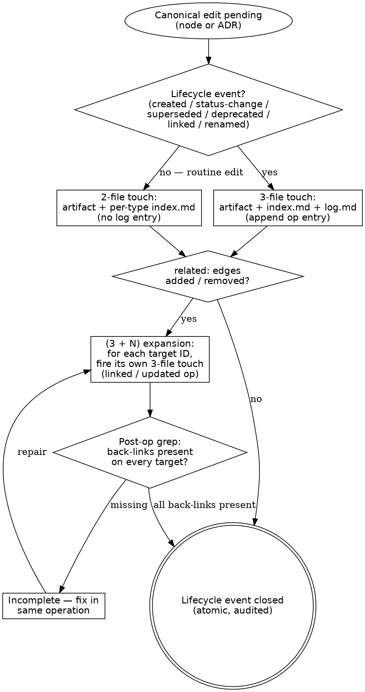

# Maintenance discipline

> Canonical home for the **tiered-touch** rule that fires on every
> lifecycle event in the DDD wiki and the ADR store. Tells you which
> files to touch, in what order, and what log entry to append.

> **HARD-GATE:** Do NOT consider a lifecycle event closed until **every
> required file has been touched in the same atomic operation** — the
> artifact, the per-type `index.md`, the per-type `log.md` (lifecycle
> tier), and every reciprocal `related:` target (`(3 + N)` tier). If
> any one is missing, the event is half-fired and the canonical store
> is silently inconsistent. (Cross-cutting rule:
> [`../../CLAUDE.md ## Hard rules`](../../CLAUDE.md#hard-rules) —
> "Canonical edits use tiered touch".)

## When to Use

**Use when:** any canonical-node or ADR file (`docs/<component>/nodes/<type>/`,
`docs/<component>/adrs/`, `docs/shared/adrs/`) is about to change —
content edit, frontmatter edit, status flip, supersession, link
addition, or initial creation. Load before the edit; the touch fires
as part of the edit, not after.

**Do NOT use when:** the artifact is a milestone-scoped CHG node, an
FRS, an FS, a TC, a discovery surface (OQ / EXP / RESEARCH), or one of
the project-owned baselines (`docs/glossary.md`,
`docs/cross-cutting-concerns.md`, `docs/tech-stack.md`). Those live
under different cadences — see the relevant rule book
([`baseline-references.md`](baseline-references.md) for glossary +
cross-cutting; [`../WORKFLOW.md`](../WORKFLOW.md) for the discovery
surface; [`plan.md`](plan.md) for CHG and FS).

**Vs. sibling files:** [`authoring-adr.md`](authoring-adr.md) /
[`legacy-absorption.md`](legacy-absorption.md) /
[`evolving-the-workflow.md`](evolving-the-workflow.md) /
[`new-component-bootstrap.md`](new-component-bootstrap.md) are the
**callers** that fire the touch as part of their own procedures; this
file is the **rule book** they consult for the file-set and log
format. Every reference to "the 3-file touch" in any other file points
here.

## Process Flow



The two diamonds are sequential and orthogonal: the **tier diamond**
classifies the edit (routine vs. lifecycle, affecting log-entry
emission); the **related-edge diamond** classifies the cross-reference
delta (whether N reciprocal touches are owed). A single edit can be
"routine" *and* still owe the `(3 + N)` expansion if `related:`
changed — though in practice `related:` edits almost always co-occur
with a lifecycle event (`linked`, `updated`, or `created`).

## Anti-Pattern: "The Lightweight Shortcut"

Firing the artifact edit but skipping the `index.md` re-sync, the
`log.md` `created`/`status-change`/`linked` entry, or the reciprocal
`related:` back-link on a target node — because the edit is small,
the operation already feels long, or "the next session will catch it".
The cost: the index goes stale; cross-type retrieval (`Read the per-type
index.md before globbing`, from
[`../../CLAUDE.md ## Hard rules`](../../CLAUDE.md#hard-rules)) returns
the wrong view of canonical; future readers consume the index summary
and write derivative artifacts against the wrong shape. **Half-fired
events are how the corpus drifts silently.** The lightweight option is
the **2-file routine touch** (the tier table below) — not skipping
files inside a 3-file or `(3 + N)` event. Doctrinal anchor:
[`../PRINCIPLES.md`](../PRINCIPLES.md) — *Silent node or ADR edits* and
*If it can drift, the operation isn't atomic enough.*

---

Canonical edits use a **tiered touch**:

- **Routine canonical edit** — **2-file touch**: artifact + per-type `index.md`.
  Triggers: content edits that don't cross a lifecycle threshold; frontmatter field
  updates that don't affect cross-references. No log entry fires.
- **Lifecycle canonical event** — **3-file touch**: artifact + per-type `index.md` +
  per-type `log.md`. Triggers (closed set — see Operation vocabulary):
  `created`, `status-change`, `superseded`, `deprecated`, `linked`.
- **(3 + N) touch** — when `related:` or other bidirectional edges change, the lifecycle
  event escalates to include N reciprocal back-link updates (see Bidirectional-link
  enforcement). The N expansion is orthogonal to the routine/lifecycle tier.

The indexes are a source of truth only as long as nothing slips past them. Routine edits
keep the index current; lifecycle events also append a log entry for chronological audit.

**The tiered touch is event-driven** — it fires at the lifecycle event itself, not at
a fixed phase boundary. Concretely:

- **Phase 2 ingest of a new node** — `created` log entry, new row in the
  per-type `index.md` with Status = `proposed`. The new node is written
  directly to `docs/<component>/nodes/<type>/<ID>-<slug>.md` with `status: proposed`;
  the 3-file lifecycle touch fires immediately.
- **Phase 3 merge of an FS** — for each new node listed in the FS's
  `new_nodes:`, a `status-change` entry fires (`proposed → active`) and
  the index row's Status column flips. For each CHG `modifies[]` entry,
  the delta is applied to the canonical target and an `updated` log entry
  fires; the index row re-syncs if summary/tags/status/source changed.
  For each CHG `removes[]` / `supersedes[]` entry, a `status-change` or
  `superseded` log entry fires on the canonical target and the index row
  is moved to the Superseded/deprecated section.
- **Brownfield absorption** — absorbed nodes go straight to
  `status: active` with a `created` log entry; the `proposed` stage
  applies only to FS-generated nodes. See
  [`legacy-absorption.md`](legacy-absorption.md).
- **FS abandonment** — each `proposed` new node in the abandoned FS flips
  to `deprecated`; a `status-change` log entry fires (body notes
  "FS-NNN abandoned"); the index row moves to Superseded/deprecated.
  Files are never deleted (append-only log integrity); IDs are not reused.

CHG nodes are milestone-scoped — they live permanently at
`milestones/M-NN-<slug>/specs/FS-NNN-<slug>/nodes/changes/CHG-NNN-<slug>.md`
and never participate in the canonical tiered touch. There is no
canonical `docs/<component>/nodes/changes/` subtree. The CHG's own status lifecycle
(`draft → approved → merged`) is in-place edits to its frontmatter at
the milestone path.

The master catalog [`docs/home.md`](../home.md) is **derived**, not
hand-maintained per event. Its node-type and ADR tables regenerate on
demand from the per-type indexes (`docs/<component>/nodes/<type>/index.md` and
`docs/<component>/adrs/index.md`) — same treatment as the derived
reports at `reports/` (see
[`derived-reports.md`](derived-reports.md) for the parallel procedure).
The Planning Artifacts section in `home.md` (milestones, FRSs, feature
specs, discovery) stays hand-maintained until per-type indexes exist for
those artifacts.

## Files to touch on a canonical node lifecycle event

For **lifecycle events** (see tier table above), the base is the **3-file
lifecycle touch**. Routine edits use only the first two files (no log entry).
When the event involves `related:` declarations, it becomes a **(3 + N) touch** —
see *Bidirectional-link enforcement* below. A separate optional touch
on [`../../docs/tech-stack.md`](../../docs/tech-stack.md) fires at the
same Phase 3 merge whenever stack versions, application layout,
operational commands, environments, runtime state, or milestone progress
moved — see *Tech-stack touch at merge* below. The tech-stack touch is
**not** triggered by individual node lifecycle events; it tracks
project-level operational state, not behavioral content.

1. **The node file itself** — `docs/<component>/nodes/<type>/<ID>-<slug>.md`
   (e.g., `docs/<component>/nodes/flows/<ID>-<slug>.md` or
   `docs/<component>/nodes/contracts/<PREFIX>-CON-NNN-<slug>.md` — see
   `docs/project.md § Components` for component slugs and prefixes).
2. **The per-type index** — `docs/<component>/nodes/<type>/index.md`. Add or update one
   row (ID, one-line summary, tags, source, status). Create the file from
   [`_templates/INDEX.md`](../_templates/INDEX.md) if this is the first node
   of the type.
3. **The per-type log** — `docs/<component>/nodes/<type>/log.md`. Append one entry in the
   format below. Create from [`_templates/LOG.md`](../_templates/LOG.md) if
   first node of the type.
4. **Each `related:` target** — for every node ID declared in the page's
   `related:` frontmatter, update the target node's `related:` to carry the
   reciprocal back-link. See *Bidirectional-link enforcement* below.

## Bidirectional-link enforcement

`related:` declarations are bidirectional contracts. When a node's
`related:` lists targets `[X, Y, Z]`, the targets MUST carry the reciprocal
back-link in **the same atomic operation**. The base 3-file lifecycle touch
becomes `(3 + N)` where N is the number of `related:` targets.

**Concrete steps when `related:` changes on node A:**

1. For each ID added to A's `related:`: open the target node file, add A
   to its `related:` if absent. If the target is a legacy-schema node
   without a `related:` field, add the field.
2. For each ID removed from A's `related:`: open the target node, remove A
   from its `related:`.
3. Each touched target node fires its own 3-file lifecycle touch (target file +
   target's per-type index + target's per-type log), with the log entry
   operation `linked` (added) or `updated` (removed).
4. **Post-op gate**: grep the target files for the back-reference; if
   missing, the operation is incomplete.

**Inline DECs and `related:` — exception**: an inline DEC's effective
`related:` is implicit (the host node, plus any node IDs cited in the
inline block's body). Cited node IDs do not require reciprocal back-links;
the host node carries the citation as natural prose. If reciprocal linking
becomes desirable, promote inline → standalone (the scope expansion is the
trigger).

**Why this rule exists**: silent half-linkage produced the legacy slug
residue and missing ENT-side back-links surfaced in the 2026-05-13 DEC
audit. See `sdlc/PRINCIPLES.md` — *If it can drift, the operation isn't
atomic enough.*

## Tech-stack touch at merge

[`../../docs/tech-stack.md`](../../docs/tech-stack.md) is the project's
operational baseline (versions, layout, operational commands,
environments, runtime state, milestone progress). It is **not** a
canonical node and does **not** participate in the per-type tiered touch —
its update cadence is coarser and
project-level.

At Phase 3 merge, ask:

1. Did this merge change any pinned stack version? (new dependency,
   version bump, removed component)
2. Did this merge add / remove / rename projects in the application
   layout?
3. Did this merge change build / run / test / migrate commands?
4. Did this merge introduce a new environment or change an endpoint?
5. Did this merge land a new database migration (business or workflow
   schema)?
6. Did this merge change the milestone's `FS merged` count or status?
7. Did this merge create a new release tag or change `Current branch`?

If **any** answer is yes, update the affected section of
`docs/tech-stack.md` in the same merge. No log entry, no per-type
index re-sync — the file is its own source of truth and carries no
companion `log.md`. If every answer is no, no touch is required;
silence is correct.

Decisions about the stack (a new component adopted, an existing
component replaced, an environment topology rethought) still author an
ADR — `docs/tech-stack.md` is updated **after** the ADR lands and
points to it from the affected row.

## Promoting an inline DEC to standalone

When an inline DEC trips a standalone-trigger (see
[`authoring-adr.md → Inline vs standalone DEC`](authoring-adr.md#inline-vs-standalone-dec-sub-discriminator)),
the promotion procedure:

1. **Allocate** the next free `DEC-NNN` ID from
   `docs/<component>/nodes/decisions/index.md` (e.g.,
   `docs/app/nodes/decisions/index.md`).
2. **Create** the standalone file `docs/<component>/nodes/decisions/DEC-NNN-<slug>.md`
   from [`../_templates/nodes/DECISION.md`](../_templates/nodes/DECISION.md).
   Move the inline body content into the new file's body sections. Populate
   `related:` with every node ID the decision shapes.
3. **Fire the 3-file lifecycle touch** on the standalone DEC: file +
   decisions/index.md + decisions/log.md. Log entry operation: `created`;
   body notes "promoted from inline DEC in <host-node-ID>".
4. **Replace the inline section** in the host node with a one-line link:
   `> See [DEC-NNN — <title>](../decisions/DEC-NNN-<slug>.md).` Append a
   `updated` log entry to the host node's per-type log.
5. **Fire bidirectional-link enforcement** for the new standalone DEC's
   `related:` — every target node carries a back-link to the new DEC.

Same operation, same commit. Inline → standalone is not a multi-step
spread.

## Files to touch on an ADR lifecycle event

1. **The ADR file itself** — `docs/<component>/adrs/ADR-NNN-<slug>.md`
   (e.g., `docs/<component>/adrs/ADR-001-<slug>.md` — see `docs/project.md § Components`
   for each component's ADR range).
2. **The ADR index** — `docs/<component>/adrs/index.md`. Add the row to
   Active, or move it to Superseded/deprecated. Use the ADR discriminator in
   [`authoring-adr.md`](authoring-adr.md) to determine whether the ADR belongs
   to a specific component or `docs/shared/adrs/`.
3. **The ADR log** — `docs/<component>/adrs/log.md`. Append one entry.

## Log entry format

Single-line, always:

```
## [YYYY-MM-DD] <op> | <node-id> — <one-line note>
```

Examples:

```
## [2026-05-13] created | ENT-042 — order line aggregate per FRS-018
## [2026-05-15] superseded | ENT-005 — folded into ENT-042 via CHG-009
## [2026-06-02] updated | FLW-007 — added fault scenario per bug-fix
```

Parseable via `grep "^## \[" log.md | tail -5`.

**This format applies prospectively.** Existing multi-line log entries in the
corpus are not retroactively rewritten — they describe what happened on a given
date and remain authoritative as written.

## Operation vocabulary (closed set)

Active operations (fire log entries today):

- `created` — new page landed.
- `updated` — significant content edit. Routine typos skipped.
- `status-change` — `proposed → accepted`, `active → superseded`, etc. Body
  notes old and new status.
- `superseded` — superseded by another ID. Body names the superseder.
- `deprecated` — no longer authoritative, no successor.
- `linked` — a new FRS or FS started consuming the page (back-link landed
  via `adrs:` or `source_ref`).
- `renamed` — fires when an ID prefix or core identity changes
  (precedent: EP → CON, 2026-05-14). Body names the old and new IDs;
  the page itself moves to the new prefix/folder.

Reserved operations (named in the vocabulary but not yet fired — deferred per §6
of the MVS execution plan):

- `merged-into` — fires when CHG `merges[]` op lands (deferred).
- `derived-genesis` — fires when CHG `derives[]` op lands (deferred).

## Discovery surface discipline

The discovery surface (`docs/discovery/`) is working notes, not canonical
wiki. Lighter discipline applies:

- **Routine edit** — **1-file touch** (the discovery artifact only). No index update,
  no log entry.
- **Terminal lifecycle event** (`adopted`, `rejected`, `merged`, `done`, `fixed`,
  `escalated`) — **2-file touch** (artifact + `docs/discovery/<type>/index.md` if one
  exists). No log.md for the discovery surface — git history + the index's status column
  are the audit trail.
- No bidirectional `related:` enforcement on discovery artifacts — loose linking is fine
  for working notes.

## Cross-type supersession (ADR ↔ DEC)

When a DEC is promoted to an ADR (or, rarely, an ADR is demoted to a
DEC) because the original classification was wrong from the start, the
supersession spans two type folders. Each side fires its own 3-file lifecycle
touch:

- The ADR side: ADR file + `docs/<component>/adrs/index.md` + `docs/<component>/adrs/log.md`.
  Use `created` for the new ADR (body of the log entry names the
  superseded DEC).
- The DEC side: DEC file + `docs/<component>/nodes/decisions/index.md` (move row
  from Active to Superseded/deprecated) + `docs/<component>/nodes/decisions/log.md`
  (use `status-change` op; body names the superseding ADR).

Frontmatter wiring is the same as same-type supersession: the new
artifact's `supersedes:` holds the old ID; the old artifact's
`superseded_by:` holds the new ID. The fields accept either prefix.
See [`authoring-adr.md → Cross-type supersession`](authoring-adr.md#cross-type-supersession-adr-supersedes-dec-or-vice-versa)
for the editorial procedure. Precedent: ADR-029 supersedes DEC-009
(2026-05-13).

## Node versioning — `version: N`

All canonical DDD node templates (ACT, ENT, CMD, QRY, FLW, STA, DEC, INT,
MOD, SCR, CON, PERM, SVC, FA) carry a `version: N` integer in
frontmatter, starting at `1` on creation. The field tracks revision
activity orthogonal to status — its job is to make stale cross-references
auditable.

**Bump rule (mechanical, not a judgment call).**

- **Bump** on any **content edit that changes the node's semantic
  content for a consumer**: body invariant/field/scenario changes;
  frontmatter field changes that affect cross-references (`related:`,
  `invokes:`, `contains:`, `consumed_by_services:`, etc.); changes to
  a node's discriminator fields (`kind:`, `protocol:`).
- **Do not bump** on:
  - `status:` flips (`proposed → active`, `active → superseded`,
    `active → deprecated`). Status is orthogonal to revision.
  - Pure typo / pure formatting / whitespace edits that don't change
    semantics.
  - Date-only field updates (`updated:`).
  - Log-entry append.
- Bumps land **in the same edit** that makes the substantive change —
  not in a separate touch pass.
- `updated:` (date) and `version:` (revision count) are kept; they
  answer different questions ("when" vs "how many revisions").

**Cross-reference syntax (optional, opt-in).** Stability-sensitive
references can pin to a version:

```
ref: ENT-007@v3            # in inline prose
related: [ENT-007@v3]      # in frontmatter when pinning matters
```

Unversioned cross-refs (`ENT-007`) continue to mean "current head of
that node" — the default. Pinning is for cases like "the FRS depended
on ENT-007 as of v3 — if it's moved on, surface that," and gets the
stale-version lint pass below.

**Lint surface and pre-commit advisory.** See [`lint.md → stale-version-ref`](lint.md#stale-version-ref) for how stale pinned cross-references are detected and the pre-commit advisory script.

**ADRs / FRSs / FSs do not carry `version:`.** ADRs have their own
lifecycle (`proposed → accepted → deprecated | superseded`); FRSs and
FSs are planning artifacts whose revisions live in git history and in
the `status:` field. The version field is specifically for the
canonical DDD wiki where stable cross-references matter most.

Source: `sdlc-framework-refinement-v3.md` Δ6 + Δ12 (open-item
discriminator: "would the edit change the node's semantic content for
a consumer?" — codified here).

## Append-only, oldest first

Never edit or reorder existing log entries — they describe what happened on a
given date. New entries go at the **bottom** of the file. One commit covering
several lifecycle changes produces several entries, one per change.

## Lazy creation

`docs/<component>/nodes/<type>/` folders do not exist until the first node of the type
lands. When that happens, the same commit that creates the node also creates
`<type>/index.md` and `<type>/log.md` from the templates. After that, both
files grow with every subsequent event in the type.

## Light-touch fallback (if discipline proves too heavy)

The tier model above (routine 2-file, lifecycle 3-file) is the default
lightening — routine edits no longer require a log entry. If even the
lifecycle 3-file touch proves too heavy in practice, the next fallback is
to keep `adrs/log.md` only and drop per-type node logs entirely — make the
call explicitly; don't let it erode by drift. Per-type `index.md` and the
derived `home.md` still close the silent-drift gap even without node logs.

---

## Integration

- **Required before:** [`../../CLAUDE.md ## Hard rules`](../../CLAUDE.md#hard-rules)
  — "Canonical edits use tiered touch" is the doctrinal anchor; this
  file is its procedural detail.
- **Required before:** [`../PRINCIPLES.md`](../PRINCIPLES.md) —
  "Silent node or ADR edits" and "If it can drift, the operation isn't
  atomic enough" are the named anti-patterns this rule book prevents.
- **Required before:** [`../BOUNDARY.md ## Engine-vs-project axis`](../BOUNDARY.md#engine-vs-project-axis)
  — canonical home for the four status vocabularies (node / ADR / FRS
  / OQ) that the `status-change` op references.
- **Callers (this file is wholesale-read by):**
  [`plan.md`](plan.md) (3-file lifecycle touch on every new node's
  `created` event; `(3 + N)` when `related:` lands),
  [`implementation.md`](implementation.md) (`status-change`
  `proposed → active` on every new node at FS merge; `updated` /
  `superseded` / `deprecated` for every CHG `modifies[]` / `removes[]`
  / `supersedes[]` entry),
  [`bug-fix.md`](bug-fix.md) (`updated` on the canonical FLW when
  bug-fix path edits it),
  [`legacy-absorption.md`](legacy-absorption.md) (`created` on every
  promoted node + ADR; absorbed nodes go directly to `status: active`),
  [`authoring-adr.md`](authoring-adr.md) (`created` / `linked` /
  `superseded` / `status-change` on every ADR lifecycle event),
  [`new-component-bootstrap.md`](new-component-bootstrap.md) (lazy
  `index.md` / `log.md` creation on first node of a type for a new
  component).
- **Sibling rule books:**
  [`legacy-absorption.md`](legacy-absorption.md),
  [`authoring-adr.md`](authoring-adr.md),
  [`evolving-the-workflow.md`](evolving-the-workflow.md),
  [`new-component-bootstrap.md`](new-component-bootstrap.md),
  [`baseline-references.md`](baseline-references.md).
