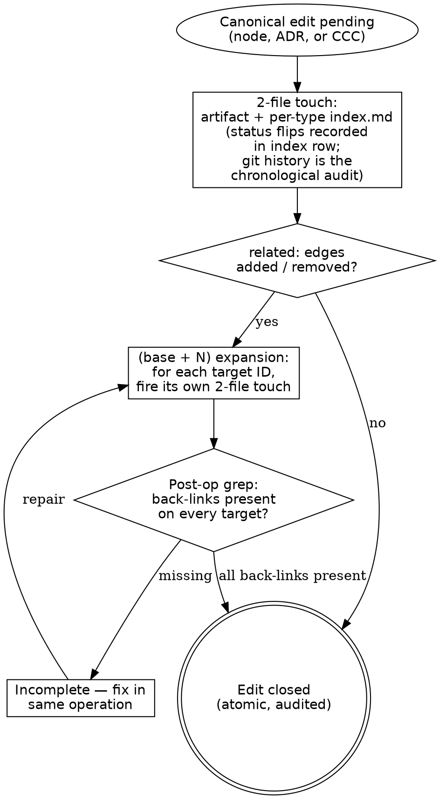

# Maintenance discipline

> Canonical home for the **tiered-touch** rule that fires on every
> lifecycle event in the DDD wiki, the ADR store, and the CCC store.
> Tells you which files to touch and in what order. All canonical
> artifacts (node, ADR, CCC) now use the **2-file touch**; the per-type
> `log.md` companion was retired on 2026-05-16 — see *Rule history* below.

> **HARD-GATE:** Do NOT consider an edit closed until **every required file
> has been touched in the same atomic operation** — the artifact, the
> per-type `index.md`, and every reciprocal `related:` target
> (`(base + N)` expansion). If any one is missing, the event is half-fired
> and the canonical store is silently inconsistent. (Cross-cutting rule:
> [`../../CLAUDE.md ## Hard rules`](../../CLAUDE.md#hard-rules) —
> "Tiered touch for canonical edits".)

## When to Use

**Use when:** any canonical-node, ADR, or CCC file (`docs/<component>/nodes/<type>/`,
`docs/<component>/adrs/`, `docs/shared/adrs/`, `docs/shared/ccc/`) is about to change —
content edit, frontmatter edit, status flip, supersession, link
addition, or initial creation. Load before the edit; the touch fires
as part of the edit, not after.

**Do NOT use when:** the artifact is a milestone-scoped CHG node, an
FRS, an FS, a TC, a discovery surface (OQ / EXP / RESEARCH), or one of
the project-owned baselines (`docs/shared/glossary.md`,
`docs/shared/tech-stack.md`). Those live under different cadences — see
the relevant rule book ([`baseline-references.md`](baseline-references.md)
for glossary; [`../WORKFLOW.md`](../WORKFLOW.md) for the discovery surface;
[`plan.md`](plan.md) for CHG and FS). Note: `docs/shared/cross-cutting-concerns.md`
is retired; individual CCC-NNN artifacts under `docs/shared/ccc/` are
first-class and **do** fall under this rule.

**Vs. sibling files:** [`authoring-adr.md`](authoring-adr.md) /
[`legacy-absorption.md`](legacy-absorption.md) /
[`evolving-the-workflow.md`](evolving-the-workflow.md) /
[`new-component-bootstrap.md`](new-component-bootstrap.md) are the
**callers** that fire the touch as part of their own procedures; this
file is the **rule book** they consult for the file-set. Every
reference to "the 2-file touch" in any other file points here.

## Section routing

If you've loaded this file for a specific operation, read the linked
section only. The first-time reader should also read
[Process Flow](#process-flow) and
[Anti-Pattern: "The Lightweight Shortcut"](#anti-pattern-the-lightweight-shortcut) —
those carry the doctrinal frame the per-op sections assume.

| Operation | Sections to read |
|---|---|
| Canonical node edit (any) | [Files to touch on a canonical node edit](#files-to-touch-on-a-canonical-node-edit) |
| Node `related:` add / remove | + [Bidirectional-link enforcement](#bidirectional-link-enforcement) |
| Node semantic content change | + [Node versioning — `version: N`](#node-versioning--version-n) |
| Phase 1.5 round-trip body edit on Phase-1-born FLW / ACT | [Phase 1.5 round-trip body-edit exception](#phase-15-round-trip-body-edit-exception) |
| ADR edit (any) | [Files to touch on an ADR edit](#files-to-touch-on-an-adr-edit) |
| CCC edit (any) | [Files to touch on a CCC edit](#files-to-touch-on-a-ccc-edit) |
| Promote inline DEC → standalone | [Promoting an inline DEC to standalone](#promoting-an-inline-dec-to-standalone) |
| Cross-type supersession (ADR ↔ DEC) | [Cross-type supersession (ADR ↔ DEC)](#cross-type-supersession-adr--dec) |
| Tech-stack version / command change | [Tech-stack touch at merge](#tech-stack-touch-at-merge) |
| Discovery-surface artifact edit | [Discovery surface discipline](#discovery-surface-discipline) |
| First node of a new type | [Lazy creation](#lazy-creation) |
| Lifecycle vocabulary in prose / `status:` | [Operation vocabulary](#operation-vocabulary-closed-set) |

If your operation is not in the table or you are unsure, read the full
file. The type-split touch summary between the anti-pattern and the
per-op sections carries shared invariants — skim once per session.

## Process Flow



All canonical artifacts fire the same **2-file touch** (artifact + per-type
`index.md`). The single remaining diamond — the **related-edge diamond** —
classifies the cross-reference delta and decides whether N reciprocal touches
are owed via the `(base + N)` expansion.

## Anti-Pattern: "The Lightweight Shortcut"

Firing the artifact edit but skipping the `index.md` re-sync, or the
reciprocal `related:` back-link on a target — because the edit is small, the
operation already feels long, or "the next session will catch it".
The cost: the index goes stale; cross-type retrieval (`Read the per-type
index.md before globbing`, from
[`../../CLAUDE.md ## Hard rules`](../../CLAUDE.md#hard-rules)) returns
the wrong view of canonical; future readers consume the index summary
and write derivative artifacts against the wrong shape. **Half-fired
events are how the corpus drifts silently.** Doctrinal anchor:
[`../PRINCIPLES.md`](../PRINCIPLES.md) — *Silent node or ADR edits* and
*If it can drift, the operation isn't atomic enough.*

---

Canonical edits use the **2-file touch**:

- **Canonical node edit** — node artifact + per-type `index.md`. Applies to
  every node edit, whether routine (content, frontmatter) or lifecycle
  (`created`, `status-change`, `superseded`, `deprecated`, `linked`,
  `renamed`). Status flips and supersession are recorded by re-syncing the
  index row's Status column.
- **ADR edit** — ADR artifact + `adrs/index.md`. Applies to every ADR edit,
  routine or lifecycle. Lifecycle transitions re-sync the row's Status column
  and move the row to Active or Superseded/deprecated as appropriate.
- **CCC edit** — CCC artifact + `ccc/index.md`. Same shape as ADR. CCCs are
  always under `docs/shared/ccc/` — there is no component-scoped CCC path.
- **(base + N) touch** — when `related:` or other bidirectional edges change,
  the touch escalates to include N reciprocal back-link updates (see
  Bidirectional-link enforcement). Each target fires its own 2-file touch.

The indexes are a source of truth only as long as nothing slips past them.
Chronological audit for any canonical artifact: git history of the artifact
and its `index.md` row. There is no per-type `log.md` companion for nodes,
ADRs, or CCCs — see *Rule history* below.

**The touch is event-driven** — it fires at each edit, not at a fixed phase
boundary. Concretely:

- **Phase 1 ingest of a Phase-1-born FLW or ACT** (per R-NEW-1) — new row
  in `nodes/flows/index.md` (for FLW) or `nodes/actors/index.md` (for
  ACT) with Status = `proposed`. The new node is written directly to
  `docs/<component>/nodes/<type>/<ID>-<slug>.md` with `status: proposed`
  and a Phase-1-bare body shape (per R-NEW-2 / R-NEW-2a — see
  [`in-flight-nodes.md → FLW lifecycle`](in-flight-nodes.md)). The 2-file
  node touch fires immediately. When a single FRS births both a FLW and
  an ACT, that is **two independent 2-file touches** in the same
  authoring session — they do not compound.
- **Phase 1 birth of a Phase-1-born CHG** (per R-CHG-1) — when the FRS's
  `touches_nodes:` is non-empty, the CHG file is written to
  `milestones/M-NN-<slug>/chg/CHG-NNN-<slug>.md` (CR track:
  `docs/change-requests/CR-NNN-<slug>/chg/CHG-NNN-<slug>.md`) with
  `status: draft` and a Phase-1-bare body shape (behavior-language
  `modifies[]` only — see [`in-flight-nodes.md → CHG mechanics`](in-flight-nodes.md#chg-mechanics)).
  The touch is **1-file** because CHG has no per-type `index.md`
  companion today (see **CHG `index.md` gap** in the round-trip
  exception below). This is independent from any FLW / ACT birth in the
  same session — touches do not compound across artifact types.
- **Phase 1.5 round-trip body edit** on a Phase-1-born FLW or ACT — see
  [Phase 1.5 round-trip body-edit exception](#phase-15-round-trip-body-edit-exception)
  below. This is the framework's first and only carve-out to the
  universal 2-file rule; the scope is tight and the rule is not
  generalizable.
- **Phase 2 enrichment of a Phase-1-born FLW or ACT** — same file edited
  in place, body content added (Sequence / Branches / Compensating /
  Postconditions / Decisions on FLW; Commands triggered / Queries issued /
  PERM-NNN refs on ACT), `related:` populated, `status:` unchanged
  (`proposed`). The 2-file node touch fires because frontmatter `updated:`
  and the body change are non-trivial; the index row's Status column
  stays `proposed`. Plus the `(base + N)` expansion fires because
  `related:` just transitioned `[] → [...]`.
- **Phase 2 ingest of a new Phase-2-born node** (ENT / CMD / STA / CON /
  INT / DEC / PERM / QRY) — new row in the per-type `index.md` with
  Status = `proposed`. The new node is written directly to
  `docs/<component>/nodes/<type>/<ID>-<slug>.md` with `status: proposed`;
  the 2-file node touch fires immediately. ADR `created` events fire the
  same 2-file touch on the ADR store.
- **Phase 3 merge of an FS** — for each new node listed in the FS's
  `new_nodes:`, the canonical node's frontmatter flips
  `proposed → active` and the index row's Status column re-syncs. For
  each CHG `modifies[]` entry, the delta is applied to the canonical
  target and the index row re-syncs if summary/tags/status/source
  changed. For each CHG `removes[]` / `supersedes[]` entry, the canonical
  target's Status column flips (`superseded` or `deprecated`) and the
  index row moves to the Superseded/deprecated section.
- **Brownfield absorption** — absorbed nodes go straight to
  `status: active`; the `proposed` stage applies only to FS-generated
  nodes. See [`legacy-absorption.md`](legacy-absorption.md).
- **FS abandonment** — each `proposed` new node in the abandoned FS flips
  to `deprecated`; the index row moves to Superseded/deprecated. Files are
  never deleted; IDs are not reused.

CHG nodes are milestone-scoped — they live permanently at
`milestones/M-NN-<slug>/chg/CHG-NNN-<slug>.md` (CR track:
`docs/change-requests/CR-NNN-<slug>/chg/CHG-NNN-<slug>.md`) and never
participate in the canonical tiered touch. There is no canonical
`docs/<component>/nodes/changes/` subtree. CHG births at Phase 1 by the
FRS (R-CHG-1) when `touches_nodes:` is non-empty; the touch is 1-file on
the CHG file (no per-type `index.md` today — see **CHG `index.md` gap**
below). CHG status lifecycle (`draft → approved → merged`, plus
`draft → deprecated` for sibling-CHG fold / abandonment) is in-place
edits to its frontmatter at the milestone path. Pre-cutover CHGs at
`specs/FS-NNN-<slug>/nodes/changes/` are grandfathered and stay where
they are.

The master catalog [`docs/home.md`](../home.md) is **derived**, not
hand-maintained per event. Its node-type and ADR tables regenerate on
demand from the per-type indexes (`docs/<component>/nodes/<type>/index.md` and
`docs/<component>/adrs/index.md`) — same treatment as the derived
reports at `reports/` (see
[`derived-reports.md`](derived-reports.md) for the parallel procedure).
The Planning Artifacts section in `home.md` (milestones, FRSs, feature
specs, discovery) stays hand-maintained until per-type indexes exist for
those artifacts.

## Files to touch on a canonical node edit

Every canonical node edit — content change, frontmatter update, status flip,
supersession, or initial creation — fires the **2-file node touch**. When the
edit involves `related:` declarations, it becomes a **(2 + N) touch** — see
*Bidirectional-link enforcement* below. A separate optional touch on
[`../../docs/shared/tech-stack.md`](../../docs/shared/tech-stack.md) fires at the same Phase 3
merge whenever stack versions, application layout, operational commands,
environments, runtime state, or milestone progress moved — see *Tech-stack
touch at merge* below. The tech-stack touch is **not** triggered by individual
node lifecycle events; it tracks project-level operational state, not
behavioral content.

1. **The node file itself** — `docs/<component>/nodes/<type>/<ID>-<slug>.md`
   (e.g., `docs/<component>/nodes/flows/<ID>-<slug>.md` or
   `docs/<component>/nodes/contracts/<PREFIX>-CON-NNN-<slug>.md` — see
   `docs/project.md § Components` for component slugs and prefixes).
2. **The per-type index** — `docs/<component>/nodes/<type>/index.md`. Add or update one
   row (ID, one-line summary, tags, source, status). Status flips
   (`proposed → active`, `active → superseded`, `active → deprecated`) are
   recorded by re-syncing the row's Status column and, for terminal
   transitions, moving the row to the Superseded/deprecated section.
   Create the file from [`_templates/INDEX.md`](../_templates/INDEX.md) if
   this is the first node of the type.
3. **Each `related:` target** — for every node ID declared in the page's
   `related:` frontmatter, update the target node's `related:` to carry the
   reciprocal back-link. See *Bidirectional-link enforcement* below.

Node lifecycle events (`created`, `status-change`, `superseded`,
`deprecated`, `linked`, `renamed`) are captured by the index row's Status
column and git history — there is no companion `log.md`. See *Rule history*
below for the consolidation date.

## Phase 1.5 round-trip body-edit exception

A doctrinal carve-out (per R-NEW-7 / B3, 2026-05-17; extended to CHG per
R-CHG-1..7) to the universal 2-file touch rule. Tightly scoped. **The
framework's first exception to the universal 2-file rule.**

**Trigger.** A Phase 1.5 round-trip on a Phase-1-born FLW, ACT, or CHG,
where the revision is body-only and the artifact's `status:` stays
unchanged (FLW / ACT: `proposed`; CHG: `draft`).

**Action.** 1-file touch — edit the artifact body only. The per-type
`index.md` is NOT re-synced (Status column unchanged; Title / Description
columns are frontmatter-sourced, also unchanged). The artifact's
`updated:` frontmatter timestamp DOES fire — it carries the revision
date. For CHG specifically: CHG has no per-type `index.md` today (see
**CHG index.md gap** note below); the touch is naturally 1-file
regardless of carve-out, but the carve-out logic still applies for
status-stability discipline.

**Scope restrictions — not generalizable. ALL four must hold:**

- **Only Phase-1-born artifacts (FLW / ACT / CHG).** Not Phase-2-born
  canonical nodes (ENT / CMD / STA / CON / INT / DEC / PERM / QRY).
- **Only during Phase 1.5 round-trip.** Not during free-form edits, not
  during Phase 2 enrichment, not during bug fixes.
- **Only when `status:` does not change.** Any status flip
  (FLW / ACT `proposed → active` or `proposed → deprecated`; CHG
  `draft → approved`, `draft → deprecated`) → 2-file touch as usual.
- **Only when body edits do not change frontmatter fields driving index
  columns** (title, summary, tags). Such edits → 2-file touch as usual.

**Precedent risk.** Future requests "I'm just editing the body, can I use
1-file touch?" MUST NOT cite R-NEW-7 or its R-CHG extension. The carve-out
is scoped to Phase 1.5 round-trip on Phase-1-born FLW / ACT / CHG only;
each extension is type-named (FLW / ACT in the original, CHG here) — not
generalized as "any in-flight body edit." Generalizing the carve-out to
all canonical body edits is a separate doctrinal question (deferred —
body-edit vs. index-relevance audit not done). The carve-out exists
because:

- Phase 1.5 round-trip is the FRS revision loop; an FAIL / PASS_WITH_MAJORS
  verdict often ripples to the canonical FLW (Scenarios revised), the
  canonical ACT (Goals / Preconditions revised), and/or the milestone-
  scoped CHG (`modifies[]` behavior delta revised). Worst case 4× edit
  cost per round-trip otherwise.
- The Phase-1-bare body shape (per R-NEW-8 / R-CHG-7) means the index
  row (where one exists) is carrying minimal information — Status
  `proposed` / `draft`, Title (frontmatter), one-line description
  (frontmatter). Body content (Scenarios prose, ACT Description prose,
  CHG `modifies[]` behavior delta) is not in the index, so a body
  revision does not invalidate any index column.

**Other status-change events keep the existing 2-file touch (or 1-file
where no index exists):** Phase 3 activation `proposed → active` (FLW /
ACT) / CHG `approved → merged`, FS-validation exit CHG `draft → approved`,
full FRS abandonment FLW / ACT `proposed → deprecated` / CHG `draft →
deprecated`, sibling-CHG fold `draft → deprecated` (R-CHG-3). See
[`in-flight-nodes.md → Abandonment`](in-flight-nodes.md) for the
abandonment procedure.

**CHG `index.md` gap.** Today the milestone-scoped `chg/` directory has
**no per-type `index.md`** companion — CHG births at Phase 1 fire a
1-file touch on the CHG file alone (no index to re-sync). When the gap
proves painful (e.g., a milestone accumulates enough CHGs that scanning
becomes expensive), a future plan can introduce
`milestones/M-NN-<slug>/chg/index.md` (and the parallel CR-track path);
the 2-file touch would then become standard for CHG births. Until that
plan lands, the 1-file touch is the procedurally correct shape for CHG
births and Phase 1.5 round-trip body edits.

## Bidirectional-link enforcement

`related:` declarations are bidirectional contracts. When a node's
`related:` lists targets `[X, Y, Z]`, the targets MUST carry the reciprocal
back-link in **the same atomic operation**. The 2-file touch on A
becomes `(2 + N)` where N is the number of `related:` targets — each
target fires its own 2-file touch.

**Worked example — creating a new ENT with three `related:` targets.**

Suppose you author `docs/app/nodes/entities/ENT-007-invoice.md` at
Phase 2 ingest with `related: [CMD-012, QRY-005, EVT-003]`. The base
touch on ENT-007 is **2-file**. The `(base + N)` expansion adds **N = 3**
target touches, each of which is *itself* a 2-file node touch. Total
files touched in this atomic operation:

1. `docs/app/nodes/entities/ENT-007-invoice.md` — new file (ENT-007 body).
2. `docs/app/nodes/entities/index.md` — new `proposed` row for ENT-007.
3. `docs/app/nodes/commands/CMD-012-<slug>.md` — add `ENT-007` to its `related:`.
4. `docs/app/nodes/commands/index.md` — re-sync the CMD-012 row's `related` column.
5. `docs/app/nodes/queries/QRY-005-<slug>.md` — add `ENT-007` to its `related:`.
6. `docs/app/nodes/queries/index.md` — re-sync the QRY-005 row's `related` column.
7. `docs/app/nodes/events/EVT-003-<slug>.md` — add `ENT-007` to its `related:`.
8. `docs/app/nodes/events/index.md` — re-sync the EVT-003 row's `related` column.

**8 files** for one node create with three reciprocal links. Skipping
any of these is a half-fired touch — the canonical store is silently
inconsistent until the next operation catches up.

**Concrete steps when `related:` changes on node A:**

1. For each ID added to A's `related:`: open the target node file, add A
   to its `related:` if absent. If the target is a legacy-schema node
   without a `related:` field, add the field.
2. For each ID removed from A's `related:`: open the target node, remove A
   from its `related:`.
3. Each touched target fires its own 2-file touch (target file + target's
   per-type `index.md` — for a node, the type folder; for an ADR, `adrs/index.md`;
   for a CCC, `ccc/index.md`).
4. **Post-op gate**: grep the target files for the back-reference; if
   missing, the operation is incomplete.

**Inline DECs and `related:` — exception**: an inline DEC's effective
`related:` is implicit (the host node, plus any node IDs cited in the
inline block's body). Cited node IDs do not require reciprocal back-links;
the host node carries the citation as natural prose. If reciprocal linking
becomes desirable, promote inline → standalone (the scope expansion is the
trigger).

**Why this rule exists**: silent half-linkage produced the legacy slug
residue and missing ENT-side back-links surfaced in the 2026-05-13 DEC
audit. See `sdlc/PRINCIPLES.md` — *If it can drift, the operation isn't
atomic enough.*

## Tech-stack touch at merge

[`../../docs/shared/tech-stack.md`](../../docs/shared/tech-stack.md) is the project's
operational baseline (versions, layout, operational commands,
environments, runtime state, milestone progress). It is **not** a
canonical node and does **not** participate in the per-type tiered touch —
its update cadence is coarser and
project-level.

At Phase 3 merge, ask:

1. Did this merge change any pinned stack version? (new dependency,
   version bump, removed component)
2. Did this merge add / remove / rename projects in the application
   layout?
3. Did this merge change build / run / test / migrate commands?
4. Did this merge introduce a new environment or change an endpoint?
5. Did this merge land a new database migration (business or workflow
   schema)?
6. Did this merge change the milestone's `FS merged` count or status?
7. Did this merge create a new release tag or change `Current branch`?

If **any** answer is yes, update the affected section of
`docs/shared/tech-stack.md` in the same merge. No per-type index
re-sync — the file is its own source of truth. If every answer is no,
no touch is required; silence is correct.

Decisions about the stack (a new component adopted, an existing
component replaced, an environment topology rethought) still author an
ADR — `docs/shared/tech-stack.md` is updated **after** the ADR lands and
points to it from the affected row.

## Promoting an inline DEC to standalone

When an inline DEC trips a standalone-trigger (see
[`authoring-adr.md → Inline vs standalone DEC`](authoring-adr.md#inline-vs-standalone-dec-sub-discriminator)),
the promotion procedure:

1. **Allocate** the next free `DEC-NNN` ID from
   `docs/<component>/nodes/decisions/index.md` (e.g.,
   `docs/app/nodes/decisions/index.md`).
2. **Create** the standalone file `docs/<component>/nodes/decisions/DEC-NNN-<slug>.md`
   from [`../_templates/nodes/DECISION.md`](../_templates/nodes/DECISION.md).
   Move the inline body content into the new file's body sections. Populate
   `related:` with every node ID the decision shapes.
3. **Fire the 2-file touch** on the standalone DEC: file +
   decisions/index.md (new row, Status = `proposed` or `active` per the
   promoting context).
4. **Replace the inline section** in the host node with a one-line link:
   `> See [DEC-NNN — <title>](../decisions/DEC-NNN-<slug>.md).` The host
   node's own 2-file touch fires (its index.md row's summary may re-sync if
   the inline removal changes the host's one-line description).
5. **Fire bidirectional-link enforcement** for the new standalone DEC's
   `related:` — every target node carries a back-link to the new DEC.

Same operation, same commit. Inline → standalone is not a multi-step
spread.

## Files to touch on an ADR edit

1. **The ADR file itself** — `docs/<component>/adrs/ADR-NNN-<slug>.md`
   (e.g., `docs/<component>/adrs/ADR-001-<slug>.md` — see `docs/project.md § Components`
   for each component's ADR range).
2. **The ADR index** — `docs/<component>/adrs/index.md`. Add the row to
   Active, or move it to Superseded/deprecated on terminal transitions.
   Re-sync the row's Status column on any lifecycle event. Use the ADR
   discriminator in [`authoring-adr.md`](authoring-adr.md) to determine
   whether the ADR belongs to a specific component or `docs/shared/adrs/`.

Lifecycle events (`created`, `status-change`, `superseded`, `deprecated`,
`linked`, `renamed`) are observable in the index row's Status column and in
git history — there is no `adrs/log.md`.

## Files to touch on a CCC edit

1. **The CCC file itself** — `docs/shared/ccc/CCC-NNN-<slug>.md`.
2. **The CCC index** — `docs/shared/ccc/index.md`. Add the row (schema:
   `| ID | Status | Title | Stack | Tags | Source | Updated |`) or update
   the existing row; move to the Superseded/deprecated section on terminal
   transitions. CCCs are always under `docs/shared/ccc/` — there is no
   component-scoped CCC path.

Lifecycle events on CCCs follow the same audit pattern as ADRs — index row
Status column + git history. There is no `ccc/log.md`.

## Operation vocabulary (closed set)

Lifecycle vocabulary used in prose, in `status:` field values, in commit
messages, and in the surviving research / standards logs (see
[Log entry format](#log-entry-format)):

- `created` — new page landed.
- `updated` — significant content edit. Routine typos skipped.
- `status-change` — `proposed → accepted`, `active → superseded`, etc.
- `superseded` — superseded by another ID. The new artifact's body names
  the old; the old artifact's `superseded_by:` names the new.
- `deprecated` — no longer authoritative, no successor.
- `linked` — a new FRS or FS started consuming the page (back-link landed
  via `adrs:` or `source_ref`).
- `renamed` — fires when an ID prefix or core identity changes
  (precedent: EP → CON, 2026-05-14). The page itself moves to the new
  prefix/folder.

Reserved (named in the vocabulary but not yet fired — deferred per §6 of
the MVS execution plan):

- `merged-into` — fires when CHG `merges[]` op lands (deferred).
- `derived-genesis` — fires when CHG `derives[]` op lands (deferred).

For canonical artifacts (node, ADR, CCC), these terms describe events
auditable via the per-type `index.md` Status column and git history; they
do not trigger separate log entries. The surviving research and standards
logs use the same vocabulary for their entries.

## Log entry format

> **Scope:** applies to the surviving append-only logs only —
> `docs/research/log.md` (research discovery surface) and
> `sdlc/standards/log.md` (engine standards). Canonical artifacts (nodes,
> ADRs, CCCs) do **not** use this format — they audit via index Status
> column + git history.

Single-line, always:

```
## [YYYY-MM-DD] <op> | <node-id> — <one-line note>
```

Examples:

```
## [2026-05-13] created | RESEARCH-004 — IaC spike per FRS-018
## [2026-05-15] superseded | RESEARCH-002 — folded into RESEARCH-004
## [2026-06-02] updated | STD-005 — added analyzer rule for nullable refs
```

Parseable via `grep "^## \[" log.md | tail -5`.

**This format applies prospectively.** Existing multi-line log entries in the
corpus are not retroactively rewritten — they describe what happened on a given
date and remain authoritative as written.

## Discovery surface discipline

The discovery surface (`docs/discovery/`) is working notes, not canonical
wiki. Lighter discipline applies:

- **Routine edit** — **1-file touch** (the discovery artifact only). No index update.
- **Terminal lifecycle event** (`adopted`, `rejected`, `merged`, `done`, `fixed`,
  `escalated`) — **2-file touch** (artifact + `docs/discovery/<type>/index.md` if one
  exists). No `log.md` for the discovery surface — git history + the index's status
  column are the audit trail. (Research is the exception — see *Log entry format*
  scope above.)
- No bidirectional `related:` enforcement on discovery artifacts — loose linking is fine
  for working notes.

## Cross-type supersession (ADR ↔ DEC)

When a DEC is promoted to an ADR (or, rarely, an ADR is demoted to a
DEC) because the original classification was wrong from the start, the
supersession spans two type folders. Each side fires its own 2-file touch:

- The ADR side: ADR file + `docs/<component>/adrs/index.md` (new row in
  Active, body of the ADR names the superseded DEC).
- The DEC side: DEC file + `docs/<component>/nodes/decisions/index.md` (move
  row from Active to Superseded/deprecated, Status column flips to
  `superseded`).

Frontmatter wiring is the same as same-type supersession: the new
artifact's `supersedes:` holds the old ID; the old artifact's
`superseded_by:` holds the new ID. The fields accept either prefix.
See [`authoring-adr.md → Cross-type supersession`](authoring-adr.md#cross-type-supersession-adr-supersedes-dec-or-vice-versa)
for the editorial procedure. The cross-type audit trail is the two index
rows + git history. Precedent: ADR-029 supersedes DEC-009 (2026-05-13).

## Node versioning — `version: N`

All canonical DDD node templates (ACT, ENT, CMD, QRY, FLW, STA, DEC, INT,
MOD, SCR, CON, PERM, SVC, FA) carry a `version: N` integer in
frontmatter, starting at `1` on creation. The field tracks revision
activity orthogonal to status — its job is to make stale cross-references
auditable.

**Bump rule (mechanical, not a judgment call).**

- **Bump** on any **content edit that changes the node's semantic
  content for a consumer**: body invariant/field/scenario changes;
  frontmatter field changes that affect cross-references (`related:`,
  `invokes:`, `contains:`, `consumed_by_services:`, etc.); changes to
  a node's discriminator fields (`kind:`, `protocol:`).
- **Do not bump** on:
  - `status:` flips (`proposed → active`, `active → superseded`,
    `active → deprecated`). Status is orthogonal to revision.
  - Pure typo / pure formatting / whitespace edits that don't change
    semantics.
  - Date-only field updates (`updated:`).
- Bumps land **in the same edit** that makes the substantive change —
  not in a separate touch pass.
- `updated:` (date) and `version:` (revision count) are kept; they
  answer different questions ("when" vs "how many revisions").

**Cross-reference syntax (optional, opt-in).** Stability-sensitive
references can pin to a version:

```
ref: ENT-007@v3            # in inline prose
related: [ENT-007@v3]      # in frontmatter when pinning matters
```

Unversioned cross-refs (`ENT-007`) continue to mean "current head of
that node" — the default. Pinning is for cases like "the FRS depended
on ENT-007 as of v3 — if it's moved on, surface that," and gets the
stale-version lint pass below.

**Lint surface and pre-commit advisory.** See [`lint.md → stale-version-ref`](lint.md#stale-version-ref) for how stale pinned cross-references are detected and the pre-commit advisory script.

**ADRs / FRSs / FSs do not carry `version:`.** ADRs have their own
lifecycle (`proposed → accepted → deprecated | superseded`); FRSs and
FSs are planning artifacts whose revisions live in git history and in
the `status:` field. The version field is specifically for the
canonical DDD wiki where stable cross-references matter most.

Source: `sdlc-framework-refinement-v3.md` Δ6 + Δ12 (open-item
discriminator: "would the edit change the node's semantic content for
a consumer?" — codified here).

## Append-only, oldest first

> **Scope:** the surviving research and standards logs only — see
> [Log entry format](#log-entry-format).

Never edit or reorder existing log entries — they describe what happened on a
given date. New entries go at the **bottom** of the file. One commit covering
several lifecycle changes produces several entries, one per change.

## Lazy creation

`docs/<component>/nodes/<type>/` folders do not exist until the first node of the type
lands. When that happens, the same commit that creates the node also creates
`<type>/index.md` from [`../_templates/INDEX.md`](../_templates/INDEX.md). No
companion `log.md` is created (see *Rule history* below).

ADR folders (`docs/<component>/adrs/`, `docs/shared/adrs/`) lazy-create
`index.md` on first ADR. No `adrs/log.md` is created.

The CCC folder (`docs/shared/ccc/`) lazy-creates `index.md` on first CCC,
same as ADRs. No `ccc/log.md` is created. Every subsequent CCC-NNN file
is added to the catalog via the 2-file touch.

## Rule history — CCC promoted to first-class artifacts (2026-05-16)

CCCs promoted from a single baseline file (`docs/shared/cross-cutting-concerns.md`,
now retired) to first-class CCC-NNN artifacts under `docs/shared/ccc/`. The
tiered-touch rule now covers CCCs with the same 2-file shape as nodes and
ADRs (CCC + `ccc/index.md`). The exclusion of `cross-cutting-concerns.md`
from the When to Use gate was removed and replaced with a note that individual
CCC-NNN artifacts are first-class and in scope.

## Rule history — canonical `log.md` retired (2026-05-16)

The earlier rule split canonical edits into a routine 2-file touch and a
lifecycle 3-file touch — the third file being a per-type `log.md` (node-type
log, `adrs/log.md`, `ccc/log.md`). On 2026-05-16 the lifecycle log was
retired for all canonical artifacts: nodes, ADRs, and CCCs now use the
2-file touch uniformly. The surviving append-only logs are
`docs/research/log.md` (discovery surface) and `sdlc/standards/log.md`
(engine standards).

**Rationale:**

- One-human-all-roles. The audit-for-others case is weak;
  audit-for-future-self is covered by git history + the per-type `index.md`
  Status column.
- `id-claims.md` already records `created` events for nodes from the
  planning side (`milestones/M-NN-<slug>/id-claims.md`).
- ADR / CCC supersession chains are visible in `superseded_by:` /
  `supersedes:` frontmatter and the Active vs Superseded/deprecated
  sections of the index. The chronological view a `log.md` added is
  available via `git log --oneline -- docs/<component>/adrs/`.
- Zero `adrs/log.md` / `ccc/log.md` files were populated at the time of
  decision; no migration cost.
- Lifecycle vocabulary (`created`, `status-change`, `superseded`,
  `deprecated`, `linked`, `renamed`) survives in descriptive prose, in
  `status:` field values, and in the surviving research / standards log
  entries. See [Operation vocabulary](#operation-vocabulary-closed-set).

If even the surviving 2-file touch proves too heavy, the next fallback
would be to drop the per-type `index.md` re-sync on routine content edits
(retaining it only for status flips and `related:` changes) — make that
call explicitly; don't let it erode by drift.

---

## Integration

- **Required before:** [`../../CLAUDE.md ## Hard rules`](../../CLAUDE.md#hard-rules)
  — "Tiered touch for canonical edits" is the doctrinal anchor; this
  file is its procedural detail.
- **Required before:** [`../PRINCIPLES.md`](../PRINCIPLES.md) —
  "Silent node or ADR edits" and "If it can drift, the operation isn't
  atomic enough" are the named anti-patterns this rule book prevents.
- **Required before:** [`../BOUNDARY.md ## Engine-vs-project axis`](../BOUNDARY.md#engine-vs-project-axis)
  — canonical home for the four status vocabularies (node / ADR / FRS
  / OQ) that the `status-change` op references.
- **Callers (this file is wholesale-read by):**
  [`plan.md`](plan.md) (2-file node touch on every new node's ingest;
  `(2 + N)` when `related:` lands),
  [`implementation.md`](implementation.md) (`status-change`
  `proposed → active` on every new node at FS merge — recorded in the
  index row's Status column; `updated` / `superseded` / `deprecated` for
  every CHG `modifies[]` / `removes[]` / `supersedes[]` entry — same),
  [`bug-fix.md`](bug-fix.md) (canonical FLW edit fires its 2-file node
  touch),
  [`legacy-absorption.md`](legacy-absorption.md) (2-file touch on every
  promoted node or ADR; absorbed artifacts go directly to `status: active`),
  [`authoring-adr.md`](authoring-adr.md) (2-file ADR touch on every
  lifecycle event — index row Status column captures the transition),
  [`new-component-bootstrap.md`](new-component-bootstrap.md) (lazy
  per-type `index.md` creation on first node; lazy `adrs/index.md`
  creation on first ADR).
- **Sibling rule books:**
  [`legacy-absorption.md`](legacy-absorption.md),
  [`authoring-adr.md`](authoring-adr.md),
  [`evolving-the-workflow.md`](evolving-the-workflow.md),
  [`new-component-bootstrap.md`](new-component-bootstrap.md),
  [`baseline-references.md`](baseline-references.md).
