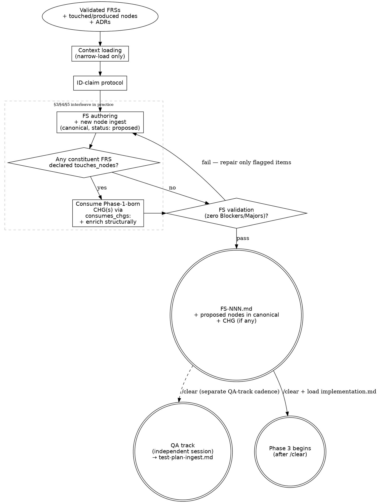

# Plan Flow

Plan flow turns a milestone's validated FRSs into a Feature Spec and the new DDD nodes
the spec introduces. It writes every new node directly to canonical with `status: proposed`,
fires the 2-file node touch (canonical node + per-type `index.md`), and consumes the
Phase-1-born CHGs the FRSs introduced (via FS `consumes_chgs:` per R-CHG-3) — enriching
each with structural before/after, `adds[]`, and `migration_steps[]`. Phase 3 applies the
CHG deltas, flips new nodes `proposed → active`, and flips consumed CHGs `approved →
merged`.

<HARD-GATE>
Do NOT write **method bodies, brace-delimited blocks, SQL bodies, YAML payloads,
implementation file paths, or line-level code** in the FS, the new canonical nodes, or
any CHG node. **Structural names ARE the deliverable** — class names, method signatures,
event names, table names, route paths. Phase 1 names FLW (Trigger + Scenarios) and CHG
(behavior-language `modifies[]` when the FRS declares non-empty `touches_nodes:`)
structures. Phase 2 names ACT (when the FRS declares `produced_actor:` — Description +
Goals + business Preconditions + Flows initiated + Commands triggered + Queries issued +
PERM-NNN refs all authored at birth) + ENT / CMD / STA / CON / INT / DEC / PERM / QRY
structures, enriches the Phase-1-born FLW with wiring (`related:` populated, Sequence,
Branches, Compensating actions, structural Postconditions), and consumes the
Phase-1-born CHGs via FS `consumes_chgs:` for structural enrichment (`modifies[]`
before/after, `adds[]`, `migration_steps[]`). Phase 3 writes code, applies CHG deltas,
and flips `proposed → active` / `approved → merged`. This applies regardless of how
obvious the implementation looks. (Structural YAML in frontmatter and templates is not
what this forbids — payload bodies are.)
**Phase 2 reload reads the Phase-1-born FLW + CHG from disk — never from Phase 1
session memory; the `/clear` between Phase 1.5 and Phase 2 enforces this.**
Cross-cutting rule canonical home: [`../../CLAUDE.md ## Hard rules`](../../CLAUDE.md#hard-rules) —
"Plans contain no syntax".
</HARD-GATE>

---

## Overview

This flow runs after the Design flow ([`design.md`](design.md)) has produced a validated
FRS set and a `/clear` has happened. It covers `generate-feat-spec`: FS authoring +
canonical node ingest (status: proposed) + CHG consumption + enrichment (via FS
`consumes_chgs:`) + FS validation loop. Test plan
ingest is the first **QA-track** flow ([`test-plan-ingest.md`](test-plan-ingest.md)) — it
runs in its own session after `/clear`, on the QA-track operator's cadence (not
necessarily immediately). See [`../../CLAUDE.md ## Hard rules`](../../CLAUDE.md#hard-rules)
— "QA-track flows count as independent flow boundaries."

**Mode: Ingest.** Existing canonical nodes are NOT modified here. When the FS
consumes a Phase-1-born CHG (via `consumes_chgs:`), this flow enriches that
CHG in place at its milestone-scoped permanent home —
`milestones/M-NN-<slug>/chg/CHG-NNN-<slug>.md` (CR track:
`docs/change-requests/CR-NNN-<slug>/chg/CHG-NNN-<slug>.md`) — by adding
structural before/after on `modifies[]`, populating `adds[]`, and
populating `migration_steps[]`. The CHG itself was born at Phase 1 by the
FRS (R-CHG-1); Phase 2 enriches but does not create. Phase 3 implementation
applies the deltas.

**Phase mode boundaries:** [`design.md`](design.md) is mixed-mode at Phase 1 —
Queries canonical (validates the FRS) **and** Ingests journey + modify-intent
(FLW born to canonical with `status: proposed`; CHG born to milestone with
`status: draft` when `touches_nodes:` is non-empty). This file (Phase 2)
Ingests structure + wiring (creates ACT when the FRS declares `produced_actor:`
+ ENT / CMD / STA / CON / INT / DEC / PERM / QRY; enriches the Phase-1-born
FLW with `related:` + Sequence + Branches + Compensating + structural
Postconditions + Decisions; enriches the Phase-1-born CHGs the FS consumes
with structural delta + adds[] + migration_steps[]).
[`implementation.md`](implementation.md) (Phase 3) Merges + Codes. Each phase
boundary requires a `/clear` at entry — Phase 1.5 → Phase 2 and Phase 2 →
Phase 3.

**Prerequisites:** the Design flow has produced a milestone with `status: planning`,
its validated FRSs in `milestones/M-NN-<slug>/frs/`, every FRS's "Validation findings"
resolved or deferred, and the milestone-scope discovery's "Cross-FRS conflicts" section
clean. A context reset has happened between Phase 1.5 and this flow.

**Core principle:** Phase 2 names structures; Phase 3 writes them.

---

## Anti-Pattern: "The Obvious Path"

Writing a method body, a SQL statement, a YAML configuration block, or a brace-delimited
code snippet inside the FS or a new node because the implementation looks "obvious" —
already in your head, no point waiting for Phase 3. The validation gate catches it, but
the cheaper fix is not to drift in the first place. Phase 2 names structures (a
`OrderManager` aggregate root with a `Cancel(reason)` method and a `Cancelled` domain
event); Phase 3 writes them (the `{ ... }` body, the `WHERE` clause, the
`appsettings.Production.json` block).

---

## When to Use

**Use when:** the Design flow has produced a validated FRS set, a `/clear` has happened,
and the next operation is `generate-feat-spec` (write the FS + ingest new nodes + emit
the CHG) followed by the Phase 2 Test plan ingest.

**Do NOT use when:** still in Phase 1 / 1.5 (load [`design.md`](design.md)), or after
Phase 2 validation has closed (load [`implementation.md`](implementation.md)). This flow
Ingests new nodes to canonical — it does **not** apply CHG deltas to existing canonical
nodes (that is Phase 3's job).

**Vs. sibling files:** [`design.md`](design.md) Queries canonical;
[`implementation.md`](implementation.md) Merges + Codes; this file Ingests. The three
are file-disjoint mode boundaries; each requires a `/clear` at entry.

---

## Section routing

If you've loaded this file for a specific issue mid-Phase-2 (rather
than at Phase 2 entry), read the linked section only. The HARD-GATE
callout at the top and
[Anti-Pattern: "The Obvious Path"](#anti-pattern-the-obvious-path)
carry the doctrinal frame the per-op sections assume — first-time
readers should re-read those on each new Phase 2.

| Operation | Sections to read |
|---|---|
| Phase 2 entry (first time) | [Checklist](#checklist) → [Process Flow](#process-flow) → [The Process](#the-process) |
| Resume mid-FS authoring | [The Process → Authoring sequence](#authoring-sequence--3-4-5-interleave) + the §3/§4/§5 sub-sections |
| Context loading question | [The Process → 1. Context loading](#1-context-loading) |
| ID-claim collision / cross-FS modify-intent conflict | [The Process → 2. ID-claim protocol](#2-id-claim-protocol) |
| New-node canonical ingest + Phase-1-born FLW enrichment (ACT born here too) | [The Process → 3. New node canonical ingest + Phase-1-born FLW enrichment](#3-new-node-canonical-ingest--phase-1-born-flw-enrichment) |
| CHG consumption + enrichment (FS consumes a Phase-1-born CHG) | [The Process → 4. CHG node consumption + enrichment](#4-chg-node-consumption--enrichment) |
| Phase-2 surfaced an undeclared modify-intent | [The Process → 4a. Retroactive `touches_nodes:` loop-back (R-NEW-10)](#4a-retroactive-touches_nodes-loop-back-r-new-10) |
| FS body authoring (Architecture / Data / Interface / Tasks) | [The Process → 5. FS authoring](#5-fs-authoring) |
| Checking Phase 2 exit readiness | [Checklist](#checklist) + [The Process → 6. FS validation loop](#6-fs-validation-loop) |
| Common Phase 2 mistakes (mid-flow check) | [Common Mistakes](#common-mistakes) + [Red Flags](#red-flags) |
| Cross-file dependencies / handoff to QA or Phase 3 | [Integration](#integration) |

If your operation is not in the table or you are entering Phase 2 for
the first time, read the full file in order: Overview → Anti-Pattern
→ When to Use → Checklist → Process Flow → The Process.

---

## Checklist

Scan-level gate before diving into The Process. All seven must hold before Phase 3 begins.

1. Every FRS acceptance criterion appears in the FS Coverage table — one row per Flow
   scenario it spans; no AC partially covered or duplicated within a scenario.
2. Every new node is written to canonical (`docs/<component>/nodes/<type>/<ID>-<slug>.md`)
   with `status: proposed` and the 2-file node touch fired (node + per-type `index.md`
   row with Status = `proposed`).
3. Every new node has `source_ref` tracing to a specific FRS criterion or body section (Use case / Business rules / Edge cases) or Phase-1-born FLW Scenario.
4. Every Phase-1-born CHG produced by the FS's constituent FRSs is listed
   in the FS's `consumes_chgs:` (subset consumption / merging per R-CHG-3
   noted in the FS's "Change maps"); each consumed CHG has been
   structurally enriched (`modifies[]` before/after, `adds[]`,
   `migration_steps[]` filled); each `modifies[]` target's ID is recorded
   in `id-claims.md` as `op: modify`.
5. No syntax (method bodies, SQL, YAML) appears anywhere in the FS or new nodes.
6. Every architecture decision is routed: promoted to ADR, filed as DEC, or kept inline.
7. FS validation loop passes: zero Blockers, zero Majors.

---

## Process Flow



The FS-validation diamond is the **node ingest gate** — Phase 2 is not complete
until zero Blockers and zero Majors remain. Repair is surgical, not full re-draft.
Test plan ingest is in the QA track and runs in its own session after a separate
`/clear` — see [`../../CLAUDE.md ## Hard rules`](../../CLAUDE.md#hard-rules)
("QA-track flows count as independent flow boundaries").

---

## The Process

### 1. Context loading

Read **only** the nodes and ADRs the milestone's FRSs declare:

1. Open each linked FRS in `milestones/M-NN-<slug>/frs/` and collect every node ID in
   `touches_nodes` and `produces_nodes`, every ADR ID in `adrs:`, every STD ID in
   `standards:`, and every CCC ID in `ccc:`.
2. Check for `FS-NNN-CONTEXT.md` at
   `milestones/M-NN-<slug>/specs/FS-NNN-<slug>/FS-NNN-CONTEXT.md`. If present, load it
   before drafting — it carries locked decisions that bind this FS's architecture choices.
   If absent, proceed without it ([`discuss.md`](discuss.md) is optional).
3. Read the relevant component ADR index — one-line summaries only.
   `docs/<component>/adrs/index.md` for each component in scope; for cross-component work
   also check `docs/shared/adrs/index.md`. Cross-check the FRS-declared ADR list against
   the index for anything plainly relevant that an FRS missed; if you find a gap, surface
   it (update the FRS, do not silently load).
4. Read [`../standards/index.md`](../standards/index.md) and
   [`../../docs/shared/ccc/index.md`](../../docs/shared/ccc/index.md) — one-line summaries
   only, both indexes are bounded by design. Narrow-load every STD declared in the
   collected FRSs' `standards:` set whose `applies_when.stack:` intersects the FS's
   declared `stack:` plus every STD tagged `convention` or `task-ordering` that the FS
   missed. Narrow-load every CCC declared in `ccc:`. If you find a relevant STD or CCC
   missing from the FRS's declared sets, surface it (update the FRS, do not silently
   load); the FS inherits `standards:` and `ccc:` from its FRSs.
5. Read the canonical node files for IDs in `touches_nodes`. Follow `related` one hop and
   read those too. For IDs in `produces_nodes`, there is no canonical node yet — they will
   be created at the ingest step.
6. Narrow-load the declared ADR pages. No transitive expansion.
7. Do **not** glob `docs/*/nodes/**` or pre-load wholesale. If a node, ADR, STD, or CCC
   not on the list turns out necessary mid-draft, stop, update the source FRS to declare
   it, and re-enter Phase 1.5 (for a node) or update the FRS's `adrs:` / `standards:` /
   `ccc:` (for a governance artifact).

This is the workflow's primary token lever — see [`retrieval-discipline.md`](retrieval-discipline.md).

**Verify:** every node and ADR you have loaded is traceable to a declared ID in an FRS.
No unlisted files open.

**On failure:** if you discover a needed node mid-draft, stop. Surface the gap. Update
the FRS. Re-enter Phase 1.5 before continuing. The same applies if an AC itself is
unworkable — ambiguous, contradictory, or undefined. Do not paper over by inventing
structure that doesn't trace to a clear AC.

**Rollback procedure (when re-entering Phase 1.5).** The FS shell on disk is durable —
do not delete it. Leave the frontmatter intact and the section headers in place. In any
body section that referenced the now-missing node or unworkable AC, replace the prose
with a `TBD — pending Phase 1.5 re-pass on FRS-NNN` marker so the next session knows
exactly which sections need re-authoring. `/clear`, load [`design.md`](design.md),
re-run Phase 1.5 on the updated FRS. After Phase 1.5 exit, `/clear` + load this file
and resume the FS — re-walking only the TBD sections. New canonical nodes already
ingested (`status: proposed`) stay where they are unless the re-pass explicitly retires
them via the abandonment procedure in
[`in-flight-nodes.md`](in-flight-nodes.md). CHG and TC files stay at their milestone
paths. Already-claimed IDs in `id-claims.md` stay claimed (the re-pass may add more,
never silently retire).

---

### 2. ID-claim protocol

Every node ID this FS introduces or modifies must be recorded in
`docs/milestones/M-NN-<slug>/id-claims.md`. **Lazy-create timing** (per R-NEW-9):
the file is created on the **first FRS or FS claim** — i.e., the moment Phase 1 first
allocates an FLW or claims an ACT-NNN ID for its FRS (R-NEW-1), or the moment Phase 2
first allocates an ENT / CMD / STA / CON / INT / DEC / PERM / QRY / TC, whichever fires
earlier. (ACT-NNN is always Phase-1-claimed when `produced_actor:` is set — Phase 2
authors the ACT file against the existing claim; it does not first-allocate the ID.)

| ID | Source | Op | Date |
| -- | ------ | -- | ---- |
| FLW-005 | FRS-008 | introduce | YYYY-MM-DD |
| ACT-005 | FRS-008 | introduce | YYYY-MM-DD |
| CHG-003 | FRS-008 | introduce | YYYY-MM-DD |
| CMD-010 | FS-007  | modify    | YYYY-MM-DD |
| ENT-021 | FS-007  | introduce | YYYY-MM-DD |
| TC-001  | FS-007  | introduce | YYYY-MM-DD |

**Op enum.** Valid values: `introduce` | `modify` | `released`. The third
value `released` fires when a claimed ID is given up before the file
materializes — most commonly an ACT-NNN claim under `produced_actor:`
that's abandoned at Phase 1 / 1.5 FRS abandonment. Released IDs are
never reused; the row stays in the ledger as the audit trail.

(CHG-NNN is allocated at Phase 1 by the FRS whose `touches_nodes:` is
non-empty — Source = FRS-NNN, Op = introduce. The IDs the CHG's
`modifies[]` cites are NOT separately listed in `id-claims.md` here as
`op: modify` rows under the FRS; they appear as Phase-2 rows under the
consuming FS — Source = FS-NNN, Op = modify — at FS authoring time.)

**Source column** (per R-NEW-9 — column renamed from `FS`) accepts either an FRS-NNN
(Phase 1 FLW / ACT allocation) or an FS-NNN (Phase 2 ENT / CMD / STA / CON / INT / DEC /
PERM / QRY / TC allocation). **Grandfathered entries:** pre-cutover rows with `FS` as the
column header are valid as-is — `FS-007` is a valid `Source` value. The header rename
uses **next-touch eventual consistency**: a milestone's `id-claims.md` keeps its old `FS`
header until the next claim allocation against that file, at which point the header is
renamed in the same edit. Closed milestones with no further allocations keep the old
header indefinitely; in-flight milestones converge to `Source` on next use.

TC IDs use the same ledger; Test plan ingest claims them after the FS validation loop
passes — see [`test-plan-ingest.md`](test-plan-ingest.md).

Before allocating a new ID, **read both** the canonical per-type
`docs/<component>/nodes/<type>/index.md` (carries every claimed ID: proposed, active,
superseded, deprecated) **and** the milestone's `id-claims.md` (carries in-flight
reservations). Pick the next free ID from the higher of the two ceilings **for this
(component, type) counter** — counters are per-(component, type), per
[`../KB-LAYOUT.md → Counter scope`](../KB-LAYOUT.md). Retired IDs are not reused.

Two collision signals to surface (never silently resolve):

- **New-ID collision** — another FS has already claimed the same ID for the same concept.
  Either merge the intent or re-coordinate.
- **Cross-FS modify-intent collision** — a sibling FS has already recorded an
  `op: modify` row for the same canonical ID. Coordinate which FS owns the change or
  merge the modify-intents into a single CHG.

Across milestones, IDs are globally unique.

**Verify:** every ID in this FS's `produces_nodes` and `touches_nodes` has a row in
`id-claims.md`. No row duplicates a sibling FS's claim.

**On failure:** surface the collision immediately. Do not allocate a conflicting ID.

---

### Authoring sequence — §3, §4, §5 interleave

**Do not execute §3 → §4 → §5 in linear order.** The three sections
interleave in practice. The linear presentation below is for
completeness, not execution order. Authoring sequence:

1. **Draft the FS shell first** — frontmatter (with the FS-NNN ID
   claimed in §2) plus empty section headers. This shell lets §3's
   `source_ref: [{frs:, fs:, op:}]` reference resolve in-flow even
   though the FS body is still empty.
2. **Name a structure in the FS body**, then immediately ingest the
   matching new node to canonical with `status: proposed` (§3).
   Fire the 2-file node touch as part of that ingest. Repeat per
   structure named.
3. **Declare `consumes_chgs:` and enrich each consumed CHG** (§4).
   The Phase-1-born CHGs already exist at the milestone-scoped `chg/`
   home; the FS lists them in `consumes_chgs:` (subset / merge per
   R-CHG-3) and enriches each in place — structural before/after on
   `modifies[]`, `adds[]` mirroring new node ingest, `migration_steps[]`.
4. **Fill the remaining FS sections** (§5 — Architecture decisions,
   Data model, Interface contracts, Tasks, etc.) using the now-canonical
   node IDs as references rather than restating their behavior.

The Process Flow diagram above shows this as the `cluster_interleave`
subgraph (`fsauthor + new-node ingest` in one box, CHG conditional from
that box). **First-time authors who linearize §3 → §4 → §5 hit the
forward-reference problem:** a node with `fs: FS-NNN` written before
the FS shell exists.

### 3. New node canonical ingest + Phase-1-born FLW enrichment

**Two operations fire here.** (a) New Phase-2-born node files are written to canonical
(ACT — when `produced_actor:` is set — plus ENT, CMD, STA, CON, INT, DEC, PERM, QRY).
(b) The Phase-1-born FLW (declared in the FRS's `produced_flw:`) is **enriched in
place** — same file, body content added, `related:` populated, `status:` unchanged
(`proposed`). Both fire the 2-file touch independently.

**(a) New Phase-2-born nodes.** For every node ID in the FRSs' `produces_nodes:`
(ENT / CMD / STA / CON / INT / DEC / PERM / QRY) and for the ACT-NNN claimed in
`produced_actor:` (when set), write the node file **directly to canonical** with
`status: proposed`:

```
docs/<component>/nodes/<type>/<ID>-<slug>.md
```

Use the templates in [`../_templates/nodes/`](../_templates/nodes/). Set
`status: proposed` in frontmatter. Every new node carries `source_ref` pointing back to
the FRS and FS:

```yaml
status: proposed
source_ref:
  - frs: FRS-NNN
    fs: FS-NNN
    op: introduce
```

**Note.** `fs: FS-NNN` is a forward reference at ingest — the FS file may not yet exist
on disk. The ID is valid because it was claimed in §2 (ID-claim protocol); the FS shell
(frontmatter + empty section headers) is drafted at the start of §5, so the reference
resolves within the same flow. Shape is consistent across all node templates:
`source_ref: [{frs:, fs:, op:}]` (list-of-objects).

**ACT-NNN authoring at Phase 2 (when `produced_actor:` is set).** Write the ACT file
in full at this stage — there is no Phase-1-bare ACT body shape; the entire ACT body
is authored here using structural language. Body shape: **Description** + **Goals**
(reference the FRS by ID) + **Preconditions to act** (with PERM-NNN refs when
applicable) + **Flows they initiate** (FLW-NNN IDs — real because the FLW is
Phase-1-born) + **Commands they trigger** (CMD-NNN IDs from this FS's
`produces_nodes:` or existing canonical) + **Queries they issue** (QRY-NNN, optional).
`related:` populated (CMD / QRY / FLW / PERM IDs). 2-file touch (ACT file +
`nodes/actors/index.md`). (R-NEW-2a retired 2026-05-17 — the Phase-1-bare ACT body
shape no longer applies because the ACT is born at Phase 2.)

**(b) Phase-1-born FLW enrichment.** The FLW (per `produced_flw:`) already exists in
canonical with `status: proposed` and Phase-1-bare body shape (`related: []`, Trigger
+ Scenarios). At Phase 2:

- **FLW enrichment** — open the canonical file, populate `related:` (CMD / STA / ACT
  IDs sequenced or referenced by this flow), restore the Trigger's `Initiating command:
  CMD-NNN` line, and fill the Phase-2 sections: **Sequence** (ordered CMD-NNN / DEC-NNN
  steps), **Branches and gates** (referencing Sequence step numbers), **Compensating
  actions** (when `mode: async`), **Postconditions** (structural — ENT/STA/downstream
  FLW refs), and **Decisions** (optional inline DEC). Scenarios stay business-language
  from Phase 1 — do NOT rewrite them with node IDs. Fire the 2-file touch (FLW file +
  `nodes/flows/index.md`); `status:` stays `proposed`.
- **Source ref append** — FLW enrichment appends a Phase-2 entry to `source_ref:`
  (`{frs: FRS-NNN, fs: FS-NNN, op: detail}`) recording the FS that enriched it,
  leaving the Phase-1 `{frs: FRS-NNN, op: introduce}` entry intact.

For FLW Scenarios specifically: the three slots (happy / edge / fault) are already
filled at Phase 1; Phase 2 does NOT rewrite their bodies. If they're underspecified for
the FS's coverage needs, that's a `R-NEW-10` loop-back to Phase 1.5 (§4a below) — not a
silent rewrite here.

**Fire the 2-file node touch at ingest** (see [`maintenance-discipline.md`](maintenance-discipline.md)):

- [ ] Each Phase-2-born canonical node file in place at
      `docs/<component>/nodes/<type>/<ID>-<slug>.md` with `status: proposed`.
- [ ] Row added to `docs/<component>/nodes/<type>/index.md` showing Status = `proposed`.
      Create the file from [`../_templates/INDEX.md`](../_templates/INDEX.md) if this is
      the first node of the type. The `id-claims.md` row for this node (see §2) carries
      the originating FS/FRS audit trail; no canonical `log.md` fires (see
      [`maintenance-discipline.md → Rule history`](maintenance-discipline.md#rule-history--canonical-logmd-retired-2026-05-16)).
- [ ] Bidirectional `related:` back-links fired against each target in this node's
      `related:` list (the (2 + N) touch — every target fires its own 2-file
      touch regardless of canonical type — see `maintenance-discipline.md`).
- [ ] For the Phase-1-born FLW enriched here: `related:` populated; Phase-2
      sections filled (per the bullets above); `nodes/flows/index.md` Status column
      unchanged (still `proposed`); 2-file touch fires because frontmatter `updated:`
      and the body change are non-trivial. Status flip is Phase 3's job alone
      (R-NEW-4).
- [ ] For the Phase-2-born ACT (when `produced_actor:` is set): file authored
      in full at `docs/<component>/nodes/actors/ACT-NNN-<slug>.md` with
      `status: proposed`; row added to `nodes/actors/index.md`.

**For `touches_nodes` (existing canonical nodes any constituent FRS intends to modify):
do NOT write to canonical at Phase 2.** The canonical file is left untouched; the
Phase-1-born CHG (consumed via `consumes_chgs:` per §4) records the intended delta
and is enriched here with structural before/after. Phase 3 applies it.

**Cross-FS dependencies.** If a new node references a `proposed` sibling-FS node that
hasn't merged yet, declare the dependency in this FS's frontmatter:

```yaml
depends_on_specs: [FS-006]
```

Phase 3 enforces merge order from this field. An FS may **read** a sibling-FS proposed
node via `depends_on_specs:`, but may **not** include it in its own `touches_nodes` /
CHG `modifies[]` — proposed nodes are provisional, not modify targets.

**No reciprocal back-link.** `depends_on_specs:` is one-way. At Phase 3 merge, the merger
globs `depends_on_specs:` across all FSs in the milestone to detect dependents before
retiring or reordering an FS. A generated "Spec dependencies" table on the milestone
portal is a future enhancement (track in [`evolving-the-workflow.md`](evolving-the-workflow.md)).

**Verify:** every `produces_nodes` ID has a canonical file at the expected path with
`status: proposed` and an index row showing Status = `proposed`. No canonical node body
for a `touches_nodes` ID has been touched.

**On failure:** if a 2-file node touch is incomplete, complete it before moving on. If a
`touches_nodes` ID was edited, revert — it belongs in the CHG, not in canonical yet.

---

### 4. CHG node consumption + enrichment

**Birth shift (R-CHG-1).** Post-2026-05-17 cutover: CHG-NNN is born at
**Phase 1** by the FRS whose `touches_nodes:` is non-empty — one CHG per
FRS, parallel to `produced_flw:` / `produced_actor:`. Phase 2 **consumes**
and **enriches**; it does not emit. The CHG file already exists at its
permanent milestone-scoped home:

```
milestones/M-NN-<slug>/chg/CHG-NNN-<slug>.md
# CR track:
docs/change-requests/CR-NNN-<slug>/chg/CHG-NNN-<slug>.md
```

(Pre-cutover CHGs at `specs/FS-NNN-<slug>/nodes/changes/` are
grandfathered and stay where they are — see
[`change-request.md`](change-request.md) for the frozen-layout callout.)

**Five-step procedure.**

1. **Phase 1 FRS authoring** (covered in
   [`design.md § Phase 1`](design.md#phase-1--frs-authoring)) births the
   per-FRS CHG at the path above with `status: draft`,
   `source_ref: [{frs: FRS-NNN, op: modify}]`, behavior-language
   `modifies[]`, optional milestone-level `invariants_before/after`, and
   optional `removes[]` / `supersedes[]`. No `adds[]`, no
   `migration_steps[]`, no structural before/after at Phase 1.
2. **Phase 2 FS authoring declares `consumes_chgs:`** in frontmatter,
   listing the per-FRS-born CHGs this FS owns. **Default at Phase 2:**
   consume every CHG born by the FS's constituent FRSs. Two adjustments
   per R-CHG-3:
   - **Subset consumption** — consume only a subset when splitting
     heuristics fire (different bounded context, different risk profile,
     different reviewer). The unconsumed CHGs route to a sibling FS in the
     same milestone. Each CHG ends up consumed by exactly one FS before
     milestone close.
   - **CHG merging** — at FS-authoring time, two sibling CHGs (born by
     sibling FRSs in the same milestone) may be merged into one when they
     target the same bounded context with matching risk and reviewer
     profile. Procedure: retain one CHG ID; fold the other's `modifies[]`
     and invariant deltas into it; flip the unused ID to `status:
     deprecated` (do NOT reuse). The retained CHG's `source_ref:`
     accumulates both originating FRS IDs.
3. **Phase 2 FS enrichment** of each consumed CHG:
   - **Structural before/after on each `modifies[]` entry** — the
     business-language behavior delta the Phase 1 author wrote stays;
     the FS author adds the structural before/after columns naming ENT
     fields, CMD signatures, FLW Sequence step numbers, etc.
   - **`adds[]` populated** — mirrors the new canonical nodes this FS
     introduces under §3 (one entry per `new_nodes:` ID).
   - **`migration_steps[]` populated** — ordered data / schema migration
     steps required at Phase 3 merge.
   - 2-file touch on enrichment fires the CHG file's `updated:`
     timestamp; the milestone-scoped `chg/index.md` row (when one
     exists — none today, per row-12 gap note) is re-synced.
4. **Phase 2 FS validation exit** (§6 below) flips each consumed CHG's
   `status: draft → approved`. The CHG remains at the milestone path
   permanently.
5. **Phase 3 merge** applies the CHG's `modifies[]` / `removes[]` /
   `supersedes[]` deltas to canonical targets (each fires its own 2-file
   node touch — node file + per-type `index.md` re-sync) and flips the
   CHG's status `approved → merged` in place.

**Splitting heuristics — applied at FS-consumption time** (reframed from
the prior FRS-birth granularity table). When deciding whether sibling
CHGs from sibling FRSs fold into one FS's `consumes_chgs:` (merge them
into a single CHG per R-CHG-3) or route to separate FSs, apply the same
heuristics as before:

| Situation | Same bounded context? | Same risk profile? | Same reviewer? | Decision |
|---|---|---|---|---|
| Two FRS-born CHGs both targeting the `orders` module, both data-shape changes | ✅ | ✅ | ✅ | **Merge into one CHG** (one FS consumes; per R-CHG-3 procedure) |
| FRS-born CHG against ENT + FRS-born CHG against CMD, same module, same reviewer | ✅ | ✅ | ✅ | **Merge into one CHG** (the type difference is not load-bearing) |
| Config-flag CHG + DB-schema-migration CHG from sibling FRSs in same milestone | ✅ | ❌ (reversible vs destructive) | ✅ | **Keep separate** — risk profiles differ; route to separate FSs; each FS consumes its own |
| CHG against `orders` MOD + CHG against `billing` MOD | ❌ | — | typically ❌ | **Keep separate** — unrelated bounded contexts; different stakeholder review; separate FSs |
| Critical-path security CHG + cosmetic-copy CHG | ✅ | ❌ | typically ❌ | **Keep separate** — critical-path delta deserves its own review record |

The driving heuristic: a CHG should be **atomically reviewable** — a
reviewer should be able to approve or reject it without paging in a
second unrelated context. If you can't summarize the CHG in one sentence
without "and also," keep the FRS-born CHGs separate (route to different
FSs) rather than merging them.

If the FS's constituent FRSs all have empty `touches_nodes:` (pure
additions), `consumes_chgs:` is empty. Pure additions are already
audited by new nodes' `source_ref`, their `id-claims.md` rows, and git
history.

**Verify:** every Phase-1-born CHG from this FS's constituent FRSs is
either listed in this FS's `consumes_chgs:` (consumed here) or
documented in the FS's "Change maps" as merged-in or routed-to-sibling.
Every `modifies[]` entry in each consumed CHG carries structural
before/after at Phase 2 close. Every consumed CHG's `adds[]` mirrors
this FS's `new_nodes:` and `migration_steps[]` is filled.

**On failure:** if a Phase-1-born CHG is not consumed by any FS in the
milestone, that's a Blocker — fix at FS authoring (consume it) or merge
it per R-CHG-3 before Phase 2 close.

---

### 4a. Retroactive `touches_nodes:` loop-back (R-NEW-10)

If FS authoring surfaces a modify-intent on a canonical node that is **not** declared in
the FRS's Phase-1 `touches_nodes:`, this is a **claim change** — the FRS's claim surface
is incomplete. The Phase-2 author MUST halt and loop back to Phase 1.5 rather than
silently widen the claim from Phase 2 (which would route around the gate).

**Procedure:**

1. **Halt Phase 2 enrichment** at the moment the missing modify-intent is identified.
   Do not stage the modify in the CHG yet; do not edit canonical.
2. **Revise the FRS** — add the missing canonical ID to `touches_nodes:`. Update any
   FRS body section that references the now-declared modify-intent (Brownfield impact,
   Business rules, etc.).
3. **Phase 1.5 delta re-run** — `/clear`, load [`design.md`](design.md), re-run **only**
   Pass 1's existence + sanity checks on the new `touches_nodes:` entry (not a full
   Phase 1.5 re-gate; the deltas only).
4. **Resume Phase 2** — once the Phase 1.5 delta re-run clears, `/clear`, reload this
   file, and continue FS authoring from where you halted. The new `touches_nodes:` entry
   feeds into §4's CHG `modifies[]`.

**Why loop-back rather than retro-declare with audit marker.** Phase-2 retro-declaration
would let Phase 2 silently widen the FRS's claim surface — exactly the failure mode
Phase 1.5 exists to prevent. The loop-back cost is a small Phase 1.5 delta re-run; the
cost of silent widening is a silently expanded FS that downstream readers can't audit
against the FRS's original claims.

**Mitigation against loop-back churn.** §6 FS validation includes a Phase-2-entry
canonical-state reconnaissance checklist item — every modify-intent the FS will require
should already be in the FRS's `touches_nodes:` before §5 authoring commits to a body
section that names it. The reconnaissance is the cheap catch; the loop-back is the
correctness backstop.

---

### 5. FS authoring

The FS answers *how* to implement the user-journeys its FRSs describe. The new canonical
nodes (status: proposed) and the CHG node carry the behavioral content. The FS prose
references nodes by ID — it does not restate their behavior.

What belongs in the FS prose: architecture decisions, data model changes, interface
contracts, ordered tasks, dependencies, edge cases, QA verification checklist.
What does **not** belong: code bodies, implementation file paths, class bodies, behavior
already in a canonical DDD node (link to the canonical node instead). Structural names
(class names, method signatures, table names, route paths) ARE the deliverable.

#### Generate before converging

Before settling on an architecture decision, list 2–3 genuinely different approaches
with what each optimizes for and what it gives up. Record under "Alternatives considered"
in the FS (see [`../_templates/FS.md`](../_templates/FS.md)).

- **Real alternatives only.** If you can't write a real trade-off, drop it.
- **Skip for obvious / low-stakes calls.** Forced alternatives are procrastination.
- **Lead with your recommendation** and the reasoning behind it.
- **Honor locked decisions.** Dimensions locked in `FS-NNN-CONTEXT.md` are not
  re-litigated. Cite the lock and skip alternatives for that dimension — generate
  alternatives only for dimensions still open.

#### Promote to ADR vs file a DEC vs keep inline

Every architecture decision the FS makes faces a three-way fork. Apply the discriminator
on the spot — don't punt it.

- **Promote to ADR-NNN** if the decision constrains how we'd design future features we
  haven't met yet (stack, layering, framework idiom, tooling). Create the ADR via
  [`authoring-adr.md → From an FS`](authoring-adr.md#three-triggers), add it to the FS's
  `adrs:` frontmatter, and **collapse the FS prose to a reference**.
- **File a DEC-NNN node** if the decision shapes one specific node's behavior. Written
  directly to canonical `docs/<component>/nodes/decisions/DEC-NNN-<slug>.md` with
  `status: proposed`.
- **Keep inline** if the decision is small, scoped to this FS, and not reusable.

The discriminator: *if it'll be referenced by future specs → ADR; if it explains why one
specific node looks the way it does → DEC; otherwise → inline.*

#### Section-by-section drafting

Walk the FS template in order — Coverage → New nodes → Change maps → Architecture
decisions → Data model → Interface contracts → Implementation tasks → Dependencies → QA —
and pause for confirmation between sections. **Apply CLAUDE.md's "one question per turn"
hard rule** — ask at most one question between sections, wait for the answer, then
proceed. If something stops making sense partway, go back; don't paper over.

#### Implementation-task cohort ordering

Group and order Implementation tasks along the architectural cohorts your project's
convention ADRs declare, so each cohort's compilation succeeds before the next starts.
Scan `docs/<component>/adrs/index.md` for the ADR tagged `task-ordering` and consult its
cohort table. Each task references the relevant convention ADR by ID rather than restating
the convention.

> **Your project:** Look up the ADR tagged `task-ordering` in
> `docs/<component>/adrs/index.md` and note its ID and cohort names here as a session
> reference.

Cross-cutting tasks (test scaffolding, seed data) land at the end as a final cohort or
interleaved per scenario, but never before the cohort they validate compiles.

---

### 6. FS validation loop

**Which gate is this?** This is the **Phase-2 close gate**. The top-of-doc Checklist is
its scan-level subset (use it first). The template's `## QA verification` section is the
**Phase-3 `implemented`-flip gate** — do not run it here.

Findings carry the same **Blocker / Major / Minor** severity vocabulary used at Phase
1.5 (see
[`frs-validation-rules.md → Severity classification`](frs-validation-rules.md#severity-classification)).
Zero Blockers and zero Majors is the exit bar; Minors are noted, not blocking.

**Targeted repair, not full re-draft.** Fix only the flagged items and re-check only
those — not the whole FS.

**Severity of the checkboxes below.** All boxes are **Blocker-tier** — any unchecked box
prevents Phase 2 close. Major and Minor findings emerge from the self-review pass (the
first box) and are recorded inline; Minors are noted, Majors must be repaired before
close.

- [ ] **Canonical-state reconnaissance (Phase-2-entry).** Before §5 commits to body
      sections that name modify-intents, walk every canonical node ID the FS will
      reference structurally (from `related:` populations on new nodes, from FLW
      Sequence step references, from CHG `modifies[]` candidates). Every modify-intent
      the FS requires must already be in some FRS's `touches_nodes:`. If a new one
      surfaces, fire the R-NEW-10 loop-back (§4a) before continuing — do not retro-add
      from Phase 2. Per R-NEW-10.
- [ ] Author self-review pass — look at the FS with fresh eyes:
  1. Placeholder scan — any "TBD", incomplete sections, or vague requirements?
  2. Internal consistency — does the FS contradict itself or upstream inputs (FRSs, nodes)?
  3. Scope — single coherent slice? No scope creep from adjacent FRSs?
  4. Ambiguity — any task interpretable to build the wrong thing? Pick one interpretation and make it explicit.
  Fix inline. No separate review file, no dispatched reviewer.
- [ ] Every Phase-1-born FLW this FS enriches now carries non-empty `related:`
      (per R-NEW-8 — narrowed to FLW only 2026-05-17; empty `related:` is the
      Phase-1-bare body-shape signal; an enriched node MUST move past that).
      Catches a malformed Phase-2 enrichment that forgets to populate `related:`.
      Phase-2-born ACT carries `related:` populated at birth (no separate
      enrichment step).
- [ ] Every FRS acceptance criterion is **fully covered** in the Coverage table — one row
      per Flow scenario it spans; no AC partially covered or duplicated within a scenario.
      Criteria that cannot be mapped to a Flow scenario are raised as `OQ-NNN` files under
      `docs/discovery/open-questions/` with `origin: fs-authoring, origin_ref: FS-NNN,
      gate_effect: blocking` — not absorbed as loose FS prose.
- [ ] Every covered criterion links to a Flow scenario in a canonical FLW node (new FLW
      nodes carry `status: proposed`).
- [ ] No node behavior or ADR text is restated in the FS prose — only referenced.
- [ ] No syntax in the FS or in any new node (method bodies, brace bodies, SQL, YAML).
- [ ] No unresolved design questions.
- [ ] Every new node has been written to canonical at
      `docs/<component>/nodes/<type>/<ID>-<slug>.md` with `status: proposed`; the FS's
      "New nodes" section lists each ID and one-line summary.
- [ ] No invented new nodes — every new node's `source_ref` traces to a specific FRS
      acceptance criterion, FRS body section (Use case / Business rules / Edge cases),
      or Phase-1-born FLW Scenario. Nodes without a traceable clause are removed,
      promoted to a DEC, or raised as `OQ-NNN`.
- [ ] Every new node has `source_ref` populated (`frs:`, `fs:`, `op: introduce`). Optional
      `section:` key naming the specific FRS heading improves traceability.
- [ ] Every new-node ID claimed by this FS is in `id-claims.md`; no double-claims with
      sibling FSs. Every CHG `modifies[]` entry recorded as `op: modify`.
- [ ] **`consumes_chgs:` cardinality check** (per R-CHG-3). Every CHG-NNN
      in this milestone is consumed by exactly **one** FS — globbing
      `consumes_chgs:` across the milestone's FSs returns a flat list with
      no duplicates. Double-consumption (one CHG listed in two FSs) is a
      **Blocker**. Zero-consumption (a Phase-1-born CHG no FS owns) is a
      **Blocker** unless the CHG was explicitly merged into another via
      R-CHG-3 (in which case the unused ID is `status: deprecated`).
- [ ] Every consumed CHG has structural before/after on its `modifies[]`
      entries (not just the Phase-1 business-language delta), `adds[]`
      mirroring this FS's `new_nodes:`, and `migration_steps[]` filled.
- [ ] If this FS has any constituent FRS with non-empty `touches_nodes:`,
      every such FRS's Phase-1-born CHG appears in this FS's
      `consumes_chgs:` (or is documented as merged/routed in "Change maps"
      per R-CHG-3). The CHG is **not** applied to canonical here — only
      enriched.
- [ ] No edits to existing canonical node bodies during Phase 2.
- [ ] `adrs:` frontmatter declares every ADR consulted.
- [ ] `standards:` frontmatter declares every STD this FS consumes (inherited
      from the constituent FRSs plus any STD newly surfaced during FS drafting).
      Engine-universal STDs (`applies_when.stack: [agnostic]`) listed when the
      FS's behavior depends on a specific rule; stack-conditional STDs listed
      only when their `applies_when.stack:` intersects the FS's `stack:`.
- [ ] `ccc:` frontmatter declares every CCC this FS cites (inherited from
      the constituent FRSs). For each CCC, body prose cites by ID rather than
      restating the baseline. Any operation-specific deviation from a CCC is
      filed as an ADR (with `related: [CCC-NNN]`) whose ID is in `adrs:`.
- [ ] Every architecture decision has been routed: ADR, DEC, or inline.
- [ ] Any ADR promoted from this FS is filed under
      `docs/<component>/adrs/ADR-NNN-<slug>.md`, indexed in `adrs/index.md`
      (2-file touch — no `adrs/log.md`), has `fs_origin: FS-NNN`, and is
      back-linked from the FS's `adrs:` list.
- [ ] `depends_on_specs:` declares every sibling FS whose proposed nodes this FS references.
- [ ] FS frontmatter: `merged: false`, `merge_sha:` left blank.
- [ ] FS frontmatter: `test_plan_path:` left blank — filled by Test plan ingest.

**Phase 2 fires the 2-file node touch for each new node's `created` event (canonical
node + per-type `index.md` row with Status = `proposed`). It does NOT modify
existing canonical node bodies, nor add index rows for `touches_nodes` targets — those
operations fire at Phase 3 merge when the CHG deltas are applied.**

FS validation passed; the QA track may now run [`test-plan-ingest.md`](test-plan-ingest.md) in a fresh session. The QA track is independent — no shared session, no mandate to run immediately, but milestone close depends on `qa-gate.md` (the QA track's final flow) eventually running.

---

## Common Mistakes

**❌ Writing a method body or SQL statement in the FS** — Phase 2 names; Phase 3 writes.
**✅ Name the structure** (e.g. `OrderManager.Cancel(reason)` + `Cancelled` event) and
leave the `{ ... }` body for Phase 3.

**❌ Globbing `docs/*/nodes/**` during context loading** — floods the session and violates
the token discipline that makes the workflow sustainable.
**✅ Narrow-load only** the node IDs declared in the FRSs' `touches_nodes` and
`produces_nodes`, plus one `related` hop.

**❌ Editing an existing canonical node body during Phase 2** — canonical nodes are the
source of truth; mid-phase edits create un-audited drift.
**✅ Emit a CHG node** documenting the intended delta; Phase 3 applies it.

**❌ Silently resolving an ID collision** — two FSs claiming the same ID creates invisible
Phase 3 merge conflicts.
**✅ Surface the collision** immediately, stop allocation, and reconcile before proceeding.

**❌ Listing a CHG in `consumes_chgs:` for a pure-addition FS** — there is no CHG to consume
when no canonical node is being modified (post-cutover CHGs are born at Phase 1 only when
the FRS declares non-empty `touches_nodes:`).
**✅ Only populate `consumes_chgs:` when at least one constituent FRS declared
non-empty `touches_nodes:`** — pure additions are audited by `source_ref`, the
`id-claims.md` row, and git history.

---

## Red Flags

**Never:**
- Write syntax (method bodies, SQL, YAML payloads) in the FS or new canonical nodes
- Glob `docs/*/nodes/**` — load only what FRSs declare by ID
- Edit existing canonical node bodies during Phase 2
- Allocate a node ID without reading both the per-type `index.md` and `id-claims.md`
- Proceed to `test-plan-ingest.md` before zero Blockers and zero Majors
- Emit a CHG node when the FS has no `touches_nodes` entries
- Silently broaden the context load when a mid-draft gap is found — stop and update the FRS

---

## Integration

- **Required before:** [`../../CLAUDE.md ## Hard rules`](../../CLAUDE.md#hard-rules) —
  "Plans contain no syntax" is the doctrinal anchor of this flow's HARD-GATE; "Read the
  per-type `index.md` before globbing" governs the context-loading step; "Canonical edits
  use tiered touch" governs every node ingest fired here.
- **Required before:** [`../WORKFLOW.md`](../WORKFLOW.md) — phase pipeline, retrieval
  discipline, in-flight `status: proposed` rule, CHG-emission rule.
- **Required before:** [`../PRINCIPLES.md`](../PRINCIPLES.md) — doctrinal anti-patterns
  the FS-validation gate enforces.
- **Required before (entry):** [`design.md`](design.md) — produces the validated FRS set
  this flow consumes.
- **Routes to (QA track):** [`test-plan-ingest.md`](test-plan-ingest.md) — runs as an independent flow in the QA track, in its own session. Logical sequencing only: this file's FS validation must pass before the QA track's first flow can begin. No same-session requirement; no `/clear` exception.
- **Maintenance ops that may fire:**
  [`maintenance-discipline.md`](maintenance-discipline.md) (every 2-file node touch on
  new node ingest; the (2+N) touch when new nodes carry `related:` back-links — (3+N)
  if any target is an ADR),
  [`authoring-adr.md`](authoring-adr.md) (FS architecture decision promoted to ADR),
  [`new-component-bootstrap.md`](new-component-bootstrap.md) (FS introduces nodes for a
  new component — runs FIRST, before any ingest),
  [`evolving-the-workflow.md`](evolving-the-workflow.md) (Phase 2 surfaces a missing node
  type or template gap).
- **Routes to (after `/clear`):** [`implementation.md`](implementation.md) — Phase 3
  Merge + Code + QA. After review and `/clear`, the QA track may begin with
  [`test-plan-ingest.md`](test-plan-ingest.md). The QA track runs independently — its
  first flow is the entry point for executable test coverage.
- **Sibling flow files:** [`design.md`](design.md), [`implementation.md`](implementation.md),
  [`bug-fix.md`](bug-fix.md).
