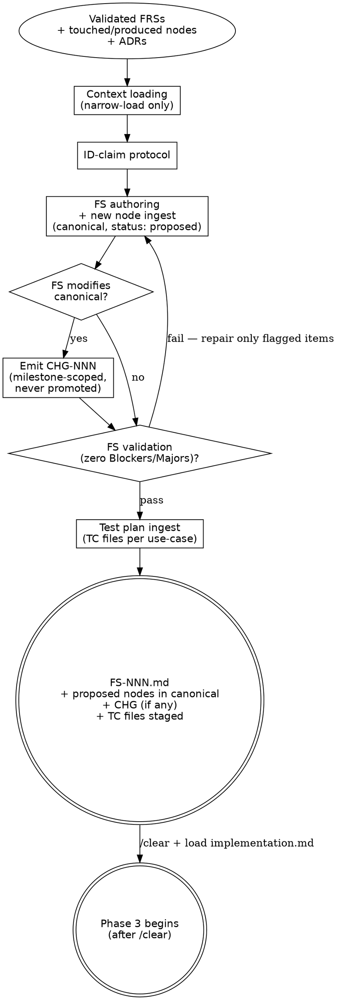

# Plan Flow

> Plan flow — turns a milestone's validated FRSs into a Feature Spec **and the
> new DDD nodes that the spec introduces.** Part of the workflow defined in
> [`../WORKFLOW.md`](../WORKFLOW.md).
>
> **Mode: Ingest.** This flow writes every new node the FS introduces directly
> to canonical `docs/<component>/nodes/<type>/<ID>-<slug>.md` with `status: proposed` and
> fires the 3-file lifecycle touch (`created` log entry, `proposed` row in the
> per-type index). Existing canonical nodes are NOT modified here — when the
> FS touches them, this flow emits a CHG-NNN node at
> `milestones/M-NN-<slug>/specs/FS-NNN-<slug>/nodes/changes/CHG-NNN-<slug>.md`
> that documents the intended delta. Phase 3 implementation applies the CHG
> deltas to canonical and flips the new nodes `proposed → active`.

> **HARD-GATE:** Do NOT type method bodies, brace bodies, SQL, YAML
> payloads, or any other concrete syntax in the FS, the new canonical
> nodes, or the CHG node. Phase 2 names structures; Phase 3 writes them.
> Cross-cutting rule canonical home:
> [`../../CLAUDE.md ## Hard rules`](../../CLAUDE.md#hard-rules) — "Plans
> contain no syntax".

## When to Use

**Use when:** the Design flow has produced a validated FRS set, a
`/clear` has happened, and the next operation is `generate-feat-spec`
(write the FS + ingest new nodes + emit the CHG) followed by the Phase 2
Test plan ingest.

**Do NOT use when:** still in Phase 1 / 1.5 (load
[`design.md`](design.md)), or after Phase 2 validation has closed (load
[`implementation.md`](implementation.md)). This flow Ingests new nodes
to canonical — it does **not** apply CHG deltas to existing canonical
nodes (that is Phase 3's job).

**Vs. sibling files:** [`design.md`](design.md) Queries canonical;
[`implementation.md`](implementation.md) Merges + Codes; this file
Ingests. The three are file-disjoint mode boundaries; each requires a
`/clear` at entry.

**Prerequisites:** the Design flow ([`design.md`](design.md)) has produced a
milestone with `status: planning`, its validated FRSs in
`milestones/M-NN-<slug>/frs/`, every FRS's "Validation findings" resolved or
deferred, and the milestone-scope discovery's "Cross-FRS conflicts" section
clean. A context reset has happened between Phase 1.5 and this flow.

## Process Flow



The FS-validation diamond is the **node ingest gate** — Phase 2 is not
complete (and Test plan ingest does not run) until zero Blockers and
zero Majors remain. Repair is surgical, not full re-draft.

---

## The Process

This flow has two parts in one session:

1. [`## Phase 2 — Feature Specification + Node Ingest`](#phase-2--feature-specification--node-ingest)
   — FS authoring + canonical node ingest (status: proposed) + CHG
   emission + FS validation.
2. [`## Test plan ingest (after FS validation)`](#test-plan-ingest-after-fs-validation)
   — runs once FS validation passes; same session, no context reset.

## Phase 2 — Feature Specification + Node Ingest

**Operation:** `generate-feat-spec`
**Inputs:** milestone portal, validated FRSs, the canonical nodes those FRSs
  declare in `touches_nodes`/`produces_nodes`, the ADRs declared in `adrs:`
**Outputs:**
- `docs/milestones/M-NN-<slug>/specs/FS-NNN-<slug>/FS-NNN.md`
- `docs/<component>/nodes/<type>/<ID>-<slug>.md` for every node ID in `produces_nodes`
  (written directly to canonical with `status: proposed`; component determined by
  which component the FS belongs to — run new-component-bootstrap first if new)
- New row in `docs/<component>/nodes/<type>/index.md` per new node (`proposed` status)
- `created` log entry in `docs/<component>/nodes/<type>/log.md` per new node
- `docs/milestones/M-NN-<slug>/specs/FS-NNN-<slug>/nodes/changes/CHG-NNN-<slug>.md`
  (one or more, **only** when the FS modifies canonical nodes — milestone-
  scoped, never promoted to canonical)
- Rows appended to `docs/milestones/M-NN-<slug>/id-claims.md` for every node
  ID this FS claims

**One Feature Spec aggregates a subset of the milestone's FRSs.** A milestone
can produce one FS (small milestone) or multiple FSs (broader milestone where
sub-slices ship independently). Each FS aggregates one or more FRSs from the
milestone — no FS reaches outside its parent milestone.

The FS answers *how* to implement the user-journeys its FRSs describe. The
**new canonical nodes (status: proposed) and the CHG node** carry the
behavioral content. The FS prose references nodes by ID rather than
restating their behavior; the Coverage table traces each FRS acceptance
criterion to a Flow scenario and an implementation task.

What belongs in the FS prose: architecture decisions, data model changes,
interface contracts, ordered tasks, dependencies, edge cases, QA verification
checklist. What does **not** belong in the FS prose: code, file paths, class
names, behavior already in a canonical DDD node (link to the canonical node
file instead).

### Context loading (before drafting)

Read **only** the nodes and ADRs the milestone's FRSs declare:

1. Open each linked FRS in `milestones/M-NN-<slug>/frs/` and collect every
   node ID in `touches_nodes` and `produces_nodes`, plus every ADR ID in
   `adrs:`.
2. Read the relevant component ADR index — one-line summaries only.
   `docs/<component>/adrs/index.md` for each component in scope (consult
   `docs/project.md § Components` for slugs); for cross-component work also
   check `docs/shared/adrs/index.md`. This is the
   **one ADR file per component** wholesale-read in Phase 2. Cross-check the
   FRS-declared ADR list against the index for anything plainly relevant
   that an FRS missed; if you find a gap, surface it (update the FRS, do
   not silently load).
3. Read the canonical node files for IDs in `touches_nodes`. Follow
   `related` one hop and read those too. For IDs in `produces_nodes`, there
   is no canonical node yet — they will be created in canonical at this
   flow's ingest step with `status: proposed`.
4. Narrow-load the declared ADR pages. No transitive expansion — ADRs
   don't have a `related` hop in initial scope.
5. Do **not** glob `docs/*/nodes/**` or `docs/*/adrs/**` or pre-load wholesale.
   If a node or ADR not on the list turns out to be necessary mid-draft,
   stop, update the source FRS to declare it, and re-enter Phase 1.5 (for a
   node) or update the FRS's `adrs:` (for an ADR). Silently broadening the
   load is the failure mode this rule prevents.

This is the workflow's primary token lever — see "Retrieval discipline" in
[`../WORKFLOW.md`](../WORKFLOW.md#retrieval-discipline).

### ID-claim protocol

Every node ID this FS will introduce or modify must be recorded in
`docs/milestones/M-NN-<slug>/id-claims.md` (lazy-create on first claim).
Format: one row per claimed ID.

| ID | FS | Op | Date |
| -- | -- | -- | ---- |
| ACT-005 | FS-007 | introduce | YYYY-MM-DD |
| CMD-010 | FS-007 | modify | YYYY-MM-DD |
| TC-001  | FS-007 | introduce | YYYY-MM-DD |

TC IDs use the same ledger; Test plan ingest claims them after the FS
validation loop passes. See [Test plan ingest → TC ID and naming](#tc-id-and-naming)
below.

Before allocating a new ID, **read both** the canonical per-type
`docs/<component>/nodes/<type>/index.md` (carries every claimed ID: proposed,
active, superseded, deprecated) **and** the milestone's `id-claims.md`
(carries in-flight reservations and cross-FS modify-intent for this
milestone). Pick the next free ID per node type from the higher of the
two ceilings. Retired IDs are not reused.

Two collision signals to surface (never silently resolve):

- **New-ID collision** — another FS in this milestone has already
  claimed the same ID for the same concept. Either two FSs are pulling
  against the same concept (merge the intent or re-coordinate) or the
  allocation is wrong.
- **Cross-FS modify-intent collision** — a sibling FS in this milestone
  has already recorded an `op: modify` row in `id-claims.md` for the
  same canonical ID this FS now also intends to modify. The two CHG
  deltas may conflict at Phase 3 apply time; coordinate which FS owns
  the change or merge the modify-intents into a single CHG.

Across milestones, IDs are globally unique.

### New node canonical ingest

For every node ID in the FRSs' `produces_nodes` (newly introduced), write
the node file **directly to canonical** with `status: proposed`:

```
docs/<component>/nodes/<type>/<ID>-<slug>.md
```

Use the templates in [`../_templates/nodes/`](../_templates/nodes/). Set
`status: proposed` in frontmatter. Every new node carries `source_ref`
pointing back to the FRS and FS:

```yaml
status: proposed
source_ref:
  - frs: FRS-NNN
    fs: FS-NNN
    op: introduce
```

For Flow nodes specifically: the three scenarios (happy / edge / fault)
must be filled. They become the QA source of truth in Phase 3. If you
can't fill all three from the FRS, the FRS is underspecified — surface
it, do not paper over.

**Fire the 3-file lifecycle touch at ingest** (see
[`maintenance-discipline.md`](maintenance-discipline.md)):

- [ ] Canonical node file in place at `docs/<component>/nodes/<type>/<ID>-<slug>.md`
      with `status: proposed`.
- [ ] Row added to `docs/<component>/nodes/<type>/index.md` showing Status =
      `proposed`. Create the file from
      [`../_templates/INDEX.md`](../_templates/INDEX.md) if this is the
      first node of the type.
- [ ] `created` entry appended to `docs/<component>/nodes/<type>/log.md`. Create
      from [`../_templates/LOG.md`](../_templates/LOG.md) if first of
      type. Body notes the originating FS and FRS.
- [ ] Bidirectional `related:` back-links fired against each target in
      this node's `related:` list (the (3 + N) touch — see
      `maintenance-discipline.md`).

**For `touches_nodes` (existing canonical nodes the FS intends to
modify): do NOT write to canonical at Phase 2.** The canonical file is
left untouched; the CHG node (below) records the intended `modifies[]` /
`removes[]` / `supersedes[]` deltas. Phase 3 implementation applies them.

**Cross-FS dependencies.** If a new node references a `proposed`
sibling-FS node that hasn't merged yet, declare the dependency in this
FS's frontmatter:

```yaml
depends_on_specs: [FS-006]
```

Phase 3 enforces merge order from this field — FS-006 must reach
`merged: true` before this FS's Phase 3 begins. An FS may **read** a
sibling-FS proposed node via `depends_on_specs:`, but may **not**
include a sibling-FS proposed node in its own `touches_nodes` / CHG
`modifies[]` — proposed nodes are provisional, not modify targets.

### CHG node emission (only for change-request FSs)

If **any** FRS in this FS lists IDs in `touches_nodes`, emit a CHG node
at its **permanent milestone-scoped home** (never promoted to canonical):

```
milestones/M-NN-<slug>/specs/FS-NNN-<slug>/nodes/changes/CHG-NNN-<slug>.md
```

Use [`../_templates/nodes/CHANGE.md`](../_templates/nodes/CHANGE.md). The
CHG node enumerates:

- `adds[]` — every new canonical node this FS introduces (mirrors the
  set of new nodes already written canonical at Phase 2 with
  `status: proposed`). Audit trail; preserves the `supersedes[]` →
  `adds[]` enforcement at Phase 3 apply.
- `modifies[]` — every canonical node this FS will edit, with a
  before/after summary per node. Phase 3 applies these deltas to
  canonical.
- `removes[]` — canonical nodes this FS retires (rare).
- `supersedes[]` — canonical nodes superseded by new ones in `adds[]`.
- `invariants_before[]` / `invariants_after[]` — the milestone-level
  invariant delta.
- `migration_steps[]` — data or schema migration the FS requires.

CHG lifecycle: `draft → approved → merged` (Phase 3 flips
`approved → merged` in place after applying the deltas). The CHG file
stays at the milestone path permanently — no canonical
`docs/<component>/nodes/changes/` subtree exists.

**Default granularity: one CHG per FS.** A single CHG covers every
canonical-touching part of the FS. Split into multiple CHGs only when the
FS has multiple unrelated canonical modifications that warrant separate
review (e.g., one Order entity migration and one independent Auth invariant
change in the same FS). Note the split in the FS's "Change maps" section.

If the FS introduces only new nodes (no `touches_nodes`), do **not** emit a
CHG. Pure additions are already audited by the new nodes' `source_ref`
and the per-type `log.md` `created` entries; there's no delta to narrate.

### Generate before converging

Before settling on an architecture decision, list 2–3 genuinely different
approaches with what each optimizes for and what it gives up. Record under
"Alternatives considered" in the FS (see
[`../_templates/FS.md`](../_templates/FS.md)).

- **Real alternatives only.** If you can't write a real trade-off for an
  alternative, drop it — see
  [`../PRINCIPLES.md`](../PRINCIPLES.md).
- **Skip for obvious / low-stakes calls.** Forced alternatives are
  procrastination. The "Alternatives considered" sub-bullet is optional in
  the template for this reason — omit it rather than fabricate.
- **Lead with your recommendation** and the reasoning behind it; don't make
  the reviewer reverse-engineer the choice.

### Promote to ADR vs file a DEC vs keep inline

Every architecture decision the FS makes faces a three-way fork. Apply the
discriminator on the spot — don't punt it.

- **Promote to ADR-NNN** if the decision constrains how we'd design future
  features we haven't met yet (stack, layering, framework idiom, tooling).
  Cross-cutting. Create the ADR via the procedure in
  [`authoring-adr.md → From an FS`](authoring-adr.md#three-triggers),
  add it to the FS's `adrs:` frontmatter, and **collapse the FS prose to a
  reference** — full rationale lives in the ADR.
- **File a DEC-NNN node** if the decision shapes one specific node's
  behavior. Standalone DECs are written directly to canonical
  `docs/<component>/nodes/decisions/DEC-NNN-<slug>.md` at Phase 2 with
  `status: proposed`, parity with other DDD nodes. Phase 3 flips them
  to `active`.
- **Keep inline** if the decision is small, scoped to this FS, and not
  reusable. The "Architecture decisions" prose carries it; no separate
  artifact.

The discriminator survives midnight-tired application: *if it'll be
referenced by future specs that don't exist yet → ADR; if it explains why
one specific node looks the way it does → DEC; otherwise → inline*.

### Anti-Pattern: "The Obvious Path"

Writing a method body, a SQL statement, a YAML configuration block, or a
brace-delimited code snippet inside the FS or a new node because the
implementation looks "obvious" — already in your head, no point waiting
for Phase 3. The doctrinal rule:
[`../../CLAUDE.md ## Hard rules`](../../CLAUDE.md#hard-rules) — "Plans
contain no syntax; implementation design IS the plan." Phase 2 names
structures (a `OrderManager` aggregate root with a `Cancel(reason)`
method and a `Cancelled` domain event); Phase 3 writes them (the
`{ ... }` body, the `WHERE` clause, the `appsettings.Production.json`
block). The validation gate below catches it — but the cheaper fix is
not to drift in the first place.

### Section-by-section drafting

Walk the FS template in order — Coverage → New nodes → Change maps →
Architecture decisions → Data model → Interface contracts → Implementation
tasks → Dependencies → QA — and pause for confirmation between sections.
Scale each section to its complexity: a few sentences for simple parts,
more for nuanced ones. If something stops making sense partway, go back;
don't paper over.

### Implementation-task cohort ordering

Group and order the Implementation tasks along the architectural cohorts
your project's convention ADRs declare, so each cohort's compilation
succeeds before the next starts. The cohort vocabulary is project-owned:
scan `docs/<component>/adrs/index.md` for the ADR tagged
`task-ordering` (or labelled as the project's cohort-ordering convention)
and consult its cohort table. Each task references the relevant
convention ADR by ID rather than restating the convention.

> **Your project:** Look up the ADR tagged `task-ordering` in
> `docs/<component>/adrs/index.md` and note its ID and cohort names here
> as a session reference.

A typical task shape is one line per task per cohort, e.g., `T1 (Cohort A)
— Add ENT-007 <aggregate> + paired <Aggregate>Manager in <project's
Domain layer> per <the cohort-ordering ADR and the conventions it cites>.`
Reference the ADR by ID; do not inline the convention.

Cross-cutting tasks (test scaffolding, seed data) land at the end as a
final cohort or interleaved per scenario, but never before the cohort
they validate compiles. The cohorts are a planning vocabulary, not a
release boundary — a single Phase 3 session walks all of them.

### Checklist — Phase 2 FS exit (validation loop before Test plan ingest)

Findings carry the same **Blocker / Major / Minor** severity vocabulary used
at Phase 1.5 (see
[`frs-validation-rules.md → Severity classification`](frs-validation-rules.md#severity-classification)).
Prefix each non-trivial finding's note with its severity:
`"Blocker: scoped CMD-005 has no source_ref."` Zero Blockers and zero Majors
is the exit bar; Minors are noted, not blocking.

**Targeted repair, not full re-draft.** When the loop fails, fix only the
flagged items and re-check only those — not the whole FS. The items that
already passed do not need re-validation; surgical fixes are cheaper and avoid
introducing new defects in passed sections.

- [ ] Author self-review pass run (see [Cross-cutting practices](../WORKFLOW.md#cross-cutting-practices)).
- [ ] Every FRS acceptance criterion appears in the Coverage table **exactly
      once**. Criteria that cannot be mapped to a Flow scenario are raised
      as `OQ-NNN` files under `docs/discovery/open-questions/` with
      `origin: fs-authoring, origin_ref: FS-NNN, gate_effect: blocking` —
      not absorbed as loose FS prose. The Coverage row cites the
      `OQ-NNN`.
- [ ] Every covered criterion links to a Flow scenario in a canonical FLW
      node (the new FLW nodes created by this FS carry `status: proposed`).
- [ ] No node behavior or ADR text is restated in the FS prose — only
      referenced. The canonical node carries the behavior; the FS carries
      the plan-to-implement.
- [ ] No syntax in the FS or in any new node (method bodies, brace bodies,
      SQL, YAML). Implementation design — structure names, cohort ordering,
      contracts — IS the plan.
- [ ] No unresolved design questions.
- [ ] Every new node has been written to canonical at
      `docs/<component>/nodes/<type>/<ID>-<slug>.md` with `status: proposed`; the FS's
      "New nodes" section lists each ID and one-line summary.
- [ ] No invented new nodes — every new node's `source_ref` traces to a
      specific FRS acceptance criterion or Behavior paragraph. Nodes without
      a traceable clause are removed, promoted to a DEC with explicit
      rationale, or raised as an `OQ-NNN` under
      `docs/discovery/open-questions/` with `origin: fs-authoring`.
- [ ] Every new node has `source_ref` populated in structured form
      (`frs:`, `fs:`, `op: introduce`). When feasible, add an optional
      `section:` key naming the specific FRS heading the node traces to —
      `section: "5.2 Acceptance criteria"` is more durable than re-reading
      the whole FRS to find the source clause later.
- [ ] Every new-node ID claimed by this FS is recorded in the milestone's
      `id-claims.md`; no double-claims with sibling FSs. Every CHG
      `modifies[]` entry also recorded as an `op: modify` row.
- [ ] If this is a change-request FS, the CHG node covers every canonical
      ID listed in any FRS's `touches_nodes`. No silent canonical
      modifications. The CHG is **not** applied to canonical here — only
      documented; Phase 3 implementation applies it.
- [ ] No edits to existing canonical node bodies during Phase 2. (Edits
      land at Phase 3 via the CHG `modifies[]` apply step.)
- [ ] `adrs:` frontmatter declares every ADR consulted (from the FRSs +
      anything that surfaced mid-draft).
- [ ] Every architecture decision has been routed: promoted to ADR-NNN,
      filed as a standalone DEC (canonical, `status: proposed`), or
      knowingly kept inline. No cross-cutting decision sits inline
      silently.
- [ ] Any ADR promoted from this FS is filed under
      `docs/<component>/adrs/ADR-NNN-<slug>.md`, indexed in `adrs/index.md`, logged
      with a `created` entry in `adrs/log.md`, has `fs_origin: FS-NNN`,
      and is back-linked from the FS's `adrs:` list. (`docs/home.md` is
      derived from `adrs/index.md`; it regenerates on demand, not per
      ADR.) See
      [`maintenance-discipline.md`](maintenance-discipline.md).
- [ ] Any pre-existing ADR newly consumed by this FS has a `linked` entry
      appended to `adrs/log.md`.
- [ ] `depends_on_specs:` declares every sibling FS whose proposed nodes
      this FS references.
- [ ] FS frontmatter: `merged: false`, `merge_sha:` left blank (filled at
      Phase 3).
- [ ] FS frontmatter: `test_plan_path:` is left blank at FS validation
      time. It is filled by Test plan ingest (next section).

**Phase 2 fires the 3-file lifecycle touch for each new node's `created` event
(canonical node + per-type `index.md` row with `proposed` status + per-type
`log.md` `created` entry). It does NOT modify existing canonical node
bodies, nor add index rows for `touches_nodes` targets — those operations
fire at Phase 3 merge when the CHG deltas are applied.**

Then proceed to **Test plan ingest** (below) before the user-review
handoff. The test plan ingest is the second part of Phase 2 — same flow,
same session, no context reset.

---

### Test plan ingest (after FS validation)

**Operation:** `generate-test-plan`
**Mode:** still **Ingest** — runs in the same Phase 2 session, no context reset.
**Prerequisites:**
- The FS validation loop above has passed (zero Blockers, zero Majors).
- Every new FLW node (canonical at Phase 2 with `status: proposed`) has
  all three scenarios (happy / edge / fault) filled.
- Every new ENT-NNN node (canonical at Phase 2 with `status: proposed`)
  carries the field-level constraints used to build the data-model fact
  sheet (required, max length, format, uniqueness, FK, cascade,
  enum/lookup, multi-tenancy, concurrency).

**Inputs:**
- Every FRS in the FS's `frs:` list.
- Every new FLW node introduced by this FS, now at
  `docs/<component>/nodes/flows/FLW-NNN-<slug>.md` with `status: proposed`.
- Every new ENT node introduced by this FS, now at
  `docs/<component>/nodes/entities/ENT-NNN-<slug>.md` with `status: proposed`
  (data-model fact sheet source).
- The Coverage Matrix ([`coverage-matrix.md`](coverage-matrix.md)).
- [`test-data-generation.md`](test-data-generation.md) — rule book for the
  `## Test Data` section in each TC file.

**Outputs:**
- TC files at
  `docs/milestones/M-NN-<slug>/specs/FS-NNN-<slug>/test-plans/<use-case>/TC-NNN-<slug>.md`
  drafted from
  [`../_templates/TC.md`](../_templates/TC.md).
- The FS's `test_plan_path:` frontmatter set to `test-plans/`.
- The FS's `## Test plan` section populated, grouped by use-case
  sub-folder.
- TC ID rows in the milestone's `id-claims.md`, one per emitted TC.
- The FRS's `## Test plan view` table — the Happy TCs / Edge TCs / Fault
  TCs columns filled with the TC IDs that trace to each scenario anchor.

#### TC ID and naming

- **TC IDs are globally unique** across the milestone, allocated like
  every other artifact ID. Increment from the highest TC ID across both
  the milestone's `id-claims.md` and any TCs already staged in sibling FSs.
  Filename: `TC-NNN-<slug>.md`. Header line: `# TC-NNN: <Title> (<Category>)`.
- The TC's `**Tags:**` line carries `@smoke @<feature> @TC-NNN` — the
  feature tag is the kebab-case FS slug, used by the test runner for
  feature-tag filtering at run time.
- TC IDs are sequential across the entire feature (across all use-case
  sub-folders), not per sub-folder. Pass-0 (section-walkthrough) TCs
  come first, then Pass-2 (matrix-driven) TCs.

#### Use-case sub-folder vocabulary

Use-case sub-folders carry kebab-case verbs that describe the user
action this group of TCs covers: `display`, `view`, `preview`, `add`,
`edit`, `delete`, `toggle`, `reorder`, `search`, `export`, `bulk`,
`workflow`, `auth`, `navigation`. Only create sub-folders for verbs
this FS actually exercises — empty folders are a smell.

This verb list is the **test-plan vocabulary**. It is orthogonal to
the architectural-layer cohorts declared in your project's
cohort-ordering ADR (see
[Implementation-task cohort ordering](#implementation-task-cohort-ordering)).
A single use-case sub-folder typically exercises tasks across most or
all of those cohorts — an `add` use case usually walks the full cohort
chain top-to-bottom. Do not claim alignment between the two
vocabularies that does not exist.

#### Section walkthrough

Walk each FRS section in the FS in the order your project's FRS template
defines (see `sdlc/_templates/FRS.md` for the engine default; your
project may add or rename sections). For each section, plus the canonical
FLW nodes:

1. **Scope section** — context only; no TCs.
2. **Behavior section** — the main flow, alternative paths, exception
   handling, business rules, and edge cases. Walk every observable
   condition:
   - **Happy path TC** — one per primary success flow described.
     Tag `@smoke`. Priority High. Traces to the AC-IDs from the
     Acceptance criteria section that map to the flow + the scoped
     `FLW-NNN#happy` anchor.
   - **Alternative-path TCs** — one per alternative behavior the
     Behavior section describes (e.g. "if X then Y; otherwise Z").
     Traces to the relevant AC-IDs and the `FLW-NNN#edge-N` anchor
     that captures the alternative.
   - **Exception TCs** — one per failure / error condition the
     Behavior section names. Traces to the AC-ID asserting the
     observable failure outcome and the `FLW-NNN#fault-N` anchor.
   - **Negative-property TCs** — for SHALL-NOT / read-only / "no input
     fields" / "no submission controls" statements, emit a dedicated
     **Guard TC** that explicitly asserts absence. Negative properties
     are NEVER covered by the happy-path TC; absence requires its own
     assertion.
3. **Acceptance criteria section** — every AC-ID must trace to at least
   one TC by the end of the walkthrough. Pure restatements of flow
   steps are typically already covered by the happy-path or
   alternative-path TC — note the trace, do not duplicate. ACs framed
   as observable conditions (`After X, the user sees Y`) translate
   directly into a Steps row.
4. **Preconditions section** — feeds the Preconditions section of every
   TC; not its own TC source. The current user's role, tenant, and
   any required pre-existing data come from here.
5. **Out-of-scope section** — items here are NOT test targets. If an
   out-of-scope item could plausibly appear as a defect (e.g. an
   "annotation tool" that should NOT exist in a read-only modal),
   emit at most one low-priority **Guard TC** that asserts its
   absence — label it `(Guard)`.
6. **Scoped FLW nodes** — the `#happy`, `#edge-N`, `#fault-N` anchors
   are the canonical scenario IDs the TC's `Traces to:` line must
   reference. If a scenario in the FLW node has no TC covering it by
   the end of the walkthrough, emit a TC for it OR record the gap as
   a Blocker.
7. **Cross-FRS scope notes** — when the FRS references a baseline
   (cross-cutting-concerns.md) category that drives test surface
   (auth, session, retention, audit, localization), check the
   Coverage Matrix ([`coverage-matrix.md`](coverage-matrix.md)) for matching rows.

**Open Questions.** OQs are first-class artifacts under
`docs/discovery/open-questions/` as `OQ-NNN-<slug>.md` files
(template: [`../_templates/OPEN-QUESTION.md`](../_templates/OPEN-QUESTION.md)),
not inline in the FRS or FS body. If a TC depends on an unresolved OQ,
prefix the TC title with `PENDING — OQ-NNN —` (the real OQ ID, not a
placeholder) and cite the OQ in `## Postconditions`. The TC stays as a
placeholder so it isn't forgotten when the OQ resolves; the resolving
artifact's `resolves: [OQ-NNN]` makes the link reciprocal.

#### Data-model fact sheet

Build the fact sheet from the scoped Entity nodes in this FS
(`nodes/entities/ENT-NNN-<slug>.md`). For each entity:

- **Required fields** — declared in the entity's `Invariants` or
  `Properties` section, or via `[Required]` / `NOT NULL`.
- **Length caps** — `[StringLength(N)]`, `varchar(N)`.
- **Uniqueness constraints** — declared unique indexes or stated
  invariants (`Code is unique within the tenant`).
- **Format constraints** — typed properties (email, URL, decimal,
  date), regex validators stated in the node.
- **Foreign-key relationships** — navigation properties declared in
  the node.
- **Authorization rules** — declared via `Permissions` references
  (PERM-NNN nodes), `[Authorize]` patterns, or stated in the FRS.
- **Cascade / dependency rules** — `OnDelete(...)` stated in the node.
- **Numeric ranges** — `[Range(min, max)]` or stated bounds.
- **Multi-tenancy markers** — a tenant-scope interface or attribute
  declared in the entity node, or stated as a tenant-scoped invariant.
  The specific marker is named in your project's persistence /
  multi-tenancy ADR.
- **Concurrency markers** — the optimistic-concurrency token your stack
  uses, declared in your project's persistence ADR. Skip only when the
  node explicitly disables it.
- **State machine / workflow** — references to STA-NNN nodes.
- **Cross-field rules** — comparison rules, conditional required,
  sum/total constraints, either-or rules stated in the entity's
  Invariants section.

Record any genuinely-absent fact explicitly (e.g. "no length cap on
Notes field") so the Coverage Matrix knows to skip the
corresponding row.

#### Coverage Matrix

**Coverage Matrix.** Consult
[`coverage-matrix.md`](coverage-matrix.md) for the test-type
checklist by use-case category (Display / Create / Update /
Delete / etc.). The matrix is guidance, not a mandatory floor —
see that file's preamble.

#### Selector posture

Every TC's `Selector` column is **`(discovered by explorer)`** at
Phase 2. The workflow drives test plan ingest from the FRS and scoped
nodes — not from existing UI code. Concrete selectors land at Phase 3
(Test suite codegen) when the developer runs an explorer pass against
the implemented UI.

The honest-failure model applies: a `(discovered by explorer)`
placeholder that survives into Phase 3 will be flagged and skipped by
codegen. The fix is to resolve the selector against the real DOM,
update the TC, and regenerate — not to invent a `data-testid` that
looks plausible.

#### Steps and Test Data

- Write Steps in the table format from
  [`../_templates/TC.md`](../_templates/TC.md): `#`, `Step`, `Selector`,
  `Expected Result`.
- One atomic user action per step. 2–10 steps per TC; split if longer.
- Selectors: `n/a` for navigation/page-level steps; `(discovered by
  explorer)` for element steps; never invent.
- Populate `## Test Data` per
  [`test-data-generation.md`](test-data-generation.md). `### Pre-existing
  State` is omitted when no DB state is needed; `### Form Input` is
  omitted when no fill/select/toggle steps exist.
- Verify Test Data per the verification rules in
  [`test-data-generation.md → Verification rules`](test-data-generation.md#verification-rules-ingest-self-checks)
  before emitting the file.

#### Traces to

The TC header's `**Traces to:**` line MUST include both:

- **FRS-side IDs** — `AC-NN` from the FRS Acceptance criteria
  section, `Matrix: <row name>` for matrix-driven TCs.
- **FLW-side scenario anchors** — `FLW-NNN#happy`, `FLW-NNN#edge-N`,
  `FLW-NNN#fault-N` for the canonical FLW node scenario this TC
  exercises.

The dual trace makes coverage auditable from both directions: from
the FRS (does every AC have at least one TC?) and from the FLW (does
every scenario have at least one TC?).

#### Checklist — Test plan ingest exit

- [ ] Every FRS acceptance criterion in the FS's `frs:` list traces
      to at least one TC via the TC's `**Traces to:**` line.
- [ ] Every canonical FLW scenario (happy / edge / fault) traces to at
      least one TC.
- [ ] Every applicable Coverage Matrix row is covered or
      explicitly marked N/A in the data-model fact sheet.
- [ ] Every TC has a resolved `**Traces to:**` line (no empty traces).
- [ ] Every TC has a populated `## Test Data` section per
      [`test-data-generation.md`](test-data-generation.md) — including
      the verification self-checks.
- [ ] Every TC has `Preconditions` and `Postconditions` (even if
      Preconditions is just "User is logged in").
- [ ] No TC exceeds 10 steps.
- [ ] No TC has all-`(discovered by explorer)` selectors AND all-empty
      Form Input — these are unimplementable; either flag the TC for
      Phase 3 selector resolution and keep the Test Data populated, or
      remove the TC.
- [ ] Each emitted TC ID is recorded in the milestone's `id-claims.md`.
- [ ] The FS's `test_plan_path:` frontmatter is set to `test-plans/`.
- [ ] The FS's `## Test plan` section lists every emitted TC,
      grouped by use-case sub-folder.
- [ ] The FRS's `## Test plan view` table has the Happy TCs / Edge TCs
      / Fault TCs columns filled (for FRSs authored against the
      current template; existing FRSs predating the template change
      may leave the columns empty).

**TC files stay milestone-scoped.** No promotion to canonical at
Phase 3 merge. No per-type `index.md` / `log.md` pair. The FS's
`## Test plan` section is the sole index.

Then run the user-review handoff before context-reset for Phase 3.

---

Next: [`implementation.md`](implementation.md) (Phase 3, Merge + Code) after
context reset.

---

## Integration

- **Required before:** [`../../CLAUDE.md ## Hard rules`](../../CLAUDE.md#hard-rules)
  — "Plans contain no syntax" is the doctrinal anchor of this flow's
  HARD-GATE; "Read the per-type `index.md` before globbing" governs
  the context-loading step; "Canonical edits use tiered touch" governs
  every node ingest fired here.
- **Required before:** [`../WORKFLOW.md`](../WORKFLOW.md) — phase
  pipeline, retrieval discipline, in-flight `status: proposed` rule,
  CHG-emission rule.
- **Required before:** [`../PRINCIPLES.md`](../PRINCIPLES.md) —
  doctrinal anti-patterns the FS-validation gate enforces ("Reference,
  never copy"; "Silent canonical edits prohibited"; "Pre-loading the
  whole KB").
- **Required before (entry):** [`design.md`](design.md) — produces the
  validated FRS set this flow consumes.
- **Rule books wholesale-read during this flow:**
  [`coverage-matrix.md`](coverage-matrix.md) (Test plan ingest),
  [`test-data-generation.md`](test-data-generation.md) (Test plan
  ingest `## Test Data` section per TC).
- **Maintenance ops that may fire:**
  [`maintenance-discipline.md`](maintenance-discipline.md) (every
  3-file lifecycle touch on a new node's `created` event; the (3+N)
  touch when the new node carries `related:` back-links),
  [`authoring-adr.md`](authoring-adr.md) (FS architecture decision
  promoted to a new ADR),
  [`new-component-bootstrap.md`](new-component-bootstrap.md) (FS
  introduces nodes for a new component — runs FIRST, before any ingest),
  [`evolving-the-workflow.md`](evolving-the-workflow.md) (Phase 2
  surfaces a missing node type or template gap).
- **Routes to (after `/clear`):**
  [`implementation.md`](implementation.md) — Phase 3 Merge + Code + QA,
  with the FS + new nodes (`status: proposed`) + CHG + TC files as input.
- **Sibling flow files:** [`design.md`](design.md),
  [`implementation.md`](implementation.md), [`bug-fix.md`](bug-fix.md).
