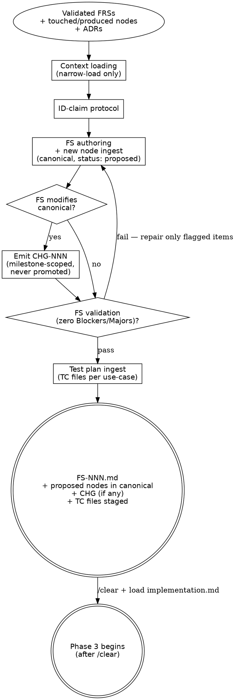

# Plan Flow

Plan flow turns a milestone's validated FRSs into a Feature Spec and the new DDD nodes
the spec introduces. It writes every new node directly to canonical with `status: proposed`,
fires the 3-file lifecycle touch, and emits a CHG node for any modifications to existing
canonical nodes. Phase 3 applies the CHG deltas and flips new nodes `proposed → active`.

<HARD-GATE>
Do NOT write method bodies, brace bodies, SQL, YAML payloads, or any other concrete syntax
in the FS, the new canonical nodes, or any CHG node. Phase 2 names structures; Phase 3
writes them. This applies regardless of how obvious the implementation looks.
Cross-cutting rule canonical home: [`../../CLAUDE.md ## Hard rules`](../../CLAUDE.md#hard-rules) —
"Plans contain no syntax".
</HARD-GATE>

---

## Overview

This flow runs after the Design flow ([`design.md`](design.md)) has produced a validated
FRS set and a `/clear` has happened. It covers `generate-feat-spec`: FS authoring +
canonical node ingest (status: proposed) + CHG emission + FS validation loop. Test plan
ingest runs in the same session immediately after the validation loop passes — that
operation is in [`test-plan-ingest.md`](test-plan-ingest.md).

**Mode: Ingest.** Existing canonical nodes are NOT modified here. When the FS touches
them, this flow emits a CHG-NNN node at
`milestones/M-NN-<slug>/specs/FS-NNN-<slug>/nodes/changes/CHG-NNN-<slug>.md`
that documents the intended delta. Phase 3 implementation applies it.

**File-disjoint mode boundaries:** [`design.md`](design.md) Queries canonical;
[`implementation.md`](implementation.md) Merges + Codes; this file Ingests. Each
requires a `/clear` at entry.

**Prerequisites:** the Design flow has produced a milestone with `status: planning`,
its validated FRSs in `milestones/M-NN-<slug>/frs/`, every FRS's "Validation findings"
resolved or deferred, and the milestone-scope discovery's "Cross-FRS conflicts" section
clean. A context reset has happened between Phase 1.5 and this flow.

**Core principle:** Phase 2 names structures; Phase 3 writes them.

---

## Anti-Pattern: "The Obvious Path"

Writing a method body, a SQL statement, a YAML configuration block, or a brace-delimited
code snippet inside the FS or a new node because the implementation looks "obvious" —
already in your head, no point waiting for Phase 3. The validation gate catches it, but
the cheaper fix is not to drift in the first place. Phase 2 names structures (a
`OrderManager` aggregate root with a `Cancel(reason)` method and a `Cancelled` domain
event); Phase 3 writes them (the `{ ... }` body, the `WHERE` clause, the
`appsettings.Production.json` block).

---

## When to Use

**Use when:** the Design flow has produced a validated FRS set, a `/clear` has happened,
and the next operation is `generate-feat-spec` (write the FS + ingest new nodes + emit
the CHG) followed by the Phase 2 Test plan ingest.

**Do NOT use when:** still in Phase 1 / 1.5 (load [`design.md`](design.md)), or after
Phase 2 validation has closed (load [`implementation.md`](implementation.md)). This flow
Ingests new nodes to canonical — it does **not** apply CHG deltas to existing canonical
nodes (that is Phase 3's job).

**Vs. sibling files:** [`design.md`](design.md) Queries canonical;
[`implementation.md`](implementation.md) Merges + Codes; this file Ingests. The three
are file-disjoint mode boundaries; each requires a `/clear` at entry.

---

## Checklist

Scan-level gate before diving into The Process. All seven must hold before Phase 3 begins.

1. Every FRS acceptance criterion appears in the FS Coverage table exactly once.
2. Every new node is written to canonical (`docs/<component>/nodes/<type>/<ID>-<slug>.md`)
   with `status: proposed` and the 3-file lifecycle touch fired.
3. Every new node has `source_ref` tracing to a specific FRS criterion or Behavior paragraph.
4. If the FS modifies any canonical node, a CHG node is emitted and all `touches_nodes`
   IDs are recorded in `id-claims.md` as `op: modify`.
5. No syntax (method bodies, SQL, YAML) appears anywhere in the FS or new nodes.
6. Every architecture decision is routed: promoted to ADR, filed as DEC, or kept inline.
7. FS validation loop passes: zero Blockers, zero Majors.

---

## Process Flow



The FS-validation diamond is the **node ingest gate** — Phase 2 is not complete (and
Test plan ingest does not run) until zero Blockers and zero Majors remain. Repair is
surgical, not full re-draft.

---

## The Process

### 1. Context loading

Read **only** the nodes and ADRs the milestone's FRSs declare:

1. Open each linked FRS in `milestones/M-NN-<slug>/frs/` and collect every node ID in
   `touches_nodes` and `produces_nodes`, plus every ADR ID in `adrs:`.
2. Check for `FS-NNN-CONTEXT.md` at
   `milestones/M-NN-<slug>/specs/FS-NNN-<slug>/FS-NNN-CONTEXT.md`. If present, load it
   before drafting — it carries locked decisions that bind this FS's architecture choices.
   If absent, proceed without it ([`discuss.md`](discuss.md) is optional).
3. Read the relevant component ADR index — one-line summaries only.
   `docs/<component>/adrs/index.md` for each component in scope; for cross-component work
   also check `docs/shared/adrs/index.md`. Cross-check the FRS-declared ADR list against
   the index for anything plainly relevant that an FRS missed; if you find a gap, surface
   it (update the FRS, do not silently load).
4. Read the canonical node files for IDs in `touches_nodes`. Follow `related` one hop and
   read those too. For IDs in `produces_nodes`, there is no canonical node yet — they will
   be created at the ingest step.
5. Narrow-load the declared ADR pages. No transitive expansion.
6. Do **not** glob `docs/*/nodes/**` or pre-load wholesale. If a node or ADR not on the
   list turns out necessary mid-draft, stop, update the source FRS to declare it, and
   re-enter Phase 1.5 (for a node) or update the FRS's `adrs:` (for an ADR).

This is the workflow's primary token lever — see [`retrieval-discipline.md`](retrieval-discipline.md).

**Verify:** every node and ADR you have loaded is traceable to a declared ID in an FRS.
No unlisted files open.

**On failure:** if you discover a needed node mid-draft, stop. Surface the gap. Update
the FRS. Re-enter Phase 1.5 before continuing.

---

### 2. ID-claim protocol

Every node ID this FS will introduce or modify must be recorded in
`docs/milestones/M-NN-<slug>/id-claims.md` (lazy-create on first claim).

| ID | FS | Op | Date |
| -- | -- | -- | ---- |
| ACT-005 | FS-007 | introduce | YYYY-MM-DD |
| CMD-010 | FS-007 | modify | YYYY-MM-DD |
| TC-001  | FS-007 | introduce | YYYY-MM-DD |

TC IDs use the same ledger; Test plan ingest claims them after the FS validation loop
passes — see [`test-plan-ingest.md`](test-plan-ingest.md).

Before allocating a new ID, **read both** the canonical per-type
`docs/<component>/nodes/<type>/index.md` (carries every claimed ID: proposed, active,
superseded, deprecated) **and** the milestone's `id-claims.md` (carries in-flight
reservations). Pick the next free ID from the higher of the two ceilings. Retired IDs
are not reused.

Two collision signals to surface (never silently resolve):

- **New-ID collision** — another FS has already claimed the same ID for the same concept.
  Either merge the intent or re-coordinate.
- **Cross-FS modify-intent collision** — a sibling FS has already recorded an
  `op: modify` row for the same canonical ID. Coordinate which FS owns the change or
  merge the modify-intents into a single CHG.

Across milestones, IDs are globally unique.

**Verify:** every ID in this FS's `produces_nodes` and `touches_nodes` has a row in
`id-claims.md`. No row duplicates a sibling FS's claim.

**On failure:** surface the collision immediately. Do not allocate a conflicting ID.

---

### 3. New node canonical ingest

For every node ID in the FRSs' `produces_nodes` (newly introduced), write the node file
**directly to canonical** with `status: proposed`:

```
docs/<component>/nodes/<type>/<ID>-<slug>.md
```

Use the templates in [`../_templates/nodes/`](../_templates/nodes/). Set
`status: proposed` in frontmatter. Every new node carries `source_ref` pointing back to
the FRS and FS:

```yaml
status: proposed
source_ref:
  - frs: FRS-NNN
    fs: FS-NNN
    op: introduce
```

For Flow nodes specifically: the three scenarios (happy / edge / fault) must be filled.
They become the QA source of truth in Phase 3. If you can't fill all three from the FRS,
the FRS is underspecified — surface it, do not paper over.

**Fire the 3-file lifecycle touch at ingest** (see [`maintenance-discipline.md`](maintenance-discipline.md)):

- [ ] Canonical node file in place at `docs/<component>/nodes/<type>/<ID>-<slug>.md`
      with `status: proposed`.
- [ ] Row added to `docs/<component>/nodes/<type>/index.md` showing Status = `proposed`.
      Create the file from [`../_templates/INDEX.md`](../_templates/INDEX.md) if this is
      the first node of the type.
- [ ] `created` entry appended to `docs/<component>/nodes/<type>/log.md`. Create from
      [`../_templates/LOG.md`](../_templates/LOG.md) if first of type. Body notes the
      originating FS and FRS.
- [ ] Bidirectional `related:` back-links fired against each target in this node's
      `related:` list (the (3 + N) touch — see `maintenance-discipline.md`).

**For `touches_nodes` (existing canonical nodes the FS intends to modify): do NOT write
to canonical at Phase 2.** The canonical file is left untouched; the CHG node records
the intended delta. Phase 3 applies it.

**Cross-FS dependencies.** If a new node references a `proposed` sibling-FS node that
hasn't merged yet, declare the dependency in this FS's frontmatter:

```yaml
depends_on_specs: [FS-006]
```

Phase 3 enforces merge order from this field. An FS may **read** a sibling-FS proposed
node via `depends_on_specs:`, but may **not** include it in its own `touches_nodes` /
CHG `modifies[]` — proposed nodes are provisional, not modify targets.

**Verify:** every `produces_nodes` ID has a canonical file at the expected path with
`status: proposed`, an index row, and a log entry. No canonical node body for a
`touches_nodes` ID has been touched.

**On failure:** if a 3-file touch is incomplete, complete it before moving on. If a
`touches_nodes` ID was edited, revert — it belongs in the CHG, not in canonical yet.

---

### 4. CHG node emission

If **any** FRS in this FS lists IDs in `touches_nodes`, emit a CHG node at its
**permanent milestone-scoped home** (never promoted to canonical):

```
milestones/M-NN-<slug>/specs/FS-NNN-<slug>/nodes/changes/CHG-NNN-<slug>.md
```

Use [`../_templates/nodes/CHANGE.md`](../_templates/nodes/CHANGE.md). The CHG node
enumerates:

- `adds[]` — every new canonical node this FS introduces (mirrors the set already written
  to canonical at Phase 2 with `status: proposed`).
- `modifies[]` — every canonical node this FS will edit, with a before/after summary per
  node. Phase 3 applies these deltas to canonical.
- `removes[]` — canonical nodes this FS retires (rare).
- `supersedes[]` — canonical nodes superseded by new ones in `adds[]`.
- `invariants_before[]` / `invariants_after[]` — the milestone-level invariant delta.
- `migration_steps[]` — data or schema migration the FS requires.

CHG lifecycle: `draft → approved → merged` (Phase 3 flips `approved → merged` after
applying the deltas). The CHG file stays at the milestone path permanently — no canonical
`docs/<component>/nodes/changes/` subtree exists.

**Default granularity: one CHG per FS.** Split into multiple CHGs only when the FS has
multiple unrelated canonical modifications that warrant separate review. Note the split
in the FS's "Change maps" section.

If the FS introduces only new nodes (no `touches_nodes`), do **not** emit a CHG. Pure
additions are already audited by the new nodes' `source_ref` and the per-type `log.md`
`created` entries.

**Verify:** every `touches_nodes` ID from every FRS in this FS appears in the CHG's
`modifies[]` or `removes[]`. The CHG file exists at the milestone-scoped path.

**On failure:** if a `touches_nodes` ID has no CHG entry, add it before proceeding.

---

### 5. FS authoring

The FS answers *how* to implement the user-journeys its FRSs describe. The new canonical
nodes (status: proposed) and the CHG node carry the behavioral content. The FS prose
references nodes by ID — it does not restate their behavior.

What belongs in the FS prose: architecture decisions, data model changes, interface
contracts, ordered tasks, dependencies, edge cases, QA verification checklist.
What does **not** belong: code, file paths, class names, behavior already in a canonical
DDD node (link to the canonical node instead).

#### Generate before converging

Before settling on an architecture decision, list 2–3 genuinely different approaches
with what each optimizes for and what it gives up. Record under "Alternatives considered"
in the FS (see [`../_templates/FS.md`](../_templates/FS.md)).

- **Real alternatives only.** If you can't write a real trade-off, drop it.
- **Skip for obvious / low-stakes calls.** Forced alternatives are procrastination.
- **Lead with your recommendation** and the reasoning behind it.

#### Promote to ADR vs file a DEC vs keep inline

Every architecture decision the FS makes faces a three-way fork. Apply the discriminator
on the spot — don't punt it.

- **Promote to ADR-NNN** if the decision constrains how we'd design future features we
  haven't met yet (stack, layering, framework idiom, tooling). Create the ADR via
  [`authoring-adr.md → From an FS`](authoring-adr.md#three-triggers), add it to the FS's
  `adrs:` frontmatter, and **collapse the FS prose to a reference**.
- **File a DEC-NNN node** if the decision shapes one specific node's behavior. Written
  directly to canonical `docs/<component>/nodes/decisions/DEC-NNN-<slug>.md` with
  `status: proposed`.
- **Keep inline** if the decision is small, scoped to this FS, and not reusable.

The discriminator: *if it'll be referenced by future specs → ADR; if it explains why one
specific node looks the way it does → DEC; otherwise → inline.*

#### Section-by-section drafting

Walk the FS template in order — Coverage → New nodes → Change maps → Architecture
decisions → Data model → Interface contracts → Implementation tasks → Dependencies → QA —
and pause for confirmation between sections. If something stops making sense partway, go
back; don't paper over.

#### Implementation-task cohort ordering

Group and order Implementation tasks along the architectural cohorts your project's
convention ADRs declare, so each cohort's compilation succeeds before the next starts.
Scan `docs/<component>/adrs/index.md` for the ADR tagged `task-ordering` and consult its
cohort table. Each task references the relevant convention ADR by ID rather than restating
the convention.

> **Your project:** Look up the ADR tagged `task-ordering` in
> `docs/<component>/adrs/index.md` and note its ID and cohort names here as a session
> reference.

Cross-cutting tasks (test scaffolding, seed data) land at the end as a final cohort or
interleaved per scenario, but never before the cohort they validate compiles.

---

### 6. FS validation loop

Findings carry the same **Blocker / Major / Minor** severity vocabulary used at Phase
1.5 (see
[`frs-validation-rules.md → Severity classification`](frs-validation-rules.md#severity-classification)).
Zero Blockers and zero Majors is the exit bar; Minors are noted, not blocking.

**Targeted repair, not full re-draft.** Fix only the flagged items and re-check only
those — not the whole FS.

- [ ] Author self-review pass — look at the FS with fresh eyes:
  1. Placeholder scan — any "TBD", incomplete sections, or vague requirements?
  2. Internal consistency — does the FS contradict itself or upstream inputs (FRSs, nodes)?
  3. Scope — single coherent slice? No scope creep from adjacent FRSs?
  4. Ambiguity — any task interpretable to build the wrong thing? Pick one interpretation and make it explicit.
  Fix inline. No separate review file, no dispatched reviewer.
- [ ] Every FRS acceptance criterion appears in the Coverage table **exactly once**.
      Criteria that cannot be mapped to a Flow scenario are raised as `OQ-NNN` files under
      `docs/discovery/open-questions/` with `origin: fs-authoring, origin_ref: FS-NNN,
      gate_effect: blocking` — not absorbed as loose FS prose.
- [ ] Every covered criterion links to a Flow scenario in a canonical FLW node (new FLW
      nodes carry `status: proposed`).
- [ ] No node behavior or ADR text is restated in the FS prose — only referenced.
- [ ] No syntax in the FS or in any new node (method bodies, brace bodies, SQL, YAML).
- [ ] No unresolved design questions.
- [ ] Every new node has been written to canonical at
      `docs/<component>/nodes/<type>/<ID>-<slug>.md` with `status: proposed`; the FS's
      "New nodes" section lists each ID and one-line summary.
- [ ] No invented new nodes — every new node's `source_ref` traces to a specific FRS
      acceptance criterion or Behavior paragraph. Nodes without a traceable clause are
      removed, promoted to a DEC, or raised as `OQ-NNN`.
- [ ] Every new node has `source_ref` populated (`frs:`, `fs:`, `op: introduce`). Optional
      `section:` key naming the specific FRS heading improves traceability.
- [ ] Every new-node ID claimed by this FS is in `id-claims.md`; no double-claims with
      sibling FSs. Every CHG `modifies[]` entry recorded as `op: modify`.
- [ ] If this is a change-request FS, the CHG node covers every canonical ID in any FRS's
      `touches_nodes`. The CHG is **not** applied to canonical here — only documented.
- [ ] No edits to existing canonical node bodies during Phase 2.
- [ ] `adrs:` frontmatter declares every ADR consulted.
- [ ] Every architecture decision has been routed: ADR, DEC, or inline.
- [ ] Any ADR promoted from this FS is filed under
      `docs/<component>/adrs/ADR-NNN-<slug>.md`, indexed, logged with a `created` entry,
      has `fs_origin: FS-NNN`, and is back-linked from the FS's `adrs:` list.
- [ ] Any pre-existing ADR newly consumed by this FS has a `linked` entry in `adrs/log.md`.
- [ ] `depends_on_specs:` declares every sibling FS whose proposed nodes this FS references.
- [ ] FS frontmatter: `merged: false`, `merge_sha:` left blank.
- [ ] FS frontmatter: `test_plan_path:` left blank — filled by Test plan ingest.

**Phase 2 fires the 3-file lifecycle touch for each new node's `created` event (canonical
node + per-type `index.md` row + per-type `log.md` `created` entry). It does NOT modify
existing canonical node bodies, nor add index rows for `touches_nodes` targets — those
operations fire at Phase 3 merge when the CHG deltas are applied.**

Once zero Blockers and zero Majors remain, proceed immediately to
[`test-plan-ingest.md`](test-plan-ingest.md) — same session, no context reset.

---

## Common Mistakes

**❌ Writing a method body or SQL statement in the FS** — Phase 2 names; Phase 3 writes.
**✅ Name the structure** (e.g. `OrderManager.Cancel(reason)` + `Cancelled` event) and
leave the `{ ... }` body for Phase 3.

**❌ Globbing `docs/*/nodes/**` during context loading** — floods the session and violates
the token discipline that makes the workflow sustainable.
**✅ Narrow-load only** the node IDs declared in the FRSs' `touches_nodes` and
`produces_nodes`, plus one `related` hop.

**❌ Editing an existing canonical node body during Phase 2** — canonical nodes are the
source of truth; mid-phase edits create un-audited drift.
**✅ Emit a CHG node** documenting the intended delta; Phase 3 applies it.

**❌ Silently resolving an ID collision** — two FSs claiming the same ID creates invisible
Phase 3 merge conflicts.
**✅ Surface the collision** immediately, stop allocation, and reconcile before proceeding.

**❌ Emitting a CHG for a pure-addition FS** — unnecessary noise when no canonical node is
being modified.
**✅ Only emit CHG when `touches_nodes` is non-empty** — pure additions are audited by
`source_ref` and `log.md` `created` entries.

---

## Red Flags

**Never:**
- Write syntax (method bodies, SQL, YAML payloads) in the FS or new canonical nodes
- Glob `docs/*/nodes/**` — load only what FRSs declare by ID
- Edit existing canonical node bodies during Phase 2
- Allocate a node ID without reading both the per-type `index.md` and `id-claims.md`
- Proceed to `test-plan-ingest.md` before zero Blockers and zero Majors
- Emit a CHG node when the FS has no `touches_nodes` entries
- Silently broaden the context load when a mid-draft gap is found — stop and update the FRS

---

## Integration

- **Required before:** [`../../CLAUDE.md ## Hard rules`](../../CLAUDE.md#hard-rules) —
  "Plans contain no syntax" is the doctrinal anchor of this flow's HARD-GATE; "Read the
  per-type `index.md` before globbing" governs the context-loading step; "Canonical edits
  use tiered touch" governs every node ingest fired here.
- **Required before:** [`../WORKFLOW.md`](../WORKFLOW.md) — phase pipeline, retrieval
  discipline, in-flight `status: proposed` rule, CHG-emission rule.
- **Required before:** [`../PRINCIPLES.md`](../PRINCIPLES.md) — doctrinal anti-patterns
  the FS-validation gate enforces.
- **Required before (entry):** [`design.md`](design.md) — produces the validated FRS set
  this flow consumes.
- **Required after (same session):** [`test-plan-ingest.md`](test-plan-ingest.md) — Test
  plan ingest runs immediately after the FS validation loop passes, before the user-review
  handoff. No `/clear` between the two.
- **Maintenance ops that may fire:**
  [`maintenance-discipline.md`](maintenance-discipline.md) (every 3-file lifecycle touch;
  the (3+N) touch when new nodes carry `related:` back-links),
  [`authoring-adr.md`](authoring-adr.md) (FS architecture decision promoted to ADR),
  [`new-component-bootstrap.md`](new-component-bootstrap.md) (FS introduces nodes for a
  new component — runs FIRST, before any ingest),
  [`evolving-the-workflow.md`](evolving-the-workflow.md) (Phase 2 surfaces a missing node
  type or template gap).
- **Routes to (after `/clear`):** [`implementation.md`](implementation.md) — Phase 3
  Merge + Code + QA.
- **Sibling flow files:** [`design.md`](design.md), [`implementation.md`](implementation.md),
  [`bug-fix.md`](bug-fix.md).
