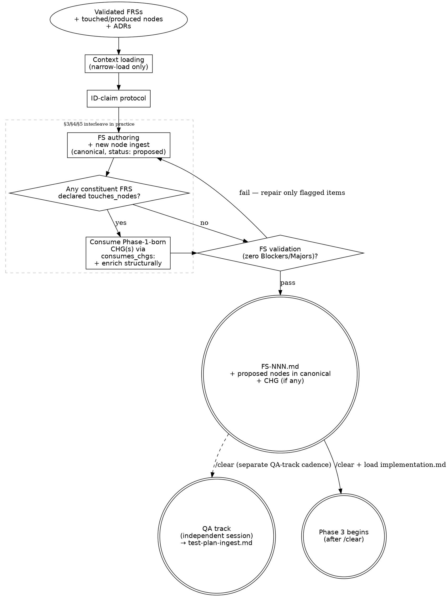

# Process Flow — Phase 2 (generate-feat-spec)

> Detail file of [`plan.md`](../plan.md) (Phase 2 flow). Load once at
> orientation; the core file's Checklist and §6 gate carry the binding rules.

The FS-validation diamond is the **node ingest gate** — Phase 2 is not complete
until zero Blockers and zero Majors remain. Repair is surgical, not full re-draft.
Test plan ingest is in the QA track and runs in its own session after a separate
`/clear` — see [`CLAUDE.md ## Hard rules`](../../../CLAUDE.md#hard-rules)
(QA-track entry is a flow boundary; intra-track session-share only between `test-suite-codegen` ↔ `qa-gate`).
