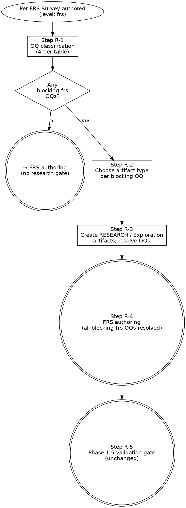

# Research Gate

> Operation for resolving `blocking-frs` open questions before FRS body
> sections (Behavior, Acceptance criteria, Test plan view) can be authored.
> Fires from inside Phase 1 when the per-FRS Survey surfaces ≥ 1 OQ-NNN
> whose Resolution path requires a resolver artifact. Part of the workflow
> defined in [`../WORKFLOW.md`](../WORKFLOW.md).
>
> **Mode: Research + Synthesis.** This operation authors external-research
> (`RESEARCH-NNN`) and spike (`Exploration`) artifacts, resolves the
> blocking OQs, and hands control back to FRS authoring in the same Phase
> 1 session — no `/clear` required.

> **HARD-GATE:** Do NOT begin this operation unless the per-FRS Survey has
> been authored and at least one OQ is classified `blocking-frs` (see Step
> R-1 below). Do NOT exit this operation until every `blocking-frs` OQ has
> `status: resolved` and a `resolved_by:` field pointing at a concrete
> artifact. Partial resolution is not resolution.

## When to Use

**Use when:** the per-FRS Survey surfaces ≥ 1 OQ-NNN whose Resolution
path (in the OQ body) requires a resolver artifact (RESEARCH doc, spike,
or ADR) before the FRS Behavior / Acceptance criteria sections can be
authored. Invoke by name from inside Phase 1.

**Trigger condition (precise):** ≥ 1 OQ raised in the Survey is
classified `blocking-frs` — meaning the FRS body cannot be authored to
sufficient specificity without it. If no OQ is `blocking-frs`, skip this
file entirely and proceed to FRS authoring.

**Do NOT use when:** all OQs from the Survey are `blocking-fs`,
`blocking-impl`, or `non-blocking` — proceed directly to FRS authoring.

**Vs. sibling files:** [`design.md`](design.md) is the caller — it
invokes the research gate from Phase 1. [`authoring-adr.md`](authoring-adr.md)
governs any ADR produced as a research output.
[`maintenance-discipline.md`](maintenance-discipline.md) governs the
3-file lifecycle touch when RESEARCH artifacts are created.

## Process Flow

---

## Step R-1 — OQ classification (in per-FRS Survey)

For each OQ raised in the Survey, assign one tier from the table below.
Every OQ receives exactly one tier — no dual classification.

| Tier | Meaning | Action |
|------|---------|--------|
| `blocking-frs` | FRS Behavior / Acceptance criteria cannot be authored without this | Enter research gate |
| `blocking-fs` | FRS body can be authored; FS authoring will be blocked | Set `status: deferred`, `needed_by: phase-2`; note in FRS "Out of scope" |
| `blocking-impl` | FRS + FS can be authored; code authoring needs resolution | Set `status: deferred`, `needed_by: phase-3`; note in FRS "Out of scope" |
| `non-blocking` | Answerable inline or outside current scope | Inline-answer in FRS body, or close with a brief note in the OQ |

Only `blocking-frs` OQs enter the research gate. The other tiers are
recorded in the Survey; the OQ files are updated immediately.

> **Note — vocabulary scope.** The 4-tier classification above is **procedural,
> not a stored field**: it routes to `status:` + `needed_by:` per the action
> column. Validation-gate and FS-authoring OQs use a different vocabulary
> (`gate_effect: blocking | post-approval`) recorded directly in OQ frontmatter
> — see [`frs-validation-rules.md → OQ gate-effect taxonomy`](frs-validation-rules.md#oq-gate-effect-taxonomy).
> The two never coexist on one OQ.

---

## Step R-2 — Choose artifact type per blocking OQ

For each `blocking-frs` OQ, choose the resolver artifact shape:

- **External / vendor research** (papers, benchmarks, vendor docs, domain
  whitepapers) → `RESEARCH-NNN` at `docs/research/RESEARCH-NNN-<slug>.md`
- **Technical spike / options weighing** (hypothesis-driven, in-project
  experiment) → `Exploration` (spike-shaped, `hypothesis:` frontmatter) at
  `docs/exploration/EXP-<slug>.md`

Both shapes are valid simultaneously for the same OQ — a spike's
verdict can feed directly into a RESEARCH doc's Key findings. The
RESEARCH doc is always the canonical OQ resolver; the spike is a
supporting artifact.

---

## Step R-3 — Create artifacts

### RESEARCH-NNN

- Copy [`../_templates/RESEARCH.md`](../_templates/RESEARCH.md) to
  `docs/research/RESEARCH-NNN-<slug>.md`.
- First RESEARCH ever in the project: lazy-create `docs/research/index.md`
  and `docs/research/log.md` — this counts as a 3-file lifecycle touch
  (`created` entry in `log.md`). See
  [`maintenance-discipline.md`](maintenance-discipline.md).
- Fill `resolves: [OQ-NNN, ...]` in frontmatter — lists every blocking OQ
  this document closes.
- Body: complete all sections. The **Canonical implications** table must
  name a `Target artifact` for every implication; `Status: proposed` is
  acceptable until the ADR is filed.

### Exploration (spike)

- Copy [`../_templates/EXPLORATION.md`](../_templates/EXPLORATION.md) to
  `docs/exploration/EXP-<slug>.md`.
- Set `hypothesis:`, `success_criteria:`, and (when run) `outcome:` in
  frontmatter. Outcome values: `confirmed | refuted | partial`.
- Body: include a **Verdict** section stating the outcome and its
  implications for the FRS.
- A spike does **not** directly resolve the OQ. Its findings are cited in
  the RESEARCH doc's **Key findings** section; the RESEARCH doc is the
  canonical resolver. If a spike reveals that no external RESEARCH doc is
  needed (the spike itself is the only evidence), author a minimal
  RESEARCH-NNN that cites the spike and carries `resolves: [OQ-NNN]`.

### OQ resolution (after each artifact is complete)

For each OQ closed by a RESEARCH or Exploration artifact:

1. Update the OQ file: `status: resolved`, `resolved_by: RESEARCH-NNN`,
   `updated: <today>`. The `resolved_by:` value is always a RESEARCH-NNN
   ID — the OQ template does not accept EXP slugs as resolver values.
2. Update `docs/discovery/open-questions/index.md`: move the row from
   open to resolved section.

This is a 2-file touch (OQ file + OQ index). If a log file exists under
`docs/discovery/open-questions/`, append a `status-change` entry —
making it a 3-file touch per
[`maintenance-discipline.md`](maintenance-discipline.md).

### ADRs produced by research

If a RESEARCH or spike outcome requires an architectural commitment, apply
the discriminator from [`authoring-adr.md`](authoring-adr.md). ADRs are
filed separately and back-linked from the FRS via `adrs:`. Do not absorb
an architectural decision inline into the RESEARCH body.

---

## Step R-4 — FRS authoring

All `blocking-frs` OQs are now resolved. Resume or complete the FRS:

- **Path A** (Survey-first): author the complete FRS at
  `docs/milestones/M-NN-<slug>/frs/FRS-NNN-<slug>.md` using
  [`../_templates/FRS.md`](../_templates/FRS.md).
- **Path B** (skeleton-first): complete the FRS body sections (Behavior,
  Acceptance criteria, Test plan view, Brownfield impact) on the existing
  skeleton.

In both cases:

- Cite RESEARCH and Exploration artifacts by ID in the FRS body — do not
  restate their content.
- List resolved blocking OQ IDs in the FRS `resolves:` frontmatter field
  (add the field if the template does not include it).
- `adrs:` frontmatter lists any ADRs produced during the research gate.

---

## Step R-5 — Resume Phase 1.5 validation gate

Exit the research gate and resume normal Phase 1 flow. The Phase 1.5
validation gate is unchanged — run it after all FRSs in the milestone are
authored.

---

## Boundary rules

- The research gate is **Phase 1 internal** — no `/clear` required to
  enter or exit it. Sessions 0 / 1 / 1.5 continue to share one
  conversation.
- The `/clear` boundary between Phase 1.5 and Phase 2 is unchanged.
- `docs/research/` and `docs/exploration/` live outside the milestone
  path — RESEARCH and Exploration artifacts are not milestone artifacts
  and do not appear in the milestone portal's `frs:` or `specs:` lists.
- If a research artifact remains `raw` (unfilled **Canonical
  implications** table) when FRS authoring begins, the corresponding OQ
  is not resolved — do not mark it resolved until the table is filled.

---

## Integration

- **Required before:** [`../../CLAUDE.md ## Hard rules`](../../CLAUDE.md#hard-rules)
  — "Every artifact has an ID and links upstream + downstream" governs
  the `resolves:` / `resolved_by:` reciprocal links; "Canonical edits use
  tiered touch" governs RESEARCH `created` events.
- **Required before:** [`../WORKFLOW.md`](../WORKFLOW.md) — phase pipeline
  and cross-cutting practices.
- **Caller:** [`design.md`](design.md) — Phase 1 invokes this operation
  when the OQ classification step produces ≥ 1 `blocking-frs` OQ.
- **Templates wholesale-read during this op:**
  [`../_templates/RESEARCH.md`](../_templates/RESEARCH.md),
  [`../_templates/EXPLORATION.md`](../_templates/EXPLORATION.md),
  [`../_templates/OPEN-QUESTION.md`](../_templates/OPEN-QUESTION.md).
- **Maintenance ops that may fire during this op:**
  [`authoring-adr.md`](authoring-adr.md) (research outcome produces an
  architectural commitment),
  [`maintenance-discipline.md`](maintenance-discipline.md) (3-file touch
  on RESEARCH `created`; 2-file OQ status-change).
- **Routes to (on exit):** [`design.md → Step 3`](design.md#phase-1--frs-authoring)
  (FRS body authoring, all blocking-frs OQs resolved).
- **Sibling operation files:** [`authoring-adr.md`](authoring-adr.md),
  [`maintenance-discipline.md`](maintenance-discipline.md),
  [`frs-validation-rules.md`](frs-validation-rules.md).
