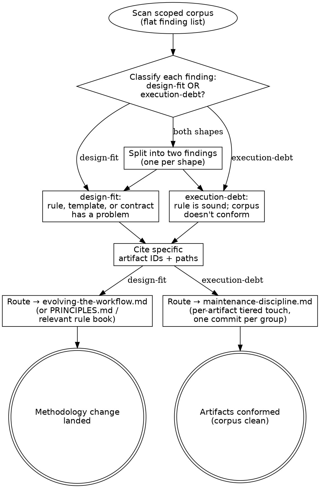

# Review

> Maintenance operation for any review pass over the corpus — QA gates,
> post-Phase-2 author self-review, ADR-conformance checks, audits
> triggered by a friction signal. Not a phase; fires from inside any
> phase or standalone. Codifies the two-heading filing rule
> (`design-fit` vs `execution-debt`) and the parent-side outcome
> rubric for dispatched review subagents.

> **HARD-GATE:** Every finding from a review pass MUST be classified
> as either `design-fit` (the rule is wrong) or `execution-debt` (the
> rule is right, the corpus doesn't conform) BEFORE any routing
> decision is made. An unclassified finding cannot route — it either
> drives a methodology change that wasn't needed or a per-artifact
> patch while the rule continues to produce drift. If a single finding
> contains both shapes, **split it into two findings** rather than
> filing under both headings. (Cross-cutting rule:
> [`../../CLAUDE.md ## Hard rules`](../../CLAUDE.md#hard-rules) —
> "Every artifact has an ID and links upstream + downstream"; an
> unclassified finding has no downstream route.)

## When to Use

**Use when:** running a QA pass at Phase 3 completion (the FS's
`adrs:` declaration scoping the review), running an author self-review
at Phase 2 close, executing an ADR-conformance sweep, or triaging an
audit triggered by a friction signal (drift surfaced during normal
work that warrants a focused pass).

**Do NOT use when:** the work is the Phase 1.5 validation gate (use
[`design.md → Phase 1.5`](design.md#phase-15--validation-gate) and
[`frs-validation-rules.md`](frs-validation-rules.md) — that is a
different gate with its own rule book and severity tiers), a
periodic drift detection pass (use [`lint.md`](lint.md) — debt-class
scanning), or maintenance for a single artifact (the canonical edit
fires [`maintenance-discipline.md`](maintenance-discipline.md)
directly, no review pass required).

**Vs. sibling files:** [`lint.md`](lint.md) is a programmatic
debt-class scan with predetermined detection rules; this file is a
qualitative pass over a scoped subset that can surface findings of
either `design-fit` or `execution-debt` shape.
[`maintenance-discipline.md`](maintenance-discipline.md) is the
canonical-touch rule book this file's `execution-debt` findings route
to. [`evolving-the-workflow.md`](evolving-the-workflow.md) is where
this file's `design-fit` findings route.

Peer of [`authoring-adr.md`](authoring-adr.md),
[`maintenance-discipline.md`](maintenance-discipline.md), and
[`legacy-absorption.md`](legacy-absorption.md). Read on demand.

## Process Flow

The classification diamond is the gate. The split path exists because
findings frequently arrive with both shapes entangled ("the rule says
X, but Y also slipped through that the rule wouldn't catch even if
followed") — splitting forces the methodology change and the
per-artifact patch onto separate routes so neither one masks the
other.

## The two-heading rule

Every review pass files findings under exactly two headings:

### `design-fit` — the rule is wrong

The rule, template, or contract being reviewed has a problem with its
design. Fixing the artifact does not fix the rule; the rule itself needs
to change.

Examples:
- A node template requires a frontmatter field that 70% of real instances
  cannot populate — the field is wrong.
- The ADR-vs-DEC discriminator misclassifies real cases consistently — the
  discriminator needs another axis.
- The Phase 1.5 gate snapshots fewer baselines than the project needs — the
  gate's read contract is incomplete.

Remedy: methodology change. Routes to
[`evolving-the-workflow.md`](evolving-the-workflow.md), the relevant rule
book under `sdlc/workflow/`, or [`../PRINCIPLES.md`](../PRINCIPLES.md).

### `execution-debt` — the rule is right but unenforced

The rule, template, or contract is sound. The corpus does not yet conform
to it. Fixing the artifacts is the remedy; the rule does not change.

Examples:
- A DEC declares `related: [ENT-016]` but ENT-016 carries no back-link.
  Rule (bidirectional linkage) is correct; ENT-016 hasn't been touched
  since the rule was tightened.
- Legacy slug `DEC-RuleActiveOnCreate` survives in ENT-017 body text after
  the rename to `DEC-003`. Rule (target-side rewrite on rename) is
  correct; the rename pass didn't touch the target.
- A DEC's `status: draft` survived a 2026-05-13 normalization that should
  have flipped it to `active`. Rule (status moves are explicit) is
  correct; the normalization missed the status flip.

Remedy: per-artifact fix, fire the maintenance discipline on each.

## Why this split exists

A finding misfiled under `design-fit` produces a methodology change that
wasn't needed — and the original execution gap remains. A finding misfiled
under `execution-debt` patches artifacts while the rule continues to
produce more drift. Both failure modes were observed during the 2026-05-13
DEC audit. See [`../PRINCIPLES.md`](../PRINCIPLES.md) — separating the two
is now a doctrinal rule.

## Anti-Pattern: "The Misfiled Finding"

Filing every finding from a review pass under `execution-debt` because
the per-artifact fix is concrete and shippable while the methodology
critique feels like over-reach — or filing every finding under
`design-fit` because the corpus has multiple instances and "the rule
must be wrong if it keeps producing drift". Both shapes occur; the
mix matters. The cost of either monoculture: under-filing `design-fit`
leaves the rule emitting more drift after the patch ships
("execution-debt forever"); over-filing it triggers methodology
changes that weren't warranted ("rule churn"). **The split is the
discipline** — every finding gets the explicit shape question, and
findings carrying both shapes get split, not filed under both. The
2026-05-13 DEC audit surfaced cases of each misfiling and forced this
to a doctrinal rule. Doctrinal anchor:
[`../PRINCIPLES.md`](../PRINCIPLES.md) — separating `design-fit` from
`execution-debt` is now codified.

## Procedure

1. **Scan** the corpus or subset under review. Generate a flat list of
   findings.
2. **Classify** each finding as `design-fit` or `execution-debt`. If a
   single finding contains both shapes, split it into two findings.
3. **Sort** under the two headings.
4. **Cite** the specific artifact paths and IDs for each finding — no
   abstract claims.
5. **For `design-fit` findings**: hand off to
   [`evolving-the-workflow.md`](evolving-the-workflow.md) for the
   extension discriminator before any rule change lands.
6. **For `execution-debt` findings**: open one focused commit per finding
   group; fire the maintenance discipline on each artifact touched.

## QA gate posture (Phase 3 implementation review)

When the QA hat runs at Phase 3 implementation completion, the FS's
`adrs:` declaration drives the review scope. The two-heading rule still
applies — but the expected distribution skews heavily toward
`execution-debt` findings, since the rules were already snapshot at
Phase 1.5. Any `design-fit` finding at Phase 3 implies the Phase 1.5 gate
missed something; surface it via
[`evolving-the-workflow.md`](evolving-the-workflow.md) as a methodology extension.

## Parent-side outcome rubric (dispatched review subagents)

When a review pass is dispatched as an inline subagent (per
[`../../CLAUDE.md ## When to Use`](../../CLAUDE.md#when-to-use-inline-subagent-dispatch)
and the gate dispatch shape at
[`../WORKFLOW.md ### Inline dispatch shape for gates`](../WORKFLOW.md#inline-dispatch-shape-for-gates)),
the subagent returns the canonical 3-block contract (`## Findings /
## Risks / ## Open questions`). The orchestrator then routes the
return per this rubric. The vocabulary below is the parent-side
routing handle — not a separate `## Handling Subagent Status`
section; the content shape stays the 3-block return.

- **DONE** — `## Findings` is empty, or contains only Minor entries.
  Proceed: file the review pass as closed; commit the (empty or
  Minor-only) findings list to the audit trail.
- **DONE_WITH_CONCERNS** — `## Findings` contains Major entries that
  classify as `execution-debt`. Proceed only after the per-artifact
  fixes land via [`maintenance-discipline.md`](maintenance-discipline.md);
  one focused commit per finding group.
- **NEEDS_CONTEXT** — empty return, or `## Findings` includes
  "could-not-determine" / "scope unclear" notes. Re-dispatch with
  explicit added context — name the artifact subset, the specific
  rule or contract being audited, the time window for staleness, etc.
  Do NOT retry blindly; a re-dispatch without added context produces
  the same shape of return.
- **BLOCKED** — `## Findings` contains Blocker-severity entries OR a
  classification of `design-fit` (the rule itself needs to change).
  Escalate: route through
  [`evolving-the-workflow.md`](evolving-the-workflow.md) for the
  methodology extension, OR raise an `OQ-NNN` if the rule change
  needs scoping work first. The review pass cannot close without the
  rule change landing (or being deferred via OQ).

The rubric consumes the 3-block return; it does not modify it.

---

## Integration

- **Required before:** [`../../CLAUDE.md ## Hard rules`](../../CLAUDE.md#hard-rules)
  — "Every artifact has an ID and links upstream + downstream"; both
  filing headings cite IDs explicitly.
- **Required before:** [`../PRINCIPLES.md`](../PRINCIPLES.md) — the
  two-heading split is now a doctrinal rule (2026-05-13 DEC audit).
- **Required before:** [`../WORKFLOW.md ### Inline dispatch shape for gates`](../WORKFLOW.md#inline-dispatch-shape-for-gates)
  — canonical home for the 3-block return contract this file's
  parent-side rubric consumes.
- **Caller:** [`design.md`](design.md) (Phase 1.5 QA dispatch when run
  as a review pass — though the canonical gate rule book is
  [`frs-validation-rules.md`](frs-validation-rules.md)),
  [`implementation.md`](implementation.md) (Phase 3 QA dispatch — the
  primary inline-dispatch caller of this file).
- **Routes findings to:**
  [`evolving-the-workflow.md`](evolving-the-workflow.md) for
  `design-fit`; [`maintenance-discipline.md`](maintenance-discipline.md)
  for `execution-debt`.
- **Adjacent (not callers but consulted):**
  [`lint.md`](lint.md) — periodic debt-class scan that may surface
  candidate findings for a focused review pass;
  [`frs-validation-rules.md`](frs-validation-rules.md) — Phase 1.5
  validation gate uses a different (severity-based) finding shape and
  this rubric does NOT apply to it.
- **Sibling rule books:**
  [`authoring-adr.md`](authoring-adr.md),
  [`maintenance-discipline.md`](maintenance-discipline.md),
  [`legacy-absorption.md`](legacy-absorption.md),
  [`lint.md`](lint.md).
